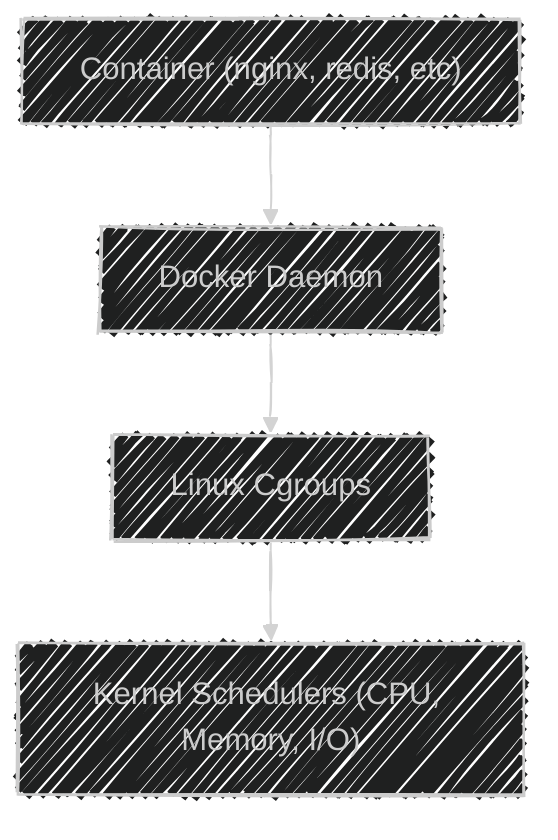
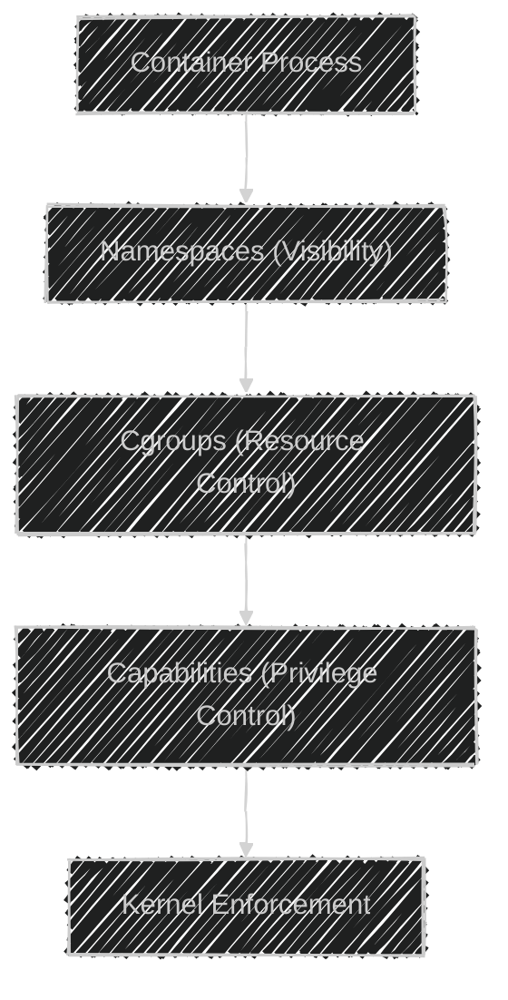

# ⚙️ **Docker Security — Control Groups (Cgroups) & Resource Limits**

> 🧠 _How Docker ensures no single container eats all your host resources — explained with Linux internals, visuals, and hands-on examples._

---

## 📖 **What Are Control Groups (cgroups)?**

**Linux Control Groups (cgroups)** are a **kernel feature** that lets you:

- **Limit** how much CPU, memory, disk I/O, or network a process can use
- **Prioritize** some workloads over others
- **Isolate** resource usage between groups of processes

Cgroups are the _“resource police”_ for containers 🚓
They make sure one misbehaving container doesn’t choke your entire host.

---

### 🧠 Core Concept

When Docker starts a container, it groups its processes under a **cgroup hierarchy**.
Each hierarchy controls a specific type of resource:

- CPU → `cpu` or `cpu,cpuacct`
- Memory → `memory`
- Block I/O → `blkio`
- Network → `net_cls`, `net_prio`

Cgroups apply **quotas and limits** that the Linux kernel enforces.

---

### 🧩 Docker + Cgroups Integration

Docker sits between your containers and the Linux kernel:

<div align="center">



</div>

When you set flags like `--cpus` or `--memory`,
Docker writes those values into cgroup files under `/sys/fs/cgroup`.

---

## 🏷️ **Cgroups Versions — v1 vs v2**

| Version | Introduced                 | Key Difference                    | Docker Support                   |
| ------- | -------------------------- | --------------------------------- | -------------------------------- |
| **v1**  | Older (since Linux 2.6)    | Separate hierarchies per resource | ✅ Full                          |
| **v2**  | Unified hierarchy (modern) | Cleaner, more consistent model    | ✅ Supported since Docker 20.10+ |

To check which version your system uses:

```bash
mount | grep cgroup
```

If you see `cgroup2`, you’re on v2 (default on modern Ubuntu/Fedora).

---

## 🎭 **Resource Control Types**

| Resource  | Docker Flag                               | Description                    |
| --------- | ----------------------------------------- | ------------------------------ |
| CPU       | `--cpus`, `--cpu-shares`, `--cpuset-cpus` | Limit or schedule CPU usage    |
| Memory    | `--memory`, `--memory-swap`               | Limit RAM + optional swap      |
| Block I/O | `--blkio-weight`                          | Control disk I/O priority      |
| Network   | `--network` + `tc`                        | Manage bandwidth caps manually |

---

## 🧠 **1. CPU Resource Limits** (CFS Scheduling)

### ⁉️ How Linux Shares CPU Time

Linux uses the **Completely Fair Scheduler (CFS)**.  
Imagine one CPU core like a pizza 🍕 —
CFS divides it into small time slices (microseconds) and shares them _fairly_ among processes.

Without limits, containers compete freely — whoever’s hungriest gets more pizza.

---

### ⚙️ CPU Shares — Relative Weights

CPU shares (`--cpu-shares`) define **relative priority**, not hard caps.

| Container | CPU Shares | Relative CPU % (if 2 containers) |
| --------- | ---------- | -------------------------------- |
| webapp1   | 1024       | 66%                              |
| webapp2   | 512        | 33%                              |

Command:

```bash
docker run --cpu-shares=512 --name webapp2 nginx
```

🧠 If webapp1 is idle, webapp2 can still take 100% of CPU.

---

#### 📊 Visualizing CPU Shares

<div align="center">


</div>

Each container gets time slices proportional to its weight.

---

### ⚙️ Pinning to Specific Cores — `--cpuset-cpus`

Use **CPU pinning** to bind a container to certain cores.

```bash
docker run --cpuset-cpus="0-1" nginx
```

This runs the container only on cores 0 and 1.
Useful for **real-time workloads** or **NUMA-aware systems**.

You can verify:

```bash
docker inspect <container_id> | grep CpusetCpus
```

---

### ⚙️ Hard CPU Limit — `--cpus`

For a _strict_ CPU cap, use:

```bash
docker run --cpus=2.5 nginx
```

Meaning:

- On a 4-core host, the container can use max 2.5 cores (≈62.5% CPU).
- The rest is reserved for other containers or system processes.

You can also update running containers:

```bash
docker update --cpus=2.5 nginx
```

---

#### ⚠️ Without CPU limits…

A misbehaving container can:

- Hog CPU → Freeze the host
- Starve the Docker daemon itself
- Cause latency in other workloads

Always apply sane CPU quotas in production.

---

### 🧩 CPU Flags Summary

| Flag            | Description                | Example               |
| --------------- | -------------------------- | --------------------- |
| `--cpu-shares`  | Relative scheduling weight | `--cpu-shares=512`    |
| `--cpuset-cpus` | Bind to specific cores     | `--cpuset-cpus="0,1"` |
| `--cpus`        | Hard CPU limit             | `--cpus=1.5`          |

---

## 🧠 **2. Memory Resource Limits** (OOM Prevention)

### ⁉️ Why Memory Limits Matter

Unlike CPU, memory cannot be “shared fairly.”
If a process exceeds system RAM, the kernel invokes the **OOM Killer**,
which terminates random processes (even your Docker daemon 😱).

To prevent this, Docker uses the `memory` cgroup to **enforce limits**.

---

### ⚙️ Hard Memory Limit — `--memory`

This sets a **strict RAM ceiling**.

Example:

```bash
docker run --memory=512m nginx
```

If the container tries to use >512 MB → 💥 it gets killed instantly with an OOM error.

> Memory limits are **enforced**, not throttled.

---

### ⚙️ Swap Control — `--memory-swap`

You can allow or disable swap explicitly.

| Configuration      | Description              | Example                            |
| ------------------ | ------------------------ | ---------------------------------- |
| Disable swap       | Equal memory and swap    | `--memory=512m --memory-swap=512m` |
| Allow limited swap | Add some disk swap space | `--memory=512m --memory-swap=768m` |
| Unlimited swap     | Dangerous!               | `--memory=512m --memory-swap=-1`   |

---

#### 🧩 Example

```bash
docker run \
  --memory=512m \
  --memory-swap=768m \
  nginx
```

👉 Total memory budget = 512 MB RAM + 256 MB swap.

---

### ⚙️ Soft Memory Reservation — `--memory-reservation`

Set a “soft floor” — a memory guarantee during contention.

```bash
docker run \
  --memory=200m \
  --memory-reservation=100m \
  nginx
```

Meaning:

- Guaranteed 100 MB
- Can grow to 200 MB if free memory exists

---

### ⚙️ Memory Swappiness — `--memory-swappiness`

Controls how aggressively the kernel swaps memory to disk (0–100).

```bash
docker run --memory=512m --memory-swappiness=10 nginx
```

Lower values = prefer RAM, minimize swap (better performance).

---

### 🧩 Memory Flags Summary

| Flag                   | Description            | Example                            |
| ---------------------- | ---------------------- | ---------------------------------- |
| `--memory`             | Hard RAM limit         | `--memory=200m`                    |
| `--memory-reservation` | Soft limit (guarantee) | `--memory-reservation=100m`        |
| `--memory-swap`        | RAM + swap total limit | `--memory=200m --memory-swap=512m` |
| `--memory-swappiness`  | Swap aggressiveness    | `--memory-swappiness=10`           |

---

## ✍🏻 **Practical Demo** — CPU & Memory Limits

### 🔹 Default (No Limits)

```bash
docker run -d --name=default ubuntu sleep 1000
docker inspect default | grep -i mem
```

Output shows all `0` — meaning unlimited.

---

### 🔹 Hard Limit (200MB RAM)

```bash
docker run -d --name=limited --memory=200m ubuntu sleep 1000
docker inspect limited | grep -i mem
```

---

### 🔹 Unlimited Swap

```bash
docker run -d --name=swappy --memory=200m --memory-swap=-1 ubuntu sleep 1000
```

---

### 🔹 Soft Reservation

```bash
docker run -d \
  --name=softmem \
  --memory=200m \
  --memory-reservation=100m \
  ubuntu sleep 1000
```

---

### 🔹 CPU Limit (1 Core)

```bash
docker run -d --name=cpu1 --cpus=1 ubuntu sleep 1000
docker inspect cpu1 | grep NanoCpus
```

---

### 🔹 Pinning to Core 0

```bash
docker run -d --name=core0 --cpuset-cpus="0" ubuntu sleep 1000
```

---

## ✅ **Best Practices** for Production

| Category                    | Recommendation              | Reason                      |
| --------------------------- | --------------------------- | --------------------------- |
| 🧱 Always set limits        | `--cpus`, `--memory`        | Prevent resource starvation |
| 🧠 Tune swap carefully      | Avoid `-1` unless necessary | Prevent slow I/O            |
| 🧍 Use reservations         | Combine with Kubernetes QoS | Guarantee baseline          |
| 📊 Monitor usage            | `docker stats`, Prometheus  | Detect bottlenecks early    |
| 🚫 Avoid overcommit         | Don’t over-allocate CPU     | Ensures predictability      |
| ⚡ Use namespaces + cgroups | Together = full isolation   | Security + fairness         |

---

## 🖼️ **Diagram**: Full Isolation Flow

<div align="center">



</div>

- **Namespaces** hide resources
- **Cgroups** throttle resource consumption
- **Capabilities** limit power
  Together, they form the _holy trinity_ of Docker isolation 🔱

---

## 🧠 **Summary**

| Concept              | What It Does        | Docker Flag            |
| -------------------- | ------------------- | ---------------------- |
| **CPU Shares**       | Relative scheduling | `--cpu-shares`         |
| **CPU Cores**        | Pin to CPUs         | `--cpuset-cpus`        |
| **CPU Limit**        | Hard quota          | `--cpus`               |
| **Memory Limit**     | Max RAM usage       | `--memory`             |
| **Swap Control**     | RAM + swap total    | `--memory-swap`        |
| **Soft Reservation** | Minimum guarantee   | `--memory-reservation` |
| **Swappiness**       | Swap tendency       | `--memory-swappiness`  |

---

## 🎁 **Block I/O (Disk) and Network**

also there is a Block I/O cgroup and a Network cgroup that can be used to control bandwidth.

---

### 🧩 Block I/O Priority

Control disk throughput with:

```bash
--blkio-weight=500
```

Range: 10–1000 (default = 500)

Useful when multiple containers perform heavy disk I/O.

---

### 🧩 Network Control

Docker doesn’t directly cap bandwidth —
but you can use Linux `tc` (traffic control) or advanced plugins.

Example:

```bash
tc qdisc add dev eth0 root tbf rate 1mbit burst 32kbit latency 400ms
```
