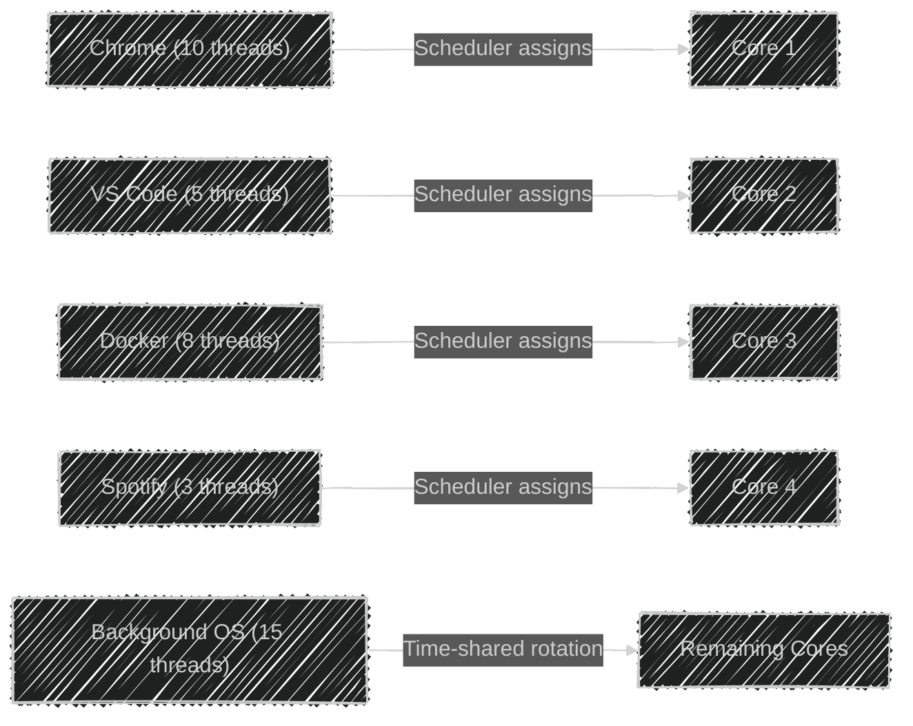
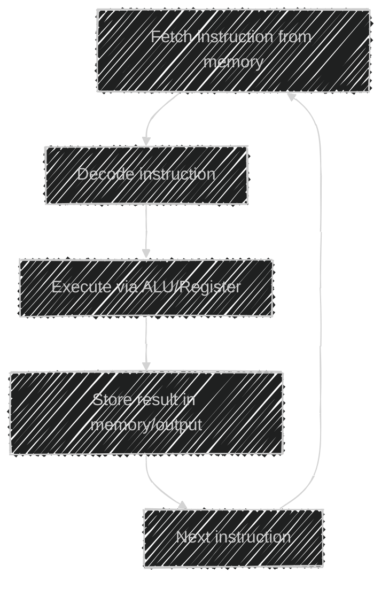

# ⚙️ **What Is a CPU?**

> 🧠 The **CPU (Central Processing Unit)** is your computer’s _brain_.
> It executes all instructions that make programs _come alive_ — from Chrome tabs to your code compiling.

Everything your computer does — opening a file, playing a song, running Docker — eventually becomes **instructions** the CPU must execute.

---

## 🧩 **CPU’s Core Components**

Let’s look inside this "brain" 🧠 and understand what’s really happening.

### 1️⃣ **ALU (Arithmetic Logic Unit)**

- Performs all math and logic operations.
- Example: `2 + 2`, `x > y`, or `AND`, `OR`.
- Think of it as the **calculator** of the CPU 🧮.

---

### 2️⃣ **Registers**

- Tiny, super-fast memory _inside_ the CPU.
- Used to store temporary values (like variables while running code).
- Much faster than RAM — measured in _nanoseconds_.

> Example: When you do `a + b`, both `a` and `b` go into registers before ALU calculates the sum.

---

### 3️⃣ **Cache Memory (L1, L2, L3)**

- Stores recently used data close to the CPU.
- Avoids going to slower main memory (RAM) every time.
- Hierarchical:

  - **L1** — fastest, smallest (per core)
  - **L2** — slightly larger
  - **L3** — shared between cores

> Think of it like a **chef’s workstation**: ingredients you use a lot stay nearby 🍳.

---

### 4️⃣ **Control Unit (CU)**

- The **manager** that tells the CPU _what to do next_.
- It fetches instructions from memory, decodes them, and signals other parts to execute them.

---

### 5️⃣ **Clock**

- The CPU runs based on a **clock signal** — measured in GHz.
- 1 GHz = 1 billion ticks per second.
- Each tick is a chance to execute one or more instructions.

> Example: A 3.0 GHz CPU does about **3 billion cycles per second** 🤯.

---

### 6️⃣ **Cores**

- Each core is like an _independent mini-CPU_ that can run one program (thread) at a time.
- More cores = more parallel tasks.

---

### 7️⃣ **Threads (Logical Processors)**

- Some CPUs use **Hyper-Threading (Intel)** or **SMT (AMD)** to run two threads per core.
- Each thread shares one physical core’s resources — not double performance, but better efficiency.

---

## 💭 **Example** Setup: Intel Core i7

Let’s assume your CPU has:

- **8 cores**
- **2 hardware threads per core (Hyper-Threading)**
- → **Total: 16 hardware threads**

---

### ✍🏻 Scenario: Running Multiple Apps

You open these apps:

| App           | Process Count | Threads per Process | Total Threads |
| ------------- | ------------- | ------------------- | ------------- |
| Chrome        | 1             | 10                  | 10            |
| VS Code       | 1             | 5                   | 5             |
| Docker        | 1             | 8                   | 8             |
| Spotify       | 1             | 3                   | 3             |
| Background OS | 10            | 1–2 each            | ~15           |

👉 **Total software threads running:** ~41

---

### ⚙️ How They Map to Your CPU

- You have **16 hardware threads** available.
- The OS scheduler (like Linux CFS we studied earlier) picks **16 threads to run simultaneously**.
- The remaining **25 threads** are **queued** and rotated in using **context switching**.

> 🌀 The OS rapidly switches between them (thousands of times per second),
> giving the illusion that all 41 threads are running at once.

---

### 🧩 Visualization

<div align="center" style="background-color: #1b1515ff; border-radius: 10px; border: 2px solid">



</div>

🧩 The scheduler keeps switching which threads get CPU time — using **CFS** to be fair and responsive.

---

## 🪜 **How a CPU Runs Your App** — Step by Step

Let’s take an example:
You run a small Python script:

```bash
python hello.py
```

### 🔹Step 1: Load

- The OS loads your program into **RAM**.

### 🔹Step 2: Fetch

- The **Control Unit (CU)** fetches one instruction from memory (e.g., `print("Hi")`).

### 🔹Step 3: Decode

- CU decodes it — “This is a function call to print text.”

### 🔹Step 4: Execute

- The **ALU** and **Registers** work together to perform the instruction —
  maybe moving data, comparing, or writing to output buffer.

### 🔹Step 5: Store

- The result (e.g., the string “Hi”) is sent to memory or output device.

- This cycle is called the **Instruction Cycle (Fetch → Decode → Execute → Store)** —
  and it happens **billions of times per second** ⚡.

---

### 🔁 Visualization — CPU Instruction Cycle

<div align="center" style="background-color:#1b1515ff; border-radius: 10px; border: 2px solid">



</div>

---

## 🎯 **Where the OS Fits In**

Your **Operating System (Linux, Windows, macOS)** is the **conductor** 🧑‍🏫:

- It manages **process scheduling** (CFS)
- Allocates **memory**, **I/O**, and **CPU time**
- Handles **context switching**
- Keeps everything isolated and stable

Without the OS, every app would fight for the CPU —
it would be chaos 🤯.

---

## 🎶 **CPU + OS + Apps = The Symphony**

<div align="center" style="background-color:#1b1515ff; border-radius: 10px; border: 2px solid">

| Component              | Responsibility                          |
| ---------------------- | --------------------------------------- |
| **CPU**                | Executes instructions                   |
| **Memory (RAM)**       | Stores active data/code                 |
| **OS Scheduler (CFS)** | Decides which thread runs where         |
| **Applications**       | Generate instructions (your code)       |
| **Hardware Threads**   | Execute actual instructions in parallel |

</div>

---

## 🍽️ **Analogy: CPU as a Restaurant**

<div align="center" style="background-color:#1b1515ff; border-radius: 10px; border: 2px solid">

| Role      | Real-world Analogy                           |
| --------- | -------------------------------------------- |
| CPU Core  | Chef                                         |
| Thread    | Dish being cooked                            |
| Cache     | Ingredients at the table                     |
| RAM       | Pantry nearby                                |
| Disk      | Warehouse storage                            |
| Scheduler | Restaurant manager assigning dishes to chefs |

</div>

> If you have 8 chefs (cores) and 16 dishes (threads),
> the manager (scheduler) decides who cooks next, rotating fairly.

---

## ✅ **Summary**

<div align="center" style="background-color:#1b1515ff; border-radius: 10px; border: 2px solid">

| Concept             | Description                            |
| ------------------- | -------------------------------------- |
| **CPU**             | Executes all program instructions      |
| **Core**            | Independent processing unit            |
| **Thread**          | A sequence of instructions a core runs |
| **Scheduler (CFS)** | Decides which thread gets CPU time     |
| **Cache**           | Fast, nearby memory                    |
| **Registers**       | Ultra-fast temporary variables         |
| **Clock**           | Controls instruction speed             |

</div>

---

## ✅ **In short**

Your CPU is a super-fast multitasking brain 🧠 with multiple cores (chefs), caches (ingredients), and a scheduler (manager) that shares time fairly among dozens of running threads (dishes).
Even if you’re running 40+ threads on a 16-thread CPU — Linux makes it look smooth, thanks to the **CFS scheduler** and **context switching**.
