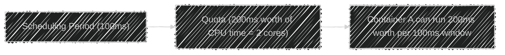

# 🚦 The Linux CPU Scheduler — **Completely Fair Scheduler (CFS)**

> 🧠 _CFS decides who gets how much CPU time, when, and for how long._

---

## 📖 **What Is a CPU Scheduler?**

The **CPU scheduler** is part of the Linux kernel that decides:

- Which process should run next
- For how long it should run
- When to pause and switch to another process

You can think of it as the **traffic controller** of your CPU,
making sure all processes get a turn, nobody blocks forever, and system stays responsive.

---

## ⁉️ **Why It Exists**

A CPU can execute **one thread per core** at a time.
But your system runs hundreds (or thousands) of processes simultaneously — Docker containers, system daemons, browsers, etc.

➡️ So Linux must **pretend** that everyone runs in parallel
by quickly switching between processes many times per second (context switching).

---

## ⚙️ **The CFS Philosophy** — “Be Fair to Everyone”

CFS = **Completely Fair Scheduler**
Introduced in Linux 2.6.23 (2007), it replaced the old “O(1)” scheduler.

Its goal:

> **Every runnable process should get an equal share of CPU over time.**

Instead of fixed time slices, CFS uses a **virtual clock** system that tracks _how much CPU time_ each process has already received.

---

## 🍕 **How CFS Shares CPU Time** (Simplified)

Let’s imagine:

- You have 1 CPU core
- 3 processes are running: P1, P2, P3

CFS tracks a “**virtual runtime (vruntime)**” for each process:

- `vruntime` = how much CPU time that process already used
- The smaller the `vruntime`, the **more “hungry”** the process is

CFS always picks the process with the **smallest vruntime** next.

---

### 🔄 Example

| Process | vruntime (ms) | Meaning           |
| ------- | ------------- | ----------------- |
| P1      | 10            | Used a lot of CPU |
| P2      | 5             | Used less         |
| P3      | 2             | Hardly ran yet    |

➡️ CFS picks **P3** to run next, since it’s the most “starved.”
After running, its vruntime increases.
Eventually, all processes’ vruntimes converge — achieving fairness.

---

### 🧩 Visual Timeline

<div align="center" style="background-color:#1b1515ff; border-radius: 10px; border: 2px solid">


</div>

Each process gets a turn — **the illusion of parallelism** on a single core.

---

## ⚖️ **CPU Shares** — Adding Weights

In Docker (and cgroups), each container has a **CPU weight** (default = 1024).
CFS uses these weights to decide **how big each process’s share** of CPU time should be.

If you have two containers:

- `webapp1` → 1024 shares
- `webapp2` → 512 shares

Then CFS ensures:

- `webapp1` gets 2× more CPU time than `webapp2`
- But if `webapp2` is alone, it can still use 100% CPU

---

### 🧩 Visualizing Weighted Fairness

<div align="center" style="background-color:#1b1515ff; border-radius: 10px; border: 2px solid">


</div>

CFS doesn’t impose a hard cap — it adjusts scheduling **proportionally**.

---

## ⏱️ **Time Slices** — “Scheduling Periods”

CFS divides CPU time into **scheduling periods** — usually around **6–10 ms**.

Each process gets a slice of that period proportional to its share.

For example:

- 1 CPU core, 2 containers (weights 1024 and 512)
- Scheduling period = 9 ms

  - Container A → 6 ms
  - Container B → 3 ms

Then the next period begins, and both get another slice.

This keeps CPU sharing smooth and balanced.

---

## ⚙️ **Preemption and Context Switching**

If a new, higher-priority process appears (or a process wakes from sleep),
CFS can **preempt** (pause) the running process and switch instantly.

This ensures:

- Interactive tasks (like SSH, terminal, GUI) respond fast
- Background tasks (like batch jobs) don’t block them

Each context switch adds a small overhead (~1–3 microseconds),
but it’s necessary for fairness.

---

## 🧠 **Docker + CFS = Resource Fairness**

When you use:

```bash
docker run --cpu-shares=512 nginx
```

Docker writes to the cgroup file:

```ini
/sys/fs/cgroup/cpu/docker/<id>/cpu.shares
```

Then the kernel’s CFS scheduler reads that value
and divides CPU time accordingly.

So **Docker doesn’t implement CPU throttling itself** —
it delegates the job to **CFS inside the kernel**.

---

## ⚠️ **Hard CPU Limits with Quota System**

CFS also supports **hard caps**, used by Docker’s `--cpus` flag.

It uses two key parameters:

- `cpu.cfs_period_us` — how long each cycle lasts (default: 100000 µs = 100ms)
- `cpu.cfs_quota_us` — how much time your process can run within that period

Example:

```bash
docker run --cpus=2 nginx
```

Docker sets:

```ini
cpu.cfs_period_us = 100000
cpu.cfs_quota_us  = 200000
```

→ meaning: every 100ms, this container can run for 200ms of CPU time total (≈2 cores).

---

### 🧩 Visualization — CFS Quota Logic

<div align="center">



</div>

If it exceeds its quota → the kernel throttles it until the next period.

---

## ⚡ **Real-Time Scheduler (FYI)**

CFS handles **normal workloads**,
but Linux also supports **real-time (RT)** schedulers (e.g., `SCHED_RR`, `SCHED_FIFO`)
for ultra-low-latency tasks like audio, robotics, or embedded systems.

Docker supports these too (with the `--cpu-rt-runtime` flag),
but only if your host kernel allows RT scheduling — not common in production servers.

---

## 🧭 **Commands** to Observe CFS in Action

### Check CPU usage per container

```bash
docker stats
```

### Inspect container CPU quota

```bash
cat /sys/fs/cgroup/cpu/docker/<id>/cpu.cfs_*
```

### Inspect all process weights

```bash
cat /sys/fs/cgroup/cpu/docker/*/cpu.shares
```

---

## 🏁 **Summary** — CFS in Plain English

| Concept               | Meaning                               | Analogy                                    |
| --------------------- | ------------------------------------- | ------------------------------------------ |
| **CFS**               | Kernel scheduler for normal processes | “Fair judge of CPU time” ⚖️                |
| **vruntime**          | Virtual time tracking CPU use         | “How long you’ve eaten pizza” 🍕           |
| **cpu.shares**        | Relative priority                     | “More weight = more slices”                |
| **cpu.cfs_quota_us**  | Hard CPU limit                        | “You can only eat 2 slices per 10 seconds” |
| **cpu.cfs_period_us** | Period length for quota               | “The timer that resets your eating rights” |

---

## 💡 **Example Recap**

| Docker Flag     | What It Does               | Backed by CFS Parameter                |
| --------------- | -------------------------- | -------------------------------------- |
| `--cpu-shares`  | Relative scheduling weight | `cpu.shares`                           |
| `--cpus`        | Hard CPU limit (cores)     | `cpu.cfs_quota_us / cpu.cfs_period_us` |
| `--cpuset-cpus` | Core affinity              | CPU affinity mask (not CFS directly)   |

---

✅ **In short:**  
CFS is what makes Docker’s CPU limits _real_.  
It gives every container a fair share of CPU cycles using **virtual runtime tracking**,
**weighted fairness**, and **periodic quotas** —
so one container can’t hijack your system.
