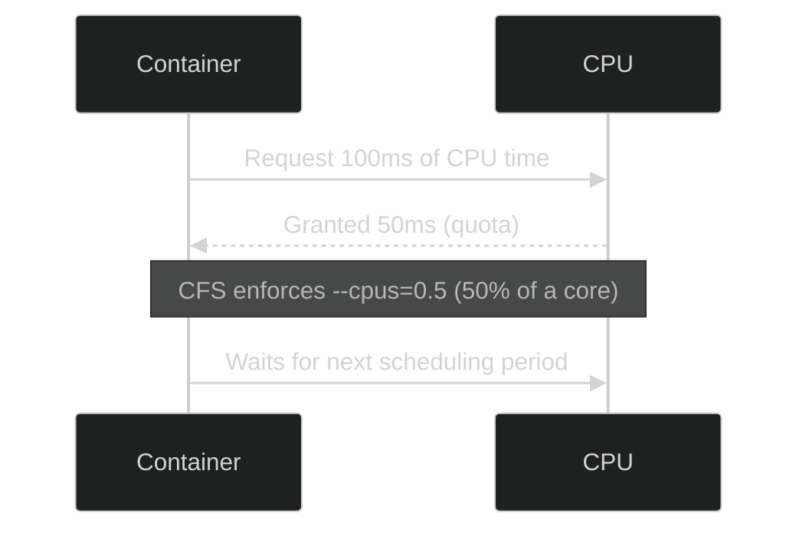

# ⚙️ **CPU Resource Limits in Docker (Cgroups + Scheduler)**

> Docker containers share the host kernel, including the CPU.  
> Without limits, one noisy container can hog all CPU time.  
> To prevent that, Docker uses **Linux Control Groups (cgroups)** and the **Completely Fair Scheduler (CFS)** to control **who gets how much CPU time**.

---

## ⚙️ **How Docker Controls CPU Resources**

There are **three main ways** to manage CPU usage in containers:

| Method | Flag            | Type              | Description                           |
| ------ | --------------- | ----------------- | ------------------------------------- |
| 1️⃣     | `--cpu-shares`  | _Relative Weight_ | Share CPU _fairly_ between containers |
| 2️⃣     | `--cpus`        | _Absolute Limit_  | Set hard CPU usage cap                |
| 3️⃣     | `--cpuset-cpus` | _Pinning_         | Restrict to specific cores            |

---

## 1️⃣ `--cpu-shares` — Relative CPU Weight

### 💡 Concept:

This doesn’t _limit_ CPU.
It just defines **relative priority** between containers when CPU contention happens.

> If only one container is active, it can still use **100% of CPU** even with a small share.

---

### 🧪 Example

Let’s say your host has **4 cores**.

You run two containers:

```bash
docker run -d --name web1 --cpu-shares=1024 nginx
docker run -d --name web2 --cpu-shares=512 nginx
```

🧮 **Result:**

- `web1` gets **twice** as much CPU time as `web2` when both are busy.
- Ratio: `1024 : 512 = 2 : 1`

If both are under full load,

- `web1` → ≈ **66% CPU time**
- `web2` → ≈ **33% CPU time**

If `web1` is idle → `web2` can use **100%** of the CPU.

---

### 🧩 Notes

| Concept | Description                                                    |
| ------- | -------------------------------------------------------------- |
| Default | All containers = `1024` shares                                 |
| Range   | Any positive integer (not capped, but typically 2–2048)        |
| Scope   | Only affects CPU allocation _when multiple containers compete_ |
| Type    | **Soft limit** (relative weighting, not enforcement)           |

---

### 🧠 Analogy

Think of **`--cpu-shares`** as “how many tickets” each container gets in a CPU lottery 🎟️:

- More tickets → higher chance to run more often.
- But if the others aren’t competing, you get all the CPU anyway.

---

## 2️⃣ `--cpus` — Hard CPU Limit

### 💡 Concept:

This defines the **maximum number of CPU cores** a container can use.

It’s an **absolute limit** — enforced by the **CFS quota system** (`cpu.cfs_quota_us`).

---

### 🧪 Example 1 — Half a CPU Core

```bash
docker run -d --name api --cpus=0.5 nginx
```

🧮 **Result:**

- The container can only use **50% of one CPU core**.
- CFS sets a time quota:

  - Period: 100,000 μs (100ms)
  - Quota: 50,000 μs → container can run for half of that period.

---

### 🧪 Example 2 — 2.5 CPUs

```bash
docker run -d --name backend --cpus=2.5 nginx
```

🧮 **Result:**

- Container can use **2.5 full CPU cores**.
- On a 4-core host, that’s **62.5%** of total CPU time.
- The kernel enforces this strictly, even if other containers are idle.

---

### 🧪 Example 3 — Update Running Container

You can also update an existing container:

```bash
docker update --cpus=1.5 backend
```

The limit is applied dynamically, without stopping the container.

---

### ⚠️ Notes

| Option          | Description                                         |
| --------------- | --------------------------------------------------- |
| `--cpus`        | Defines the number of cores the container can use   |
| Internally Uses | `cpu.cfs_quota_us` and `cpu.cfs_period_us`          |
| Enforced By     | **CFS quota system** (Linux Scheduler)              |
| Type            | **Hard limit** — container cannot exceed this quota |

---

### 🧩 Visual — How CFS Quota Works



🧠 The **CFS** (Completely Fair Scheduler) divides time into small periods
and assigns each container its “fair share” of execution time based on quota.

---

## 3️⃣ `--cpuset-cpus` — Pinning Containers to Specific Cores

### 💡 Concept:

Bind a container to specific **CPU cores**, improving cache locality and predictability.

---

### 🧪 Example

Host with **4 cores (0–3)**

```bash
docker run -d --cpuset-cpus="0-1" --name web1 nginx
docker run -d --cpuset-cpus="2,3" --name web2 nginx
```

🧮 **Result:**

- `web1` only runs on cores 0 and 1
- `web2` only runs on cores 2 and 3
  They don’t compete, which improves stability for performance-sensitive apps (e.g., databases).

---

### ⚠️ Notes

| Option                | Description                                       |
| --------------------- | ------------------------------------------------- |
| `--cpuset-cpus="0,1"` | Use cores 0 and 1 only                            |
| `--cpuset-cpus="2-3"` | Use core range 2 to 3                             |
| Type                  | **Core affinity** — physical pinning, not a limit |

---

## 📝 **Combined Example** — All Together

```bash
docker run -d \
  --name webapp \
  --cpus=2.5 \
  --cpu-shares=512 \
  --cpuset-cpus="0-2" \
  nginx
```

| Flag                  | Meaning                       |
| --------------------- | ----------------------------- |
| `--cpus=2.5`          | Hard limit: use max 2.5 cores |
| `--cpu-shares=512`    | Lower priority if contention  |
| `--cpuset-cpus="0-2"` | Run only on cores 0–2         |

🧩 The container can use only 2.5 cores (out of 3 assigned), and if it competes with others, it’ll get half their share.

---

## ⚙️ **Inspecting CPU Limits**

You can verify limits using:

```bash
docker inspect <container> | grep -i cpu
```

or monitor live usage:

```bash
docker stats
```

Output includes:

```ini
CONTAINER   CPU %   MEM USAGE / LIMIT
webapp      62.3%   200MiB / 512MiB
```

---

## 🏁 **Summary**

| Flag            | Purpose                | Type     | Example               |
| --------------- | ---------------------- | -------- | --------------------- |
| `--cpu-shares`  | Relative weight        | Soft     | `--cpu-shares=512`    |
| `--cpus`        | Hard CPU limit         | Hard     | `--cpus=2.5`          |
| `--cpuset-cpus` | Bind to specific cores | Affinity | `--cpuset-cpus="0-1"` |

---

## 🚨 **Best Practices**

- ✅ Always use `--cpus` for **production containers**
- ✅ Use `--cpu-shares` only when sharing CPU between non-critical services
- ✅ Use `--cpuset-cpus` for **latency-sensitive workloads** (e.g., DBs, APIs)
- ✅ Monitor with `docker stats` or `cAdvisor`
- ✅ Tune with real-world load tests — not guesses

---

## 🧩 **Mental Model**

Think of your CPU like a **pizza 🍕**:

- `--cpus` = how many slices you _can_ eat
- `--cpu-shares` = your _priority_ when everyone’s hungry
- `--cpuset-cpus` = which slices (cores) you’re allowed to take
