# 🔍 **Image Scanning**

## 📖 **What Is Image Scanning?**

> **Image Scanning** is the process of analyzing a **container image** to find **security vulnerabilities**, **malware**, or **misconfigurations** before it’s deployed.

When you build a Docker image — it contains:

- an **OS base** (e.g., Ubuntu, Alpine, Debian)
- **system libraries**
- **language dependencies** (npm, pip, gem, etc.)
- your **application code**

Each of these layers may contain **known vulnerabilities (CVEs)**.

Example:

You built your app using `ubuntu:20.04`, but that image contains:

- OpenSSL 1.1.1k (CVE-2023-0464)
- curl 7.68.0 (CVE-2022-27774)

So even though your app runs fine, it’s silently insecure.

---

## 🧠 **Why It’s Critical for DevOps/SRE**

| Without Scanning                              | With Scanning                                |
| --------------------------------------------- | -------------------------------------------- |
| You deploy images “as is.”                    | You detect risky packages early.             |
| Vulnerabilities show up **after** compromise. | You fix vulnerabilities **before** shipping. |
| No visibility into base image health.         | Centralized reports on image risk.           |
| Difficult to enforce compliance.              | Meets SOC2, ISO, and CIS benchmarks.         |

### 📌 Real-world rule:

> “**Never deploy an image that hasn’t been scanned**.”
> Most enterprises enforce this in CI/CD (especially for prod environments).

---

## ⚙️ **How Image Scanning Works Internally**

```mermaid
flowchart TD
    A[📦 Container Image] -->|1. Extract Layers| B[🗂 File System Snapshot]
    B -->|2. Identify OS + Packages| C[📚 Package Inventory]
    C -->|3. Compare with CVE DB| D[🔍 Vulnerability Matching Engine]
    D -->|4. Report Results| E[📜 Vulnerability Report]
```

<div align="center" style="background-color:#071D28; border-radius: 10px; border: 2px solid">



</div>

### Step-by-step:

#### 1️⃣ Extract Layers

- Each image is a stack of **read-only layers**.
- The scanner unpacks these layers and inspects filesystem metadata.

#### 2️⃣ Identify OS + Packages

- It checks `/etc/os-release` to detect OS type (Ubuntu, Alpine, etc.)
- Then reads installed packages from:

  - `dpkg -l` (Debian/Ubuntu)
  - `rpm -qa` (RHEL/CentOS)
  - `apk info` (Alpine)

- Also scans dependency manifests like:

  - `package-lock.json` (Node.js)
  - `requirements.txt` (Python)
  - `pom.xml` (Java)

#### 3️⃣ Match Against CVE Databases

- Each package version is compared to known **Common Vulnerabilities and Exposures (CVE)** records from:

  - NVD (National Vulnerability Database)
  - Vendor advisories (RedHat, Debian)
  - GitHub Security Advisories

#### 4️⃣ Generate Report

- Each finding includes:

  - **CVE ID**
  - **Severity**
  - **Package name**
  - **Installed version**
  - **Fixed version (if available)**

---

## 🧾 **Example Vulnerability Entry**

| Field                 | Example                                       |
| --------------------- | --------------------------------------------- |
| **CVE ID**            | CVE-2024-12345                                |
| **Package**           | openssl                                       |
| **Installed Version** | 1.1.1k                                        |
| **Fixed In**          | 1.1.1w                                        |
| **Severity**          | HIGH                                          |
| **Description**       | Heap buffer overflow in SSL_do_handshake()... |

This data helps DevOps teams patch the image or rebuild with newer base layers.

---

## ⚙️ **Types of Image Scanning**

<div align="center" style="background-color:#071D28; border-radius: 10px; border: 2px solid">

| Type                             | What It Checks                            | Examples                        |
| -------------------------------- | ----------------------------------------- | ------------------------------- |
| **OS Package Scanning**          | Vulnerabilities in system libs            | CVEs in glibc, openssl, bash    |
| **Language Dependency Scanning** | Vulnerabilities in app-level dependencies | npm, pip, gem, maven            |
| **Configuration Scanning**       | Insecure Dockerfile / permissions         | Running as root, no healthcheck |
| **Secrets Scanning**             | Exposed API keys, tokens                  | AWS keys, SSH private keys      |
| **Malware Scanning**             | Known bad binaries                        | Signature-based detection       |

</div>

---

## 🔖 **Common Image Scanning Tools**

<div align="center" style="background-color:#071D28; border-radius: 10px; border: 2px solid">

| Tool                              | Type                  | Notes                                    |
| --------------------------------- | --------------------- | ---------------------------------------- |
| **Trivy**                         | Open-source           | Fast, supports CVE, config, IaC, secrets |
| **Grype**                         | Open-source (Anchore) | Works offline, SBOM-based                |
| **Clair**                         | CNCF project          | Used by Harbor registry                  |
| **Docker Scout**                  | Docker official       | Integrated with Docker Hub               |
| **AWS ECR Scan**                  | Managed               | Automatically scans pushed images        |
| **Azure Defender for Containers** | Managed               | Scans ACR and AKS                        |
| **GCP Artifact Registry Scan**    | Managed               | Built into Google Cloud registry         |

</div>

---

## 🎯 **Where Image Scanning Fits**

Image scanning usually happens in **three stages** of the container lifecycle:

<div align="center" style="background-color:#071D28; border-radius: 10px; border: 2px solid">

| Stage             | Description                            | Example                    |
| ----------------- | -------------------------------------- | -------------------------- |
| **Build Time**    | Scan images before pushing to registry | Trivy, Grype               |
| **Registry Time** | Registry auto-scans after push         | AWS ECR, ACR               |
| **Runtime**       | Scan running containers or nodes       | Falco, Aqua, Sysdig Secure |

</div>

---

## 📝 **Example**: Build + Scan Pipeline


Example CI/CD snippet:

```yaml
# Pseudo YAML pipeline
steps:
  - name: Build image
    run: docker build -t myapp:v1 .
  - name: Scan image
    run: trivy image --exit-code 1 --severity HIGH,CRITICAL myapp:v1
  - name: Push to registry
    run: docker push myapp:v1
```

If Trivy finds any **HIGH or CRITICAL** issues, it stops the pipeline 🚫

---

## 🧠 Key Benefits

- ✅ Early vulnerability detection
- ✅ Automated compliance (CIS, PCI-DSS, SOC2)
- ✅ Prevents deployment of insecure containers
- ✅ Integrates easily with CI/CD tools (GitHub, Jenkins, GitLab)
- ✅ Supports **SBOM (Software Bill of Materials)** generation

---

## 🏁 In Short

| Aspect            | Description                                      |
| ----------------- | ------------------------------------------------ |
| **Purpose**       | Find vulnerabilities, misconfigurations, secrets |
| **Focus**         | Image content (packages, libs, configs)          |
| **Output**        | List of CVEs and risks                           |
| **Frequency**     | On every build or registry push                  |
| **Tool Examples** | Trivy, Grype, Clair, ECR Scan, Docker Scout      |

---

## 💭 Quick Analogy

Think of **image scanning** like a **security X-ray** for your container:

- It doesn’t change or block your image itself.
- It just reports what’s _inside_ — good or bad.
- You decide whether it’s “safe to deploy.”
