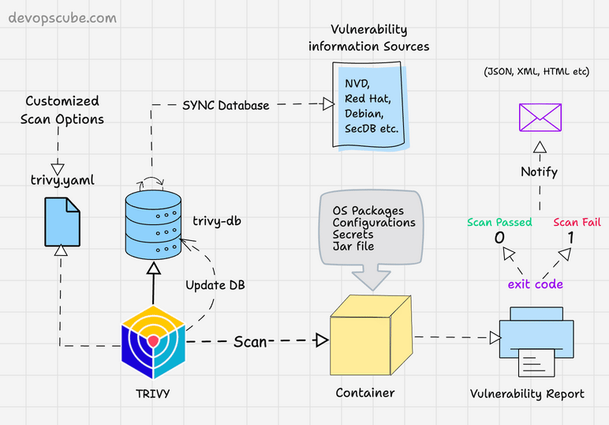
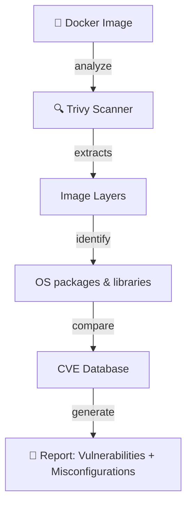
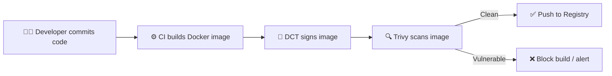

# 🕵🏻 **Trivy**

## 📖 **What Is Trivy?**

> **Trivy** (by Aqua Security) is a **vulnerability scanner** for:
>
> - Docker **images**
> - **Containers** running on your host
> - Local **filesystems**
> - **Git repositories** (IaC scanning)
> - **Kubernetes clusters**

Its job:  
👉 Find **known security vulnerabilities (CVEs)** in packages and libraries  
👉 Detect **misconfigurations** (like privileged containers, weak permissions)

---

<div align="center" style="background-color:#F4F4F4; border-radius: 10px; border: 2px solid">
  
</div>

---

## 🧠 **Why We Need It**

Docker Content Trust (DCT) only ensures “the image is from the right person.”
But we also need to know:  
 “Is the image **safe** to run?”

Example:

- Image is signed ✅ (authentic)
- But includes **OpenSSL with CVE-2024-XXXX** ❌

That’s what **Trivy** detects.

---

## ⚙️ **How Trivy Works Internally**

<div align="center" style="background-color:#071D28; border-radius: 10px; border: 2px solid">



</div>

### 🧠 **Internals:**

1. **Extracts image layers**

   - Reads `/var/lib/docker/overlay2/...` or pulls metadata directly from registry.
   - Looks for OS packages (apk, dpkg, rpm) and language dependencies (npm, pip, etc.).

2. **Matches each package version**

   - Compares against its **CVE database** (updated from NVD, vendor advisories, etc.).

3. **Outputs report**

   - Lists vulnerabilities with severity, fixed version, and package details.

---

## ⚙️ **Installing Trivy**

You can install it on any machine with Docker:

### 🐧 On Linux / macOS:

```bash
brew install aquasecurity/trivy/trivy
# or
sudo apt install trivy
```

### 🪟 On Windows (PowerShell):

```powershell
choco install trivy
```

---

## ✍🏻 **Basic Image Scan Example**

```bash
trivy image nginx:latest
```

Output:

```ini
nginx:latest (debian 12.1)

Total: 5 (UNKNOWN: 0, LOW: 1, MEDIUM: 2, HIGH: 2, CRITICAL: 0)

┌────────────┬─────────────────────┬──────────┬───────────────┬──────────┐
│  Severity  │     Vulnerability   │ Package  │ Installed Ver │ Fixed Ver│
├────────────┼─────────────────────┼──────────┼───────────────┼──────────┤
│  HIGH      │ CVE-2024-12345      │ openssl  │ 3.0.2-1       │ 3.0.8    │
│  MEDIUM    │ CVE-2023-6789       │ libc6    │ 2.36          │ 2.37     │
└────────────┴─────────────────────┴──────────┴───────────────┴──────────┘
```

✅ **Interpreting results:**

- Each row = one vulnerability.
- “Fixed version” shows what you should update to.
- “Severity” helps prioritize fixes.

---

## ✍🏻 **Advanced Example — CI/CD Report**

Generate JSON or table reports for automation:

```bash
# Scan and output JSON
trivy image --format json --output report.json myapp:1.0

# Scan for only high or critical
trivy image --severity HIGH,CRITICAL myapp:1.0
```

---

## 🔍 **Scan Without Pulling Image (Remote Registry)**

You can scan images directly from Docker Hub or ECR:

```bash
trivy image docker.io/library/alpine:latest
trivy image 123456789012.dkr.ecr.us-east-1.amazonaws.com/myapp:v1
```

If the registry requires auth, Trivy uses your local Docker credentials.

---

## 🎁 **Scanning Files and Repos (Bonus)**

Trivy can also scan **code repos** for secrets or IaC issues:

```bash
# Scan source code for secrets/misconfigurations
trivy fs .
# Scan Terraform or Kubernetes manifests
trivy config .
```

---

## 🫙 **How the CVE Database Works**

- Trivy maintains a **local cache** of vulnerability data.
- You can update it anytime:

  ```bash
  trivy --download-db-only
  ```

- It merges multiple feeds:

  - NVD (National Vulnerability Database)
  - GitHub Security Advisories
  - OS vendor advisories (Debian, Alpine, etc.)

---

## ⚠️ **Trivy Severities**

<div align="center" style="background-color:#071D28; border-radius: 10px; border: 2px solid">

| Severity     | Meaning                                      | Action               |
| ------------ | -------------------------------------------- | -------------------- |
| **CRITICAL** | Remote code execution / privilege escalation | Patch immediately    |
| **HIGH**     | Denial-of-service / serious flaw             | Fix quickly          |
| **MEDIUM**   | Information disclosure                       | Plan update          |
| **LOW**      | Cosmetic or minor issue                      | Optional fix         |
| **UNKNOWN**  | No rating yet                                | Investigate manually |

</div>

---

## ♾️ **Integrating Trivy in CI/CD**

Example (GitHub Actions):

```yaml
name: Image Scan
on: [push]
jobs:
  scan:
    runs-on: ubuntu-latest
    steps:
      - uses: actions/checkout@v4
      - name: Build Docker image
        run: docker build -t myapp:${{ github.sha }} .
      - name: Scan image with Trivy
        uses: aquasecurity/trivy-action@master
        with:
          image-ref: myapp:${{ github.sha }}
          format: table
          exit-code: 1
          ignore-unfixed: true
```

🧠 This fails the pipeline if any **HIGH/CRITICAL** vulnerability is found.

---

## 🖼️ **Visual Flow:** Trivy in DevOps Pipeline



---

## ✔️ **Key Takeaways**

| Concept           | Explanation                                     |
| ----------------- | ----------------------------------------------- |
| **Purpose**       | Finds CVEs, misconfigurations, and secrets      |
| **When**          | After build or before deploy                    |
| **Data Source**   | CVE databases (NVD, vendor feeds)               |
| **Output**        | Table, JSON, SARIF for CI integration           |
| **Usage**         | `trivy image`, `trivy fs`, `trivy config`       |
| **Best Practice** | Automate in CI/CD; block severe vulnerabilities |

## 🔗 **Learn More**

- [Trivy Security Blog](https://devopscube.com/scan-docker-images-using-trivy/)
- [Trivy GitHub](https://github.com/aquasecurity/trivy)
- [Trivy Docker Hub](https://hub.docker.com/r/aquasecurity/trivy)
- [Trivy Blog](https://aquasecurity.github.io/trivy/)
