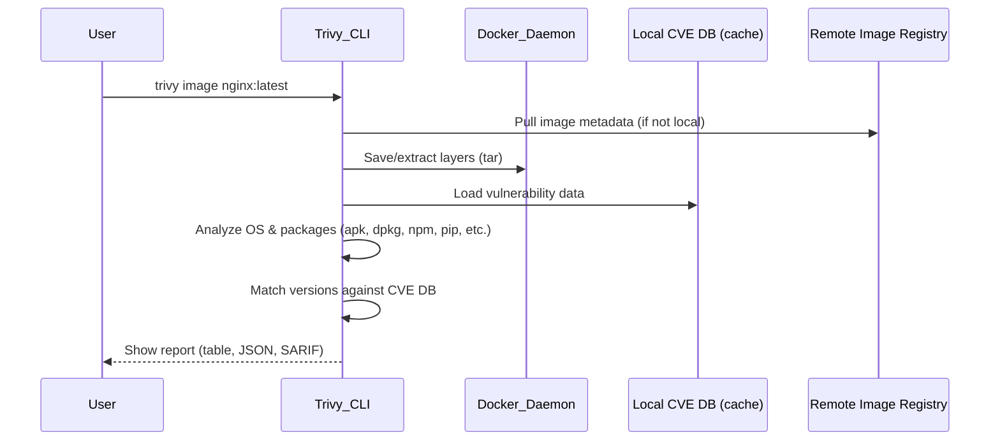
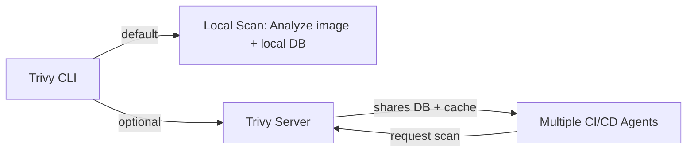

# 🧠 How Trivy Works Internally

Trivy is **local-first** — meaning, all scanning happens **on your own machine**, not on a remote server.
It’s not sending your image or code to Aqua Security’s cloud.

Let’s visualize the flow:

<div align="center" style="background-color:#071D28; border-radius: 10px; border: 2px solid">



</div>

---

## 🧩 Step-by-Step Breakdown

### 1️⃣ Local or Remote Image Retrieval

- If you run `trivy image nginx:latest`:

  - If the image exists locally, Trivy uses it.
  - If not, it **pulls metadata** from the remote registry (Docker Hub, ECR, etc.) using your Docker credentials.

- Trivy doesn’t upload your image anywhere — it only fetches what’s needed to analyze.

### 2️⃣ Local Extraction

- Trivy uses Docker’s `save` API internally to **extract image layers** into `/tmp/trivy/` (or your Docker cache).
- Each layer is unpacked to analyze:

  - `/etc/os-release`
  - `/var/lib/dpkg/status` (Debian)
  - `/lib/apk/db/installed` (Alpine)
  - `package-lock.json`, `requirements.txt`, etc.

### 3️⃣ Local Database Lookup

- Trivy keeps a **local vulnerability database**, usually under:

  ```ini
  ~/.cache/trivy/db/
  ```

- This DB is downloaded from Aqua’s public mirror (GitHub release) and cached locally.

### 4️⃣ Vulnerability Matching

- Trivy runs a **local match engine** — it compares each detected package version against the CVE data.
- The entire comparison and filtering happen locally (CPU-bound).

### 5️⃣ Report Generation

- Finally, it formats results as:

  - table
  - JSON
  - SARIF (for GitHub Actions)
  - SPDX or CycloneDX (SBOM)

✅ No network dependency except when:

- downloading the CVE DB (if outdated)
- pulling remote image metadata (if image isn’t local)

---

## 🧠 Summary — Where the Work Happens

| Component             | Location          | Description                                  |
| --------------------- | ----------------- | -------------------------------------------- |
| **Image analysis**    | Local             | Extract layers, identify OS, parse manifests |
| **CVE matching**      | Local             | Matches versions using cached DB             |
| **CVE DB download**   | Remote (once)     | Fetch from Aqua Security CDN                 |
| **Registry access**   | Remote (optional) | If image not local                           |
| **Report generation** | Local             | JSON, table, SARIF                           |

So Trivy doesn’t “scan remotely.”
It’s your CPU and disk doing all the heavy lifting ⚙️

---

## 🐢 Why Trivy Can Be Slow (and How to Fix It)

Trivy’s first scan is slow because it downloads and unpacks large data.

### Common causes:

| Cause                  | Explanation                            | Fix                                      |
| ---------------------- | -------------------------------------- | ---------------------------------------- |
| **CVE DB download**    | First run downloads 100–200MB database | Use `--download-db-only` periodically    |
| **Large images**       | More layers = more unpacking           | Use smaller base images (e.g., `alpine`) |
| **Network throttling** | When fetching remote image             | Use local cache (`--cache-dir`)          |
| **No caching**         | Each run rescans everything            | Use `--cache-dir` + `--ignore-unfixed`   |
| **JSON format**        | Slower than table output               | Use `--format table` unless needed       |

---

## ⚡️ Speed Optimization Tips (2025)

Use these best practices and flags:

### ✅ 1. Preload DB manually (avoid re-downloads)

```bash
trivy --download-db-only
```

### ✅ 2. Use cache directory

```bash
trivy image --cache-dir /tmp/trivy-cache nginx:latest
```

### ✅ 3. Ignore unfixed vulnerabilities (huge time saver)

```bash
trivy image --ignore-unfixed nginx:latest
```

### ✅ 4. Limit scope to High & Critical

```bash
trivy image --severity HIGH,CRITICAL nginx:latest
```

### ✅ 5. Scan locally without network calls

If the image is already present:

```bash
trivy image --offline-scan myimage:latest
```

### ✅ 6. Update DB in background

Use a cron job:

```bash
0 0 * * * trivy --download-db-only > /dev/null 2>&1
```

### ✅ 7. Use SBOM for faster re-scans

Trivy can scan from **SBOMs** (Software Bill of Materials):

```bash
trivy sbom --input sbom.json
```

---

## 🧰 Latest & Useful Commands (2025)

### 🔍 Scan image with minimal noise

```bash
trivy image --quiet --ignore-unfixed --severity HIGH,CRITICAL nginx:latest
```

### 📜 Export results as JSON

```bash
trivy image --format json --output result.json myapp:v2
```

### 🧩 Generate SBOM

```bash
trivy image --format cyclonedx --output sbom.json myapp:v2
```

### 🧾 Scan Dockerfile for bad practices

```bash
trivy config --severity HIGH,CRITICAL .
```

### 📁 Scan your project source code

```bash
trivy fs --severity HIGH,CRITICAL .
```

### 🔐 Scan for secrets

```bash
trivy fs --scanners secret .
```

### 🚀 Speed-optimized all-in-one

```bash
trivy image --skip-db-update --ignore-unfixed --severity HIGH,CRITICAL --format table nginx:latest
```

---

## 🧠 Bonus: Trivy Modes

| Mode                   | Command                                   | Description                     |
| ---------------------- | ----------------------------------------- | ------------------------------- |
| **Standalone (CLI)**   | `trivy image myapp:v1`                    | Local scan (default)            |
| **Client-Server Mode** | `trivy server` / `trivy client`           | Remote caching and shared DB    |
| **Air-gapped Mode**    | `trivy --download-db-only` + offline copy | For disconnected environments   |
| **Kubernetes Mode**    | `trivy k8s cluster`                       | Scans all running workloads     |
| **Continuous Mode**    | `trivy monitor`                           | Watches registries continuously |

---

## 🧩 Visualization — Local Scan vs. Client-Server Mode



If your CI/CD has many agents, **Trivy Server mode** centralizes the CVE DB and cache to reduce repeated downloads.

---

## ✅ TL;DR

| Question                             | Answer                                                       |
| ------------------------------------ | ------------------------------------------------------------ |
| Does Trivy scan locally or remotely? | **Locally**, all processing is local.                        |
| Does it upload my image?             | ❌ Never.                                                    |
| Why slow?                            | DB download + layer unpacking.                               |
| How to fix?                          | Use cache, ignore unfixed, preload DB.                       |
| Best speed flags?                    | `--skip-db-update --ignore-unfixed --severity HIGH,CRITICAL` |
| Latest mode for CI/CD?               | Use **Trivy Server** to centralize cache & DB.               |
