# 🔞 Docker Content Trust (DCT) & Image Signing with Notary

## 🧩 1. What Is Docker Content Trust?

> **Docker Content Trust (DCT)** ensures the **authenticity and integrity** of images that you pull or push.
> It guarantees that **the image comes from a trusted publisher** and **has not been tampered with** during transport or in a registry.

Without DCT:

- You can `docker pull nginx:latest` — but you don’t _really_ know if someone replaced it with malware.
- You trust the registry implicitly.

With DCT:

- The image has a **cryptographic signature**.
- Docker verifies this signature before running or pulling it.

---

## 🏗️ 2. The Engine Behind It — **Notary**

**Notary** is an open-source project by Docker implementing **The Update Framework (TUF)**.

It’s like a _mini Public Key Infrastructure (PKI)_ for Docker images:

- Maintains signed metadata for each image tag.
- Allows offline signing keys.
- Protects against **key compromise**, **replay**, and **tampering** attacks.

---

## ⚙️ 3. Architecture Overview

```mermaid
flowchart LR
    Dev["👨‍💻 Developer (Signer)"] -->|"docker push (signed)"| Notary["🔏 Notary Server"]
    Notary -->|stores signatures & metadata| Registry["🏭 Docker Registry (Hub / ECR / ACR)"]
    User["🧩 Docker Client (Verifier)"] -->|docker pull| Registry
    User -->|fetch signatures| Notary
    User -->|verify using trust data| Trusted["✅ Trusted Image"]
```



### Components:

| Component          | Description                                   |
| ------------------ | --------------------------------------------- |
| **Notary Server**  | Stores trusted metadata and signatures        |
| **Trust Server**   | Often co-located with Docker Hub, ECR, or ACR |
| **Root Key**       | Highest-trust key (kept offline)              |
| **Repository Key** | Used for signing tags for an image repo       |
| **Target Key**     | Signs individual image tags                   |
| **Timestamp Key**  | Ensures metadata freshness                    |

---

## 🔐 4. How Docker Content Trust Works

Let’s follow a full lifecycle:

### Step 1: Enable DCT

```bash
export DOCKER_CONTENT_TRUST=1
```

Now every pull/push is **signed or verified**.

---

### Step 2: Build an image

```bash
docker build -t myrepo/myapp:v1 .
```

---

### Step 3: Push with signing

When you push:

```bash
docker push myrepo/myapp:v1
```

Docker will:

1. Check `$DOCKER_CONTENT_TRUST=1`
2. Generate or use existing signing keys:

   - `~/.docker/trust/private/<keyid>.key`

3. Create a signed metadata bundle (JSON, signatures)
4. Send the image to registry **and** the signature to **Notary Server**

---

### Step 4: Pull with verification

When someone pulls:

```bash
docker pull myrepo/myapp:v1
```

Docker:

1. Contacts the registry for the image layers.
2. Contacts the Notary server for the signature metadata.
3. Verifies:

   - The tag was signed.
   - The signature matches the image hash.
   - The signer’s public key matches a trusted one.

4. If all good → proceeds with download.
   If invalid → ❌ “No valid trust data” error.

---

### Step 5: Rotate or Revoke Keys

If a signing key is compromised:

```bash
docker trust key rotate myrepo/myapp --key newkey.pem
```

The **root key** (offline) is used to sign new delegation keys securely.

---

## 🧱 5. Types of Keys in DCT (TUF Model)

| Key Type           | Purpose                      | Storage                      |
| ------------------ | ---------------------------- | ---------------------------- |
| **Root Key**       | Master of trust chain        | Offline / hardware key store |
| **Repository Key** | Delegated authority for repo | Online                       |
| **Targets Key**    | Signs image tags             | Online                       |
| **Timestamp Key**  | Ensures freshness            | Rotated frequently           |

Each layer of keys protects the next.
Even if a lower-level key is stolen, the attacker can’t compromise the root trust.

---

## 🧠 6. Example: AWS ECR with DCT

AWS ECR integrates **Notary v2 (OCI signatures)**.

1. Enable image signing:

   ```bash
   aws ecr put-registry-policy --registry-policy file://trust-policy.json
   ```

2. Sign your image:

   ```bash
   docker build -t 123456789012.dkr.ecr.us-east-1.amazonaws.com/myapp:v1 .
   export DOCKER_CONTENT_TRUST=1
   docker push 123456789012.dkr.ecr.us-east-1.amazonaws.com/myapp:v1
   ```

3. AWS CLI verification:

   ```bash
   aws ecr describe-image-scan-findings --repository-name myapp --image-id imageTag=v1
   ```

---

## ☁️ 7. Example: Azure ACR Content Trust

Azure Container Registry supports **Content Trust** (Notary v1).

Enable via Azure CLI:

```bash
az acr update -n myregistry --trust-policy enabled=true
```

Push signed image:

```bash
export DOCKER_CONTENT_TRUST=1
docker push myregistry.azurecr.io/myapp:v1
```

ACR automatically enforces signature validation during pulls.

---

## 🧩 8. Notary Metadata Layout

Each repository has a trust metadata store (JSON files):

```ini
~/.docker/trust/tuf/myrepo/myapp/metadata/
├── root.json
├── targets.json
├── snapshot.json
└── timestamp.json
```

These contain:

- Signed image digests
- Expiry timestamps
- Key IDs and delegations

---

## 🧰 9. Common Commands

| Command                                  | Purpose                         |
| ---------------------------------------- | ------------------------------- |
| `docker trust inspect <image>`           | View trust metadata and signers |
| `docker trust sign <image:tag>`          | Manually sign image             |
| `docker trust key generate <name>`       | Create new key                  |
| `docker trust signer add <name> <image>` | Add signer to repo              |
| `docker trust revoke <image:tag>`        | Revoke a tag signature          |
| `docker trust key rotate`                | Rotate signing keys             |

---

## ⚠️ 10. Real-World Problems It Solves

| Problem                  | Without DCT     | With DCT                           |
| ------------------------ | --------------- | ---------------------------------- |
| Malicious image uploaded | Can be pulled   | Signature invalid                  |
| Registry tampering       | Hard to detect  | Signature mismatch                 |
| Insider replacing tags   | Possible        | Rejected by client                 |
| Key compromise           | All access lost | Contained via delegation hierarchy |

---

## 🧠 11. Bonus: Notary v2 (OCI Signature Evolution)

Docker and OCI are evolving to **Notary v2 / cosign**:

- Uses **OCI artifacts** instead of TUF metadata.
- Standardized across registries (Docker Hub, ECR, ACR, GCR).
- Supported by tools like **cosign** and **oras**.

Example (future-proof):

```bash
cosign sign myregistry.azurecr.io/myapp:v1
cosign verify myregistry.azurecr.io/myapp:v1
```

---

## ✅ Summary

| Concept                        | Description                                                            |
| ------------------------------ | ---------------------------------------------------------------------- |
| **Docker Content Trust (DCT)** | Enforces signed pushes and verified pulls                              |
| **Notary**                     | Server that stores trust metadata and signatures                       |
| **mTLS vs DCT**                | mTLS → protects communication channel<br/>DCT → protects image content |
| **Keys**                       | Root, Repo, Target, Timestamp (TUF model)                              |
| **Enforcement**                | Controlled via `DOCKER_CONTENT_TRUST=1`                                |

---

Would you like me to follow this up with a **Mermaid sequence diagram** showing how the signing and verification flow works (Developer → Notary → Registry → User)?
That visualizes exactly where each signature check occurs and which keys are used.
