# 🔞 What DCT/Notary Solves

- **Authenticity**: proves _who_ produced the image.
- **Integrity**: proves the image wasn’t tampered with.
- **Policy**: clients can **refuse** unsigned or untrusted images.

> TLS protects the **channel**; DCT protects the **content** (the **image digest** for a given tag).

---

## 🧩 Core Pieces (TUF/Notary model)

| Key/Role                   | Purpose                                         | Where you keep it     |
| -------------------------- | ----------------------------------------------- | --------------------- |
| **Root key**               | Root of trust; delegates signers                | Offline (protected)   |
| **Repository/Targets key** | Signs tags (e.g., `myapp:1.2`)                  | Usually on signer/CI  |
| **Timestamp/Snapshot**     | Freshness & consistency                         | Notary service        |
| **Notary server**          | Stores trust metadata (signatures, delegations) | Registry/side service |
| **Client trust data**      | Verifies signatures on pull                     | `~/.docker/trust/`    |

---

## ⚙️ Enabling DCT (client-side)

```bash
export DOCKER_CONTENT_TRUST=1         # enforce signing/verification
```

Now:

- `docker push` → **signs** the tag
- `docker pull` → **requires** a valid signature

---

## 🔏 Signing flow (developer/CI)

- You build/tag an image.
- On push, Docker creates/uses signing keys and uploads **signatures** (trust metadata) to Notary.

```bash
# (one time) create a signer key pair
docker trust key generate alice

# (one time) add signer to the repo
docker trust signer add --key alice.pub alice myrepo/myapp

# build & sign during push
docker build -t myrepo/myapp:1.2 .
export DOCKER_CONTENT_TRUST=1
docker push myrepo/myapp:1.2
```

Check trust info:

```bash
docker trust inspect --pretty myrepo/myapp:1.2
```

---

## ✅ Verification flow (consumer)

With `DOCKER_CONTENT_TRUST=1`, a pull **fails** if trust data is missing/invalid.

```bash
export DOCKER_CONTENT_TRUST=1
docker pull myrepo/myapp:1.2   # verifies signature → then downloads
```

---

## 🧠 Diagrams

### 1. Push = **Sign + Publish**

```mermaid
sequenceDiagram
    autonumber
    participant Dev as Developer/CI
    participant CLI as Docker CLI (with DCT)
    participant Reg as Registry (image layers)
    participant Not as Notary Server (trust metadata)

    Dev->>CLI: docker push myrepo/myapp:1.2
    CLI->>CLI: Compute image digest for tag 1.2
    CLI->>CLI: Load signer key (Targets/Repo key)
    CLI->>Not: Publish signed metadata (targets/snapshot/timestamp)
    Note over CLI,Not: Signature binds tag → digest
    CLI->>Reg: Upload image manifest + layers (if needed)
    Reg-->>CLI: 201 Created
    Not-->>CLI: 200 OK (metadata stored)
    CLI-->>Dev: Push complete (image + signatures)
```



### 2. Pull = **Verify + Download**

```mermaid
sequenceDiagram
    autonumber
    participant User as Consumer
    participant CLI as Docker CLI (with DCT)
    participant Reg as Registry (image layers)
    participant Not as Notary Server (trust metadata)

    User->>CLI: docker pull myrepo/myapp:1.2
    CLI->>Not: Fetch trust metadata for myrepo/myapp
    CLI->>CLI: Verify signatures with local trust roots (root/targets)
    alt Invalid or missing trust data
        CLI-->>User: ❌ Reject: "no trust data / invalid signature"
    else Valid signatures
        CLI->>Reg: GET image manifest for tag 1.2
        CLI->>CLI: Compare manifest digest with signed digest
        alt Digest mismatch (tampering)
            CLI-->>User: ❌ Reject: "digest mismatch"
        else Digest matches
            Reg-->>CLI: 200 OK (layers)
            CLI-->>User: ✅ Pull succeeds (verified content)
        end
    end
```



---

## 🛠️ Daily Commands (you’ll actually use)

```bash
# Enforce trust in this shell
export DOCKER_CONTENT_TRUST=1

# See who can sign a repo
docker trust inspect --pretty myrepo/myapp

# Add a signer (needs repo admin)
docker trust signer add --key alice.pub alice myrepo/myapp

# Sign an already-pushed tag (explicit)
docker trust sign myrepo/myapp:1.2

# Rotate keys if compromised (repo admin + root delegation)
docker trust key rotate myrepo/myapp --key newkey.pem

# Revoke a tag (prevent future trusted pulls of that tag)
docker trust revoke myrepo/myapp:1.2
```

---

## ☁️ Registries quick notes

- **Docker Hub (Notary v1/TUF)**: `docker trust …` works out of the box.
- **AWS ECR (Notary v2/OCI signatures)**: signing integrated with ECR; verify in console/CLI.
- **Azure ACR (Notary v2/OCI signatures)**: enable content trust; signatures stored as OCI artifacts.
- **Harbor**: supports Notary v1 and OCI signatures + policy enforcement.

> Modern stacks are moving toward **Notary v2 / OCI signatures** (also supported by **cosign/notation**).

---

## 🧾 Policies you can enforce

- **Reject unsigned** images (client-side via DCT, or registry policy).
- **Pin by digest** in deployments:

  ```bash
  docker run myrepo/myapp@sha256:<immutable-digest>
  ```

- **Separate signers** for environments (e.g., only “Release” signer can sign `prod` tags).
- **Rotate** repo keys periodically; keep **root key offline**.

---

## 🧠 Mental model

- **Tag** → human label (mutable)
- **Digest** → content hash (immutable)
- **Signature** → _binds_ the tag to a specific digest that a trusted signer approved.

If a tag is moved to a different digest later, verification **fails**.

---

## ✅ TL;DR

- Turn on DCT: `export DOCKER_CONTENT_TRUST=1`.
- Push: images get **signed**; Notary stores trust metadata.
- Pull: client **verifies** signatures → only downloads trusted digests.
- Manage signers/keys with `docker trust …`.
- For newer registries, prefer **Notary v2/OCI signatures** (cosign/notation compatible).

Want a short **“prod-ready checklist”** for DCT (who holds which keys, how to organize signers per environment, and how to lock Kubernetes manifests to digests)?
