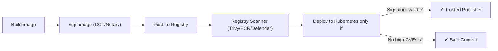

# 🧩 DCT vs. Image Scanning

<div align="center" style="background-color:#071D28; border-radius: 10px; border: 2px solid">

| Aspect                      | **Docker Content Trust (Notary)**                                     | **Image Scanning (Security Analysis)**                                                                    |
| --------------------------- | --------------------------------------------------------------------- | --------------------------------------------------------------------------------------------------------- |
| **Goal**                    | Verify **authenticity & integrity**                                   | Detect **vulnerabilities & malware**                                                                      |
| **When It Happens**         | During **push/pull** (distribution)                                   | After **build/pull** (analysis)                                                                           |
| **What It Checks**          | - Is the image signed?<br>- Was it modified?<br>- Who signed it?      | - Are there CVEs (vulnerabilities) in OS packages or libraries?<br>- Is the base image outdated or risky? |
| **Tooling**                 | - Docker Content Trust (Notary v1)<br>- Notary v2 / cosign / notation | - Docker Scout<br>- Trivy<br>- AWS ECR Scan<br>- Azure Defender for Containers                            |
| **Trust Model**             | Public/Private key cryptography (TUF)                                 | CVE database + security policy                                                                            |
| **Preventive vs Detective** | Prevents untrusted code from running                                  | Detects insecure code inside                                                                              |
| **Registry Integration**    | Native in Docker Hub, ACR, ECR, Harbor                                | Supported by most registries (via scanners)                                                               |
| **Result**                  | ✅ Image is verified as authentic                                     | ✅ or ⚠️ Image is safe/vulnerable                                                                         |

</div>

---

## 🧬 How They Work Together

Think of DCT and scanning as **two locks on your supply chain**:

### 1️⃣ Docker Content Trust (DCT)

- Happens _before download or deployment_.
- Uses cryptographic signatures.
- Example:

  ```bash
  export DOCKER_CONTENT_TRUST=1
  docker pull myorg/app:v1   # Only succeeds if signature matches
  ```

### 2️⃣ Image Scanning

- Happens _after image exists_.
- Analyzes layers, OS packages, and dependencies.
- Example with Trivy:

  ```bash
  trivy image myorg/app:v1
  ```

  Output:

  ```ini
  Vulnerability: CVE-2024-XXXX
  Severity: HIGH
  Package: openssl
  Fixed in: 1.1.1w
  ```

---

## 🧠 Analogy

| Analogy            | DCT                                                      | Image Scanning                                                   |
| ------------------ | -------------------------------------------------------- | ---------------------------------------------------------------- |
| **Passport Check** | Confirms you are _who you claim to be_ (authentic image) | Confirms you _aren’t carrying anything dangerous_ (secure image) |

So — DCT = identity check ✅,
Scanning = baggage inspection 🔍.

---

## ⚙️ Registry Examples

### 🐳 Docker Hub

- **DCT:** Built-in with Notary.
- **Scanning:** Docker Scout provides vulnerability reports.

### ☁️ AWS ECR

- **DCT:** Notary v2-based signatures.
- **Scanning:** Automated CVE scanning (basic or enhanced mode).

### ☁️ Azure ACR

- **DCT:** `az acr update --trust-policy enabled=true`
- **Scanning:** Azure Defender for Containers scans ACR images for CVEs.

---

## 🔐 Combined Workflow (Best Practice)



---

## ✅ Best Practice Checklist

| Area                | Recommendation                                              |
| ------------------- | ----------------------------------------------------------- |
| 🔏 Signing          | Use **DCT** or **cosign/notation** for all promoted tags    |
| 🧩 Verification     | Enforce `DOCKER_CONTENT_TRUST=1` in CI/CD and production    |
| 🔍 Scanning         | Automate image scanning pre-deploy (Trivy/ECR/ACR Defender) |
| 🔁 Governance       | Fail builds if image is unsigned or has high-severity CVEs  |
| 🧱 Defense in Depth | Combine **signing + scanning** for full supply chain trust  |

---

So in short:

> **DCT = trust the source** > **Scanning = trust the contents**
