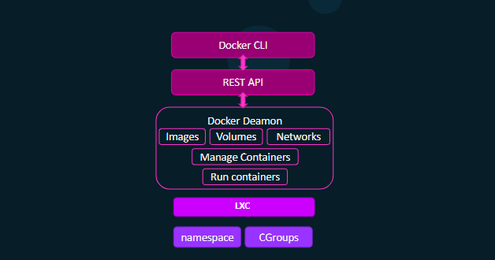
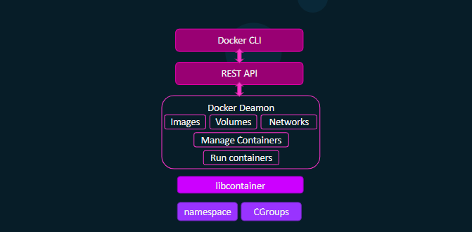
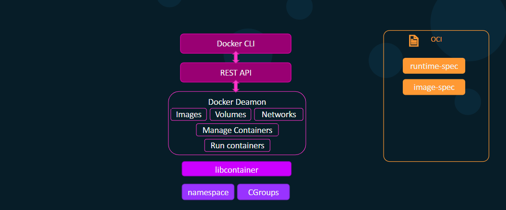
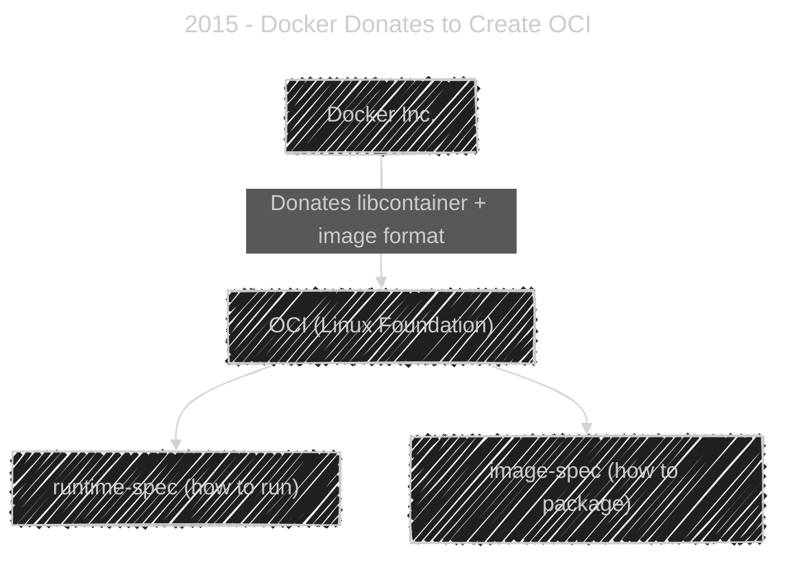
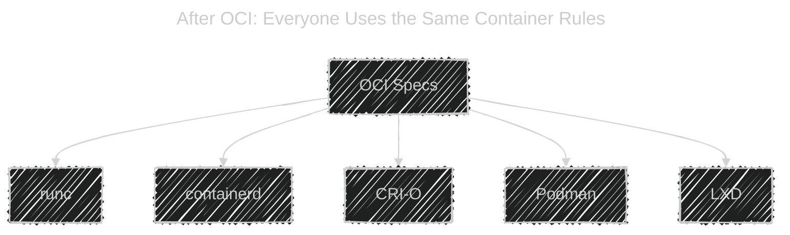
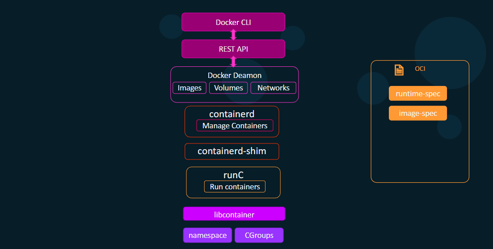

# 🐳 Docker Engine Architecture — The Complete Evolution (2013 → Today)

<div align="left">

> “You can’t understand Kubernetes until you understand Docker.  
> You can’t understand Docker until you understand the Linux kernel.”
> — Every SRE ever

</div>

---

## 📍 **(Pre-2013)** The Problem Before Docker

**🚨 Pain Points in Traditional Virtualization:**

- VMs used **hypervisors** (KVM, Xen, VMware).
- Each VM ran its own **guest OS**, even if all apps were Linux.
- Resource overhead: multiple OS kernels, large disk images, long boot times.
- Dev vs Prod mismatch (“works on my machine” syndrome).

**💡 What the World Needed:**

- Lightweight _process-level_ isolation instead of full VMs.
- A universal packaging format (code + dependencies).
- Instant start/stop lifecycle (milliseconds vs minutes).

> This led to the **rebirth of containerization** — an old Linux feature that got a new face.  
> We will note discuss it in this topic, for more please goto [Linux Kernel - Linux Container (LXC)](../../core/1.what-is-container.md)

---

## 📍 **2013** — Docker 0.6 (LXC Era)

<div align="center" style="background: #071D28; border-radius: 20px">

</div>

---

Docker came with a **new idea**:

> “Let’s run apps in isolated environments using Linux features — but make it super easy!”

Those features were:

- **Namespaces** → give each container its own view of the system (processes, network, etc.)
- **Cgroups** → limit how much CPU/memory a container can use

Docker made this simple with a CLI:

```bash
docker run nginx
```

Boom, a running web server, isolated, in seconds.

---

**🔩 Components (v0.6):**

| Component         | Description                                                        |
| ----------------- | ------------------------------------------------------------------ |
| **Docker CLI**    | Command-line interface to interact with Docker Daemon via REST API |
| **REST API**      | HTTP API used by CLI and external tools                            |
| **Docker Daemon** | Background service that manages images, containers, networks       |
| **LXC**           | Low-level container runtime (via kernel)                           |
| **Linux Kernel**  | Provides `namespaces` + `cgroups` for isolation                    |

---

**🧩 How It Worked:**

1. `docker run nginx`
   → CLI sends HTTP request to Docker Daemon via REST API
2. Daemon uses **LXC tools** to create a container
3. LXC asks Linux kernel to:

   - Create new **namespaces** (PID, NET, MNT, USER, UTS)
   - Apply **cgroups** for CPU/memory control

> Docker started as a **wrapper around LXC** (Linux Containers).

---

**❌ Problems:**

- LXC was external; version mismatches broke things.
- No full control over runtime behavior.
- Limited portability across distros.
- Hard to extend or standardize.

---

## 📍 **2014** — Docker v0.9 → Goodbye LXC, Hello **libcontainer**

<div align="center" style="background: #071D28; border-radius: 20px">

</div>

---

in 2014, Docker said:

> “We want full control over how containers work.”

So they built **libcontainer**, a library written in **Go**, that talks directly to the Linux kernel.  
This made Docker faster and more independent.

---

**📖 What is libcontainer?**

- A native Go library that interacts directly with kernel syscalls.
- Manages:

  - Creating namespaces (`syscall.CLONE_NEW*`)
  - Setting up cgroups
  - Configuring root filesystem (pivot_root)
  - Dropping capabilities

**💡 Why Rewrite in Go?**

| Reason            | Description                                                  |
| ----------------- | ------------------------------------------------------------ |
| **Portability**   | Go is compiled, static, and cross-platform                   |
| **Control**       | Direct syscall usage instead of shelling out to LXC binaries |
| **Extensibility** | Easier to evolve for networking, storage, and plugins        |
| **Performance**   | Fewer layers = less overhead                                 |

**🧠 Real SRE Insight:**

`libcontainer` was the **first time** Docker truly owned the full stack —
this made containers predictable and reproducible across environments.

✅ **So by 2014:**

- Docker CLI talked to the **Docker Daemon**
- The Daemon used **libcontainer** to create containers
- Everything worked great — but Docker controlled the _whole stack_

---

## 📍 **2015** — Open Container Initiative (OCI)

<div align="center" style="background: #071D28; border-radius: 20px">

</div>

---

By 2015, Docker became super popular — but that caused a problem:

Other companies didn’t want to depend on **Docker Inc.** for everything.  
So they started making their own runtimes:

| Company   | Project            | Goal                                |
| --------- | ------------------ | ----------------------------------- |
| CoreOS    | **rkt**            | More secure runtime                 |
| Red Hat   | **systemd-nspawn** | Built into Linux                    |
| Canonical | **LXD**            | Based on LXC                        |
| Google    | **Kubernetes**     | Wanted a standard runtime interface |

Problem:  
Each had its **own image format** and **own way to start containers**.
So an image built by Docker **did not work** in rkt or LXD.

That’s like:

> “A .docx file not opening in Google Docs.”

The container world was fragmenting.

> “In 2015, Docker was both the king 👑 and the chaos creator ⚡ of the container world.”

---

### 🧠 Docker Creates the **OCI (Open Container Initiative)**

Docker realized:

> “If we don’t standardize containers, the ecosystem will break.”

So in 2015, Docker donated parts of its tech to the **Linux Foundation** and helped start the **Open Container Initiative (OCI).**

They gave away:

- **libcontainer** (the Go library)
- Docker’s **image format**

And OCI defined **two official open standards**:

| OCI Spec         | What It Defines                    | Example                                            |
| ---------------- | ---------------------------------- | -------------------------------------------------- |
| **runtime-spec** | How to _run_ a container           | `config.json` describing process, mounts, env vars |
| **image-spec**   | How to _package_ a container image | Layers, manifest, metadata                         |

---

<div align="center">



</div>

---

✅ **Goal:**
Now anyone could build a container runtime or image tool that follows these open specs — not just Docker!

---

### 🔧 After OCI — Many Runtimes Appear

Once OCI was formed, other companies started building their **own runtimes**, following the same rules.

| Tool           | Description                                                 | Uses libcontainer? |
| -------------- | ----------------------------------------------------------- | ------------------ |
| **runc**       | Created by Docker — reference runtime for OCI               | ✅ Yes             |
| **containerd** | Manages containers and images (used by Docker & Kubernetes) | ✅ (via runc)      |
| **CRI-O**      | Red Hat’s runtime for Kubernetes                            | ✅ (via runc)      |
| **Podman**     | Docker alternative without a daemon                         | ✅ (via runc)      |
| **LXC/LXD**    | Canonical’s system container runtime                        | ❌ Uses its own    |
| **rkt**        | CoreOS runtime (deprecated)                                 | ❌                 |

---

<div align="center">



</div>

Now, all these runtimes could **run the same Docker image**,
because the **format and behavior were standard**.

---

## 📍 **2016** — Docker v1.11 → Modular Runtime Stack

<div align="center" style="background: #071D28; border-radius: 20px">

</div>

---

Docker split its monolith into smaller components.
Each layer now had a single responsibility.

**🧱 Components:**

| Component              | Role                                                    |
| ---------------------- | ------------------------------------------------------- |
| **dockerd**            | High-level manager: images, networks, volumes           |
| **containerd**         | Mid-level runtime: manages container lifecycle          |
| **containerd-shim**    | Keeps containers alive if containerd dies               |
| **runc**               | Low-level runtime that executes containers per OCI spec |
| **libcontainer**       | Library used inside runc for actual syscalls            |
| **namespaces/cgroups** | Kernel-level isolation                                  |

**⚙️ Data Flow:**

1. **Docker CLI** → sends REST call
2. **dockerd** → calls containerd to manage containers
3. **containerd** → launches **containerd-shim** for each container
4. **shim** → calls **runc**
5. **runc** → uses **libcontainer** to talk to kernel
6. **Kernel** → applies namespaces and cgroups → spawns container process

**🧠 Why This Split Happened:**

| Problem                              | Solution                               |
| ------------------------------------ | -------------------------------------- |
| Monolithic Docker daemon too heavy   | Split into micro-runtime components    |
| Daemon crashes killed containers     | `containerd-shim` keeps them alive     |
| Kubernetes wanted direct runtime API | `containerd` exposes gRPC interface    |
| Need for OCI compliance              | `runc` implements runtime-spec cleanly |

---

## 📍 **2020s** - Modern Docker

### Current Stack

```bash
docker run nginx
```

➡️ CLI → REST API → dockerd → containerd → shim → runc → libcontainer → kernel

All OCI-compliant.
But Kubernetes no longer talks to Docker directly.

---

### ⚙️ Kubernetes Runtime Interface (CRI)

- Kubernetes uses **CRI** to talk to container runtimes.
- **containerd** implements CRI directly.
- **dockershim** (bridge for Docker) was deprecated in K8s v1.24.

💡 So, in modern clusters:

- Docker CLI is used by developers.
- **containerd** or **CRI-O** is used in production.

---

## ❤️ Kernel Foundations — The Heartbeat ❤️

| Kernel Feature       | Purpose                            |
| -------------------- | ---------------------------------- |
| **PID Namespace**    | Isolate process trees              |
| **NET Namespace**    | Separate network interfaces        |
| **MNT Namespace**    | Independent mount points           |
| **UTS Namespace**    | Hostname/domain isolation          |
| **IPC Namespace**    | Isolate shared memory              |
| **USER Namespace**   | Map users inside/outside container |
| **cgroups**          | Control CPU, RAM, IO limits        |
| **seccomp/apparmor** | Security filters for syscalls      |

These are invoked by **runc/libcontainer** during container creation.

---

### 🧠 Real SRE Debug Flow

```bash
# See low-level runtime state
sudo ctr containers list
sudo runc list

# See kernel namespaces of a container
sudo lsns

# Inspect container’s cgroups
cat /sys/fs/cgroup/<container-id>/cgroup.procs
```

---

## 🧭 Summary of Docker Evolution

| Year      | Milestone               | Key Change                                       | Written In |
| --------- | ----------------------- | ------------------------------------------------ | ---------- |
| **2013**  | Docker v0.6             | Used **LXC** as runtime                          | Python/Go  |
| **2014**  | v0.9                    | Introduced **libcontainer**                      | Go         |
| **2015**  | OCI founded             | Defined runtime & image specs                    | —          |
| **2016**  | v1.11                   | Split into **dockerd**, **containerd**, **runc** | Go         |
| **2019**  | containerd CNCF project | Independent runtime used by K8s                  | Go         |
| **2022+** | dockershim deprecated   | K8s uses containerd/CRI-O directly               | Go/C       |

---

## 🏁 Easy Summary

| Question                                      | Simple Answer                                                       |
| --------------------------------------------- | ------------------------------------------------------------------- |
| **Why did Docker create OCI?**                | To make containers open and compatible across tools.                |
| **What did OCI define?**                      | Two open rules: how to _run_ and how to _package_ containers.       |
| **Did OCI replace Docker Daemon?**            | No, but it allowed others (containerd, CRI-O) to be alternatives.   |
| **What language is libcontainer written in?** | **Go**                                                              |
| **Who uses libcontainer now?**                | runc, containerd, Docker, Podman, CRI-O                             |
| **Why does this matter?**                     | Now all tools (Docker, Podman, Kubernetes) can run the same images. |

---

## ✅ TL;DR — Docker Engine in One Sentence

> **Docker = High-level API (dockerd + CLI) → containerd (manager) → runc (executor) → libcontainer → Linux kernel (namespaces + cgroups).**

✅ **Final Takeaway:**

> 🧱 Docker built the foundation  
> 📜 OCI standardized it  
> 🌐 Kubernetes and others built on top
