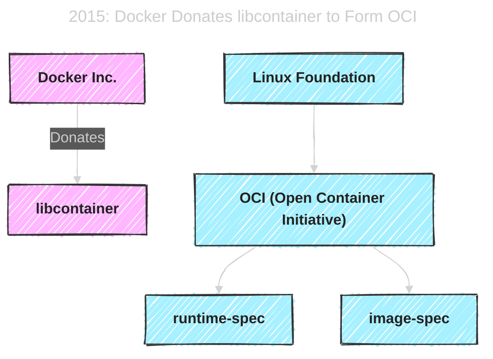
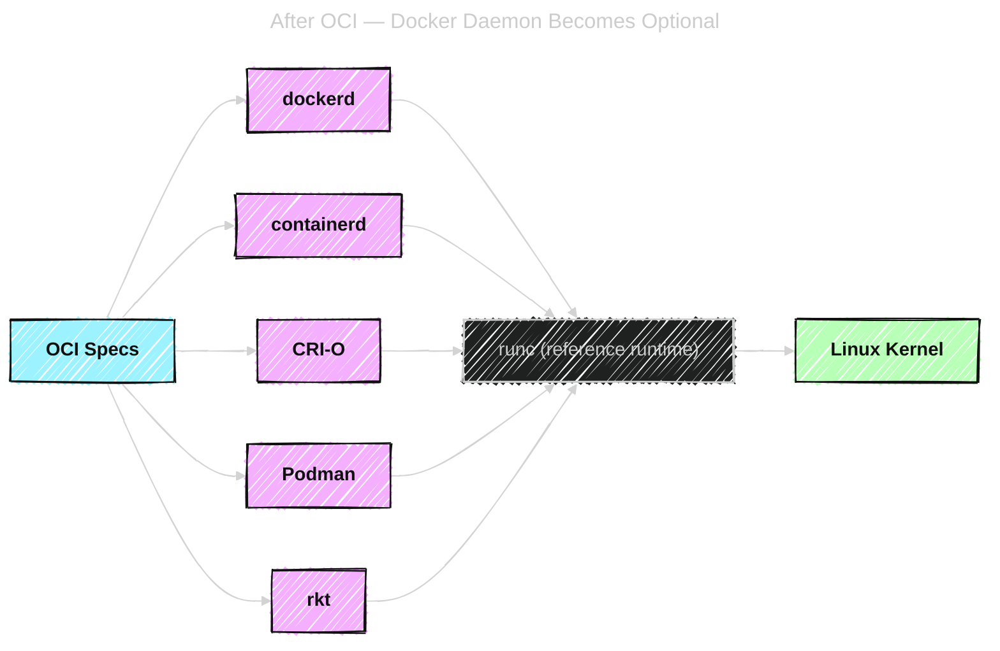
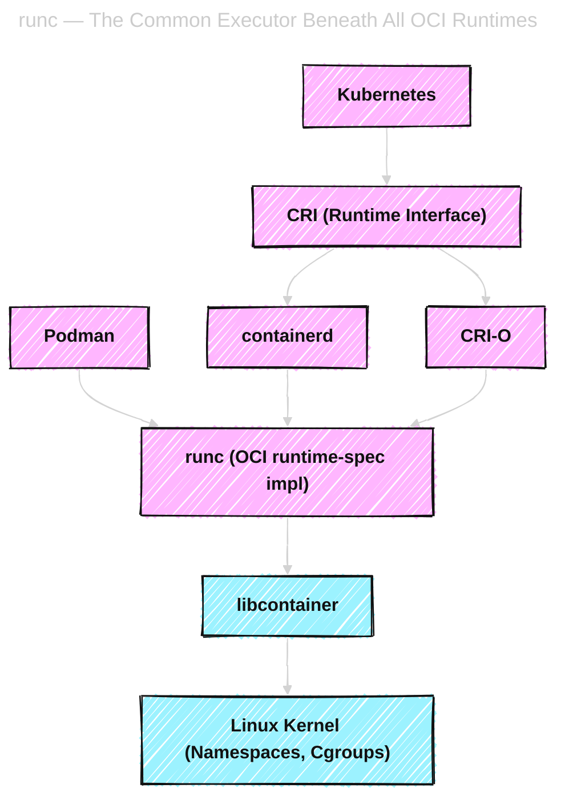

# 🏗️ 2015 — The Open Container Initiative (OCI): The “Container Civil War” and Peace Treaty

> “In 2015, Docker was both the king 👑 and the chaos creator ⚡ of the container world.”

---

## 🧨 Step 1 — The Situation Before OCI

By 2015, Docker was **hugely successful**.
Everyone loved `docker run nginx` — but under the hood, Docker had become a **monolith**.

### ⚙️ Docker Stack (Before OCI)

| Layer                    | What Docker Owned                                      |
| ------------------------ | ------------------------------------------------------ |
| **Image Format**         | The `.tar` layered filesystem design (AUFS, overlayfs) |
| **Image Registry**       | Docker Hub & Registry API (for pulling/pushing images) |
| **Runtime**              | `libcontainer` for isolation                           |
| **Daemon**               | `dockerd` – the monolithic controller                  |
| **CLI**                  | `docker` command                                       |
| **Networking & Volumes** | Built into `dockerd`                                   |
| **API**                  | Docker Engine REST API                                 |

Docker was **vertically integrated** — one vendor controlled every piece.

---

## ⚔️ Step 2 — The Competitors Appear

Other companies started building **alternatives** for specific layers of the stack —
they didn’t want to depend on Docker Inc for production infrastructure.

| Project            | Company   | Goal                                                 |
| ------------------ | --------- | ---------------------------------------------------- |
| **rkt**            | CoreOS    | Alternative runtime — more secure, no central daemon |
| **LXD**            | Canonical | LXC-based system containers                          |
| **Mesos**          | Apache    | Container orchestration before Kubernetes            |
| **systemd-nspawn** | Red Hat   | Lightweight container runtime built into systemd     |
| **OpenVZ**         | Parallels | Kernel-level containers (older tech)                 |

💬 **Problem:**
Each runtime used its _own image format_ and _own container definition_.
→ A container built for Docker couldn’t run on rkt or LXD.
→ Chaos in CI/CD pipelines, registries, and orchestration tools.

---

## 🧩 Step 3 — Docker Creates OCI to Save the Ecosystem (and Itself)

Docker realized:

> “If everyone forks our format, containers will fragment — like RPM vs DEB.”

So Docker donated key parts of its runtime to the **Linux Foundation**.

---

---

## 🧠 What Docker Had vs What Others Had (in 2015)

| Layer              | Docker                                          | Others                                 | Problem                     |
| ------------------ | ----------------------------------------------- | -------------------------------------- | --------------------------- |
| **Image Format**   | Docker Image (layered tarballs, JSON manifests) | CoreOS “ACI” (App Container Image)     | Incompatible formats        |
| **Runtime Engine** | `libcontainer` (Go)                             | `rkt`, `LXC`, `systemd-nspawn` (C/C++) | Different syscalls, configs |
| **Daemon**         | `dockerd` (central API + builder)               | rkt (daemonless), LXD (REST API)       | Fragmented lifecycle mgmt   |
| **Orchestration**  | Swarm (early), Docker Compose                   | Mesos, Kubernetes, Fleet               | No common runtime interface |
| **Registry**       | Docker Hub                                      | Private registries (custom APIs)       | Nonstandard push/pull       |

So — **everyone** had a “container” — but none of them were the _same type_ of container.

---

## 🧩 Step 4 — What OCI Actually Did

OCI was not a new runtime.
It was a **set of specifications (documents)** describing:

| Spec             | Defines                                                                                  |
| ---------------- | ---------------------------------------------------------------------------------------- |
| **image-spec**   | How container images are packaged (manifests, layers, metadata)                          |
| **runtime-spec** | How to create and run containers from an image (filesystem, process, env, mounts, hooks) |

---

### 🧠 Think of OCI as:

> “The IEEE of containers.”

It didn’t tell you _which code to use_, only _how your runtime must behave_.

---

### 📜 Example (runtime-spec core ideas)

A valid OCI container must have:

- A `config.json` describing:

  - root filesystem path
  - user, environment variables
  - cgroup resources
  - namespace isolation

- A root filesystem directory (`rootfs/`) with the unpacked image
- Hooks for prestart, poststop, etc.

---

### 📜 Example (image-spec core ideas)

A valid OCI image must have:

- JSON manifest listing layers
- Layer tarballs (filesystem diffs)
- Config JSON (entrypoint, cmd, env)

So OCI turned Docker’s internal formats into **open standards**.

---

## 🧩 Step 5 — Did This Mean Alternatives to Docker Daemon?

YES — absolutely.

The **moment OCI specs existed**, other runtimes could replace Docker’s daemon entirely.

Docker Daemon was **just one implementation** that happened to speak OCI.

---

### 🧠 OCI opened the door to new runtimes:

| Runtime          | Developer               | Notes                                                    |
| ---------------- | ----------------------- | -------------------------------------------------------- |
| **runc**         | Docker (donated to OCI) | Reference implementation of runtime-spec                 |
| **containerd**   | Docker → CNCF           | Mid-level daemon managing multiple runc containers       |
| **CRI-O**        | Red Hat                 | Kubernetes-focused runtime implementing CRI using runc   |
| **rkt (CoreOS)** | CoreOS                  | Implemented OCI (later deprecated)                       |
| **Podman**       | Red Hat                 | Daemonless runtime; uses `runc` under the hood           |
| **LXD**          | Canonical               | System container runtime; OCI-compatible through adapter |

---

---

## 🧠 So — Do All These Use `libcontainer`?

Here’s the nuance 👇

| Runtime            | Uses libcontainer? | Written In | Explanation                                         |
| ------------------ | ------------------ | ---------- | --------------------------------------------------- |
| **runc**           | ✅ Yes             | Go         | Directly uses libcontainer                          |
| **containerd**     | ✅ Indirectly      | Go         | Calls runc (which uses libcontainer)                |
| **dockerd**        | ✅ Indirectly      | Go         | Uses containerd → runc → libcontainer               |
| **Podman**         | ✅ Indirectly      | Go         | Calls runc                                          |
| **CRI-O**          | ✅ Indirectly      | Go         | Calls runc                                          |
| **rkt**            | ❌ No              | Go/C       | Used its own isolation engine                       |
| **LXD**            | ❌ No              | C          | Uses LXC, not libcontainer                          |
| **systemd-nspawn** | ❌ No              | C          | Uses systemd APIs, not OCI runtime-spec (initially) |

So `libcontainer` became the **de facto kernel interface** library for OCI runtimes, but not the only one.

---

## 🧩 Step 6 — runc: The Reference Runtime

To prove the OCI runtime spec was real, Docker donated `libcontainer` → turned it into **runc**.

runc is now the **official reference implementation** of OCI runtime-spec.

All modern runtimes like `containerd`, `CRI-O`, `Podman`, and even `Buildah` call **runc** internally.

---

---

## ⚙️ Step 7 — The Aftermath: How the Ecosystem Unified

### 🔹 Docker Inc. kept:

- Docker CLI
- Docker Daemon
- Docker Hub

### 🔹 The Community (via OCI + CNCF) built:

- **containerd** → runtime for K8s and Docker
- **runc** → standard executor
- **CRI-O** → K8s-native runtime
- **Podman/Buildah** → developer tools without daemons

---

### 🔹 Kubernetes adopted:

- **CRI** (Container Runtime Interface) → talks to containerd or CRI-O
- **Dockershim** (bridge to Docker) → **removed in K8s v1.24**

Result:

> Kubernetes now uses the same runc/libcontainer engine, but **no Docker Daemon is needed**.

---

## 🧭 Final Summary — The “Peace Treaty of Containers”

| Layer             | Standardized by                 | Implementation Examples      |
| ----------------- | ------------------------------- | ---------------------------- |
| **Image Format**  | OCI Image Spec                  | Docker, Podman, CRI-O        |
| **Runtime Spec**  | OCI Runtime Spec                | runc, crun, Kata Containers  |
| **Orchestration** | CNCF Projects                   | Kubernetes                   |
| **Registry API**  | Docker Registry API (open spec) | Docker Hub, Harbor, ECR, GCR |

---

## 🧠 TL;DR Answers to Your Questions

| Question                            | Answer                                                                                                                                |
| ----------------------------------- | ------------------------------------------------------------------------------------------------------------------------------------- |
| **Why did Docker create OCI?**      | To prevent fragmentation of image/runtime formats and gain trust of enterprise + ecosystem by open-sourcing its internals.            |
| **What did Docker have vs others?** | Docker had full vertical stack (daemon, CLI, image, runtime), while others built isolated alternatives.                               |
| **What did OCI define?**            | Two open specs: `runtime-spec` (how to run containers) and `image-spec` (how to package them).                                        |
| **Did it replace Docker Daemon?**   | Not directly — but it **allowed others** to replace it (containerd, CRI-O, Podman).                                                   |
| **Do they all use libcontainer?**   | Most OCI-compliant runtimes use libcontainer (via runc), except some like LXC or nspawn that have their own low-level implementation. |

---

Would you like me to continue next with
👉 **“How runc and libcontainer actually create a container process (syscalls, namespaces, pivot_root, cgroups setup, step-by-step with diagrams)”**?

That’s the real kernel-level magic underneath everything — the part Kubernetes and containerd ultimately depend on.
