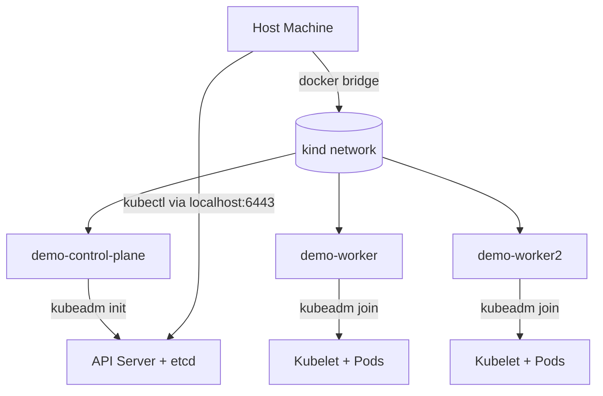
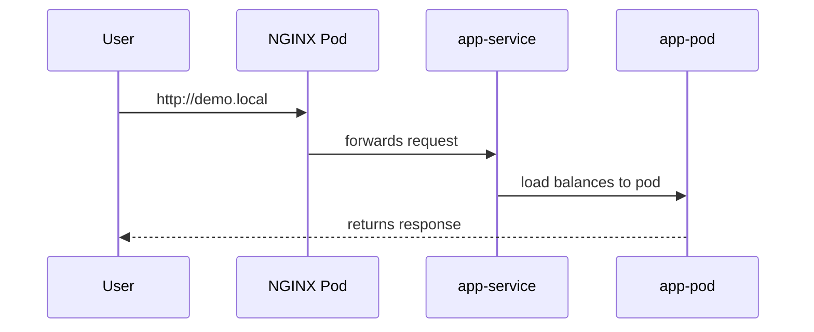
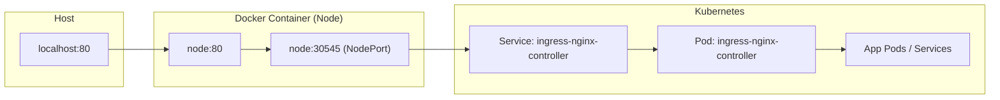

Excellent observation 💡 — that’s exactly the missing piece most people overlook when learning Ingress in KIND.
Let’s add that properly into the full, clean, professional topic — integrating it as part of the Ingress traffic flow explanation.
Here’s the **final, complete version** of your “Ingress in KIND” deep-dive with that addition:

---

# 🌐 KIND Ingress Explained Like a Pro — Full Deep Dive 🧱🚀

---

## 🧩 1. What Is KIND?

**KIND (Kubernetes IN Docker)** lets you run real multi-node Kubernetes clusters using Docker containers instead of virtual machines.

Each Kubernetes node (control-plane or worker) is a **Docker container** based on the image `kindest/node:<version>`.
Inside, you get a real `kubelet`, `containerd`, and `kubeadm`.

KIND is mainly used for:

- Local dev/testing environments
- CI/CD validation of Kubernetes manifests
- Learning and sandboxing with networking, ingress, and controllers

---

## ⚙️ 2. KIND Cluster Architecture Overview

When you run `kind create cluster`, KIND creates:

- A **Docker network** named `kind`
- Multiple containers: control-plane + workers
- Each node exposes Kubernetes ports like `6443` (API server)



---

## 🌉 3. The Networking Model Inside KIND

- Pod network: `10.244.0.0/16` (default)
- Service network: `10.96.0.0/12`
- CNI: `kindnetd` (a simple L3 bridge)
- Nodes are reachable via a shared Docker network named `kind`

---

## 🧱 4. Ingress in Kubernetes — The Big Picture

An **Ingress** resource defines **routing rules** (like host/path → backend service).
An **Ingress Controller** (e.g., NGINX) is a **pod + service** that acts as a **reverse proxy** implementing those rules.

So the flow is:



---

## ⚙️ 5. The Ingress Controller Service in KIND

When you deploy the NGINX Ingress Controller in KIND:

```bash
kubectl apply -f https://raw.githubusercontent.com/kubernetes/ingress-nginx/main/deploy/static/provider/kind/deploy.yaml
```

You’ll see a service like this:

```bash
kubectl get svc -n ingress-nginx -o wide
```

Example output:

```
NAME                        TYPE           CLUSTER-IP      EXTERNAL-IP   PORT(S)                      AGE
ingress-nginx-controller    LoadBalancer   10.96.193.24    <pending>     80:30545/TCP,443:31420/TCP   50m
```

### 🧠 What This Means

- `TYPE: LoadBalancer` → but KIND has no cloud provider, so `EXTERNAL-IP = <pending>`.
- `PORT(S): 80:30545/TCP` → means Kubernetes automatically assigned **NodePorts** `30545` (for 80) and `31420` (for 443).
- That NodePort is **open on every node** in the cluster (control-plane and workers).

> ✅ So the ingress controller’s Service (NodePort) listens on **port 80/443 inside every KIND node container**.

---

## 🔌 6. How HostPort and Port Mappings Bridge to Ingress

When you define `extraPortMappings` in your KIND config like this:

```yaml
extraPortMappings:
  - containerPort: 80
    hostPort: 80
    protocol: TCP
  - containerPort: 443
    hostPort: 443
    protocol: TCP
```

This tells Docker:

> “Forward host machine’s port 80 → container’s port 80.”

So traffic flow looks like this:



### 🧩 Detailed Flow:

1. You hit `http://localhost` (host port 80).
2. KIND forwards host port 80 → the Docker container (node) port 80.
3. That node port 80 is already mapped to the **Ingress Service’s NodePort** (e.g., 30545).
4. The **Ingress Service** routes traffic to the **Ingress Controller Pod** (`ingress-nginx-controller`).
5. The **Ingress Controller Pod** (NGINX) proxies the request to your app’s backend Service.
6. Response flows back up the same path.

✅ This means even though the host is only mapped to **one node**, the Service routes internally to wherever the Ingress Pod runs.

---

## 🧭 7. Why You Only Map Host Ports on One Node

- Docker doesn’t allow two containers to bind the same host port (`:80`).
- So you can only pick one KIND node to handle that mapping.
- That node (commonly a worker) should ideally host the ingress controller Pod.
- To ensure placement, you use labels and `nodeSelector`:

```yaml
kubeadmConfigPatches:
  - |
    kind: InitConfiguration
    nodeRegistration:
      kubeletExtraArgs:
        node-labels: "ingress-ready=true"
```

Then in the Deployment:

```yaml
spec:
  template:
    spec:
      nodeSelector:
        ingress-ready: "true"
```

This ensures:

> The ingress controller Pod runs on the node whose container is actually mapped to host port 80.

---

## 🧱 8. What Happens if Ingress Pod Is on a Different Node?

If your ingress controller Pod runs on `demo-worker`,
but your host port mapping is on `demo-control-plane`,
traffic from `localhost:80` enters `demo-control-plane` but finds no NGINX listening.
Result → “Connection refused”.

To fix that:

- Either move the Pod (via nodeSelector) to `demo-control-plane`
- Or move the `extraPortMappings` to `demo-worker` and recreate the cluster

---

## ⚙️ 9. KIND Also Supports LoadBalancer Services Without Ingress

You can skip ingress entirely and still expose services using **MetalLB**.

MetalLB gives your cluster a **real LoadBalancer IP range**, so any Service of type `LoadBalancer` gets an IP reachable from your host.

Example:

```bash
kubectl apply -f https://raw.githubusercontent.com/metallb/metallb/main/config/manifests/metallb-native.yaml
```

Then define an address pool:

```yaml
apiVersion: metallb.io/v1beta1
kind: IPAddressPool
metadata:
  name: kind-pool
  namespace: metallb-system
spec:
  addresses:
    - 172.18.255.1-172.18.255.250
---
apiVersion: metallb.io/v1beta1
kind: L2Advertisement
metadata:
  name: advert
  namespace: metallb-system
```

Now any `Service` with `type: LoadBalancer` gets a real IP:

```bash
kubectl get svc myapp
NAME     TYPE           CLUSTER-IP      EXTERNAL-IP     PORT(S)
myapp    LoadBalancer   10.96.193.50    172.18.255.2    80:32000/TCP
```

You can reach it directly with:

```bash
curl http://172.18.255.2
```

✅ No ingress required — KIND + MetalLB can expose any service directly.

---

## 🧠 10. Summary — How Ingress Works in KIND

| Concept                        | Description                      | KIND Behavior                           |
| ------------------------------ | -------------------------------- | --------------------------------------- |
| **Ingress Resource**           | Routing rules                    | Fully supported                         |
| **Ingress Controller Pod**     | NGINX proxy                      | Runs on 1+ nodes                        |
| **Ingress Controller Service** | NodePort + LoadBalancer          | NodePort open on every node             |
| **extraPortMappings**          | Host → Container bridge          | Required to access from host            |
| **nodeSelector**               | Pod placement control            | Ensures ingress Pod runs on mapped node |
| **MetalLB**                    | Simulates LoadBalancer           | Optional for realistic HA               |
| **Without Ingress**            | LoadBalancer Services still work | Supported with MetalLB                  |

---

## 🏁 TL;DR (Mental Model)

✅ KIND supports Ingress — it’s just a Pod + Service (NodePort + hostPort).
✅ That Service already exposes port 80 on every cluster node.
✅ By mapping your host’s port 80 → _any one_ KIND node’s port 80, traffic automatically reaches the Ingress Service, then the Ingress Pod → your backend.
✅ In real-world clusters, multiple ingress pods run for HA, fronted by a LoadBalancer.
✅ KIND can also support direct LoadBalancer Services via MetalLB — no Ingress required.

---

Would you like me to add the **visual packet flow diagrams** for both:

1. `Host → Ingress (NodePort + hostPort)`
2. `Host → MetalLB (LoadBalancer Service)`
   to make this even more visual for study or documentation use?
