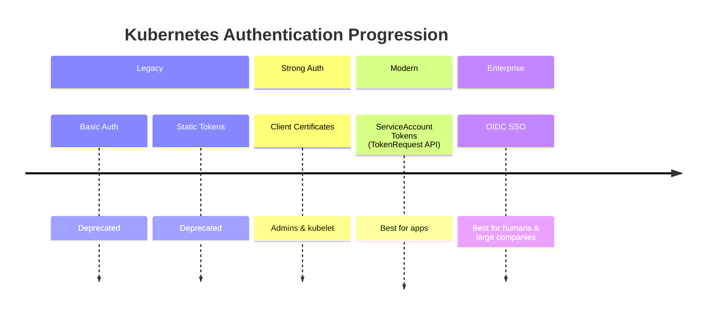

# 🔐 **Authentication Methods for Accessing the K8s REST API**

_Ordered from LEAST common → MOST common, with full real-world DevOps detail!_

Kubernetes supports several authentication methods for users and applications interacting with the REST API.
Some are **legacy** (deprecated), some are **cryptographically strong**, and some are **enterprise-grade**.

Let’s walk through **all methods**, from outdated → modern → recommended → enterprise SSO.

---

## ❌ **1. Basic Authentication** (LEGACY / DEPRECATED)

> **Deprecated since Kubernetes 1.19**.
> Removed from most managed clusters (EKS, AKS, GKE).
> Only available if running your own `kube-apiserver` in a cluster YOU control (like kubeadm, k3s, custom clusters).

Use only for **testing**, **labs**, or **CKA exam** environments.

---

### 🅰️ — Username + Password Auth (DEPRECATED)

#### 🔹 Step 1 — Create `.htpasswd` file

```bash
htpasswd -c /etc/kubernetes/htpasswd admin
```

#### 🔹 Step 2 — Enable in kube-apiserver (ONLY self-managed clusters)

Edit `/etc/kubernetes/manifests/kube-apiserver.yaml`:

```yaml
- --basic-auth-file=/etc/kubernetes/htpasswd
```

Restart kube-apiserver (kubelet auto-reloads static pod).

#### 🔹 Step 3 — Use in REST API call

```bash
curl -u admin:<password> https://<api-server>/api/v1/pods
```

---

### 🅱️ — Username + Token Auth (DEPRECATED)

#### 🔹 Step 1 — Create token file

You define a **static token file**:

```ini
<token>,<username>,<uid>,<group1>,<group2>
```

Example `/etc/kubernetes/token.csv`:

```ini
1234567890abcdef,devuser,1001,system:masters
```

#### 🔹 Step 2 — Enable token-based auth

Add to `kube-apiserver.yaml`:

```yaml
- --token-auth-file=/etc/kubernetes/token.csv
```

#### 🔹 Step 3 — Use token

```bash
curl -H "Authorization: Bearer 1234567890abcdef" \
  https://<api-server>/api/v1/pods
```

---

### 📃 Using Basic/Auth Tokens in kubeconfig (For Testing Only)

```bash
kubectl config set-credentials devuser \
  --username=devuser --password=<password>

kubectl config set-credentials devtokenuser \
  --token=1234567890abcdef
```

---

## 🔐 **2. Client Certificates** (mTLS Auth)

_Still used today (admins, kubelet), but improved using the modern CertificateSigningRequest API._

Kubernetes supports **X.509 Client Certificate authentication** where identity = CN + O fields.

---

### 🅰️ — Old Method (still works): OpenSSL + admin signer

#### 🔹 Step 1 — Generate key + CSR

```bash
openssl genrsa -out client.key 2048
openssl req -new -key client.key -out client.csr -subj "/CN=john/O=dev-team"
```

#### 🔹 Step 2 — Ask admin to sign → produce `client.crt`

```bash
openssl x509 -req -in client.csr -CA /etc/kubernetes/pki/ca.crt \
  -CAkey /etc/kubernetes/pki/ca.key -CAcreateserial \
  -out client.crt -days 36500
```

---

### 🅱️ — Modern Best Practice: Kubernetes Certificate API (CSR API)

_Recommended for Kubernetes-native certificate management._

#### 🔹 Step 1 — Base64 encode CSR

```bash
cat client.csr | base64 | tr -d '\n'
```

#### 🔹 Step 2 — Create CSR manifest

```yaml
apiVersion: certificates.k8s.io/v1
kind: CertificateSigningRequest
metadata:
  name: dev-user-csr
spec:
  request: <base64-csr>
  signerName: kubernetes.io/kube-apiserver-client
  usages:
    - client auth
```

Apply:

```bash
kubectl apply -f csr.yaml
```

#### 🔹 Step 3 — Approve CSR

```bash
kubectl certificate approve dev-user-csr
```

#### 🔹 Step 4 — Fetch signed certificate

```bash
kubectl get csr dev-user-csr -o jsonpath='{.status.certificate}' \
  | base64 --decode > client.crt
```

#### 🔹 Using in REST

```bash
curl -k --cert client.crt --key client.key \
  https://<api-server>/api/v1/pods
```

---

### 📃 Using Client Certificates in kubeconfig

```bash
kubectl config set-credentials john \
  --client-certificate=client.crt \
  --client-key=client.key
```

---

## 🪙 **3. Token Authentication (ServiceAccounts)** — Modern & Widely Used

_The most common for apps, controllers, automation, CI/CD._

Previously SA tokens were stored in Secrets.  
➡️ Now Kubernetes uses the **TokenRequest API** which issues **short-lived JWTs** dynamically.

---

### 🅰️ — Legacy Method: Read SA Secret Token (Still Works)

#### 🔹 Step 1 — Create ServiceAccount

```bash
kubectl create sa demo
```

#### 🔹 Step 2 — Retrieve token

```bash
SECRET=$(kubectl get sa demo -o jsonpath='{.secrets[0].name}')
TOKEN=$(kubectl get secret $SECRET -o jsonpath='{.data.token}' | base64 --decode)
```

---

### 🅱️ — Modern Method (Recommended): TokenRequest API (Projected Token)

#### 🔹 Step 1 — Get a fresh JWT token

```bash
kubectl create token demo
```

Produces output like:

```ini
eyJhbGciOiJSUzI1NiIsImtpZCI6Ij...
```

This token is short-lived and safer.

#### 🔹 Step 2 — Use in curl

```bash
curl -H "Authorization: Bearer $TOKEN" \
  https://<api-server>/api/v1/pods
```

---

### 📃 Using SA Tokens in kubeconfig

```bash
kubectl config set-credentials demo-user --token=$TOKEN
```

---

## 🌐 **4. OpenID Connect (OIDC)** — Modern, Enterprise-Grade

_The MOST secure, most scalable authentication method._

Supports:

- Single Sign-On (SSO)
- MFA
- AzureAD, Okta, Google, Keycloak, Auth0
- Group-based RBAC

---

### 🔹 Step 1 — Enable OIDC flags on kube-apiserver

```yaml
- --oidc-issuer-url=https://accounts.google.com
- --oidc-client-id=my-k8s-client
- --oidc-username-claim=email
- --oidc-groups-claim=groups
```

---

### 🔹 Step 2 — Login to your Identity Provider

Example login using oidc-login plugin:

```bash
kubectl oidc-login setup
kubectl oidc-login get-token
```

This gives a JWT.

---

### 🔹 Step 3 — Use JWT token

```bash
curl -H "Authorization: Bearer <jwt>" \
  https://<api-server>/api/v1/pods
```

---

### 📃 Using OIDC Tokens in kubeconfig

```bash
kubectl config set-credentials oidc-user \
  --auth-provider=oidc \
  --auth-provider-arg=idp-issuer-url=<issuer> \
  --auth-provider-arg=client-id=<client-id> \
  --auth-provider-arg=refresh-token=<refresh-token>
```

Or modern exec plugins (EKS, AKS, GKE automatically use these).

---

## ⚔️ **Visual Comparison**



---

## 🏆 **FINAL SUMMARY** (Best → Worst)

| Rank       | Method                                   | Best for               | Notes                       |
| ---------- | ---------------------------------------- | ---------------------- | --------------------------- |
| ⭐⭐⭐⭐⭐ | **OIDC (SSO, MFA)**                      | Org users, DevOps, SRE | Most secure & scalable      |
| ⭐⭐⭐⭐   | **ServiceAccount Tokens (TokenRequest)** | In-cluster apps, CI/CD | Modern + safe               |
| ⭐⭐⭐     | **Client Certificates**                  | Admins, kubelet        | Strong but harder to manage |
| ❌         | **Basic Auth**                           | Testing only           | Deprecated                  |
| ❌         | **Static Tokens**                        | Testing only           | Deprecated                  |
