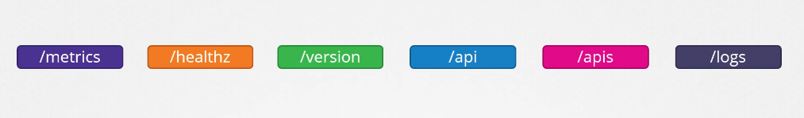
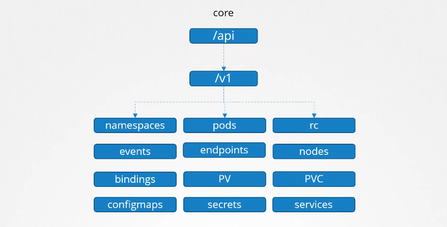
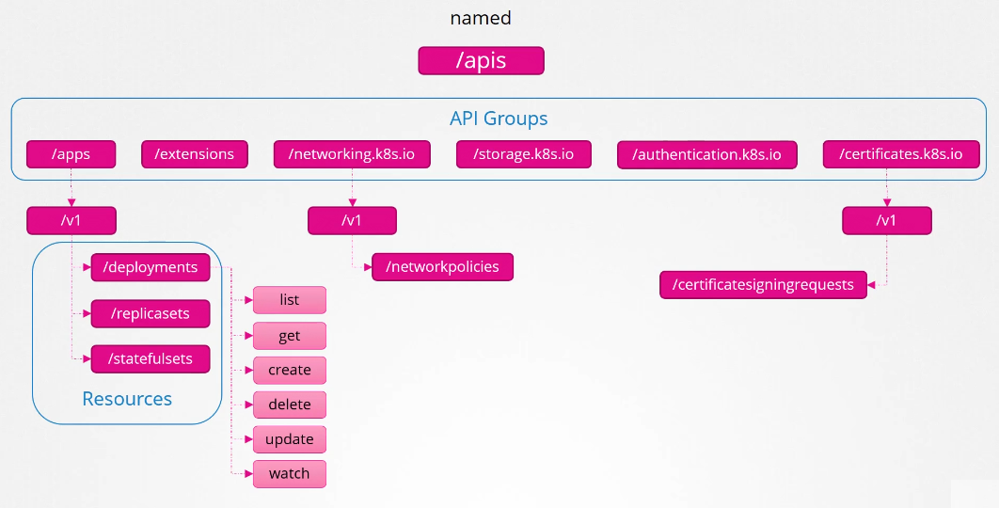
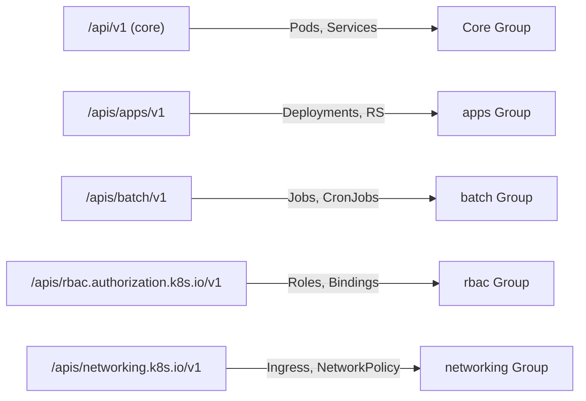

# 🧩 **Kubernetes API Groups**

> _“API groups are just folders that organize Kubernetes resources.”_

---

## 🎄 **Hierarchy of API Groups**

<div align="center" style="background-color:#F1F1F1; border-radius: 10px; border: 2px solid">
  
</div>

---

<div align="center" style="background-color:#F1F1F1; border-radius: 10px; border: 2px solid">
  
</div>

---

### 📌 **core api group (`api`)**

<div align="center" style="background-color:#F1F1F1; border-radius: 10px; border: 2px solid">
  
</div>

---

### 📌 **named api group (`apis`)**

<div align="center" style="background-color:#F1F1F1; border-radius: 10px; border: 2px solid">
  
</div>

---

## 📖 **What Are API Groups?**

Kubernetes has **hundreds of resources** — Pods, Deployments, Services, Nodes, ConfigMaps, CRDs, etc.

To keep things organized, the **Kubernetes API Server** groups them into **API groups** —
like “folders” or “namespaces” for APIs.

Each group represents a **category of related resources**.
When you call the API (or use `kubectl`), you’re actually talking to one of these groups.

---

## 📦 **Real-Life Analogy**

Think of API groups like folders in a file system:

```ini
/core/
  ├── pods
  ├── services
  ├── configmaps
/apps/
  ├── deployments
  ├── replicasets
/batch/
  ├── jobs
  ├── cronjobs
```

So when you run:

```bash
kubectl get pods
```

You’re really calling:

```ini
GET /api/v1/pods
```

And when you run:

```bash
kubectl get deployments
```

You’re calling:

```ini
GET /apis/apps/v1/deployments
```

---

## ⚙️ **The API Path Structure**

Every Kubernetes resource lives under an HTTP path like this:

```ini
/api/<version>               → Core group
/apis/<group>/<version>      → Named API groups
```

### Example:

<div align="center" style="background-color: #141a19ff;color: #a8a5a5ff; border-radius: 10px; border: 2px solid">

| Resource   | Full API Path                              | API Group                 | Version |
| ---------- | ------------------------------------------ | ------------------------- | ------- |
| Pod        | `/api/v1/pods`                             | (core)                    | v1      |
| Deployment | `/apis/apps/v1/deployments`                | apps                      | v1      |
| Job        | `/apis/batch/v1/jobs`                      | batch                     | v1      |
| Role       | `/apis/rbac.authorization.k8s.io/v1/roles` | rbac.authorization.k8s.io | v1      |

</div>

---

## 🧱 **The “Core” API Group (Special Case)**

The **core group** (sometimes called the “legacy group”) doesn’t have a group name.

- It includes basic, built-in resources like:

  - `pods`
  - `services`
  - `namespaces`
  - `nodes`
  - `configmaps`
  - `secrets`

These are accessed under:

```ini
/api/v1
```

✅ So when you see `"apiGroups": [""]` in RBAC —  
it means _“the core group”_ (no group name).

Example:

```yaml
rules:
  - apiGroups: [""]
    resources: ["pods"]
    verbs: ["get", "list"]
```

---

## 🧩 **Named API Groups**

Everything else (like Deployments, Jobs, RBAC rules) belongs to a **named API group**.

<div align="center" style="background-color: #141a19ff;color: #a8a5a5ff; border-radius: 10px; border: 2px solid">

| API Group                   | Resources It Contains                              | Example Path                         |
| --------------------------- | -------------------------------------------------- | ------------------------------------ |
| `apps`                      | Deployments, DaemonSets, ReplicaSets, StatefulSets | `/apis/apps/v1`                      |
| `batch`                     | Jobs, CronJobs                                     | `/apis/batch/v1`                     |
| `rbac.authorization.k8s.io` | Roles, ClusterRoles, RoleBindings                  | `/apis/rbac.authorization.k8s.io/v1` |
| `autoscaling`               | HorizontalPodAutoscaler                            | `/apis/autoscaling/v2`               |
| `networking.k8s.io`         | NetworkPolicy, Ingress                             | `/apis/networking.k8s.io/v1`         |
| `apiextensions.k8s.io`      | CRDs (CustomResourceDefinitions)                   | `/apis/apiextensions.k8s.io/v1`      |

</div>

---

## 🧩 **Custom API Groups (via CRDs)**

When you create a **CustomResourceDefinition (CRD)**,
you’re actually **adding a new API group** to your cluster.

Example CRD:

```yaml
apiVersion: apiextensions.k8s.io/v1
kind: CustomResourceDefinition
metadata:
  name: pipelines.cicd.example.com
spec:
  group: cicd.example.com
  names:
    kind: Pipeline
    plural: pipelines
  scope: Namespaced
  versions:
    - name: v1
      served: true
      storage: true
```

After applying it, your cluster gets a new API:

```ini
/apis/cicd.example.com/v1/pipelines
```

✅ You can now run:

```bash
kubectl get pipelines
```

---

## 🧠 **Why API Groups Matter in RBAC**

RBAC rules **must specify** which API group the resource belongs to.
Otherwise, Kubernetes won’t know which “folder” to check.

Example:

```yaml
rules:
  - apiGroups: ["apps"]
    resources: ["deployments"]
    verbs: ["create", "list", "delete"]
```

Without the correct group, your RBAC rule will silently fail.

---

## 🧰 **Quick Commands to Explore API Groups**

<div align="center" style="background-color: #141a19ff;color: #a8a5a5ff; border-radius: 10px; border: 2px solid">

| Command                      | Purpose                                 |
| ---------------------------- | --------------------------------------- |
| `kubectl api-resources`      | List all resources and their API groups |
| `kubectl api-versions`       | List all available API versions         |
| `kubectl explain deployment` | Show resource’s API version and fields  |

</div>

---

Example output:

```bash
kubectl api-resources | head
NAME                 SHORTNAMES   APIVERSION                             NAMESPACED   KIND
pods                 po           v1                                     true         Pod
deployments          deploy       apps/v1                                true         Deployment
jobs                              batch/v1                               true         Job
roles                             rbac.authorization.k8s.io/v1           true         Role
```

---

## 🧩 **Versioning Inside Each API Group**

Each group has versions like `v1`, `v1beta1`, `v2`, etc.

- **v1** → Stable (GA)
- **v1beta1** → Beta, may change
- **v1alpha1** → Experimental

Example:

```ini
/apis/autoscaling/v2 → stable (v2)
```

✅ This allows Kubernetes to evolve APIs without breaking old workloads.

---

## 🧭 **Visual Summary**

<div align="center" style="background-color: #141a19ff;color: #a8a5a5ff; border-radius: 10px; border: 2px solid">



</div>

---

## ✅ **Quick Summary Table**

<div align="center" style="background-color: #141a19ff;color: #a8a5a5ff; border-radius: 10px; border: 2px solid">

| API Group Type                | Example Path                         | Common Resources                      |
| ----------------------------- | ------------------------------------ | ------------------------------------- |
| **Core**                      | `/api/v1`                            | Pods, Services, ConfigMaps, Nodes     |
| **apps**                      | `/apis/apps/v1`                      | Deployments, DaemonSets, StatefulSets |
| **batch**                     | `/apis/batch/v1`                     | Jobs, CronJobs                        |
| **rbac.authorization.k8s.io** | `/apis/rbac.authorization.k8s.io/v1` | Roles, ClusterRoles                   |
| **networking.k8s.io**         | `/apis/networking.k8s.io/v1`         | Ingress, NetworkPolicy                |
| **apiextensions.k8s.io**      | `/apis/apiextensions.k8s.io/v1`      | CustomResourceDefinitions             |

</div>

---

## 🧩 **TL;DR — In One Line**

> **API groups are just versioned folders that organize Kubernetes resources.**

They let Kubernetes evolve APIs safely, keep resources organized, and power RBAC and CRDs.
