# ✨ AKS `exec` Plugin Authentication

When you authenticate to AKS with:

```bash
az aks get-credentials --resource-group myRG --name myAKS
```

Your `kubeconfig` includes an **exec block** that triggers Azure CLI to obtain **OIDC tokens** from **Microsoft Entra ID (Azure AD)**.

Let’s go step-by-step 🔥

---

## 🧠 **What is the AKS `exec` plugin?**

💡 **Definition (simple + official)**

> The AKS exec plugin is the `exec` section in your kubeconfig that makes `kubectl` dynamically call the Azure CLI (`az`) to obtain an Azure AD access token whenever you interact with the Kubernetes API.

It uses:

- Azure CLI
- OAuth 2.0 / OIDC
- Microsoft Entra ID
- Short-lived tokens (usually 1 hour)

No static passwords, no certificates you manage, nothing to leak.

---

## 🗂️ **What the AKS `kubeconfig` Looks Like**

Here is the real exec block generated by Azure CLI:

```yaml
users:
  - name: clusterUser_myRG_myAKS
    user:
      exec:
        apiVersion: client.authentication.k8s.io/v1beta1
        command: az
        args:
          - account
          - get-access-token
          - --resource
          - 6dae42f8-4368-4678-94ff-3960e28e3630
          - --output
          - json
```

📌 That GUID is the **AKS Kubernetes API resource ID in Azure AD**.
All AKS clusters use this resource to request tokens.

---

## 🔍 **Why Does AKS Use Azure AD?**

Because Azure AD is the identity provider for:

- Users (portal users / employees)
- Service principals
- Managed identities
- Azure CLI logins
- Azure AD workload identities
- Azure RBAC for Kubernetes

This unlocks enterprise features:

- MFA
- Conditional Access
- Device-based access
- SSO
- Federated identity
- Group-based RBAC integration

All via OIDC tokens.

---

## 🔄 **Full Authentication Flow (Azure AD → AKS)**

Below is the full AKS auth flow explained visually.

```mermaid
sequenceDiagram
    participant U as You
    participant K as kubectl
    participant E as exec plugin (az)
    participant AAD as Microsoft Entra ID (Azure AD)
    participant API as AKS API Server

    U->>K: kubectl get pods
    K->>E: Run exec plugin (az account get-access-token)
    E->>AAD: Request OIDC token<br/>(OAuth 2.0)
    AAD-->>E: Access Token (JWT)
    E-->>K: Send token to kubectl
    K->>API: Present token as Bearer token
    API->>API: Validate token signature via AAD public keys
    API-->>U: Allowed! Pods returned 🎉
```

<div align="center" style="background:#343739ff; border-radius:20px">



</div>

---

## 🧩 **How Kubernetes Validates Azure AD Tokens**

AKS API server is configured to trust:

- Azure AD issuer URL
- Azure AD JWKS (public keys)

So the API server validates:

- Token signature
- Tenant ID
- Audience (should match the AKS resource ID)
- Expiry
- Issuer
- UPN / Object ID

Then the user identity is passed into:

- Azure RBAC for Kubernetes (modern way)
- Kubernetes RBAC (classic way)

---

## 🪪 **Token Format (Yes, You Can Decode It)**

Run:

```bash
az account get-access-token --resource 6dae42f8-4368-4678-94ff-3960e28e3630 --output json
```

You get JSON with:

```json
{
  "accessToken": "eyJ0eX...",
  "expiresOn": "2025-01-22 16:43:12.000000",
  "subscription": "...",
  "tenant": "..."
}
```

Decode the JWT:

```bash
echo "<token>" | cut -d. -f2 | base64 -d | jq .
```

You'll see:

- `"iss": "https://login.microsoftonline.com/<tenantID>/v2.0"`
- `"aud": "6dae42f8-4368-4678-94ff-3960e28e3630"`
- `"oid": "<object-id-of-user-or-SP>"`

---

## 🛡 **How AKS Uses Azure AD for RBAC (2 Modes)**

AKS supports **two RBAC modes**:

---

### Mode 1: 🟦 Azure RBAC for Kubernetes (NEW & Recommended)

Azure AD identity → Azure RBAC → Kubernetes permissions

Example Azure role:

```ini
Azure Kubernetes Service RBAC Reader
Azure Kubernetes Service RBAC Writer
Azure Kubernetes Service RBAC Admin
```

Benefits:

- Native Azure experience
- Uses Azure AD groups
- Works with Managed Identities
- No need to modify Kubernetes RBAC or config maps

---

### Mode 2: 📜 Kubernetes RBAC (Classic)

User identity from Azure AD → mapped into Kubernetes

Identity is represented as:

- `oid=<object-id>`
- Or UPN: `user@company.com`

RBAC works with:

```yaml
subjects:
  - kind: User
    name: "oid:<GUID>"
```

---

## 🧰 **How Service Principals / Managed Identities Use Exec Plugin**

The same mechanism still applies.

### 🔧 If using a Service Principal:

Azure CLI obtains token using:

```bash
az login --service-principal ...
```

### 🔧 If using Managed Identity:

Azure CLI automatically fetches token from IMDS:

```bash
az login --identity
```

Then `exec` passes that token to Kubernetes.

No difference in the flow.

---

## 🧪 **Real-Life Authentication Example (Behind the Scenes)**

You run:

```bash
kubectl get nodes
```

Behind the scenes:

1. `kubectl` → checks for token
2. Token expired → runs exec
3. Exec runs:

   ```bash
   az account get-access-token --resource <AKS-RESOURCE-ID>
   ```

4. Azure AD:

   - Validates your session
   - Applies Conditional Access
   - Checks MFA
   - Issues JWT access token

5. Azure CLI returns token JSON
6. kubectl extracts `"accessToken"`
7. Sends it to AKS
8. AKS validates token (OIDC)
9. RBAC → permission granted
10. Nodes list returned 🎉

---

## 🧱 **Common Problems & Fixes**

<div align="center" style="background:#343739ff; border-radius:20px">

| Error                  | Cause                            | Fix                                        |
| ---------------------- | -------------------------------- | ------------------------------------------ |
| ❌ Unauthorized        | Token expired                    | `az login` again                           |
| ❌ Missing `oid` claim | Using legacy AAD graph flows     | `az login --allow-no-subscriptions`        |
| ❌ “invalid audience”  | Token target wrong resource      | Ensure exec block uses correct resource ID |
| ❌ MFA required        | Conditional Access blocking      | Re-auth via `az login`                     |
| ❌ Forbidden           | Identity not granted RBAC access | Assign Azure RBAC or K8s RBAC role         |

</div>

---

## 🧠 **EKS Exec vs AKS Exec – High-Level Comparison**

<div align="center" style="background:#343739ff; border-radius:20px">

| Feature                  | EKS                          | AKS                           |
| ------------------------ | ---------------------------- | ----------------------------- |
| Identity Source          | IAM                          | Azure AD                      |
| Token Type               | STS SigV4 → k8s-aws-v1 token | JWT OIDC token                |
| Token Lifespan           | 15 min                       | ~60 min                       |
| Exec Command             | `aws eks get-token`          | `az account get-access-token` |
| RBAC Mapping             | aws-auth ConfigMap           | Azure RBAC OR K8s RBAC        |
| SSO/MFA                  | IAM Identity Center          | Azure AD Conditional Access   |
| Managed Identity Support | Limited                      | First-class                   |

</div>

---

## 🏁 **Final Summary**

**AKS exec plugin = Azure CLI + Azure AD OIDC token generator!**

Flow:

1. Kubectl → sees exec block
2. Azure CLI is executed → requests token
3. Azure AD authenticates identity
4. Returns JWT access token
5. Kubernetes API validates token signature
6. Azure RBAC or K8s RBAC decides permissions

✔ Highly secure  
✔ SSO + MFA + Conditional Access  
✔ Works with managed identities  
✔ Zero static creds  
✔ Integrates naturally with Azure RBAC

---

If you want, I can also create:

- ✨ A side-by-side EKS vs AKS visual sequence diagram
- ✨ Detailed breakdown of the AKS Kubernetes API OIDC configuration
- ✨ A real demo showing incorrect token audiences and how to fix them
- ✨ Deep dive into Azure RBAC → K8s RBAC translation

Just tell me!
