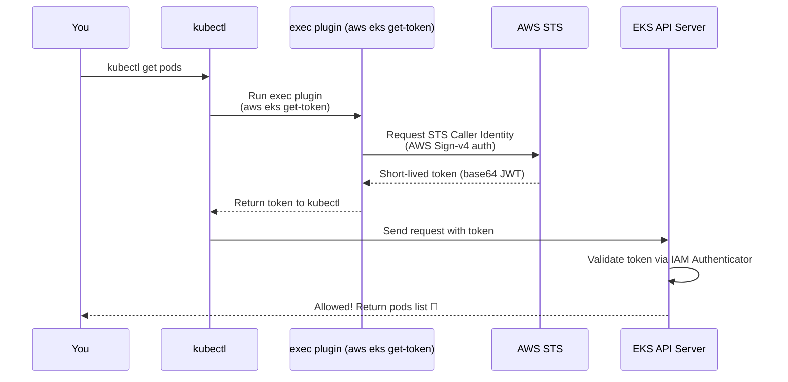

# 🔐✨ EKS `exec` Plugin — How Authentication Really Works

Think of the **EKS exec plugin** as the _secret agent_ inside your `kubeconfig`.
Its mission: **Get short-lived credentials from AWS IAM → convert them into a Kubernetes token → authenticate you.**

This is the modern, secure replacement for:

- ❌ static tokens
- ❌ client certificates
- ❌ passwords (eww, deprecated)

It is **the only correct way** to access EKS when using AWS IAM as the identity layer.

---

## 🧠 1. What is the `exec` plugin in `kubeconfig`?

💡 **Definition (official-style but easy):**

> The `exec` plugin is a block inside your `kubeconfig` that tells `kubectl`:
> “Before you try to access the cluster, run this external command to generate a token dynamically.”

For EKS, that external command is:

```ini
aws eks get-token --cluster-name <cluster>
```

This executes AWS CLI → contacts AWS STS → returns a short-lived IAM identity token → used as the Kubernetes bearer token.

---

## 🔄 2. The Full Authentication Flow (EKS IAM → Kubernetes API)

Below is the real flow, visually represented:

<div align="center" style="background:#343739ff; border-radius:20px">



</div>

---

## 🗂️ 3. What the `kubeconfig` Looks Like (Real Example ❤️)

Here is what you typically see inside your `~/.kube/config` after creating an EKS cluster:

```yaml
users:
  - name: arn:aws:eks:us-east-1:111122223333:cluster/my-eks
    user:
      exec:
        apiVersion: client.authentication.k8s.io/v1beta1
        command: aws
        args:
          - "--region"
          - "us-east-1"
          - "eks"
          - "get-token"
          - "--cluster-name"
          - "my-eks"
        # Optional:
        # env:
        #   - name: AWS_PROFILE
        #     value: myprofile
```

📌 **Key point:**
`kubectl` does _not_ store your credentials. It only stores instructions on **how to obtain them dynamically**.

---

## 🧩 4. How Kubernetes Validates the AWS Token

Inside the EKS control plane, there is a component:

➡️ **aws-iam-authenticator** (built into EKS)

It verifies:

1. Is this JWT token generated by AWS STS?
2. What IAM role or user does it belong to?
3. Is this IAM principal mapped to a Kubernetes RBAC identity?

This mapping happens via:

### ✔️ `aws-auth` ConfigMap

```yaml
mapRoles: |
  - rolearn: arn:aws:iam::111122223333:role/EKSAdminRole
    username: eks-admin
    groups:
      - system:masters
```

You → IAM Role → aws-auth → RBAC → K8s API

---

## ⏳ 5. Why EKS Uses Short-Lived Tokens (Security Explained)

Duration: **15 minutes** (AWS STS default)

Benefits:

- If a token leaks → expired quickly
- No long-lived certificates
- No static kubeconfig secrets
- Works seamlessly with MFA + SSO + IAM Identity Center
- Perfect for corporate setups with zero-trust

---

## 🛠️ 6. Real Authentication Example (Behind the Scenes)

When you run:

```bash
kubectl get pods
```

Here is what actually happens:

### 🧵 Step-by-step

1. `kubectl` sees no token → triggers `exec`
2. `exec` runs:

   ```bash
   aws eks get-token --cluster-name my-eks
   ```

3. AWS CLI:

   - Reads `~/.aws/credentials` or SSO session
   - Signs a request using IAM credentials
   - Calls STS: `GetCallerIdentity`

4. STS returns a **signed identity token** for the EKS cluster
5. CLI wraps it in JSON:

   ```json
   {
     "status": {
       "token": "k8s-aws-v1.<huge-base64-string>",
       "expirationTimestamp": "2025-02-18T..."
     }
   }
   ```

6. `kubectl` sets this token as `Authorization: Bearer ...`
7. EKS API validates it using IAM Authenticator
8. RBAC checks your permissions
9. Pods returned 🎉

---

## 🧪 7. If You Want to See the Actual Token

Run:

```bash
aws eks get-token --cluster-name my-eks --output json
```

You’ll get a large **base64-encoded** token.
Decode first part to see header:

```bash
echo "<token>" | cut -d. -f2 | base64 --decode | jq .
```

You’ll discover:

- Issuer: AWS
- Subject: IAM role/user ARN
- Expiration: 15 minutes

---

## 💼 8. How EKS `exec` Works with IAM Identity Center (SSO)

Your `kubeconfig` stays the same.
But AWS CLI credentials now come from SSO.

Flow:

1. `aws sso login --profile my-sso-prof`
2. Token stored in:

   ```ini
   ~/.aws/sso/cache/*.json
   ```

3. `exec` plugin uses those credentials
4. Works with MFA included

✔ No update needed in kubeconfig
✔ No hard-coded IAM user
✔ Enterprise-grade setup

---

## 🏢 9. How EKS `exec` Enables Zero-Trust Access

The plugin makes it extremely easy to enforce:

<div align="center" style="background:#343739ff; border-radius:20px">

| Security Control             | Supported |
| ---------------------------- | --------- |
| MFA                          | ✔         |
| Short-lived access           | ✔         |
| Remove permissions instantly | ✔         |
| Track identity using IAM     | ✔         |
| Role switching               | ✔         |

</div>

This is why AWS strongly discourages:

- IAM users
- Long-lived Access Keys
- Static tokens

---

## 🧰 10. Full Example with AWS Profile in Exec Block

```yaml
users:
  - name: my-admin
    user:
      exec:
        apiVersion: client.authentication.k8s.io/v1beta1
        command: aws
        args:
          - eks
          - get-token
          - --cluster-name
          - my-eks
        env:
          - name: AWS_PROFILE
            value: company-prod-admin
```

Now `kubectl` always uses that AWS profile.

---

## 🧱 11. Common Errors (and Why They Happen)

### ❌ `Unauthorized: No user exists for ARN`

- Your IAM role is not in `aws-auth` ConfigMap.

### ❌ "Expired token"

- Token > 15 minutes old.

### ❌ "No AWS credentials found"

AWS CLI cannot find:

- env vars
- profile
- SSO session

### ❌ "AccessDeniedException"

Your IAM role does NOT have:

```ini
eks:DescribeCluster
```

required by the plugin.

---

## 🏁 Final Summary (Super Simple)

**EKS `exec` plugin = dynamic authentication layer**

It works like this:

1. Kubectl → runs AWS CLI
2. AWS CLI → gets short-lived STS token
3. Token → sent to EKS API
4. EKS IAM Authenticator → validates IAM identity
5. RBAC → decides what you can do

> - ✨ No static creds.
> - ✨ Fully IAM-driven.
> - ✨ Short-lived & secure.
> - ✨ Works with SSO, MFA, CLI profiles.

---

If you want, I can also explain:

- ✅ how the STS-signed token is created internally
- ✅ how AWS IAM Authenticator decodes and verifies it
- ✅ how IAM → RBAC translation works
- ✅ mapping IAM users to multiple K8s roles
- ✅ how the EKS plugin differs from GKE’s gcloud plugin and AKS’s Azure CLI plugin

Just tell me!
