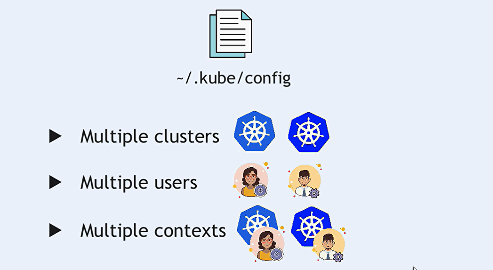
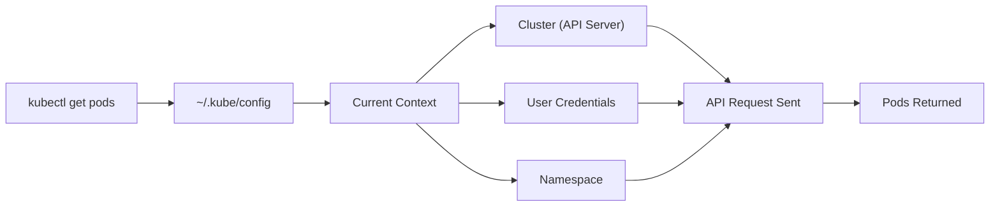

# 🌐 Kubernetes Contexts & Multi-Cluster Management

Managing multiple Kubernetes clusters **without contexts** is like trying to drive multiple cars using one steering wheel — chaos guaranteed.  
Contexts fix that. They let you _instantly switch_ between clusters, users, and namespaces with zero pain (and fewer production accidents 😁).

---

<div align="center" style="background-color:#EAF0FA; border-radius: 10px; border: 2px solid">
 
</div>

---

## 🧠 What Is a Kubernetes Context?

A **context** = `cluster` + `user` + `namespace`.

It tells `kubectl`:

> “Hey, when I run commands — talk to _this_ cluster, authenticate as _this_ user, and assume _this_ namespace.”

Perfect for multi-cluster setups such as:

- dev / test / staging / prod
- AKS + EKS + GKE
- local Minikube + cloud clusters
- multiple customer clusters (consulting scenario)

---

## 🏗️ Context Anatomy

Every context has **three components**:

<div align="center" style="background:#343739ff; border-radius:20px">

| Component     | Purpose                                           |
| ------------- | ------------------------------------------------- |
| **Cluster**   | Which Kubernetes API Server to talk to            |
| **User**      | How to authenticate (token, certs, auth-provider) |
| **Namespace** | Default namespace for your commands               |

</div>

---

## 📁 Understanding `~/.kube/config` (The Holy Book of kubectl)

This file defines everything kubectl knows: clusters, users, contexts, and the currently active context.

Let’s break it _the smart way_ 👇

---

### 🏰 1. Clusters Section

Defines where your Kubernetes API server lives.

```yaml
clusters:
  - name: dev-cluster
    cluster:
      server: https://dev.example.com:6443
      certificate-authority: /path/to/ca.crt
      insecure-skip-tls-verify: false
```

📝 Notes

- `server` → URL of API server
- Uses TLS certs or can skip verification (not recommended unless local testing)
- Cluster name is referenced by contexts

---

### 🧑‍💻 2. Users Section

The _credentials_ (identity) you use to authenticate.

```yaml
users:
  - name: dev-user
    user:
      client-certificate: /path/to/client.crt
      client-key: /path/to/client.key
      token: <auth-token>
```

Common auth methods:

- Client certificates
- Static Bearer tokens
- Exec plugins (used by AWS EKS and GCP GKE)
- OIDC providers

---

### 🔗 3. Contexts Section

Connects **cluster ↔ user ↔ default namespace**.

```yaml
contexts:
  - name: dev-context
    context:
      cluster: dev-cluster
      user: dev-user
      namespace: dev
```

This is what you switch using `kubectl config use-context`.

---

### ⭐ 4. Current Context

This tells kubectl what to use _right now_:

```yaml
current-context: dev-context
```

If you don’t specify `--context` in a command, kubectl uses this.

---

## 🧭 Visual Overview — What Happens When You Run `kubectl get pods`

Here’s the flow (Mermaid diagram):

<div align="center" style="background:#343739ff; border-radius:20px">



</div>

---

## 🔌 Connecting to Multiple Clusters (DevOps-Grade Workflow)

### Step 1️⃣ — Add Clusters

```bash
kubectl config set-cluster dev-cluster \
  --server=https://dev-api.example.com:6443 \
  --certificate-authority=/path/to/ca.crt
```

### Step 2️⃣ — Add Users

```bash
kubectl config set-credentials dev-user --token=<token>
```

### Step 3️⃣ — Create Contexts

```bash
kubectl config set-context dev-context \
  --cluster=dev-cluster \
  --user=dev-user \
  --namespace=dev
```

```bash
kubectl config set-context prod-context \
  --cluster=prod-cluster \
  --user=prod-user \
  --namespace=prod
```

### Step 4️⃣ — Switch Contexts Like a Boss 😎

```bash
kubectl config use-context dev-context
```

### Step 5️⃣ — Run Commands

```bash
kubectl get pods
```

kubectl automatically uses the **dev cluster** and **dev namespace**.

---

## 🧰 Context Management Commands

### 📌 View all contexts

```bash
kubectl config get-contexts
```

### 📌 Switch context

```bash
kubectl config use-context <context-name>
```

### 📌 Create new context

```bash
kubectl config set-context <ctx> \
--cluster=<cluster-name> \
--user=<user-name> \
--namespace=<namespace>
```

### 📌 Use context only for single command

```bash
kubectl --context=prod-context get deployments
```

---

## 🌍 When Do You Need Multiple Contexts?

Use cases where multiple contexts shine 💡:

- Switching between **dev → staging → prod** safely
- Working with **local (kind) + remote (EKS/GKE/AKS)**
- Consulting or freelancing for multiple clients
- Running CI/CD pipelines accessing multiple clusters
- Multi-tenant platform engineering

---

## 🏆 Best Practices (Real DevOps Advice)

### ✔️ 1. Use Descriptive Names

Examples:

- `eks-prod-us-east-1`
- `aks-staging-eu`
- `minikube-local`

### ✔️ 2. Don’t Mix Clusters Accidentally

Use `kubectl config current-context` before applying manifests.

### ✔️ 3. Version Control the kubeconfig (When Safe)

For team setups, create a **template** kubeconfig file.
⚠️ Never commit real creds.

### ✔️ 4. Separate kubeconfig files (Advanced)

Use:

```bash
export KUBECONFIG=~/.kube/dev:~/.kube/prod
```

Or merge using:

```bash
kubectl config view --merge --flatten > ~/.kube/config
```

### ✔️ 5. Auto-Select Context per Directory (pro tip)

Use **kubectx + kubens** or **direnv** for automatic context switching based on project folder.

---

## 🔥 Final Summary

Kubernetes contexts are the **safest**, **cleanest**, and **most professional** way to manage multiple clusters without messing up production.
By mastering contexts:

- You switch clusters instantly
- Your commands always hit the correct namespace
- Multi-cluster workflows become effortless
- You avoid accidental production deployments 😬

Contexts = **DevOps sanity + productivity + fewer headaches**.
