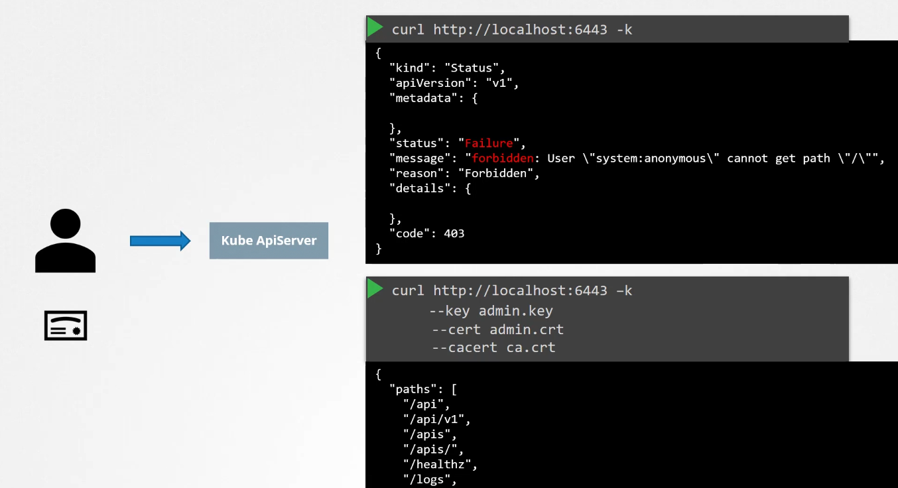
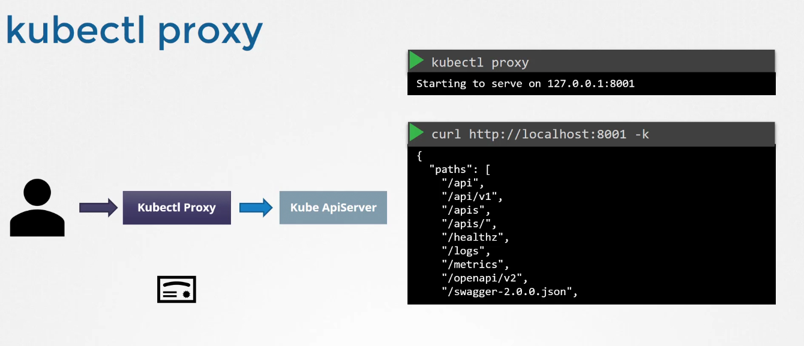

# 🌉 **Kube Proxy**

## 🔴 Without `kubectl proxy`

<div align="center" style="background-color: #F1F1F1; border-radius: 10px; border: 2px solid">
  
</div>

You’d need to:

- Know the API server address (e.g. `https://<cluster-ip>:6443`)
- Provide a valid **client certificate** or **bearer token**
- Handle **TLS verification**

Example:

```bash
curl --cacert ca.crt --cert client.crt --key client.key https://<api-server>:6443/api/v1/pods
```

This is more secure and flexible, but also more complex.

---

## 🟢 **With `kubectl proxy`**

The **kubectl proxy** command starts a **local HTTP proxy server** that forwards requests to the Kubernetes API server. It listens on `localhost:8001` by default and allows you to access the API **without needing to handle TLS certificates or authentication manually**.

---

<div align="center" style="background-color: #F1F1F1; border-radius: 10px; border: 2px solid">
  
</div>

---

### ✅ Benefits of `kubectl proxy`

- **Simplifies API access**: You can make HTTP requests to the Kubernetes API without worrying about TLS or authentication headers.
- **Great for debugging**: Inspect API objects using `curl` or a browser.
- **Secure by default**: Only listens on `localhost`, so it's not exposed externally.
- **Supports tools like the Kubernetes Dashboard**: Some tools use it to connect securely to the cluster.

---

## 🧪 Example Usage

### Start the proxy:

```bash
kubectl proxy
```

This starts a local server on `http://127.0.0.1:8001`.

### Access the API:

```bash
curl http://127.0.0.1:8001/api/v1/namespaces/default/pods
```

This fetches all Pods in the `default` namespace — no token or TLS needed.

---

## 🧪 Example: Accessing the Dashboard

If you’ve deployed the Kubernetes Dashboard:

```bash
kubectl proxy
```

Then open:

```ini
http://localhost:8001/api/v1/namespaces/kubernetes-dashboard/services/https:kubernetes-dashboard:/proxy/
```

This routes your browser through the proxy to the dashboard.

---

## 🧠 Summary

<div align="center" style="background:#343739ff; border-radius:20px">

| Feature             | With `kubectl proxy`                   | Without `kubectl proxy`                     |
| ------------------- | -------------------------------------- | ------------------------------------------- |
| TLS required        | ❌ No                                  | ✅ Yes                                      |
| Auth headers needed | ❌ No                                  | ✅ Yes (token or certs)                     |
| Ease of use         | ✅ Very easy                           | ⚠️ More complex                             |
| Use case            | Local dev, dashboard, quick API access | Production-grade scripts, automation, CI/CD |

</div>
