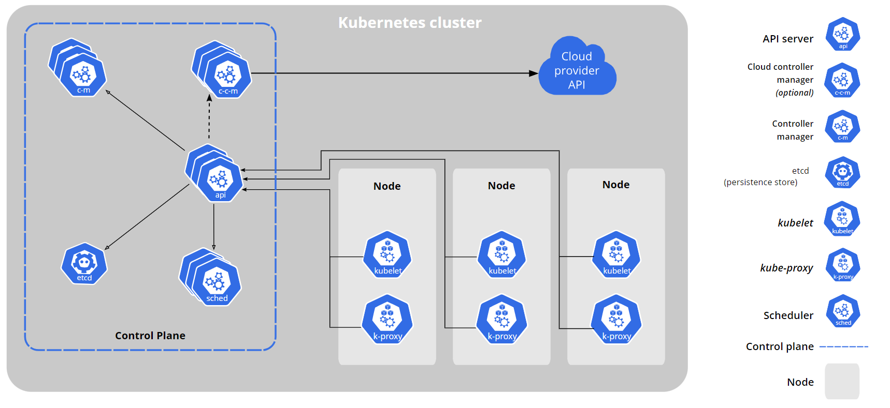

# ☸️ **Kubernetes Cluster Architecture**

Kubernetes is built like a **well-organized company**:

1. The **Control Plane** is the _management team_ — it makes all decisions, plans schedules, and monitors performance.
2. The **Worker Nodes** are the _employees_ — they actually do the work, running your applications inside containers.

Together, they form the **Kubernetes Cluster** — a self-healing, distributed system that ensures your apps are _always up and running._

---

## 🎨 **Cluster Overview**

<div align="center" style="background-color:#F5F5F5; border-radius: 10px; border: 2px solid">
  
  <!--  -->
</div>

---

## 🧠 **Control Plane Components** (The Brains)

These are the **commanders** of Kubernetes — they control, coordinate, and maintain the cluster’s desired state.

### 🌐 a. **API Server** (`kube-apiserver`)

- Acts as the **front door** to the Kubernetes cluster.
- Every interaction (via `kubectl`, SDK, or UI) goes through the API server.
- It validates requests and updates the cluster state in `etcd`.
- It’s the **communication hub** for all control plane components.

> 📝 Example:  
> When you run `kubectl apply -f deployment.yaml`, it talks to the **API Server**, which then updates the **etcd** store and instructs other components (like the Scheduler) to act.

---

### 🗄️ b. **etcd**

- A **distributed key-value store** that acts as Kubernetes’ **source of truth**.
- Stores cluster configuration, node states, secrets, and workload definitions.
- If `etcd` is lost, your cluster **forgets everything** — so backup is crucial!

> 📝 Example:
>
> ```yaml
> /api/v1/namespaces/default/pods/my-app-pod
> ```
>
> This data — including spec, labels, and current status — is persisted in `etcd`.

---

### 🧮 c. **Scheduler** (`kube-scheduler`)

- Decides **which node** should run each Pod.
- Evaluates resource availability (CPU, memory), taints/tolerations, affinity, and policies.
- Think of it as the **HR manager** assigning tasks to employees.

> 📝 Example:  
> Pod A requests 1 CPU and 2 GB RAM → Scheduler checks available nodes → assigns Pod A to Node 2.

---

### 🧑‍💼 d. **Controller Manager** (`kube-controller-manager`)

- Runs **controller loops** that continuously ensure the cluster matches the _desired state_.
- Controllers include:

  - **Node Controller:** Detects and replaces failed nodes.
  - **Service Controller:** Creates and maintains services.
  - **StatefulSet Controller:** Ensures desired replicas of stateful sets exist.
  - **Job Controller:** Cleans up pods belonging to completed jobs.
  - **DaemonSet Controller:** Ensures desired replicas of daemon sets exist.
  - **ReplicaSet Controller:** Ensures desired replicas of replica sets exist.
  - **Deployment Controller:** Ensures desired replicas of deployments exist.
  - **Endpoint Controller:** Updates service endpoints when pods change.

> 📒 Notes:
>
> - They use the **Watch API** to establish long-lived connections with the API server, allowing them to receive real-time updates about changes to resources.
> - Think of controllers as **autopilots** — they continuously fix things that drift out of sync.

---

### ☁️ e. **Cloud Controller Manager**

- Integrates Kubernetes with **cloud provider APIs** (AWS, Azure, GCP).
- Manages resources like:

  - Load balancers
  - Persistent volumes
  - Network routes

> 🧠 Example: When you define a Service of type `LoadBalancer`, the **Cloud Controller** creates a cloud-native load balancer automatically.

---

## ⚙️ **Worker Node Components** (The Muscle)

These are the **machines (VMs or physical servers)** that actually run your application containers.

---

### 👷 a. **Kubelet**

- The **node agent** — it ensures pods assigned to this node are running correctly.
- Talks to the API Server, pulls container images, and reports health.
- Restarts containers if they crash.

> 💬 “Boss (API Server) told me to run this Pod — I’ll make sure it stays alive.”

---

### 🌐 b. **Kube-proxy**

- Handles **network traffic routing** `to` and `from` pods.
- Implements **Service abstraction** — ensuring traffic can reach pods `even if their IPs change`.
- Works at the **network layer (iptables / IPVS)** to balance traffic.

> 💡 Example: When you hit a Service endpoint, `kube-proxy` redirects your request to one of the healthy pods.

---

### 🧩 c. **Container Runtime**

- Responsible for **running containers** inside pods.
- Supports multiple runtimes:

  - `containerd` (default)
  - `CRI-O`
  - `Docker` (deprecated for direct use)

> 📦 It downloads images, creates containers, and manages their lifecycle.

---

### 🧱 d. **Pod**

- The **smallest deployable unit** in Kubernetes.
- Wraps one or more containers that share:

  - The same **network namespace**
  - The same **storage volumes**
  - The same **lifecycle**

> 🧩 Example:
> A pod running a web app and a sidecar container for logging.
>
> ```yaml
> apiVersion: v1
> kind: Pod
> metadata:
>   name: web-app
> spec:
>   containers:
>     - name: app
>       image: nginx
>     - name: log-agent
>       image: fluentd
> ```
>
> ---

---

## ⚒️ **Workload Resources** — How You Define Applications

| Resource          | Purpose                                                          |
| ----------------- | ---------------------------------------------------------------- |
| **Deployment**    | Manages ReplicaSets and provides declarative updates to apps.    |
| **ReplicaSet**    | Ensures the correct number of pod replicas.                      |
| **StatefulSet**   | Manages pods that need stable network IDs or persistent storage. |
| **DaemonSet**     | Ensures one pod per node (for logging or monitoring agents).     |
| **Job / CronJob** | Runs batch or scheduled workloads.                               |

> 📘 **Example:**
> A Deployment defines _how many replicas_ of your app should exist — the Controller ensures that’s always true.

---

## 🌐 **Services & Networking**

| Component            | Function                                               |
| -------------------- | ------------------------------------------------------ |
| **Service**          | Provides stable IP and DNS for accessing pods.         |
| **Ingress**          | Routes external HTTP(S) traffic to internal services.  |
| **Network Policies** | Control which pods can talk to which pods.             |
| **CoreDNS**          | Built-in DNS for service discovery inside the cluster. |

> 💡 Think of Services as **phone directories** — pods come and go, but the Service name stays the same.

---

## 🫙 **Storage**

| Component                       | Description                                                    |
| ------------------------------- | -------------------------------------------------------------- |
| **PersistentVolume (PV)**       | Physical storage resource in the cluster.                      |
| **PersistentVolumeClaim (PVC)** | Pod’s request for storage — like an order form for disk space. |

---

## 🔐 **Configuration**

| Component     | Description                                                       |
| ------------- | ----------------------------------------------------------------- |
| **ConfigMap** | Stores non-sensitive configuration (e.g., environment variables). |
| **Secret**    | Stores sensitive info (passwords, tokens).                        |

---

## 🛡️ **Security and RBAC**

| Component          | Role                                                           |
| ------------------ | -------------------------------------------------------------- |
| **RBAC**           | Grants fine-grained permissions to users and service accounts. |
| **ServiceAccount** | Provides an identity for pods to interact with the API.        |

> 🧠 Example: A Pod can authenticate with the API using its ServiceAccount token — no hardcoded passwords needed.

---

## 📊 **Monitoring & Logging**

- **Metrics Server:** Collects cluster-wide CPU and memory usage for autoscaling.
- **Logging Stack (e.g., EFK/ELK):** Centralized logs from all pods and nodes.

> 📈 Example: Horizontal Pod Autoscaler (HPA) uses data from Metrics Server to add pods automatically when CPU > 80%.

---

## 🧭 **Namespaces**

- Provide **logical isolation** within a single cluster.
- Ideal for separating environments (e.g., `dev`, `staging`, `prod`) or teams.

> 💡 Think of Namespaces as **folders** inside your cluster.

---

## 🧰 **Helm** — The Kubernetes Package Manager

- Simplifies app deployment using **Helm Charts**.
- A single chart can define:

  - Deployment
  - Service
  - ConfigMaps
  - Secrets

- Works like **“apt” or “yum”** but for Kubernetes apps.

> 🧩 Example:
> `helm install prometheus prometheus-community/kube-prometheus-stack`

---

## 🧯 **Cluster Maintenance** & **Troubleshooting**

| Tool               | Purpose                                               |
| ------------------ | ----------------------------------------------------- |
| **kubectl**        | CLI for interacting with the API Server.              |
| **kubeadm**        | Bootstraps a new cluster easily.                      |
| **Logs & Metrics** | Identify failed pods, nodes, or resource bottlenecks. |

> 💬 Example:
>
> ```bash
> kubectl get pods -A
> kubectl describe pod myapp
> kubectl logs myapp-1234
> ```

---

## 🖼️ **Visual Summary**

<div align="center" style="background-color:#fff; border-radius: 10px; border: 2px solid">
  
</div>

---

## 🏁 **In Short**

| Layer             | Function                                |
| ----------------- | --------------------------------------- |
| **Control Plane** | Think → Decides cluster state.          |
| **Worker Nodes**  | Act → Run containers (pods).            |
| **etcd**          | Remember → Stores state permanently.    |
| **Scheduler**     | Assigns → Decides where pods go.        |
| **Controllers**   | Enforce → Keep desired state.           |
| **Kubelet**       | Execute → Runs and monitors containers. |
| **Services**      | Connect → Enable stable networking.     |

---

## 📚 **References**

<https://devopscube.com/kubernetes-architecture-explained/>  
<https://cyclops-ui.com/blog/2023/12/18/k8s-cluster-components/>
