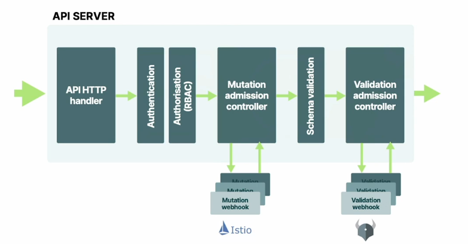

# API Server

The **API Server** is a central component of the Kubernetes control plane. It acts as the "front door" for all the interactions with the Kubernetes cluster. All communication between the cluster components and external clients (like `kubectl` or other services) goes through the API server.

---

  

---

## Key Responsibilities of the API Server

1. **Handling RESTful Requests:**

   - The API server exposes a RESTful API interface. All CRUD (Create, Read, Update, Delete) operations on Kubernetes objects (like Pods, Services, Deployments, etc.) are performed through API requests sent to the API server.
   - Users interact with the API server using tools like `kubectl`, the Kubernetes dashboard, or custom scripts and services.

2. **Authentication and Authorization:**

   - **Authentication:** The API server ensures that only authenticated users or services can access the cluster.
   - **Authorization:** Once authenticated, the API server checks if the user or service has permission to perform the requested action based on Kubernetes Role-Based Access Control (RBAC) policies.

3. **Admission Control:**

   - The API server uses **admission controllers** to enforce policies and validate requests before they are processed. These controllers can modify, reject, or accept requests based on various rules.
   - Examples of admission controllers include `PodSecurityPolicy`, `ResourceQuota`, and `LimitRanger`.

4. **Managing Cluster State:**

   - The API server is responsible for reading and writing the state of Kubernetes objects. It persists the state of the cluster in **etcd**.
   - It serves as a central hub, ensuring that all other components (controllers, schedulers, kubelets) work with a consistent view of the cluster state.

5. **Scaling and High Availability:**

   - The API server can be horizontally scaled for high availability. Multiple instances of the API server can run in parallel, all serving requests and communicating with `etcd`.

6. **Extensibility:**
   - The API server supports the addition of custom resources and APIs via the Kubernetes **Custom Resource Definitions (CRDs)**. This allows extending Kubernetes with new types of objects and functionality.
