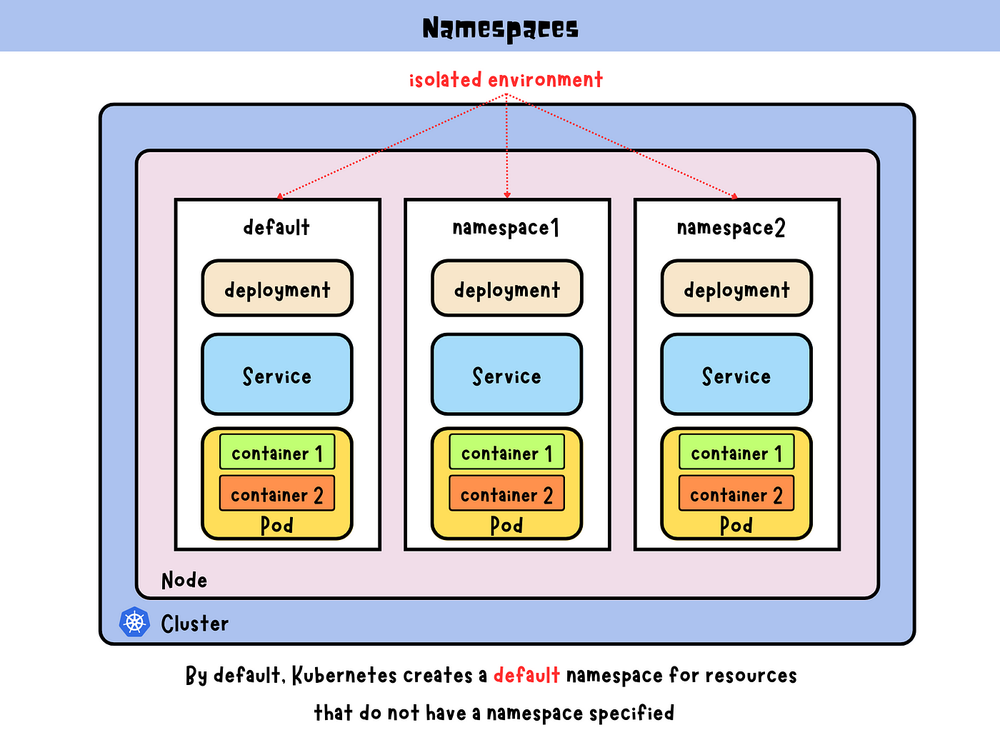

# 🧭 **Kubernetes Namespace**

Namespaces in Kubernetes are the **foundation of multi-tenancy, logical isolation, and cluster organization**.  
Think of them as **virtual clusters inside your physical cluster**, allowing you to separate resources by team, environment, or purpose — without deploying multiple clusters.

---

## 📖 **Concept Recap**

- A **Namespace** is a **logical boundary** for resources in a cluster (Pods, Services, ConfigMaps, Deployments, etc.).
- Namespaces **don’t isolate nodes or resources physically**, but they help you **organize**, **secure**, and **control** workloads.
- It’s like folders in your operating system: you can have files (Pods, Services) in different folders (Namespaces).

---

<div align="center" style="background-color:#fff; border-radius: 10px; border: 2px solid">
  
</div>

---

## 🧑🏻‍💻 **Administrative Operations**

### 🟩 1. Create a Namespace

```bash
kubectl create namespace development
```

✅ Verify:

```bash
kubectl get namespaces
```

Output example:

```ini
NAME              STATUS   AGE
default           Active   30d
kube-system       Active   30d
kube-public       Active   30d
development       Active   5m
```

---

### 🧾 2. Create Using YAML (Declarative Way)

```yaml
apiVersion: v1
kind: Namespace
metadata:
  name: development
  labels:
    environment: dev
    owner: team-alpha
```

```bash
kubectl apply -f namespace.yaml
```

---

### 🕵️ 3. Inspect a Namespace

```bash
kubectl describe namespace development
```

You’ll see:

- Labels and annotations
- Resource quotas
- Limit ranges
- Status (Active/Terminating)

---

### ❌ 4. Delete a Namespace

```bash
kubectl delete namespace development
```

⚠️ **Important:**

- Deleting a namespace **deletes everything inside it** — pods, deployments, services, secrets, etc.
- This operation can take time if there are finalizers or dangling resources.

---

### 🚨 5. If a Namespace is Stuck in “Terminating”

Sometimes deletion gets stuck because of **finalizers** on resources (like PVCs or CRDs).

To fix it:

1. Check the namespace status:

   ```bash
   kubectl get namespace development -o json
   ```

2. Edit it to remove finalizers:

   ```bash
   kubectl edit namespace development
   ```

   Remove:

   ```yaml
   finalizers:
     - kubernetes
   ```

3. Save and exit → namespace should delete successfully.

---

## 🧩 **Default System Namespaces**

<div align="center" style="background-color: #141a19ff;color: #a8a5a5ff; border-radius: 10px; border: 2px solid">

| Namespace           | Purpose                                                         |
| ------------------- | --------------------------------------------------------------- |
| **default**         | Used when no namespace is specified.                            |
| **kube-system**     | System components (API Server, Scheduler, Controller, CoreDNS). |
| **kube-public**     | Publicly readable objects (cluster info).                       |
| **kube-node-lease** | Node heartbeat tracking for faster failure detection.           |

</div>

---

## 📝 **Using Namespaces in Deployments**

When you deploy any object, specify its namespace in YAML or via CLI.

### Example: Pod in the `development` namespace

```yaml
apiVersion: v1
kind: Pod
metadata:
  name: nginx-dev
  namespace: development
spec:
  containers:
    - name: nginx
      image: nginx
```

Apply:

```bash
kubectl apply -f nginx-pod.yaml
```

Check:

```bash
kubectl get pods -n development
```

---

### CLI Shortcut

```bash
kubectl get pods -n development
kubectl get services -n production
```

or use the flag globally:

```bash
kubectl config set-context --current --namespace=development
```

Now all future `kubectl` commands default to that namespace.

---

## ♻️ **Switching Between Namespaces** Easily (`kubens` Tool)

### 🔧 Install

Mac:

```bash
brew install kubectx
```

Ubuntu:

```bash
sudo apt install kubectx
```

(`kubens` comes with `kubectx`)

### 🧠 Usage

```bash
kubens               # List namespaces
kubens dev           # Switch to 'dev'
kubens prod          # Switch to 'prod'
kubens -             # Go back to previous namespace
```

✅ **Pro Tip:** Add to `.bashrc` or `.zshrc` to display current namespace in your prompt.

---

## 🔒 **Namespaces + RBAC (Security Isolation)**

Namespaces are the foundation for **Role-Based Access Control (RBAC)** in Kubernetes.

### 🧩 Example: Restrict a user to one namespace

```yaml
apiVersion: rbac.authorization.k8s.io/v1
kind: Role
metadata:
  namespace: development
  name: dev-reader
rules:
  - apiGroups: [""]
    resources: ["pods", "services"]
    verbs: ["get", "list", "watch"]
```

Then bind it:

```yaml
apiVersion: rbac.authorization.k8s.io/v1
kind: RoleBinding
metadata:
  name: dev-reader-binding
  namespace: development
subjects:
  - kind: User
    name: alice
roleRef:
  kind: Role
  name: dev-reader
  apiGroup: rbac.authorization.k8s.io
```

This gives user `alice` **read-only** access to resources _only inside_ the `development` namespace.

---

## 📊 **Resource Quotas and Limits** (Namespace-Level Governance)

Namespaces allow **resource governance** — controlling how much CPU, memory, or storage each team/environment can use.

### Example: ResourceQuota

```yaml
apiVersion: v1
kind: ResourceQuota
metadata:
  name: dev-quota
  namespace: development
spec:
  hard:
    pods: "10"
    requests.cpu: "2"
    requests.memory: "2Gi"
    limits.cpu: "4"
    limits.memory: "4Gi"
```

Apply:

```bash
kubectl apply -f quota.yaml
kubectl describe quota dev-quota -n development
```

This ensures the `development` namespace can’t exceed its quota.

---

### LimitRange Example

Sets **default resource requests and limits** for all pods in a namespace.

```yaml
apiVersion: v1
kind: LimitRange
metadata:
  name: dev-limits
  namespace: development
spec:
  limits:
    - default:
        cpu: 500m
        memory: 512Mi
      defaultRequest:
        cpu: 200m
        memory: 256Mi
      type: Container
```

---

## 🌐 Cross-Namespace Communication

By default, **pods cannot access resources across namespaces**, except **Services**.

To reach a Service from another namespace:

```bash
curl my-service.my-namespace.svc.cluster.local
```

Format:

```ini
<service-name>.<namespace>.svc.cluster.local
```

---

## 🧯 **Troubleshooting Namespaces**

| Problem                               | Check Command                                   | Explanation                             |     |
| ------------------------------------- | ----------------------------------------------- | --------------------------------------- | --- |
| Namespace stuck in “Terminating”      | `kubectl get ns <name> -o yaml`                 | Remove finalizers manually              |     |
| Can’t access resources in a namespace | `kubectl get rolebindings -n <ns>`              | Missing Role/RoleBinding                |     |
| Wrong default namespace               | `kubectl config view --minify | grep namespace` | Reset with `kubectl config set-context` |
| Namespace limits too restrictive      | `kubectl describe quota -n <ns>`                | Adjust ResourceQuota or LimitRange      |     |

---

## 🔍 **Monitoring Namespaces**

- List all namespaces and their resource usage:

  ```bash
  kubectl get ns
  kubectl top pods -n dev
  kubectl top nodes
  ```

- For detailed metrics (via Metrics Server / Prometheus):

  ```bash
  kubectl get --raw "/apis/metrics.k8s.io/v1beta1/namespaces/development"
  ```

---

## ✅ **Best Practices for Namespace Administration**

| Category                | Best Practice                                                    |
| ----------------------- | ---------------------------------------------------------------- |
| **Organization**        | Use separate namespaces for `dev`, `test`, `staging`, `prod`.    |
| **Security**            | Apply RBAC roles at namespace scope.                             |
| **Resource Management** | Define ResourceQuotas and LimitRanges.                           |
| **Naming**              | Use lowercase, short names, avoid spaces.                        |
| **Automation**          | Use `kubectl apply -f` + GitOps to manage namespace definitions. |
| **Observability**       | Enable namespace-level metrics and logging (via labels).         |

---

## 🧑🏻‍💻 **Practical Example** — Real Admin Workflow

```bash
# 1. Create two namespaces for dev and prod
kubectl create ns dev
kubectl create ns prod

# 2. Deploy the same app in each
kubectl apply -f nginx-deploy.yaml -n dev
kubectl apply -f nginx-deploy.yaml -n prod

# 3. Check running pods per namespace
kubectl get pods -A
kubectl get pods -n dev
kubectl get pods -n prod

# 4. Apply RBAC roles for dev team
kubectl apply -f dev-role.yaml -n dev

# 5. Enforce quotas
kubectl apply -f dev-quota.yaml -n dev

# 6. Switch context to dev
kubens dev
```

---

## 🧠 **Summary** — Admin Takeaways

| Feature           | Description                                                                                      |
| ----------------- | ------------------------------------------------------------------------------------------------ |
| **Namespace**     | Logical partition in a Kubernetes cluster.                                                       |
| **Scope**         | Most resources are namespaced (Pods, Deployments, Services). Some are cluster-wide (Nodes, PVs). |
| **Isolation**     | Logical separation — not physical — for teams or environments.                                   |
| **Security**      | Works with RBAC to limit user access.                                                            |
| **Governance**    | Enforces quotas and limits to prevent abuse.                                                     |
| **CLI Shortcuts** | `kubectl -n`, `kubens`, and `kubectl config set-context` are your best friends.                  |
