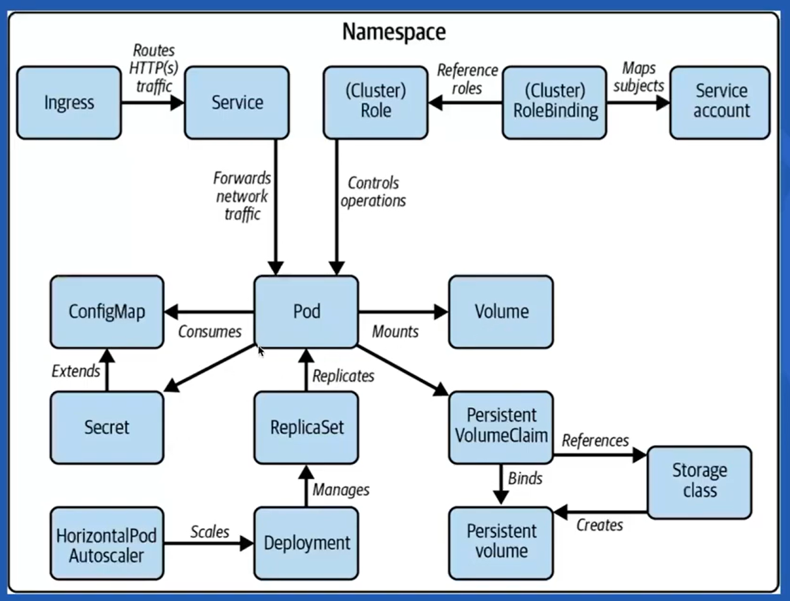
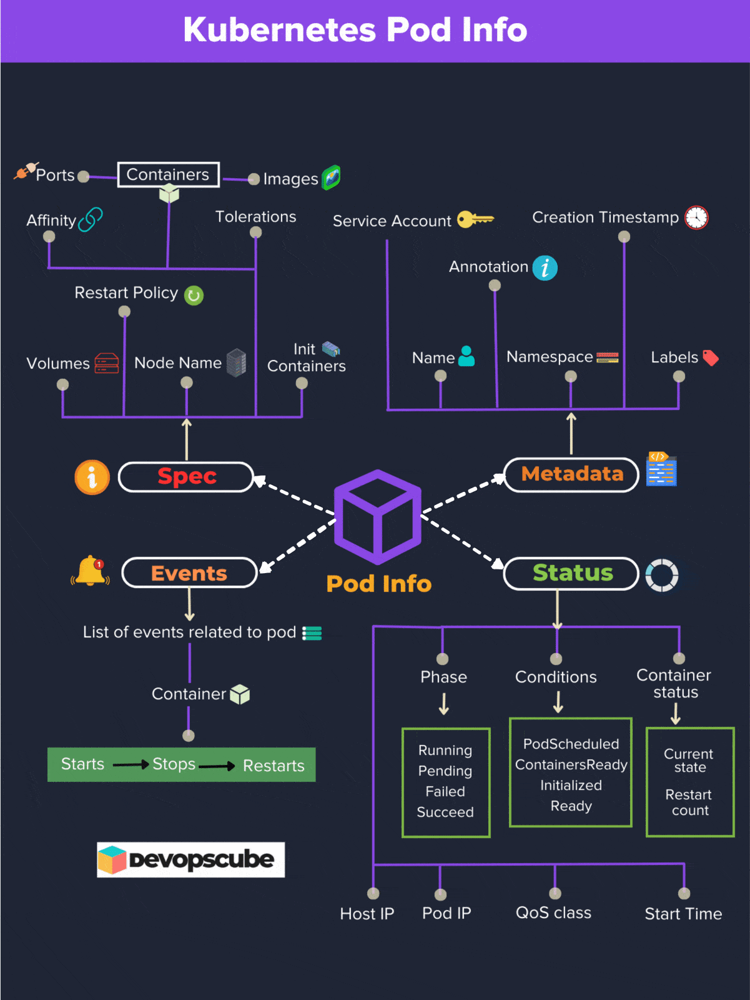

# 🧩 Kubernetes Pod — The Atomic Unit of Deployment

<div align="center" style="background-color: #F5F5F5; border-radius: 10px; border: 2px solid #D0D7DE; padding: 10px;">
  
</div>

---

## 📖 **What Is a Pod?**

> **Official Definition:**  
> A **Pod** is the smallest and simplest deployable unit in the Kubernetes object model. It represents a **single instance of a running process** inside the cluster.

### 🧱 Composition

- Can contain **one or more containers** (often Docker containers).
- Containers within a Pod share:

  - **Network namespace** (same IP, port space)
  - **Storage volumes**
  - **Lifecycle (start, stop, restart)**

### 🎯 Purpose

Pods encapsulate:

- Application **containers**
- Associated **storage resources**
- **Networking** (unique Pod IP)
- **Execution policies** (restart, affinity, tolerations)

---

## 🌐 **Pod Relationships in Kubernetes**

A Pod acts as the execution environment for containers. Higher-level controllers like **Deployments**, **ReplicaSets**, or **StatefulSets** manage Pod lifecycles.

<div align="center" style="background-color:#fff; border-radius: 10px; border: 2px solid #E2E8F0; padding: 10px;">
  
</div>

---

## 📘 **Pod Information Overview**

<div align="center" style="background-color:#1F2535; border-radius: 10px; border: 2px solid #334155; padding: 15px;">
  
</div>

Pod information is organized into **four main sections**:

> 🧩 **Metadata** | 🧠 **Spec** | 📊 **Status** | 🔔 **Events**

---

## 🧩 1. **Metadata**

| Field                  | Description                                         |
| ---------------------- | --------------------------------------------------- |
| **Name**               | Unique name of the Pod within its namespace         |
| **Namespace**          | Logical grouping (environment or team isolation)    |
| **UID**                | Persistent unique identifier for the Pod            |
| **Labels**             | Key-value pairs for selection (e.g., `app=nginx`)   |
| **Annotations**        | Arbitrary metadata (e.g., build number, owner info) |
| **Creation Timestamp** | Time when Pod was created                           |

> 💡 **Tip:** Use Labels for **selectors** (automation) and Annotations for **metadata** (human-readable info).

---

## 🧠 2. **Spec** (Specification)

This defines _how the Pod should behave_ and _what it contains_.

| Spec Element                 | Description                                            |
| ---------------------------- | ------------------------------------------------------ |
| **Containers**               | List of containers (image, ports, resources, commands) |
| **Volumes**                  | Shared storage between containers                      |
| **Init Containers**          | Run before main containers start                       |
| **Service Account**          | Used for Kubernetes API access                         |
| **Node Selector**            | Restricts Pod placement to labeled nodes               |
| **Affinity / Anti-Affinity** | Advanced placement logic                               |
| **Tolerations**              | Allows scheduling on tainted nodes                     |
| **Restart Policy**           | `Always`, `OnFailure`, or `Never`                      |
| **Ports**                    | Container ports exposed by the Pod                     |

🧩 **Example use case:**

```yaml
spec:
  containers:
    - name: web
      image: nginx
      ports:
        - containerPort: 80
  nodeSelector:
    role: frontend
  tolerations:
    - key: "dedicated"
      operator: "Equal"
      value: "frontend"
      effect: "NoSchedule"
```

---

## 📊 3. **Status**

Describes **what’s happening right now** inside the Pod.

| Field                  | Description                                                                          |
| ---------------------- | ------------------------------------------------------------------------------------ |
| **Phase**              | High-level summary (`Pending`, `Running`, `Succeeded`, `Failed`, `Unknown`)          |
| **Conditions**         | Readiness and scheduling (`PodScheduled`, `ContainersReady`, `Initialized`, `Ready`) |
| **Host IP / Pod IP**   | Node IP and Pod IP addresses                                                         |
| **QoS Class**          | Quality of Service (`Guaranteed`, `Burstable`, `BestEffort`)                         |
| **Start Time**         | Time when Pod entered `Running` phase                                                |
| **Container Statuses** | For each container: state, restarts, last state                                      |

> 🔍 **Debug tip:**
> Use `kubectl describe pod <pod-name>` to check `Restart Count` and container states for clues.

---

## 🔔 4. **Events**

Events tell the **story of your Pod’s lifecycle** — from scheduling to termination.

| Field       | Description                                            |
| ----------- | ------------------------------------------------------ |
| **Type**    | `Normal` or `Warning`                                  |
| **Reason**  | Short code (e.g., `FailedScheduling`, `Pulling`)       |
| **Message** | Human-readable summary                                 |
| **Source**  | Component reporting the event (`kubelet`, `scheduler`) |

🕓 Example Flow:

```plaintext
Started ➜ Pulled ➜ Created ➜ Started ➜ Restarted (if crash)
```

> 📋 View events:
> `kubectl describe pod <pod-name> | grep -i event`

---

## ⚙️ **Common Pod Commands**

### 🏗️ **Create a Pod**

**YAML Definition:**

```yaml
apiVersion: v1
kind: Pod
metadata:
  name: my-pod
spec:
  containers:
    - name: my-container
      image: nginx
```

**Command:**

```bash
kubectl apply -f pod.yaml
```

**Imperative Shortcut:**

```bash
kubectl run my-pod --image=nginx --restart=Never
```

---

### 📋 **List & Describe Pods**

```bash
kubectl get pods
kubectl get pods -n dev
kubectl get pods --all-namespaces
kubectl describe pod <pod-name>
```

---

### 🧾 **View Logs**

```bash
kubectl logs <pod-name>
kubectl logs <pod-name> -c <container-name>
```

---

### 💻 **Exec into a Container**

```bash
kubectl exec -it <pod-name> -- /bin/bash
```

---

### 📁 **Copy Files To/From Pod**

```bash
# To Pod
kubectl cp /local/path <pod>:/path
# From Pod
kubectl cp <pod>:/path /local/path
```

---

### 📦 **Scale Pods** (via Deployment)

```bash
kubectl scale deployment my-deploy --replicas=5
```

---

### 🗑️ **Delete Pods**

```bash
kubectl delete pod <pod-name>
kubectl delete pod <pod-name> --grace-period=0 --force
```

---

### 🧪 **Debug Pods**

```bash
kubectl run -i --tty debug-pod --image=busybox --restart=Never -- /bin/sh
kubectl attach <pod-name> -c <container-name>
```

---

### 🏷️ **Label & Annotate Pods**

```bash
kubectl label pod my-pod app=nginx
kubectl annotate pod my-pod description="Nginx web pod"
```

---

### 🔧 **Patch a Pod**

```bash
kubectl patch pod my-pod -p '{"spec":{"containers":[{"name":"nginx","image":"nginx:latest"}]}}'
```

---

### 🌍 **Port Forward to Pod**

```bash
kubectl port-forward pod/my-pod 8080:80
```

---

## 🧠 **Summary**

✅ **Pods = Smallest deployable unit**  
✅ Contain **1+ containers**, share **network + storage**  
✅ Controlled via **higher-level abstractions** (Deployments, ReplicaSets)  
✅ Use `kubectl describe`, `logs`, and `events` for **debugging**  
✅ Proper **labels**, **annotations**, and **restart policies** make them manageable in production

---

## 📚 **Reference**

- [DevOpsCube: Kubernetes Pod Explained](https://devopscube.com/kubernetes-pod/)
