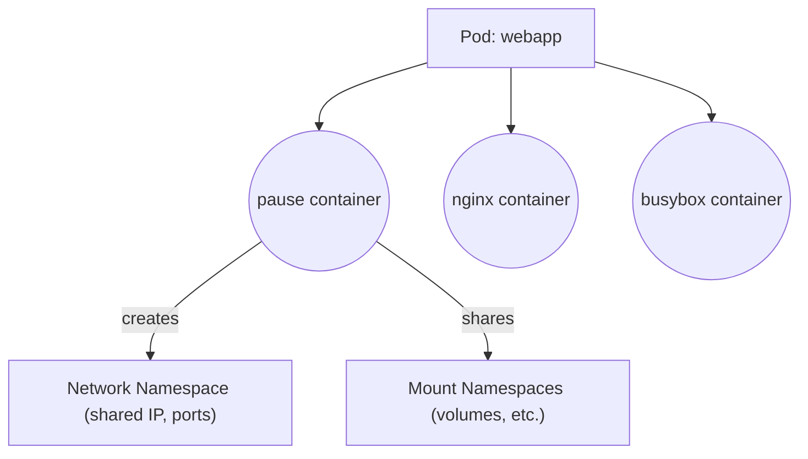

# 🧩 **What Is a Pause Container**

When you create a **Pod**, Kubernetes actually doesn’t run your containers _directly_ —
it first creates a **tiny hidden container** called the **pause container**.

Think of it like this 👇

> 🛖 **Pause container = the “house”**  
> 🧍‍♂️ **Your app containers = the “people living inside the house”**

The pause container exists **only to hold the Pod’s network and namespace** — so that all your containers inside that Pod can live together in one shared environment.

---

<div align="center" style="background-color: #EDF3FC; border-radius: 10px; border: 2px solid">
  
</div>

---

## ⚙️ **Why Kubernetes Needs a Pause Container**

Each **Pod** can have multiple containers (for example, your main app + a sidecar for logging).

All containers in a Pod must:

- Share the **same IP address**
- Share the **same network namespace**
- Share the **same storage volumes**

So Kubernetes needs something to:  
✅ Create and “own” these shared namespaces  
✅ Keep them alive even if app containers restart

👉 That’s the **pause container’s job**.

---

## 🔍 **What Does It Actually Do?**

It does _almost nothing_.
It literally just runs and then **sleeps forever** — its process is like:

```bash
/usr/bin/pause
```

That’s it.
It just stays alive so that Linux namespaces (network, PID, etc.) exist for other containers to join.

---

## 🧠 **How It Works Behind the Scenes**

Let’s say you create a Pod like this:

```yaml
apiVersion: v1
kind: Pod
metadata:
  name: webapp
spec:
  containers:
    - name: app
      image: nginx
    - name: sidecar
      image: busybox
      command: ["sh", "-c", "while true; do echo sidecar; sleep 5; done"]
```

When Kubernetes schedules this Pod on a node, here’s what happens inside that node 👇

<div align="center" style="background-color: #141a19ff;color: #a8a5a5ff; border-radius: 10px; border: 2px solid">



</div>

---

- `pause` container is created first.
- It creates the network namespace.
- Then both `nginx` and `busybox` containers join that same namespace.

So if you run inside the Nginx container:

```bash
curl localhost:8080
```

It can talk to the sidecar container directly — because they share the same IP.

---

## 🧱 **Checking It on a Real Node**

If you log into a Kubernetes node and list containers:

```bash
crictl ps
```

You’ll see something like:

```ini
CONTAINER ID  IMAGE                            NAME        STATE
a1b2c3d4e5f6  k8s.gcr.io/pause:3.9             POD         Running
b2c3d4e5f6g7  nginx:latest                     app         Running
c3d4e5f6g7h8  busybox:latest                   sidecar     Running
```

✅ The `pause` container appears as `POD` type — this is the sandbox container for that Pod.

---

## ⚙️ **What Happens if the Pause Container Dies?**

If the pause container stops or crashes:

- The Pod’s namespace disappears (network, IPC, etc.).
- Kubernetes treats it like the **whole Pod crashed**, and recreates everything.

So — the pause container is the **foundation** of the Pod sandbox.

---

## 🧠 **Why Is It Called "Pause"?**

Because its code literally looks like this in C:

```c
int main() {
  pause(); // waits forever
  return 0;
}
```

It just “pauses” forever — doing nothing — keeping namespaces alive.

---

## 🧩 **Analogy (Super Simple)**

Imagine you rent an apartment (Pod):

- 🏠 The **pause container** is the landlord who owns the apartment.
- 🧍‍♂️ The **app containers** are tenants living inside it.
- If the landlord disappears (pause dies) — the whole apartment collapses, and everyone must leave.

---

## 🧠 **Summary Table**

<div align="center" style="background-color: #141a19ff;color: #a8a5a5ff; border-radius: 10px; border: 2px solid">

| Concept                   | Description                                 |
| ------------------------- | ------------------------------------------- |
| **Pause container**       | The first, hidden container in every Pod    |
| **Purpose**               | Holds the Pod’s network and namespaces      |
| **Runs**                  | `/pause` binary that sleeps forever         |
| **IP Owner**              | Pause container’s IP = Pod’s IP             |
| **App containers**        | Join the pause container’s namespaces       |
| **If it dies**            | Entire Pod restarts                         |
| **Visible in node tools** | `crictl ps`, `docker ps` (as `k8s_POD_...`) |

</div>

---

✅ **In short:**

> The pause container is the “sandbox” that gives a Pod its shared network, PID, and IPC namespaces.
> Without it, your containers wouldn’t be able to live together as one Pod.
