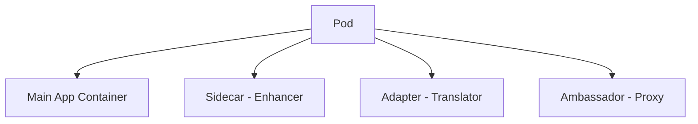

# 🚀 **Multi-Container Deployments in Kubernetes**

> _“Because sometimes one container just isn’t enough — teamwork makes the Pod work!”_ 🧩

---

## 🧭 **Table of Contents**

1. [📖 What Are Multi-Container Deployments?](#1)
2. [💡 Why Use Multi-Container Pods?](#2)
3. [💭 Common Design Patterns](#3)

   - [🛰️ Sidecar Pattern](#3.1)
   - [🔄 Adapter Pattern](#3.2)
   - [🧭 Ambassador Pattern](#3.3)

4. [✍🏻 Hands-on Examples](#4)
5. [✅ Best Practices](#5)
6. [🖼️ Visual Summary](#6)
7. [🏁 Conclusion](#7)

---

## 📖 **What Are Multi-Container Deployments?**<a id="1"></a>

In Kubernetes, a **Deployment** ensures that a specified number of identical **Pods** are always running.
While most Pods run a single container, Kubernetes allows **multiple containers inside one Pod** — all sharing:

- The same **network namespace** (i.e., `localhost`)
- The same **storage volumes**
- The same **Pod lifecycle**

This makes them **perfect teammates** for implementing composable design patterns.

<div align="center" style="background-color: #EEF4FB; border-radius: 10px; border: 2px solid #B0C4DE">
  
  <p><i>Each Pod = 1 Pause container + multiple functional containers sharing the same namespace.</i></p>
</div>

---

## 💡 **Why Use Multi-Container Pods?**<a id="2"></a>

<div align="center" style="background-color: #141a19ff;color: #a8a5a5ff; border-radius: 10px; border: 2px solid">

| Benefit                       | Description                                                                    |
| ----------------------------- | ------------------------------------------------------------------------------ |
| 🧩 **Modularity**             | Split complex applications into smaller, specialized helpers.                  |
| 🔒 **Separation of Concerns** | Keep concerns (e.g., logging, monitoring, proxying) separate from core logic.  |
| ⚡ **Efficiency**             | Share network, volumes, and memory — no need for multiple Pods.                |
| 📈 **Scalability**            | Easily scale the Deployment — each Pod brings along all its helper containers. |

</div>

---

## 💭 **Common Design Patterns**<a id="3"></a>

Kubernetes has popularized a few design patterns for combining multiple containers inside one Pod.
Let’s explore the **big three** 🧩

---

### 🛰️ **Sidecar Pattern**<a id="3.1"></a>

> _“The trusty assistant that extends your main container’s powers.”_

**Concept:**  
A **sidecar container** adds extra functionality to the main app — such as collecting logs, syncing configs, or proxying requests.

<div align="center" style="background-color: #141a19ff;color: #a8a5a5ff; border-radius: 10px; border: 2px solid">


</div>

**Characteristics:**

- Extends main container functionality ✨
- Shares same lifecycle (start, stop together) 🔁
- Communicates via shared volume or `localhost` 🔗

**Common Uses:**
Logging (Fluentd), metrics collection (Prometheus), file sync, hot reload services.

---

### 🔄 **Adapter Pattern**<a id="3.2"></a>

> _“The translator in the team — makes incompatible systems talk nicely.”_

**Concept:**
An **adapter container** transforms data or protocol formats so the main app can understand them.

<div align="center" style="background-color: #141a19ff;color: #a8a5a5ff; border-radius: 10px; border: 2px solid">


</div>

**Characteristics:**

- Handles input/output transformation 🧬
- Keeps the main container clean 🧼
- Useful for legacy-to-modern integration 🌉

**Common Uses:**
Format conversion (XML → JSON), metric normalization, legacy data pipelines.

---

### 🧭 **Ambassador Pattern**<a id="3.3"></a>

> _“The smart network diplomat who speaks on behalf of your app.”_

**Concept:**
An **ambassador container** acts as a proxy between the app and external services, managing routing, retries, authentication, or load balancing.

<div align="center" style="background-color: #141a19ff;color: #a8a5a5ff; border-radius: 10px; border: 2px solid">


</div>

**Characteristics:**

- Acts as a reverse or forward proxy 🌐
- Offloads network concerns 🧱
- Enables flexible routing & A/B testing 🧪

**Common Uses:**
Envoy, NGINX, or HAProxy sidecars for API gateways or external calls.

---

## ✍🏻 **Hands-on Examples**<a id="4"></a>

Let’s make this real with examples 👇

---

### 🛰️ **Sidecar Deployment Example**

**Use Case:** Centralized log collection with Fluentd.

```yaml
apiVersion: apps/v1
kind: Deployment
metadata:
  name: sidecar-deployment
spec:
  replicas: 3
  selector:
    matchLabels:
      app: sidecar-example
  template:
    metadata:
      labels:
        app: sidecar-example
    spec:
      containers:
        - name: main-app
          image: myapp:latest
          ports:
            - containerPort: 8080
          volumeMounts:
            - name: log-volume
              mountPath: /var/log/myapp
        - name: log-collector
          image: fluentd:latest
          args: ["fluentd", "-c", "/fluentd/etc/fluent.conf"]
          volumeMounts:
            - name: log-volume
              mountPath: /var/log/myapp
      volumes:
        - name: log-volume
          emptyDir: {}
```

✅ **Main App:** Writes logs  
✅ **Sidecar:** Ships logs to remote storage  
✅ **Shared Volume:** `/var/log/myapp`

---

### 🔄 **Adapter Deployment Example**

**Use Case:** Converting proprietary messages to JSON before main app processing.

```yaml
apiVersion: apps/v1
kind: Deployment
metadata:
  name: adapter-deployment
spec:
  replicas: 2
  selector:
    matchLabels:
      app: adapter-example
  template:
    metadata:
      labels:
        app: adapter-example
    spec:
      containers:
        - name: main-app
          image: myapp:latest
          ports:
            - containerPort: 8080
        - name: message-adapter
          image: custom-adapter:latest
          command: ["./adapter"]
          ports:
            - containerPort: 9090
          env:
            - name: MAIN_APP_URL
              value: "http://localhost:8080"
```

✅ Adapter listens on port `9090`, converts input, and forwards to main app’s `8080`.

---

### 🧭 **Ambassador Deployment Example**

**Use Case:** Routing incoming API requests securely via a proxy.

```yaml
apiVersion: apps/v1
kind: Deployment
metadata:
  name: ambassador-deployment
spec:
  replicas: 3
  selector:
    matchLabels:
      app: ambassador-example
  template:
    metadata:
      labels:
        app: ambassador-example
    spec:
      containers:
        - name: main-app
          image: myapp:latest
          ports:
            - containerPort: 8080
        - name: ambassador
          image: envoyproxy/envoy:v1.28.0
          ports:
            - containerPort: 80
          args: ["--service=myapp:8080"]
          env:
            - name: AMBASSADOR_ENV
              value: "production"
```

✅ Ambassador listens on `80`, routes to `8080`.  
✅ Handles TLS termination, auth, rate-limiting, etc.

---

## ✅ **Best Practices**<a id="5"></a>

<div align="center" style="background-color: #141a19ff;color: #a8a5a5ff; border-radius: 10px; border: 2px solid">

| Category                      | Recommendations                                               |
| ----------------------------- | ------------------------------------------------------------- |
| 🎯 **Separation of Concerns** | Keep main logic and helper logic separate.                    |
| 🪶 **Lightweight Helpers**     | Use minimal images (Alpine, BusyBox).                         |
| 📦 **Shared Volumes**         | Use `emptyDir` or `ConfigMap` for file-based exchange.        |
| 🔄 **Lifecycle Sync**         | Use readiness/liveness probes to keep helpers aligned.        |
| 🔐 **Security**               | Use least-privilege security contexts and read-only volumes.  |
| 📊 **Monitoring**             | Collect metrics/logs from _all_ containers — not just main.   |
| ⚙️ **Configuration**          | Use `ConfigMap` and `Secret` injection to centralize configs. |
| 📈 **Scaling**                | Always scale the Pod, not individual containers inside it.    |
| 🧮 **Resource Limits**        | Define requests/limits for each container individually.       |

</div>

---

Example:

```yaml
resources:
  requests:
    memory: "64Mi"
    cpu: "250m"
  limits:
    memory: "128Mi"
    cpu: "500m"
```

---

## 🖼️ **Visual Summary**<a id="6"></a>

<div align="center" style="background-color: #141a19ff;color: #a8a5a5ff; border-radius: 10px; border: 2px solid">



</div>

---

All share:

- Same network (localhost)
- Same volumes
- Same lifecycle

---

## 🏁 **Conclusion**<a id="7"></a>

Multi-container Pods are one of Kubernetes’ **most elegant design patterns** — they let you **compose behavior** like LEGO blocks 🧱:

- 🛰️ Sidecars **extend** your app
- 🔄 Adapters **translate** data
- 🧭 Ambassadors **connect** it to the world

By combining these patterns thoughtfully, you get **cleaner architecture, better observability, and maintainable microservices** — all while staying Kubernetes-native 💪
