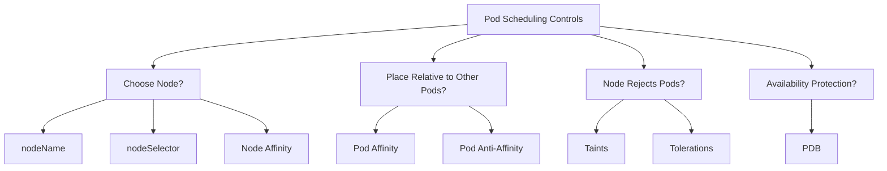

# 🚀 **Kubernetes Pod Scheduling — The Ultimate Organized Guide**

There are **4 big families** of scheduling controls in Kubernetes:

---

## 🗺️ **The Entire Scheduling Decision Tree**



---

## 🧭 **1. Node Targeting Controls**

> _“Choose **which nodes** a pod is allowed/preferred to run on.”_

These rules depend **ONLY on the node’s labels**.

---

### 1️⃣ **nodeName** — _Direct assignment (avoid unless testing)_

**Behavior**:

- ✔️ Pod goes to exactly one node
- ❌ Skips scheduler
- ❌ If node is down → pod stays Pending forever

**Use only for:**

- Debugging
- Forcing pod on a specific machine temporarily

**Mnemonic**:  
➡️ **nodeName = ZIP code** (one exact address)

---

```yaml
spec:
  nodeName: worker-1
```

```yaml
apiVersion: v1
kind: Pod
metadata:
  name: mypod
spec:
  nodeName: worker-1
  containers:
    - name: mypod
      image: busybox
      command: ["sh", "-c", "while true; do echo hello; sleep 5; done"]
```

---

### 2️⃣ **nodeSelector** — _Simple 1:1 label match_

**Behavior:**

- ✔️ Pod must match node labels
- ❌ No conditions, no OR logic
- ❌ Exact match only

**Use for:**

- Simple mapping

  - `disktype=ssd`
  - `env=prod`

**Mnemonic**:
➡️ **nodeSelector = Basic filter** (like “give me all red shoes”)

---

```yaml
spec:
  nodeSelector:
    disktype: ssd
```

```yaml
apiVersion: v1
kind: Pod
metadata:
  name: mypod
spec:
  nodeSelector:
    disktype: ssd
  containers:
    - name: mypod
      image: busybox
      command: ["sh", "-c", "while true; do echo hello; sleep 5; done"]
```

---

### 3️⃣ **Node Affinity** — _Advanced version of nodeSelector_

**Behavior:**

- ✔️ Uses expressions (`In`, `NotIn`, `Exists`, `Gt`, etc.)
- ✔️ Supports AND/OR
- ✔️ Has soft & hard rules

#### Types:

| Type                           | Meaning                  |
| ------------------------------ | ------------------------ |
| **requiredDuringScheduling…**  | Must match (hard rule)   |
| **preferredDuringScheduling…** | Try to match (soft rule) |

**Use for:**

- Multiple labels
- Zones/regions
- “Prefer SSD nodes but allow HDD if no choice”

**Mnemonic**:  
➡️ **Node Affinity = Smart filter** (like Amazon search with many conditions)

---

```yaml
spec:
  affinity:
    nodeAffinity:
      requiredDuringSchedulingIgnoredDuringExecution:
        nodeSelectorTerms:
          - matchExpressions:
              - key: disktype
                operator: In
                values:
                  - ssd
```

```yaml
apiVersion: v1
kind: Pod
metadata:
  name: mypod
spec:
  affinity:
    nodeAffinity:
      requiredDuringSchedulingIgnoredDuringExecution:
        nodeSelectorTerms:
          - matchExpressions:
              - key: disktype
                operator: In
                values:
                  - ssd
  containers:
    - name: mypod
      image: nginx
```

## 🔗 **2. Pod-to-Pod Placement Controls**

> _“Place pods near/far from **other pods** (not nodes).”_

These rules depend on **other pods’ labels**, not on nodes.

---

### 4️⃣ **Pod Affinity** — _“Stick together”_

Use when pods must be co-located for:

- ✔️ Low latency
- ✔️ Shared cache
- ✔️ Logging agent + app running together

**Example:**
Frontend wants to run with backend:

```yaml
topologyKey: kubernetes.io/hostname # required statement that tell the scheduler to place the pod on the same node as the other pod

# you're telling Kubernetes:
# 👉 “Apply this rule per node — group or separate pods by node.”
```

**Mnemonic:**  
➡️ **Affinity = BFF pods** (best friends forever)

---

```yaml
affinity:
podAffinity:
  requiredDuringSchedulingIgnoredDuringExecution:
    - labelSelector:
        matchLabels:
          app: backend
        topologyKey: "kubernetes.io/hostname"
```

```yaml
apiVersion: v1
kind: Pod
metadata:
  name: mypod
spec:
  affinity:
    podAffinity:
      requiredDuringSchedulingIgnoredDuringExecution:
        - labelSelector:
            matchLabels:
              app: backend
            topologyKey: "kubernetes.io/hostname"
  containers:
    - name: mypod
      image: nginx
```

---

### 5️⃣ **Pod Anti-Affinity** — _“Spread apart”_

Best for **high availability**:

- ✔️ Replicas in different nodes
- ✔️ Avoid putting all pods on same node
- ✔️ Failure-domain separation (zone/region)

**Mnemonic:**  
➡️ **Anti-Affinity = Social distancing** (spread out)

---

```yaml
affinity:
podAntiAffinity:
  requiredDuringSchedulingIgnoredDuringExecution:
    - labelSelector:
        matchLabels:
          app: web
        topologyKey: "kubernetes.io/hostname"
```

```yaml
apiVersion: v1
kind: Pod
metadata:
  name: mypod
spec:
  affinity:
    podAntiAffinity:
      requiredDuringSchedulingIgnoredDuringExecution:
        - labelSelector:
            matchLabels:
              app: web
            topologyKey: "kubernetes.io/hostname"
  containers:
    - name: mypod
      image: nginx
```

---

## 🚫 **3. Node Rejection & Pod Permissions**

> _“Nodes can reject pods. Pods can say they’re allowed.”_

This is **direction reversed** from affinity:

- Affinity = Pod chooses node
- Taints = Node rejects pod
- Tolerations = Pod says “I can handle that taint”

---

### 6️⃣ **Taints** — _Node says “Do NOT schedule pods here unless allowed”_

```bash
kubectl taint nodes node1 dedicated=gpu:NoSchedule
```

Node becomes:

- ❌ hostile to all pods
- ✔️ unless they tolerate the taint

Use for:

- GPU nodes
- Special workloads
- Reserved nodes

**Mnemonic:**  
➡️ **Taints = Bouncers at a club** (no entry unless on the list)

---

### 7️⃣ **Tolerations** — _Pod says “I’m allowed on that tainted node”_

```yaml
tolerations:
  - key: "gpu"
    value: "true"
    effect: "NoSchedule"
```

Pod becomes:

```yaml
apiVersion: v1
kind: Pod
metadata:
  name: mypod
spec:
  tolerations:
    - key: "gpu"
      value: "true"
      effect: "NoSchedule"
  containers:
    - name: mypod
      image: nginx
```

Use for:

- Allow certain pods to run on isolated nodes
- Let system-level pods run everywhere

**Mnemonic:**  
➡️ **Toleration = VIP pass** (grants access to restricted spaces)

---

## 🏥 **4. Pod Availability Protections**

> _“Limit how many pods can be taken down at once.”_

Not about scheduling location → but **scheduling stability**.

---

### 8️⃣ **PodDisruptionBudget (PDB)** — _Protect pods during maintenance_

Use for:

- ✔️ Node drain
- ✔️ Cluster upgrades
- ✔️ Prevent all replicas from going down

Example:

```yaml
minAvailable: 1
```

**Mnemonic:**  
➡️ **PDB = Insurance policy** (protects against voluntary disruptions)

---

## 🧠 **When to Use What — The 1-Minute Cheatsheet**

| Goal                                  | Use                   |
| ------------------------------------- | --------------------- |
| Put pod on exact node                 | **nodeName**          |
| Simple label match                    | **nodeSelector**      |
| Advanced node filtering               | **Node Affinity**     |
| Keep pods together                    | **Pod Affinity**      |
| Separate replicas                     | **Pod Anti-Affinity** |
| Block pods from nodes                 | **Taints**            |
| Allow pods on tainted nodes           | **Tolerations**       |
| Prevent too many pods from being down | **PDB**               |

---

## 🏆 **The Memory Framework (SUPER EASY)**

> All scheduling controls fall into **only 4 categories**:

### **1. “Go TO this node”**

- nodeName
- nodeSelector
- Node Affinity

### **2. “Go NEAR / FAR from these pods”**

- Pod Affinity
- Pod Anti-Affinity

### **3. “Node Rejects Pod unless…”**

- Taints → node blocks
- Tolerations → pod allowed

### **4. “Don’t kill too many pods at once”**

- PDB

This mental map ensures you never mix them again.

---

## 🎁 Want me to turn this into a printable 1-page PDF cheatsheet with colors & diagrams?
