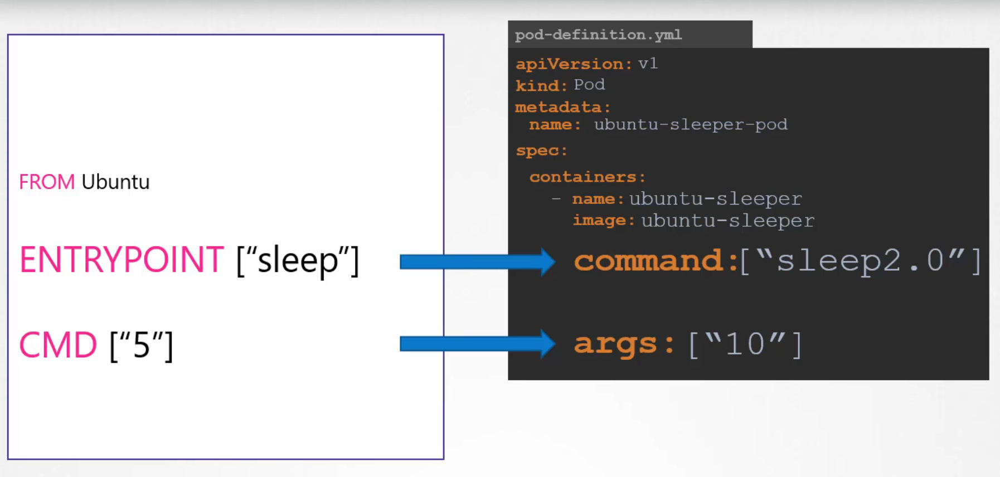

# 🐳 Understanding `ENTRYPOINT`, `CMD`, and Kubernetes Overrides

## 🧭 **Table of Contents**

1. [Introduction](#1)
2. [Dockerfile: `ENTRYPOINT` vs `CMD`](#2)

   - [Understanding `ENTRYPOINT`](#2.1)
   - [Understanding `CMD`](#2.2)
   - [Key Differences](#2.3)
   - [Common Mistakes & Fixes](#2.4)

3. [Kubernetes Pod YAML: `command` and `args`](#3)

   - [Understanding `command`](#3.1)
   - [Understanding `args`](#3.2)
   - [Common YAML Pitfalls](#3.3)

4. [Docker vs Kubernetes Behavior](#4)
5. [Hands-On Examples](#5)

   - [Example 1: Combined Use](#5.1)
   - [Example 2: CMD Without ENTRYPOINT](#5.2)
   - [Example 3: ENTRYPOINT with Runtime Args](#5.2)
   - [Example 4: Kubernetes Override](#5.3)

6. [Best Practices Checklist](#6)
7. [Conclusion](#7)

---

## 📖 **Introduction** <a id="1"></a>

When defining container behavior, the **startup command** and its **arguments** determine how your application runs.

- **Docker** defines this behavior _at build time_ using `ENTRYPOINT` and `CMD`.
- **Kubernetes** lets you _override or extend_ it _at deployment time_ using `command` and `args`.

Understanding the difference helps prevent unpredictable container starts, command overrides, and deployment errors.

---

## ⚙️ **Dockerfile**: `ENTRYPOINT` vs `CMD` <a id="2"></a>

Both are used to define what happens when your container starts — but they play **different roles**.

---

### 🚀 Understanding `ENTRYPOINT` <a id="2.1"></a>

- **Purpose** → Defines the _main executable_ that always runs.
- **Behavior** → Can’t be overridden unless you explicitly use `--entrypoint`.
- **Preferred Syntax** → _Exec form (JSON array)_

```dockerfile
ENTRYPOINT ["python", "app.py"]
```

Avoid the **shell form**:

```dockerfile
ENTRYPOINT python app.py    # ❌ wraps in /bin/sh -c
```

🧠 _Why exec form is better:_

- Runs directly as PID 1
- Proper signal handling (clean shutdowns)
- Works cleanly with additional runtime arguments

---

### 💬 Understanding `CMD` <a id="2.2"></a>

- **Purpose** → Defines _default arguments_ for the `ENTRYPOINT`, or acts as the _default command_ if no `ENTRYPOINT` is set.
- **Behavior** → Easily overridden by adding arguments at runtime.

✅ Example:

```dockerfile
ENTRYPOINT ["python", "app.py"]
CMD ["--port", "8080"]
```

Now:

```bash
docker run myimage                # → python app.py --port 8080
docker run myimage --debug        # → python app.py --debug
```

---

### 🔍 **Key Differences** <a id="2.3"></a>

<div align="center" style="background-color: #141a19ff;color: #a8a5a5ff; border-radius: 10px; border: 2px solid">

| 🔹 Feature         | 🧱 `ENTRYPOINT`                      | ⚙️ `CMD`                           |
| ------------------ | ------------------------------------ | ---------------------------------- |
| **Purpose**        | Defines the executable               | Defines default parameters         |
| **Overridable?**   | Only with `--entrypoint`             | Yes — by runtime args              |
| **Execution Form** | Must use exec form                   | Can use exec or shell form         |
| **PID 1 Process**  | Becomes PID 1                        | Arguments only                     |
| **Typical Use**    | Main command (e.g., `python app.py`) | Default args (e.g., `--port 8080`) |

</div>

---

### ❗ **Common Mistakes & Fixes** <a id="2.4"></a>

<div align="center" style="background-color: #141a19ff;color: #a8a5a5ff; border-radius: 10px; border: 2px solid">

| Mistake ❌                                                        | Problem                             | Correct ✅                                                                        |
| ----------------------------------------------------------------- | ----------------------------------- | --------------------------------------------------------------------------------- |
| `ENTRYPOINT python app.py`                                        | Shell form → signal issues          | `ENTRYPOINT ["python", "app.py"]`                                                 |
| Only `CMD ["--debug"]`                                            | No command → “executable not found” | Add `ENTRYPOINT ["python", "app.py"]`                                             |
| `ENTRYPOINT ["echo", "Starting..."]` + `CMD ["python", "app.py"]` | CMD passed to echo → app never runs | Use same tool in both: `ENTRYPOINT ["python", "app.py"]`, `CMD ["--port","8080"]` |
| Shell script without `exec "$@"`                                  | App runs as child → bad signals     | Add `exec "$@"` in script                                                         |

</div>

---

## 🧭 Kubernetes Pod YAML: `command` and `args` <a id="3"></a>

Kubernetes offers a way to **override or extend Docker’s defaults** at runtime using two fields inside the container spec.

<div align="center" style="background-color:#ffff;border-radius: 20px">
  
</div>

---

### 🧠 Understanding `command` <a id="3.1"></a>

- **Equivalent to** → Docker’s `ENTRYPOINT`
- **Purpose** → Defines the main program to run
- **Behavior** → Completely overrides image’s `ENTRYPOINT`

```yaml
command: ["python", "server.py"]
```

If omitted, Kubernetes uses the Dockerfile’s `ENTRYPOINT`.

---

### 🧩 Understanding `args` <a id="3.2"></a>

- **Equivalent to** → Docker’s `CMD`
- **Purpose** → Provides arguments to the command
- **Behavior** → Overrides Dockerfile’s `CMD`

```yaml
args: ["--port", "9090"]
```

---

### ⚠️ Common YAML Pitfalls <a id="3.3"></a>

<div align="center" style="background-color: #141a19ff;color: #a8a5a5ff; border-radius: 10px; border: 2px solid">

| Mistake ❌                                 | Why it fails                                  | Fix ✅                                   |
| ------------------------------------------ | --------------------------------------------- | ---------------------------------------- |
| `command: ["python app.py"]`               | Single string → treated as literal, not split | `command: ["python", "app.py"]`          |
| Using both command & args as shell strings | Breaks argument parsing                       | Always use array (JSON) syntax           |
| Forgetting args override CMD               | Causes old defaults to persist                | Always check which field overrides which |

</div>

---

## 🔄 Docker vs Kubernetes Behavior <a id="4"></a>

<div align="center" style="background-color: #141a19ff;color: #a8a5a5ff; border-radius: 10px; border: 2px solid">

| Behavior            | Dockerfile (`ENTRYPOINT` + `CMD`) | Kubernetes (`command` + `args`) |
| ------------------- | --------------------------------- | ------------------------------- |
| **When defined**    | During image build                | During pod deployment           |
| **Who controls it** | Image author                      | Cluster operator / DevOps       |
| **How to override** | `docker run --entrypoint` or args | `command:` / `args:` in YAML    |
| **Flexibility**     | Limited                           | Very flexible                   |
| **Best use**        | Define defaults once              | Adjust behavior per environment |

</div>

---

## 🧪 **Hands-On Examples** <a id="5"></a>

### ✍🏻 Example 1: Combined Use <a id="5.1"></a>

```dockerfile
FROM ubuntu:latest
ENTRYPOINT ["echo"]
CMD ["Hello, World!"]
```

| Command                                     | Behavior              | Output           |
| ------------------------------------------- | --------------------- | ---------------- |
| `docker run myimage`                        | Uses ENTRYPOINT + CMD | `Hello, World!`  |
| `docker run myimage Hi There!`              | Overrides CMD         | `Hi There!`      |
| `docker run --entrypoint /bin/bash myimage` | Overrides ENTRYPOINT  | Opens Bash shell |

---

### ✍🏻 Example 2: CMD Without ENTRYPOINT <a id="5.2"></a>

```dockerfile
FROM ubuntu:latest
CMD ["echo", "Hello!"]
```

```bash
docker run myimage "Hi"
```

❌ **Result:**  
Docker replaces `CMD` entirely with `"Hi"`, tries to execute it as a binary →
`exec: "Hi": executable file not found in $PATH`

✅ **Fix:**  
Add a proper ENTRYPOINT:

```dockerfile
ENTRYPOINT ["echo"]
CMD ["Hello!"]
```

---

### ✍🏻 Example 3: ENTRYPOINT with Runtime Args <a id="5.3"></a>

```dockerfile
FROM ubuntu:latest
ENTRYPOINT ["echo", "Hey there,"]
```

```bash
docker run myimage Hady Wafa
```

✅ Output:

```ini
Hey there, Hady Wafa
```

→ Runtime args are **appended** to the ENTRYPOINT automatically.

---

### ✍🏻 Example 4: Kubernetes Override <a id="5.4"></a>

**Dockerfile:**

```dockerfile
ENTRYPOINT ["echo"]
CMD ["Hello from Docker!"]
```

**Kubernetes Pod YAML:**

```yaml
apiVersion: v1
kind: Pod
metadata:
  name: echo-pod
spec:
  containers:
    - name: echo
      image: your-image
      args: ["Hello from Kubernetes!"] # overrides CMD
```

✅ Output:

```ini
Hello from Kubernetes!
```

Or override both:

```yaml
command: ["/bin/bash", "-c"]
args: ["echo 'ENTRYPOINT overridden in Kubernetes'"]
```

✅ Output:

```ini
ENTRYPOINT overridden in Kubernetes
```

---

## ✅ **Best Practices** <a id="6"></a>

<div align="center" style="background-color: #141a19ff;color: #a8a5a5ff; border-radius: 10px; border: 2px solid">

| #   | Best Practice                                          | Why                                        |
| --- | ------------------------------------------------------ | ------------------------------------------ |
| 1️⃣  | Use **exec form** (`["cmd", "arg"]`)                   | Avoids `/bin/sh -c`, ensures clean signals |
| 2️⃣  | **ENTRYPOINT** for the main command                    | Prevents accidental override               |
| 3️⃣  | **CMD** for default parameters                         | Keeps runtime flexible                     |
| 4️⃣  | Use Kubernetes `args` for overrides                    | No rebuilds required                       |
| 5️⃣  | Avoid single-string commands                           | YAML will misinterpret them                |
| 6️⃣  | Test overrides (`docker run ...`, `kubectl apply ...`) | Confirms expected behavior                 |
| 7️⃣  | Document command expectations                          | Saves debugging time                       |

</div>

---

## 🏁 **Conclusion** <a id="7"></a>

- Docker’s **`ENTRYPOINT`** defines **what runs**, and **`CMD`** defines **with what arguments**.
- Kubernetes’ **`command`** and **`args`** let you **override** them per deployment — no image rebuilds needed.
- Use **exec form**, avoid **shell wrapping**, and always **test both Docker and Kubernetes execution paths**.
