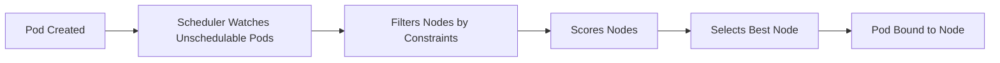

# ⚖️ **Kubernetes Pods 103 — Scheduling**, Node Placement & Pod Disruption

## 🎯 Goal

Understand **how Kubernetes decides where to run pods**, and how to control that behavior using:

- Node selectors, affinity, and anti-affinity
- Taints and tolerations
- PodDisruptionBudgets (PDBs)
- Troubleshooting scheduling issues

---

## 📖 **Scheduling Overview**

The **kube-scheduler** assigns pods to nodes based on:  
1️⃣ Node resource availability  
2️⃣ Scheduling rules (affinity, taints, etc.)  
3️⃣ Pod constraints (selectors, nodeName, tolerations)

### Scheduler Flow 🧠



---

## 👯‍♂️ **Static Placement Options**

### A. `nodeName` (Hard Binding)

Simplest method: assign pod directly to a specific node.

```yaml
spec:
  nodeName: worker-1
```

⚠️ No scheduler decision — it goes **directly** to that node.
If that node is down → pod stays **Pending** `forever`.

---

### B. `nodeSelector` (Label Match)

Labels on nodes:

```bash
kubectl label node worker-1 disktype=ssd
```

Pod YAML:

```yaml
spec:
  nodeSelector:
    disktype: ssd
```

✅ Pod will only schedule to nodes labeled `disktype=ssd`.  
🧠 One-to-one match — no expressions or conditions.

List node labels:

```bash
kubectl get nodes --show-labels
```

---

## ⚙️ **Node Affinity** (Advanced Version of nodeSelector)

Node affinity uses **expressions**, **operators**, and **multiple rules**.
Defined under `.spec.affinity.nodeAffinity`.

### Example: Preferred SSD Nodes

```yaml
spec:
  affinity:
    nodeAffinity:
      requiredDuringSchedulingIgnoredDuringExecution:
        nodeSelectorTerms:
          - matchExpressions:
              - key: disktype
                operator: In
                values:
                  - ssd
```

🧠 `requiredDuringSchedulingIgnoredDuringExecution`
→ Hard requirement during scheduling (pod won’t run otherwise).

---

### Optional vs Required Affinity

| Type                                                | Behavior                                           |
| --------------------------------------------------- | -------------------------------------------------- |
| **requiredDuringSchedulingIgnoredDuringExecution**  | Hard rule — must match or pod stays Pending.       |
| **preferredDuringSchedulingIgnoredDuringExecution** | Soft rule — scheduler prefers it but not required. |

Example:

```yaml
preferredDuringSchedulingIgnoredDuringExecution:
  - weight: 1
    preference:
      matchExpressions:
        - key: zone
          operator: In
          values:
            - us-east-1a
```

✅ “Prefer zone us-east-1a, but don’t block if unavailable.”

---

### Common Operators

| Operator       | Meaning                         |
| -------------- | ------------------------------- |
| `In`           | key’s value must be in list     |
| `NotIn`        | key’s value must not be in list |
| `Exists`       | key exists (value ignored)      |
| `DoesNotExist` | key missing                     |
| `Gt`           | greater than (numeric)          |
| `Lt`           | less than (numeric)             |

---

## 🧩 **Pod Affinity** and **Anti-Affinity**

Used to **co-locate or separate** pods based on labels of other pods.

---

### Example: Pod Affinity (run together)

```yaml
affinity:
  podAffinity:
    requiredDuringSchedulingIgnoredDuringExecution:
      - labelSelector:
          matchExpressions:
            - key: app
              operator: In
              values:
                - backend
        topologyKey: kubernetes.io/hostname
```

💡 Schedules this pod on the **same node** as pods labeled `app=backend`.

---

### Example: Pod Anti-Affinity (spread apart)

```yaml
affinity:
  podAntiAffinity:
    requiredDuringSchedulingIgnoredDuringExecution:
      - labelSelector:
          matchExpressions:
            - key: app
              operator: In
              values:
                - frontend
        topologyKey: kubernetes.io/hostname
```

✅ Ensures frontend pods are **on different nodes** — great for HA.

---

### Common topologyKeys

| Key                             | Scope      |
| ------------------------------- | ---------- |
| `kubernetes.io/hostname`        | per-node   |
| `topology.kubernetes.io/zone`   | per-zone   |
| `topology.kubernetes.io/region` | per-region |

---

## 🧱 **Taints** and **Tolerations**

Taints mark **nodes** as “restricted”; tolerations allow **pods** to run there.

---

### A. Add a taint to a node

```bash
kubectl taint nodes worker-1 dedicated=frontend:NoSchedule
```

🧠 Format:

```
key=value:effect
```

Effects:

| Effect               | Description                                 |
| -------------------- | ------------------------------------------- |
| **NoSchedule**       | Pod won’t be scheduled unless it tolerates. |
| **PreferNoSchedule** | Try to avoid scheduling, but not strict.    |
| **NoExecute**        | Evicts running pods that don’t tolerate it. |

---

### B. Toleration Example (allow pod to run)

```yaml
tolerations:
  - key: "dedicated"
    operator: "Equal"
    value: "frontend"
    effect: "NoSchedule"
```

✅ Pod can now run on tainted nodes.

Remove taint:

```bash
kubectl taint nodes worker-1 dedicated-
```

---

### C. Check Taints & Tolerations

List node taints:

```bash
kubectl describe node worker-1 | grep -i taints
```

List pods tolerating:

```bash
kubectl get pods -o custom-columns=NAME:.metadata.name,TOLERATIONS:.spec.tolerations
```

---

## ✍🏻 **Node Selectors + Affinity + Taints Combined Example**

```yaml
apiVersion: v1
kind: Pod
metadata:
  name: complex-scheduler
spec:
  nodeSelector:
    region: eu
  affinity:
    nodeAffinity:
      requiredDuringSchedulingIgnoredDuringExecution:
        - matchExpressions:
            - key: disktype
              operator: In
              values: ["ssd"]
  tolerations:
    - key: "dedicated"
      operator: "Equal"
      value: "batch"
      effect: "NoSchedule"
  containers:
    - name: app
      image: nginx
```

🧠 “Only run in EU region, on SSD nodes, with batch taint tolerance.”

---

## 🔴 **Troubleshooting Scheduling Issues**

### Check pod reason

```bash
kubectl describe pod <pod> | grep -A5 Events
```

Typical outputs:

- `0/3 nodes are available: 3 node(s) didn't match node selector.`
- `0/3 nodes had taints that the pod didn't tolerate.`
- `0/3 nodes didn't match pod affinity/anti-affinity rules.`

---

### Verify Scheduler Logs

On control plane:

```bash
kubectl -n kube-system logs kube-scheduler-<node>
```

---

### Verify Node Conditions

```bash
kubectl describe node <nodename> | grep -i Conditions
```

Common issues:

- `OutOfDisk`
- `MemoryPressure`
- `DiskPressure`
- `NetworkUnavailable`

---

## ⚙️ **Pod Disruption Budget** (PDB)

PDB controls **how many pods can be down** during maintenance or node drains.

Example: ensure at least one pod always runs.

```yaml
apiVersion: policy/v1
kind: PodDisruptionBudget
metadata:
  name: webapp-pdb
spec:
  minAvailable: 1
  selector:
    matchLabels:
      app: webapp
```

Alternative:

```yaml
maxUnavailable: 1
```

Apply:

```bash
kubectl apply -f pdb.yaml
```

Check status:

```bash
kubectl get pdb
```

---

### Why Use PDB?

- Protect apps from being **fully drained** during node upgrades.
- Ensure **HA deployments** keep enough replicas online.
- Works with **voluntary disruptions** (like `kubectl drain`), not crashes.

---

## 🧰 **Node Maintenance** (Drain & Cordon)

| Command                   | Purpose                       |
| ------------------------- | ----------------------------- |
| `kubectl drain <node>`    | Safely evict pods from a node |
| `kubectl cordon <node>`   | Mark node unschedulable       |
| `kubectl uncordon <node>` | Allow new pods again          |

💡 PDBs restrict how many pods drain at once.

---

### Example Workflow

```bash
kubectl get nodes
kubectl cordon worker-2
kubectl drain worker-2 --ignore-daemonsets --delete-emptydir-data
```

After maintenance:

```bash
kubectl uncordon worker-2
```

---

## ✅ **Best Practices**

| Area                   | Best Practice                                                 |
| ---------------------- | ------------------------------------------------------------- |
| **nodeSelector**       | Use for simple 1:1 mapping.                                   |
| **Node Affinity**      | Use for multi-label, flexible matching.                       |
| **Pod Affinity**       | Group workloads needing local communication.                  |
| **Pod Anti-Affinity**  | Improve HA and spread workloads.                              |
| **Taints/Tolerations** | Isolate nodes for special workloads.                          |
| **PDBs**               | Protect against full pod eviction.                            |
| **Drain/Cordon**       | Always use these for maintenance, never delete pods manually. |

---

## 🧪 Admin Hands-On Checklist

✅ Label a node:

```bash
kubectl label node worker-1 disktype=ssd
```

✅ Create a pod that uses nodeSelector:

```bash
kubectl run testpod --image=nginx --dry-run=client -o yaml > testpod.yaml
# edit YAML and add nodeSelector
kubectl apply -f testpod.yaml
```

✅ Taint and tolerate:

```bash
kubectl taint nodes worker-1 dedicated=frontend:NoSchedule
kubectl get nodes -o wide
```

✅ Apply PDB:

```bash
kubectl apply -f pdb.yaml
```

✅ Drain node and verify:

```bash
kubectl drain worker-1 --ignore-daemonsets
kubectl get pods -A -o wide
```
