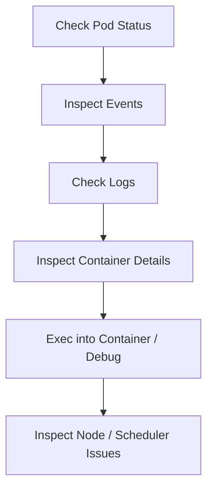

Excellent 🔥 — you’re about to complete the **Pod Administration** module with the final doc:

# 🧯 Kubernetes Pods 106 — Debugging, Troubleshooting & Recovery Techniques

> 🎯 **Goal:** Learn how to investigate, debug, and recover broken Pods like a real cluster admin — using logs, events, ephemeral containers, and practical commands.

---

<div align="center" style="background-color:#fff; border-radius: 2px; border: 2px solid">
  
</div>

---

## 🧠 1. The Pod Lifecycle (Quick Recap)

Pods go through these **phases**:

```
Pending → Running → Succeeded / Failed / Unknown
```

Each container in a Pod has its own **state**:

* **Waiting**: Container is preparing (pulling image, waiting for resources)
* **Running**: Actively running
* **Terminated**: Completed or failed
* **CrashLoopBackOff**: Container keeps restarting

---

## 🧩 2. Step-by-Step Troubleshooting Workflow

When a Pod misbehaves, always follow this sequence:



Let’s break these steps down 👇

---

## 🧱 3. Step 1 — Check Pod Status

```bash
kubectl get pods -A -o wide
```

Focus on:

* **STATUS** → Pending, CrashLoopBackOff, Error
* **READY** → e.g., `1/2` means 1 container is running, 1 failed
* **RESTARTS** → High restart count = unstable container

---

### Example Output

```
NAME           READY   STATUS             RESTARTS   AGE
nginx-demo     0/1     CrashLoopBackOff   4          2m
```

Next → describe it 👇

---

## 🧱 4. Step 2 — Describe the Pod (See Events)

```bash
kubectl describe pod nginx-demo
```

Scroll to bottom for **Events**:

```
Events:
  Type     Reason     Message
  ----     ------     -------
  Normal   Scheduled  Successfully assigned default/nginx-demo to node-1
  Normal   Pulling    Pulling image "nginx"
  Warning  Failed     Error: CrashLoopBackOff
```

### Common Event Reasons:

| Reason                 | Description                              |
| ---------------------- | ---------------------------------------- |
| `ImagePullBackOff`     | Image not found or authentication failed |
| `CrashLoopBackOff`     | App crashed repeatedly                   |
| `ErrImagePull`         | Bad image name or registry               |
| `OOMKilled`            | Memory limit exceeded                    |
| `CreateContainerError` | Bad volume or env setup                  |

---

## 🧱 5. Step 3 — Inspect Logs

```bash
kubectl logs nginx-demo
```

If multi-container Pod:

```bash
kubectl logs nginx-demo -c <container-name>
```

View previous crash logs:

```bash
kubectl logs nginx-demo -p
```

---

### Example:

```
Error: Port 8080 already in use
```

→ App conflict or duplicate process.

---

## 🧰 6. Step 4 — Get Inside the Pod (Exec Shell)

```bash
kubectl exec -it nginx-demo -- /bin/bash
# or for alpine/busybox
kubectl exec -it nginx-demo -- sh
```

✅ Check running processes, environment, and configs:

```bash
ps aux
env
ls /etc/config
```

---

### Quick Fix Example:

```
kubectl exec -it nginx-demo -- sed -i 's/8080/80/g' /etc/nginx/conf.d/default.conf
```

---

## 🧱 7. Step 5 — Pod Not Starting (Image or Config Issues)

### 🔍 Check Image Pull

```bash
kubectl describe pod <pod> | grep -A3 "Failed"
```

Errors like:

```
Failed to pull image "myapp:v2": image not found
```

✅ Fix by updating image:

```bash
kubectl set image pod/myapp myapp=repo/myapp:latest
```

---

### 🔍 Check Environment Variables

```bash
kubectl exec -it <pod> -- printenv
```

Or YAML:

```bash
kubectl get pod <pod> -o yaml | grep -A5 env:
```

---

### 🔍 Check Volume Mounts

```bash
kubectl describe pod <pod> | grep -A3 Mounts
```

If mount path missing → verify PVC:

```bash
kubectl get pvc
kubectl describe pvc <name>
```

---

## 🧠 8. Step 6 — Troubleshooting Stuck or Pending Pods

```bash
kubectl describe pod <pod> | grep -A5 Events
```

Typical errors:

* `0/3 nodes available: 3 Insufficient memory`
* `node(s) didn't match node selector`
* `node(s) had taints that the pod didn't tolerate`

✅ Fix by adjusting:

* resource requests
* node selectors
* tolerations

---

## 🧰 9. Debugging CrashLoopBackOff

CrashLoopBackOff = Container starts, crashes, restarts repeatedly.

### Analyze:

```bash
kubectl logs <pod> -p
```

If app bug → fix container or startup script.
If config issue → verify readiness/liveness probes.

---

### Check restart count

```bash
kubectl get pods
```

If increasing rapidly → CrashLoopBackOff confirmed.

---

### Restart behavior:

Pods controlled by Deployments auto-recreate — deleting won’t help.
Better approach:

```bash
kubectl rollout restart deployment <name>
```

---

## 🧩 10. Step 7 — Use `kubectl debug` (Ephemeral Containers)

Ephemeral containers allow debugging **without modifying the Pod**.
Perfect for troubleshooting production Pods.

### Example:

```bash
kubectl debug -it <pod> --image=busybox --target=<container-name>
```

✅ This launches a **temporary shell container** inside the Pod network namespace.

Inside:

```bash
ps aux
netstat -tulpn
```

Exit → ephemeral container auto-deletes.

---

## 🧱 11. Step 8 — Network Troubleshooting

If Pod can’t reach another service:

```bash
kubectl exec -it <pod> -- curl <svc-name>:<port>
```

If fails:
1️⃣ Check Service and Endpoints:

```bash
kubectl get svc <svc-name>
kubectl get endpoints <svc-name>
```

2️⃣ If Endpoints = `<none>` → backing Pods not Ready.
Check selectors:

```bash
kubectl get pods -l <label>
```

3️⃣ Test DNS:

```bash
kubectl exec -it <pod> -- nslookup <svc-name>
```

---

## 🧩 12. Step 9 — Pod Stuck in Terminating State

Common causes:

* Finalizers not cleared
* Mounted PVC busy
* Network connection hanging

Force delete:

```bash
kubectl delete pod <pod> --grace-period=0 --force
```

---

## 🧠 13. Step 10 — Pod Evicted by Node Pressure

Check status:

```bash
kubectl get pods --field-selector=status.phase=Failed
kubectl describe pod <name>
```

Look for:

```
The node was low on resource: memory.
```

✅ Fix: increase node memory or use higher QoS class.
🧩 Evicted pods are **not restarted** — controller (e.g. Deployment) must recreate.

---

## 🧱 14. Step 11 — Init Containers Debugging

Init containers run **before** app containers to prepare environment.
If one fails → main container never starts.

View init container logs:

```bash
kubectl logs <pod> -c <init-container-name>
```

Check status:

```bash
kubectl get pod <pod> -o jsonpath='{.status.initContainerStatuses[*].state}'
```

---

## 🧩 15. Step 12 — Liveness & Readiness Probe Failures

Liveness probes control **restart** behavior.
Readiness probes control **traffic acceptance**.

Check failures:

```bash
kubectl describe pod <pod> | grep -A5 "Liveness probe failed"
```

Example YAML:

```yaml
livenessProbe:
  httpGet:
    path: /health
    port: 8080
  initialDelaySeconds: 5
  periodSeconds: 10
```

✅ If probe misconfigured → app keeps restarting unnecessarily.

---

## 🧩 16. Step 13 — Resource Problems (OOMKilled, Throttling)

```bash
kubectl describe pod <pod> | grep -i "OOMKilled"
```

Memory limit exceeded → container killed.

For CPU:

```bash
kubectl top pod
```

Throttling visible in metrics.

Fix:

* Adjust resource limits
* Use QoS class `Guaranteed` for critical pods

---

## 🧱 17. Step 14 — Node-Level Problems

If all pods pending or failing:

```bash
kubectl get nodes
kubectl describe node <node>
```

Look for:

* DiskPressure
* MemoryPressure
* NetworkUnavailable

Fix by:

```bash
kubectl cordon <node>
kubectl drain <node> --ignore-daemonsets
```

Then investigate system logs.

---

## 🧰 18. Advanced Admin Commands Summary

| Task                  | Command                                             |                 |
| --------------------- | --------------------------------------------------- | --------------- |
| Get logs              | `kubectl logs <pod>`                                |                 |
| Get previous logs     | `kubectl logs -p <pod>`                             |                 |
| Describe pod          | `kubectl describe pod <pod>`                        |                 |
| Exec into container   | `kubectl exec -it <pod> -- bash`                    |                 |
| Attach to running pod | `kubectl attach <pod>`                              |                 |
| Debug ephemeral       | `kubectl debug -it <pod> --image=busybox`           |                 |
| Delete forcefully     | `kubectl delete pod <pod> --force --grace-period=0` |                 |
| Check probes          | `kubectl get pod <pod> -o yaml                      | grep -A5 probe` |

---

## 🧠 19. Common Real-World Scenarios

| Symptom               | Root Cause                  | Fix                           |
| --------------------- | --------------------------- | ----------------------------- |
| `CrashLoopBackOff`    | App crash / probe failure   | Check logs, fix probe         |
| `ImagePullBackOff`    | Bad image name / auth issue | Fix image reference or secret |
| `OOMKilled`           | Memory limit exceeded       | Increase limits or optimize   |
| `PodPending`          | Scheduler constraints       | Fix selectors or taints       |
| `No route to host`    | CNI issue                   | Restart network plugin        |
| `Terminating forever` | Finalizer lock              | Force delete pod              |
| `Evicted`             | Node pressure               | Scale nodes or raise limits   |

---

## 🧭 20. Hands-On Admin Lab

1️⃣ Simulate crash:

```bash
kubectl run crashpod --image=busybox --restart=Never -- sh -c "exit 1"
```

Check:

```bash
kubectl get pods
kubectl describe pod crashpod
```

2️⃣ Debug DNS:

```bash
kubectl run dns-test --image=busybox:1.28 -it -- nslookup kubernetes.default
```

3️⃣ Add ephemeral debug:

```bash
kubectl debug -it crashpod --image=busybox --target=crashpod
```

4️⃣ Fix deployment crash:

```bash
kubectl rollout restart deployment <name>
kubectl rollout status deployment <name>
```

---

## 🧩 21. Recovery Best Practices

| Area                          | Action                                        |
| ----------------------------- | --------------------------------------------- |
| **Always check Events first** | They tell the full story                      |
| **Avoid blind deletes**       | Use `rollout restart` instead                 |
| **Use probes carefully**      | Don’t make them too strict                    |
| **Monitor restarts**          | `kubectl get pods` frequently                 |
| **Keep a debug image handy**  | e.g. `nicolaka/netshoot`, `busybox`, `alpine` |

---

## ✅ Summary

| Concept           | You Can Now...                    |
| ----------------- | --------------------------------- |
| Pod Lifecycle     | Interpret every status            |
| Logs & Events     | Identify root causes quickly      |
| Ephemeral Debug   | Enter any Pod for inspection      |
| Resource Failures | Detect OOM, CPU throttling        |
| Node Issues       | Drain, isolate, and recover nodes |

---

## 🧭 Next Major Section

🎉 You’ve completed **Pod Administration (1–6)**
Next, we move to the **Workload Level** — starting with:

### 🚀 **Deployments 101 — Creating, Scaling & Managing Deployments**

It’ll cover:

* ReplicaSets management
* Rollouts, revisions, rollbacks
* Canary updates & blue/green patterns

Would you like me to start with **Deployments 101** next?
