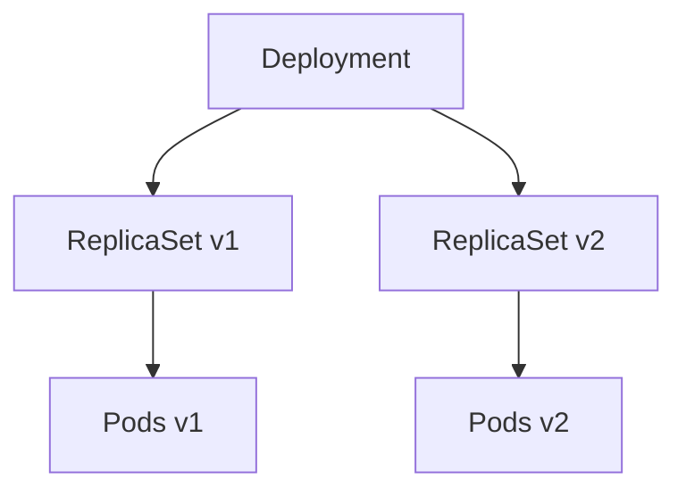

# ⚙️ Kubernetes ReplicaSets 101 — **Scaling & Consistency in Practice**

> 🎯 **Goal:** Understand how **ReplicaSets** ensure high availability and consistency for your Pods, how they’re managed via Deployments, and how to inspect, scale, and troubleshoot them.

---

## 📖 **What is a ReplicaSet?**

> 🧠 **Official Definition (Kubernetes Docs)**
> A **ReplicaSet (RS)** ensures that a specified number of Pod replicas are running at any given time.

Think of it as:

> 🧍‍♂️“I want 3 identical Pods running — no more, no less.”

If one crashes → ReplicaSet creates a new one.
If one is added manually → ReplicaSet deletes the extra one.

---

## 🫀 **Anatomy of a ReplicaSet**

A ReplicaSet YAML typically looks like this 👇

```yaml
apiVersion: apps/v1
kind: ReplicaSet
metadata:
  name: nginx-rs
spec:
  replicas: 3
  selector:
    matchLabels:
      app: nginx
  template:
    metadata:
      labels:
        app: nginx
    spec:
      containers:
        - name: nginx
          image: nginx:latest
          ports:
            - containerPort: 80
```

---

### 💡 Breakdown

| Field             | Description                                                     |
| ----------------- | --------------------------------------------------------------- |
| `replicas`        | Desired number of Pod instances                                 |
| `selector`        | Label query that identifies Pods managed by this RS             |
| `template`        | Pod template used to create new Pods                            |
| `metadata.labels` | Must match the selector; otherwise, RS won’t recognize its Pods |

---

### 🧠 Tip — Label Matching Is Everything

If labels in `template.metadata.labels` don’t match the `selector.matchLabels`,  
👉 ReplicaSet won’t manage any Pods.

Example mismatch:

```yaml
selector:
  matchLabels:
    app: nginx
template:
  metadata:
    labels:
      app: apache
```

❌ Result: RS creates Pods, but never marks them as owned — they become **orphans**.

---

## ⁉️ **How ReplicaSets Maintain Consistency**

ReplicaSets continuously **compare desired vs current** state:

| State             | Action Taken         |
| ----------------- | -------------------- |
| Desired > Current | Creates missing Pods |
| Desired < Current | Deletes extra Pods   |
| Desired = Current | No action needed     |

They reconcile automatically every few seconds.

---

### 🔍 Example in Action

```bash
kubectl apply -f nginx-rs.yaml
kubectl get rs,pods
```

Output:

```ini
NAME              DESIRED   CURRENT   READY
rs/nginx-rs       3         3         3
```

Now delete one Pod:

```bash
kubectl delete pod <pod-name>
```

✅ Within seconds:

```ini
kubectl get pods
# New Pod appears → ReplicaSet self-healed
```

---

## ⚖️ **Scaling ReplicaSets**

### ⬆️ Scale Up

```bash
kubectl scale rs nginx-rs --replicas=5
```

→ Adds 2 more Pods.

### ⬇️ Scale Down

```bash
kubectl scale rs nginx-rs --replicas=2
```

→ Terminates 3rd Pod gracefully.

---

### YAML Method

Update `.spec.replicas` and reapply:

```bash
kubectl apply -f nginx-rs.yaml
```

---

### Auto Scaling (via HPA)

You can attach a **Horizontal Pod Autoscaler**:

```bash
kubectl autoscale rs nginx-rs --min=2 --max=6 --cpu-percent=70
```

This automatically adjusts replicas based on CPU usage.

---

## 🧭 **Understanding Adoption & Orphaning**

ReplicaSets use **label selectors** to decide ownership.

### ✅ Adoption

If you manually create a Pod with matching labels:

```yaml
metadata:
  labels:
    app: nginx
```

The RS will **adopt** it automatically.

---

### ❌ Orphaning

If you change a ReplicaSet’s selector:

```yaml
selector:
  matchLabels:
    app: web
```

All old Pods (`app: nginx`) become **orphans** — not deleted or managed.

> 🚨 Kubernetes intentionally does **not** delete orphaned Pods to prevent accidental data loss.

---

### 🔍 Check Relationships

```bash
kubectl get rs -o wide
kubectl get pods --show-labels
```

Find owner reference:

```bash
kubectl get pod <pod> -o jsonpath='{.metadata.ownerReferences[0].kind}'
# Output: ReplicaSet
```

---

## 🧬 **Relationship Between ReplicaSets & Deployments**

ReplicaSets don’t handle rolling updates by themselves — that’s what **Deployments** do.  
Deployments use ReplicaSets **under the hood** to manage versions safely.

<div align="center" style="background-color: #141a19ff;color: #a8a5a5ff; border-radius: 10px; border: 2px solid">



</div>

---

When you update a Deployment:

- It creates a **new ReplicaSet** for the new Pod template.
- Gradually scales new RS up and old RS down (controlled by rollout strategy).

---

### 🔍 View All ReplicaSets of a Deployment

```bash
kubectl get rs -l app=nginx
kubectl describe deployment nginx-deploy
```

Shows both active and old RS (used for rollback).

---

## ⚙️ **Surge and Availability Basics** (from Deployments)

When using a Deployment, **ReplicaSets** are affected by rollout parameters:

```yaml
strategy:
  type: RollingUpdate
  rollingUpdate:
    maxSurge: 1
    maxUnavailable: 1
```

| Term             | Meaning                                            |
| ---------------- | -------------------------------------------------- |
| `maxSurge`       | How many **extra** Pods can be created temporarily |
| `maxUnavailable` | How many can be **down** during update             |

ReplicaSets cooperate:

- New RS scales up by `maxSurge` Pods
- Old RS scales down to keep total count consistent

---

## 🧰 **Key Commands Cheat Sheet**

| Purpose              | Command                                  |
| -------------------- | ---------------------------------------- |
| Create ReplicaSet    | `kubectl apply -f rs.yaml`               |
| List RS              | `kubectl get rs`                         |
| List RS with details | `kubectl get rs -o wide`                 |
| Describe RS          | `kubectl describe rs <name>`             |
| Scale RS             | `kubectl scale rs <name> --replicas=5`   |
| Delete RS            | `kubectl delete rs <name>`               |
| View Pods & owners   | `kubectl get pods -o wide --show-labels` |

---

## 💭 **Real Admin Scenario** — Recovering a Mismatched ReplicaSet

**Problem:** Pods created, but ReplicaSet shows `0 current replicas`.

### 🕵️ Step-by-step fix:

1️⃣ Check labels:

```bash
kubectl get rs nginx-rs -o jsonpath='{.spec.selector.matchLabels}'
kubectl get pods --show-labels
```

2️⃣ If labels don’t match → edit RS:

```bash
kubectl edit rs nginx-rs
```

3️⃣ Ensure:

```yaml
selector:
  matchLabels:
    app: nginx
template:
  metadata:
    labels:
      app: nginx
```

4️⃣ Verify:

```bash
kubectl get rs,pods
```

✅ ReplicaSet now owns Pods correctly.

---

## ✅ **Best Practices**

| Area                    | Recommendation                                            |
| ----------------------- | --------------------------------------------------------- |
| **Direct RS Usage**     | Only for stateless Pods with no rollout needs             |
| **Preferred Usage**     | Always use **Deployments** — they manage RS automatically |
| **Label Hygiene**       | Keep labels simple and consistent (`app`, `tier`, `env`)  |
| **Immutable Selectors** | Never edit `.spec.selector` post-creation                 |
| **Scaling**             | Use HPA or Deployments for dynamic workloads              |
| **Versioning**          | Let Deployments create multiple RS for version tracking   |

---

## 🏁 **Summary**

| Concept              | Key Takeaway                            |
| -------------------- | --------------------------------------- |
| ReplicaSet           | Ensures fixed number of Pods run        |
| Selector             | Determines ownership via labels         |
| Scaling              | Manual or auto via HPA                  |
| Adoption/Orphaning   | Dynamically attaches or detaches Pods   |
| Deployments          | Use RS to perform controlled rollouts   |
| Surge & Availability | Govern how RS transition during updates |
