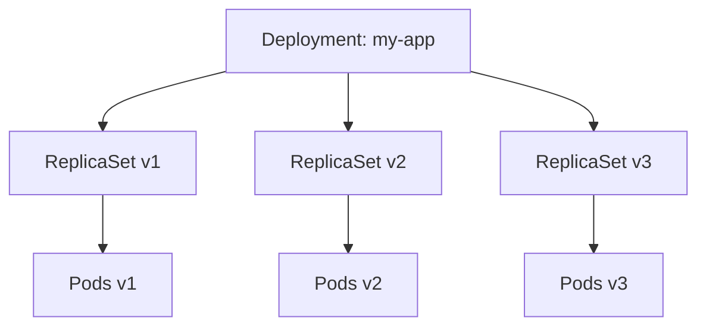

# 🕰️ Kubernetes Deployments 102 — **Rollbacks, History & Versioning**

> 🎯 **Goal:** Learn how Kubernetes tracks rollout history, manages versioned ReplicaSets, safely rolls back failed updates, and uses annotations for release traceability.

---

## 🛟 **The Deployment Lifecycle** — Version by Version

Each time you modify a Deployment’s **Pod template** (like image, env vars, or command),
Kubernetes automatically creates a **new ReplicaSet** — this forms a versioned rollout history.

<div align="center" style="background-color: #141a19ff;color: #a8a5a5ff; border-radius: 10px; border: 2px solid">



## </div>

> 💡 Each ReplicaSet = a snapshot of your app’s configuration at that time.

---

### 🔹 Example in Practice

1️⃣ Create a Deployment:

```bash
kubectl create deployment web --image=nginx:1.25 --replicas=3
```

2️⃣ Update image (new version):

```bash
kubectl set image deployment web nginx=nginx:1.26
```

3️⃣ Update again:

```bash
kubectl set image deployment web nginx=nginx:1.27
```

Now your cluster has:

```bash
kubectl get rs -l app=web
```

```ini
NAME                 DESIRED   CURRENT   READY   AGE
web-5b7d4f4c88       0         0         0      10m
web-756d6d9f8c       0         0         0      5m
web-6f9d88b66b       3         3         3      1m
```

✅ Only one active RS, but previous ones are retained for rollback.

---

## 🧭 **Viewing Deployment Rollout History**

### 🧩 Show history

```bash
kubectl rollout history deployment web
```

Output:

```ini
deployment.apps/web
REVISION  CHANGE-CAUSE
1         <none>
2         Image updated to nginx:1.26
3         Image updated to nginx:1.27
```

---

### 🧩 Show specific revision

```bash
kubectl rollout history deployment web --revision=2
```

Output:

```ini
deployment.apps/web with revision #2
Pod Template:
  Labels: app=web
  Containers:
    nginx:
      Image: nginx:1.26
```

---

## 🏷️ **Annotating for Traceability**

By default, Kubernetes tracks changes but doesn’t store your intent.
You can use **annotations** to document _why_ a rollout happened.

### Add annotation on update

```bash
kubectl annotate deployment web kubernetes.io/change-cause="Upgraded to nginx:1.27 for performance test"
```

Now:

```bash
kubectl rollout history deployment web
```

```ini
REVISION  CHANGE-CAUSE
1         initial version
2         Upgraded to nginx:1.27 for performance test
```

✅ Perfect for audit trails and CI/CD pipeline integration.

---

## 🔙 **Rolling Back to Previous Versions**

If something breaks after an update —
Kubernetes lets you **rollback instantly** using its internal history.

### 🔹 Step 1 — Detect a bad rollout

```bash
kubectl rollout status deployment web
```

If stuck:

```ini
Waiting for rollout to finish: 1 old replica(s) are pending termination...
```

---

### 🔹 Step 2 — Rollback

```bash
kubectl rollout undo deployment web
```

✅ Automatically rolls back to the **previous stable ReplicaSet**.

---

### 🔹 Rollback to a specific revision

```bash
kubectl rollout undo deployment web --to-revision=2
```

---

### 🔹 Verify

```bash
kubectl rollout history deployment web
kubectl rollout status deployment web
```

You’ll see the new rollout revert to that image version.

---

## ⚙️ **How Kubernetes Manages Revision History**

Deployments store a configurable number of old ReplicaSets using:

```yaml
spec:
  revisionHistoryLimit: 3
```

That means only the **3 most recent** revisions are kept; older ones get deleted.

---

### 🧠 Tip:

Keep this limit **low (2–5)** for production to save memory,
but **higher (10–20)** in dev/test environments for debugging.

---

## 🔴 **Rollout Failure Detection** (and Automatic Timeout)

Kubernetes uses:

```yaml
spec:
  progressDeadlineSeconds: 600
```

to decide when a rollout has failed (default 10 minutes).

If rollout exceeds this time:

```ini
ProgressDeadlineExceeded
```

You’ll see:

```bash
kubectl describe deployment web
```

```ini
Type     Reason                   Message
----     ------                   -------
Progressing   ProgressDeadlineExceeded   ReplicaSet "web-6f9d88b66b" has timed out
```

---

### 🧩 Manual Recovery

1️⃣ Pause rollout:

```bash
kubectl rollout pause deployment web
```

2️⃣ Fix problem (e.g., revert image or fix probes).

3️⃣ Resume:

```bash
kubectl rollout resume deployment web
```

4️⃣ Optionally rollback:

```bash
kubectl rollout undo deployment web
```

---

## 🤔 **What Causes Rollouts to Fail?**

<div align="center" style="background-color: #141a19ff;color: #a8a5a5ff; border-radius: 10px; border: 2px solid">

| Problem                    | Description                                  | Fix                               |
| -------------------------- | -------------------------------------------- | --------------------------------- |
| **Bad container image**    | Tag doesn’t exist or imagePullBackOff        | Fix image tag / registry secret   |
| **Failing probes**         | Readiness/liveness failing during update     | Adjust probe thresholds           |
| **Insufficient resources** | Node can’t schedule new Pods                 | Add nodes or adjust requests      |
| **Stuck old Pods**         | Deployment waiting for old Pods to terminate | Check finalizers / network delays |
| **Paused deployment**      | Accidentally paused rollout                  | Resume manually                   |

</div>

---

## 🧑🏻‍💻 **Version Verification Commands**

<div align="center" style="background-color: #141a19ff;color: #a8a5a5ff; border-radius: 10px; border: 2px solid">

| Task                     | Command                                                                              |
| ------------------------ | ------------------------------------------------------------------------------------ |
| Check current image      | `kubectl get deployment web -o=jsonpath='{.spec.template.spec.containers[0].image}'` |
| List ReplicaSets         | `kubectl get rs -l app=web`                                                          |
| View rollback candidates | `kubectl rollout history deployment web`                                             |
| Confirm active RS        | `kubectl describe deploy web \| grep "NewReplicaSet"`                                |

</div>

---

## ♾️ **Safe Rollback Patterns** (Used in Real CI/CD)

### 🧠 Pattern #1: **Pause & Verify**

1. Update image:

   ```bash
   kubectl set image deploy web nginx=nginx:1.28
   ```

2. Pause rollout:

   ```bash
   kubectl rollout pause deploy web
   ```

3. Verify logs, readiness, metrics.
4. Resume if stable:

   ```bash
   kubectl rollout resume deploy web
   ```

---

### 🧠 Pattern #2: **Staged Rollback Window**

If your pipeline detects degraded performance within X minutes, rollback automatically:

```bash
kubectl rollout undo deploy web
```

Integrate this logic with CI/CD (e.g., Argo CD, GitHub Actions).

---

### 🧠 Pattern #3: **Manual Canary with Revert**

Use two Deployments (v1 stable, v2 new).
If v2 metrics degrade — delete it:

```bash
kubectl delete deployment web-v2
```

✅ Immediate rollback to v1 since the Service routes traffic to healthy Pods.

---

## ⚖️ **Pro Tips for Release Traceability**

<div align="center" style="background-color: #141a19ff;color: #a8a5a5ff; border-radius: 10px; border: 2px solid">

| Practice                             | Why it Helps                                 |
| ------------------------------------ | -------------------------------------------- |
| **Use annotations** (`change-cause`) | Tracks the reason for each release           |
| **Tag images semantically**          | Helps match RS version ↔ Git commit          |
| **Integrate with GitOps tools**      | Argo CD or Flux automatically track rollback |
| **Export rollout history**           | Auditing or postmortem analysis              |
| **Automate rollback in CI/CD**       | Auto-detect failures → revert safely         |

## </div>

## 🧑🏻‍💻 **Admin Checklist for Healthy Rollouts**

✅ `kubectl get deploy` → All available = True  
✅ `kubectl rollout status` → Success within progressDeadline  
✅ `kubectl get rs` → Old RS scaled to 0  
✅ `kubectl describe deploy` → No `ProgressDeadlineExceeded`  
✅ `kubectl logs` → Containers running smoothly  
✅ `kubectl rollout history` → Clear annotated history

---

## ✍🏻 **Example: Full Rollout + Rollback Demo**

1️⃣ Create Deployment

```bash
kubectl create deployment demo --image=nginx:1.25
```

2️⃣ Update Image

```bash
kubectl set image deployment demo nginx=nginx:1.26
```

3️⃣ Verify Rollout

```bash
kubectl rollout status deployment demo
```

4️⃣ Annotate

```bash
kubectl annotate deployment demo kubernetes.io/change-cause="Update to nginx:1.26"
```

5️⃣ Rollback to previous

```bash
kubectl rollout undo deployment demo
```

6️⃣ Check History

```bash
kubectl rollout history deployment demo
```

✅ You’ve now gone full circle — deploy → update → rollback.

---

## ✅ **Summary**

<div align="center" style="background-color: #141a19ff;color: #a8a5a5ff; border-radius: 10px; border: 2px solid">

| Concept                 | Takeaway                                |
| ----------------------- | --------------------------------------- |
| Deployment revisions    | Managed via ReplicaSets                 |
| History tracking        | Each Pod template change = new revision |
| Rollback                | Use `rollout undo`                      |
| Revision limits         | Control with `revisionHistoryLimit`     |
| Change-cause annotation | Essential for audits                    |
| Safe rollback           | Pause, verify, then revert              |

</div>
