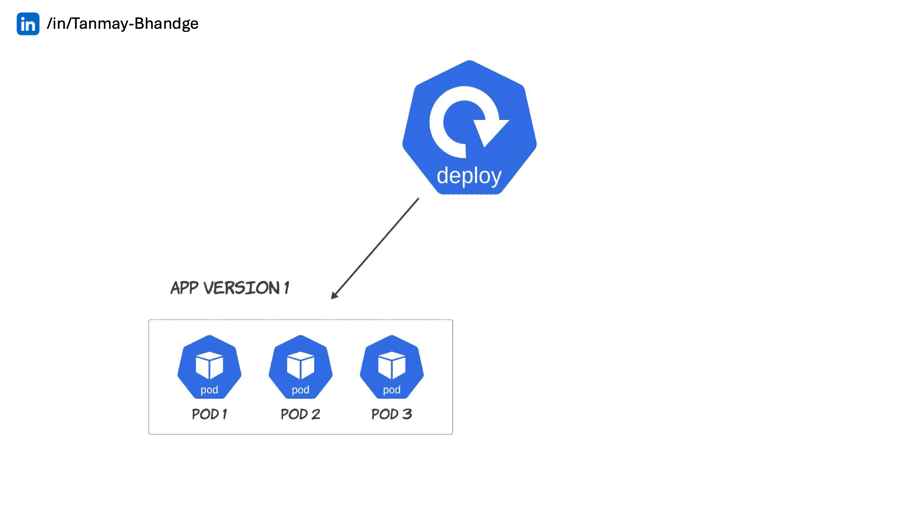
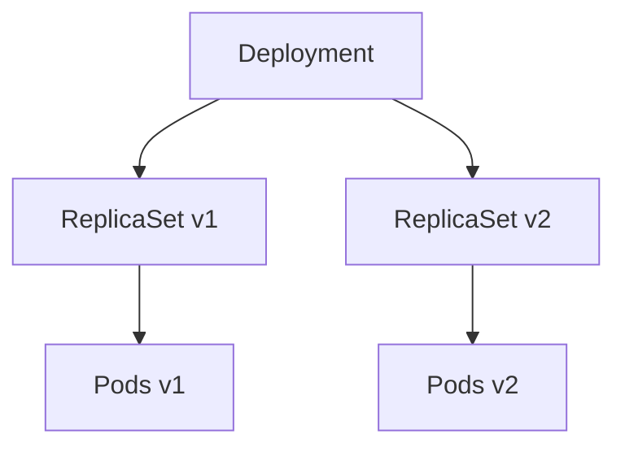

# 🚀 Kubernetes Deployments 101 — **Spec, Strategy & Rollout Control**

> 🎯 **Goal:** Understand the Deployment object, its structure, rollout strategies (especially `RollingUpdate`), how to control versioned rollouts, pause/resume updates, and perform safe canary-like releases using multiple Deployments.

---

## 📖 **What is a Deployment?**

> **A Deployment** is a **controller** that manages ReplicaSets and ensures the desired state of your Pods — handling rollouts, rollbacks, and scaling automatically.

It’s like the **project manager** supervising multiple ReplicaSets (each representing a version of your app).

---

### 🧠 Analogy

Imagine you’re running a pizza chain 🍕.

- **ReplicaSets** = the kitchen teams (each handles a specific recipe version).
- **Deployment** = the operations manager ensuring customers get consistent pizza, updating recipes smoothly, and retiring old versions safely.

---

## 🫀 **Deployment Anatomy** (YAML Spec)

Here’s a simple example 👇

```yaml
apiVersion: apps/v1
kind: Deployment
metadata:
  name: nginx-deploy
spec:
  replicas: 3
  selector:
    matchLabels:
      app: nginx
  strategy:
    type: RollingUpdate
    rollingUpdate:
      maxUnavailable: 1
      maxSurge: 1
  template:
    metadata:
      labels:
        app: nginx
    spec:
      containers:
        - name: nginx
          image: nginx:1.25
          ports:
            - containerPort: 80
```

---

### 🧩 Breakdown

<div align="center" style="background-color: #141a19ff;color: #a8a5a5ff; border-radius: 10px; border: 2px solid">

| Field                          | Description                                              |
| ------------------------------ | -------------------------------------------------------- |
| `replicas`                     | Desired number of Pods                                   |
| `selector`                     | Label match for Pods under this Deployment               |
| `template`                     | Pod definition (same as ReplicaSet’s)                    |
| `strategy`                     | Defines how Pods are updated (Rolling or Recreate)       |
| `rollingUpdate.maxUnavailable` | Max Pods that can be **unavailable** during update       |
| `rollingUpdate.maxSurge`       | Max extra Pods (above desired count) temporarily allowed |

</div>

---

## 🧠 **Strategy Types**

### 🔹 **RollingUpdate** (default)

- Gradually replaces old Pods with new ones.
- Maintains availability during rollout.
- Controlled by `maxUnavailable` and `maxSurge`.

<div align="center" style="background-color:#fff; border-radius: 10px; border: 2px solid;margin: 0 30px">
  
</div>

- Example behavior (for 3 replicas):

  ```yaml
  strategy:
  type: RollingUpdate
  rollingUpdate:
  maxUnavailable: 1
  maxSurge: 1
  ```

  | Step   | Old Pods | New Pods | Notes                   |
  | ------ | -------- | -------- | ----------------------- |
  | Start  | 3        | 0        | Initial state           |
  | Step 1 | 2        | 1        | One new Pod created     |
  | Step 2 | 1        | 2        | Another new Pod created |
  | Step 3 | 0        | 3        | Old Pods removed        |

> ✅ Keeps service up during updates.

---

### 🔸 **Recreate**

- Deletes all old Pods **before** creating new ones.
- Used when old and new versions **cannot coexist** (e.g., schema changes).

<div align="center" style="background-color:#fff; border-radius: 10px; border: 2px solid;margin: 0 30px">
  
</div>

- Example:

  ```yaml
  strategy:
  type: Recreate
  ```

> ⚠️ Causes downtime, so avoid for production unless absolutely necessary.

---

## ⚙️ **How Rolling Updates Actually Work**

When you change a Deployment (for example, update the image):

```bash
kubectl set image deployment nginx-deploy nginx=nginx:1.26
```

Kubernetes automatically:

1. Creates a **new ReplicaSet** with the new Pod template.
2. Gradually scales the new RS up.
3. Gradually scales the old RS down.
4. Deletes the old RS once rollout completes.

---

### 🧠 Internally:

<div align="center" style="background-color: #141a19ff;color: #a8a5a5ff; border-radius: 10px; border: 2px solid">



</div>

Deployment orchestrates RS transitions to achieve zero downtime.

---

## 🎮 **Controlling Rollouts in Real Time**

### 🧩 Check Rollout Status

```bash
kubectl rollout status deployment nginx-deploy
```

```ini
Waiting for deployment "nginx-deploy" rollout to finish: 2 out of 3 new replicas have been updated...
deployment "nginx-deploy" successfully rolled out
```

---

### 🧩 View Details

```bash
kubectl get deployment nginx-deploy
kubectl describe deployment nginx-deploy
```

Check `Conditions:` section for progress.

---

### 🧩 Pause and Resume Rollouts

Pause midway (for testing or manual verification):

```bash
kubectl rollout pause deployment nginx-deploy
```

Resume later:

```bash
kubectl rollout resume deployment nginx-deploy
```

---

### 🧩 Rollout Preview (Before Apply)

You can dry-run your update:

```bash
kubectl apply -f nginx-deploy.yaml --dry-run=client
```

---

## 🐦 **Canary-ish Rollouts** (Using Multiple Deployments)

Kubernetes doesn’t have built-in "canary" strategy (yet),
but you can simulate it using **two Deployments** behind a single Service.

---

### Example Setup:

| Component         | Purpose                   |
| ----------------- | ------------------------- |
| `nginx-deploy-v1` | Stable production version |
| `nginx-deploy-v2` | New canary version        |

**Service YAML:**

```yaml
apiVersion: v1
kind: Service
metadata:
  name: nginx-service
spec:
  selector:
    app: nginx
  ports:
    - port: 80
      targetPort: 80
```

**Deployments (v1 & v2):**

```yaml
# v1
apiVersion: apps/v1
kind: Deployment
metadata:
  name: nginx-v1
spec:
  replicas: 3
  selector:
    matchLabels:
      app: nginx
      version: v1
  template:
    metadata:
      labels:
        app: nginx
        version: v1
    spec:
      containers:
        - name: nginx
          image: nginx:1.25
---
# v2
apiVersion: apps/v1
kind: Deployment
metadata:
  name: nginx-v2
spec:
  replicas: 1
  selector:
    matchLabels:
      app: nginx
      version: v2
  template:
    metadata:
      labels:
        app: nginx
        version: v2
    spec:
      containers:
        - name: nginx
          image: nginx:1.26
```

Since both use `app: nginx`,
the **Service** load balances across both — effectively a canary rollout.

---

### 🧮 Gradual Traffic Shifting (Manually)

- Start with 1 replica of v2 (≈25% traffic)
- Monitor logs / metrics
- Scale up v2, scale down v1

```bash
kubectl scale deployment nginx-v2 --replicas=3
kubectl scale deployment nginx-v1 --replicas=1
```

✅ Full control without downtime.

---

## 🔞 **Advanced Rollout Tuning: Surge & Availability**

These two parameters define **how aggressive** or **safe** your rolling updates are.

| Field            | Description                                            |
| ---------------- | ------------------------------------------------------ |
| `maxUnavailable` | Number (or %) of Pods allowed to be down during update |
| `maxSurge`       | Number (or %) of **extra** Pods allowed temporarily    |

---

### Example: Aggressive Update (faster, less safe)

```yaml
rollingUpdate:
  maxUnavailable: 2
  maxSurge: 2
```

→ Up to 2 Pods can be down, and 2 extra can be created.

### Example: Conservative Update (safer)

```yaml
rollingUpdate:
  maxUnavailable: 0
  maxSurge: 1
```

→ Zero downtime guaranteed (always maintains full capacity).

---

## 🧑🏻‍💻 **Real Admin Commands Cheat Sheet**

<div align="center" style="background-color: #141a19ff;color: #a8a5a5ff; border-radius: 10px; border: 2px solid">

| Task                 | Command                                               |
| -------------------- | ----------------------------------------------------- |
| Create deployment    | `kubectl apply -f deploy.yaml`                        |
| List deployments     | `kubectl get deploy`                                  |
| Get rollout status   | `kubectl rollout status deploy <name>`                |
| Pause/resume rollout | `kubectl rollout pause/resume deploy <name>`          |
| Update image         | `kubectl set image deploy <name> <container>=<image>` |
| View rollout history | `kubectl rollout history deploy <name>`               |
| Undo rollout         | `kubectl rollout undo deploy <name>`                  |
| Scale deployment     | `kubectl scale deploy <name> --replicas=5`            |
| Delete deployment    | `kubectl delete deploy <name>`                        |

</div>

---

## ✍🏻 **Example: Controlled Image Rollout**

Start with:

```bash
kubectl create deployment web --image=nginx:1.25 --replicas=3
```

Update image:

```bash
kubectl set image deployment web nginx=nginx:1.26
```

Check rollout status:

```bash
kubectl rollout status deployment web
```

Pause if errors found:

```bash
kubectl rollout pause deployment web
```

Fix issue → resume rollout:

```bash
kubectl rollout resume deployment web
```

---

## ⚙️ **Internals: How Rollout Progress is Tracked**

Each Deployment has a **ProgressDeadlineSeconds** (default: 600s = 10min).
If a rollout doesn’t complete within this window → it’s marked as **failed**.

View in:

```bash
kubectl describe deployment <name>
```

Check `Conditions:`:

```ini
Progressing=True  Reason=NewReplicaSetAvailable
Available=True    Reason=MinimumReplicasAvailable
```

If Progressing=False → rollout stalled.

---

## ✅ **Best Practices** for Rollout Control

<div align="center" style="background-color: #141a19ff;color: #a8a5a5ff; border-radius: 10px; border: 2px solid">

| Area                        | Recommendation                                                |
| --------------------------- | ------------------------------------------------------------- |
| **Update Strategy**         | Stick with `RollingUpdate` unless migration forces `Recreate` |
| **maxUnavailable**          | Set to `0` for zero-downtime workloads                        |
| **maxSurge**                | 1 or 2 depending on capacity                                  |
| **Pause before production** | Use `kubectl rollout pause` for manual verification           |
| **Version tracking**        | Use image tags and Deployment annotations                     |
| **Avoid “latest” tag**      | Always pin exact image version for traceability               |

</div>

---

## 🏁 **Summary**

<div align="center" style="background-color: #141a19ff;color: #a8a5a5ff; border-radius: 10px; border: 2px solid">

| Concept             | Key Takeaway                                             |
| ------------------- | -------------------------------------------------------- |
| Deployment          | Manages ReplicaSets, automates rollouts                  |
| Strategy            | `RollingUpdate` (safe), `Recreate` (simple but downtime) |
| Surge / Unavailable | Controls rollout speed vs uptime                         |
| Pause / Resume      | Gives you manual control                                 |
| Canary-style        | Use multiple Deployments under one Service               |
| Image Updates       | Safe, progressive, observable                            |

</div>
