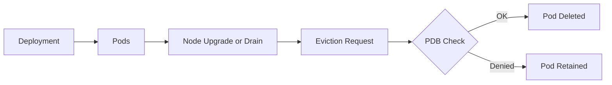

# ⚖️ Kubernetes Deployments 103 — **Scaling & Availability**

> 🎯 **Goal:** Learn how to scale Deployments safely (both manual and automatic), how Kubernetes maintains availability during scaling or upgrades, and how to use Pod Disruption Budgets (PDBs) to protect workloads during maintenance.

---

## 📖 **What “Scaling” Actually Means in Kubernetes**

Scaling simply means **changing the number of Pods** running under a Deployment.
Kubernetes gives you multiple ways to do this — **manually** or **automatically (HPA)**.

You can increase or decrease `replicas`, and the Deployment will automatically:

- Create new Pods (scale-out)
- Delete excess Pods (scale-in)

---

## 📈 **Scaling Options**

<div align="center" style="background-color: #141a19ff;color: #a8a5a5ff; border-radius: 10px; border: 2px solid">

| Type                   | Scope         | Description                              |
| ---------------------- | ------------- | ---------------------------------------- |
| **HPA**                | Pod count     | Adjusts replica count                    |
| **VPA**                | Pod resources | Adjusts CPU/memory requests/limits       |
| **Cluster Autoscaler** | Node count    | Adds/removes nodes based on pending Pods |

</div>

---

In production, you often combine all three:  
→ HPA for Pods,  
→ VPA for resources,  
→ Cluster Autoscaler for nodes.

---

## 🧑🏻‍💻 **Manual Scaling**

### 🔹 Change replica count via CLI

```bash
kubectl scale deployment web --replicas=5
```

Kubernetes creates 2 more Pods under the same ReplicaSet.
The change is **immediate**, and new Pods are distributed across nodes (based on the scheduler).

### 🔹 Update via YAML

```yaml
spec:
  replicas: 5
```

Apply it:

```bash
kubectl apply -f web-deploy.yaml
```

---

## 🤖 **Automatic Scaling — Horizontal Pod Autoscaler (HPA)**

HPA adjusts replicas automatically based on **real-time metrics** like CPU, memory, or custom app metrics.

---

### 🔹 Example

```bash
kubectl autoscale deployment web --min=2 --max=10 --cpu-percent=60
```

This means:

- Keep CPU utilization around 60%.
- Scale between 2 and 10 Pods dynamically.

---

### 🧠 How It Works

1️⃣ HPA periodically checks metrics from the **Metrics Server**.  
2️⃣ If average CPU > target → increases replicas.  
3️⃣ If CPU < target → decreases replicas.

---

### 🔍 View HPA in action

```bash
kubectl get hpa
```

Output:

```ini
NAME   REFERENCE         TARGETS   MINPODS   MAXPODS   REPLICAS   AGE
web    Deployment/web    85%/60%   2         10        5          10m
```

✅ Scales up and down automatically — without touching the Deployment spec manually.

---

### 🧠 Prerequisite:

Make sure **Metrics Server** is installed, otherwise HPA won’t have CPU/memory data.

```bash
kubectl top pods
```

If this fails → install Metrics Server.

---

## 🧭 **Ensuring High Availability During Rollouts**

Kubernetes maintains service availability even during updates by:

- Respecting `maxUnavailable` and `maxSurge` (from rollingUpdate strategy).
- Using **readiness probes** to only route traffic to ready Pods.
- Gradually replacing Pods instead of killing all at once.

---

### Example Setup for Zero Downtime

```yaml
strategy:
  type: RollingUpdate
  rollingUpdate:
    maxUnavailable: 0
    maxSurge: 1
```

This ensures:

- All old Pods are kept alive until new ones pass readiness.
- One extra Pod can temporarily run during rollout.

✅ Users never experience downtime.

---

## 🛡️ **Pod Disruption Budgets (PDBs)**

PDBs define how many Pods can be unavailable **during voluntary disruptions**,  
like node upgrades, draining, or cluster maintenance.

---

### 🔹 Example

```yaml
apiVersion: policy/v1
kind: PodDisruptionBudget
metadata:
  name: web-pdb
spec:
  minAvailable: 2
  selector:
    matchLabels:
      app: web
```

🧠 Meaning:  
During a node drain or upgrade, **at least 2 Pods** of this app must remain running.

---

### 🔹 Alternatives

You can use either:

```yaml
minAvailable: 2
```

or

```yaml
maxUnavailable: 1
```

but **not both** in the same PDB.

---

### 🔹 Check PDB Status

```bash
kubectl get pdb
```

```ini
NAME      MIN AVAILABLE   ALLOWED DISRUPTIONS   AGE
web-pdb   2               1                     2h
```

If `ALLOWED DISRUPTIONS = 0` → maintenance will be blocked until more Pods become available.

---

### 🔹 How it Works

<div align="center" style="background-color: #141a19ff;color: #a8a5a5ff; border-radius: 10px; border: 2px solid">



</div>

---

> ✅ Kubernetes refuses to evict a Pod if doing so would violate the PDB.

---

## ⚙️ **Surge vs Disruption** — Finding Balance

| Field            | Purpose                                                        | Tradeoff                |
| ---------------- | -------------------------------------------------------------- | ----------------------- |
| `maxSurge`       | Controls how many **extra Pods** you can launch during rollout | Consumes more resources |
| `maxUnavailable` | Controls how many Pods can be **down** during rollout          | Reduces availability    |

Best practice:

```ini
maxUnavailable: 0
maxSurge: 1
```

for zero-downtime, production-grade workloads.

---

## 🆕 **Upgrade Windows**

Large-scale clusters often define **upgrade windows** (periods during which rollouts are allowed).

For example:

- Allow rollouts only during business-off hours.
- Use `kubectl rollout pause` before patch windows.
- Resume with `kubectl rollout resume` after validation.

Some teams even automate rollout timing using **cron-based controllers or CI/CD conditions**.

---

## 🔍 **Diagnosing Scaling & Availability Issues**

<div align="center" style="background-color: #141a19ff;color: #a8a5a5ff; border-radius: 10px; border: 2px solid">

| Symptom                  | Possible Cause                | Fix                           |
| ------------------------ | ----------------------------- | ----------------------------- |
| Pods Pending             | No node resources or taints   | Add nodes or check scheduling |
| Pods CrashLooping        | Misconfigured liveness probe  | Tune probe settings           |
| Pods Unavailable         | Failing readiness probe       | Fix app startup delay         |
| Rollout slow             | Too strict `maxUnavailable=0` | Allow small surge margin      |
| Scaling not reacting     | Metrics Server missing        | Install metrics-server        |
| Pods all restart at once | Using Recreate strategy       | Switch to RollingUpdate       |

</div>

---

## ✅ **Best Practices**

| Area                  | Best Practice                           |
| --------------------- | --------------------------------------- |
| **Scaling**           | Use HPA for automatic load handling     |
| **PDB**               | Always define for production workloads  |
| **Availability**      | Set `maxUnavailable=0`, `maxSurge=1`    |
| **Probes**            | Ensure readiness before traffic routing |
| **Rollouts**          | Pause during business hours if risky    |
| **Resource planning** | Combine HPA + Cluster Autoscaler        |

---

## 🏁 **Summary**

| Concept              | Key Takeaway                                     |
| -------------------- | ------------------------------------------------ |
| Manual scaling       | Change replica count directly                    |
| HPA                  | Auto-scale Pods based on metrics                 |
| PDB                  | Protects against too many evictions              |
| Surge/unavailable    | Control rollout behavior                         |
| Upgrade windows      | Schedule safe updates                            |
| Combined autoscaling | HPA + VPA + Cluster Autoscaler = full elasticity |
