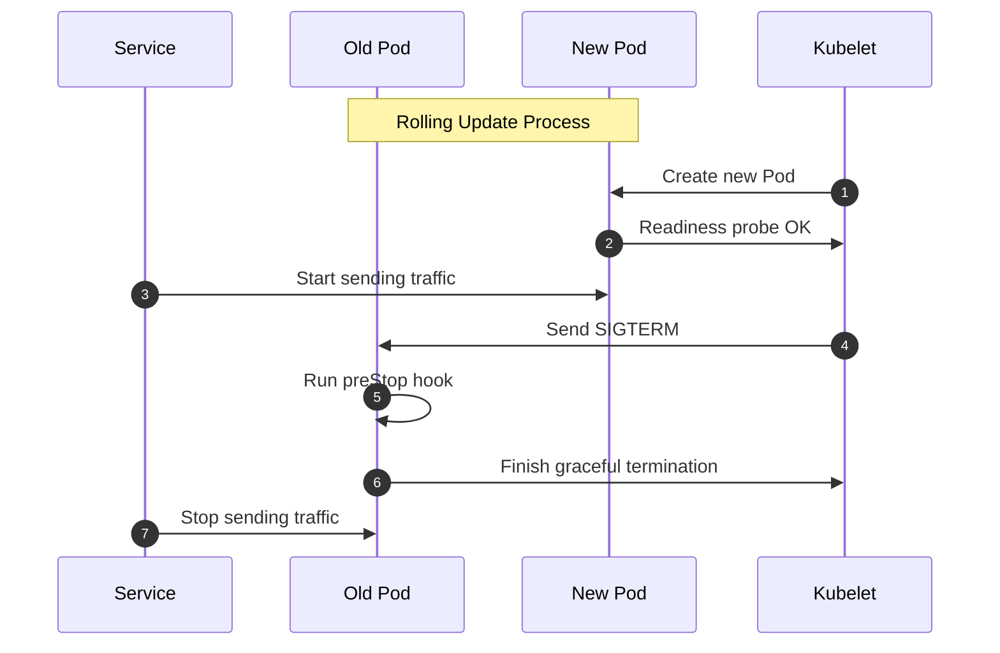

# 💫 Kubernetes Deployments 104 — **Zero-Downtime Patterns**

> 🎯 **Goal:** Learn how to perform rolling updates without disrupting live traffic using **readiness gates**, **preStop hooks**, **graceful termination**, and **connection draining** techniques.

---

## 📖 **What “Zero-Downtime” Means in Kubernetes**

Zero downtime means:

- No user requests fail during Pod replacement.
- Traffic switches **seamlessly** from old Pods to new ones.
- Load balancers and probes always see healthy endpoints.

To achieve this, Kubernetes coordinates **Pod lifecycle events** with:

- Readiness probes
- Termination grace periods
- PreStop hooks
- LoadBalancer/Ingress behavior

---

### 🧠 **Visual Overview**

<div align="center" style="background-color: #141a19ff;color: #a8a5a5ff; border-radius: 10px; border: 2px solid">



</div>

---

> ✅ Result: traffic drains smoothly, no 500s, no downtime.

---

## ⚙️ **Readiness Probes** — The Gatekeeper 🚪

**Readiness probes** tell Kubernetes when a Pod is _ready to serve requests_.

Kubernetes only routes traffic to Pods whose readiness probe succeeds.

---

### Example:

```yaml
readinessProbe:
  httpGet:
    path: /health
    port: 80
  initialDelaySeconds: 5
  periodSeconds: 10
```

Meaning:

- Wait 5 seconds after container starts.
- Then hit `/health` every 10 seconds.
- Mark Pod “Ready” once probe succeeds.

---

### 🧠 Behavior:

- When a Pod’s readiness fails → it’s removed from Service endpoints.
- When it passes again → traffic resumes.

This ensures only healthy Pods receive traffic.

---

## 👟 **Readiness Gates** — Custom Health Checks

Sometimes “ready” depends on **external conditions**, not just probes (e.g., ConfigMap sync, secret mounted, DB migration finished).

You can define **readiness gates** for those external signals.

---

### Example:

```yaml
spec:
  readinessGates:
    - conditionType: "app.kubernetes.io/dbReady"
```

Then your controller (or sidecar) must set this condition:

```bash
kubectl patch pod mypod -p '{"status":{"conditions":[{"type":"app.kubernetes.io/dbReady","status":"True"}]}}'
```

✅ The Pod won’t become “Ready” until **both**:

- All readiness probes succeed, and
- All readiness gates are True.

---

## 🧘 **PreStop Hook** — Graceful Exit Signal

When Kubernetes wants to delete a Pod (for rollout, scale-in, etc.):

1. Sends a `SIGTERM` signal to the container.
2. Waits for the **grace period** (default: 30s).
3. Then force-kills with `SIGKILL` if still running.

You can run cleanup logic before termination using **preStop hooks**.

---

### Example:

```yaml
lifecycle:
  preStop:
    exec:
      command: ["/bin/sh", "-c", "sleep 10"]
```

🧠 This delays Pod termination by 10s — giving load balancers time to stop sending traffic.

---

### Real Use Cases:

- Close DB connections.
- Flush in-memory cache.
- Finish active HTTP requests.

---

## ⏳ **Termination Grace Period** — The Safety Timer

Kubernetes gives Pods time to shut down gracefully.

Defined via:

```yaml
spec:
  terminationGracePeriodSeconds: 30
```

So when a Pod is deleted:  
1️⃣ Readiness → False (traffic stops).  
2️⃣ preStop hook runs.  
3️⃣ SIGTERM sent → Pod cleanup.  
4️⃣ After grace period → Pod killed if still running.

---

### Example Flow:

<div align="center" style="background-color: #141a19ff;color: #a8a5a5ff; border-radius: 10px; border: 2px solid">

| Step | Action                  | Behavior                 |
| ---- | ----------------------- | ------------------------ |
| 1    | SIGTERM sent            | App starts shutting down |
| 2    | preStop hook executes   | Graceful cleanup         |
| 3    | Pod readiness set False | LB stops routing         |
| 4    | Pod terminated          | Cleanup finished         |

</div>

---

## 💧 **LoadBalancer / Ingress Connection Draining**

Even if Kubernetes marks a Pod as “NotReady,” existing TCP connections may still exist.

To prevent traffic cuts:

- **LoadBalancer controllers (like NGINX, Traefik, AWS ELB)** support **connection draining**.
- They gracefully stop routing to removed Pods and wait for ongoing requests to finish.

---

### Example — NGINX Ingress Config:

```yaml
nginx.ingress.kubernetes.io/proxy-next-upstream: "error timeout invalid_header http_502"
nginx.ingress.kubernetes.io/proxy-next-upstream-timeout: "30s"
```

For AWS ELB:

```bash
aws elb modify-load-balancer-attributes \
  --load-balancer-name myLB \
  --connection-draining.enabled \
  --connection-draining.timeout 30
```

✅ Ensures no mid-flight requests are dropped.

---

## ✅ **Graceful Termination Checklist**

<div align="center" style="background-color: #141a19ff;color: #a8a5a5ff; border-radius: 10px; border: 2px solid">

| Step | Mechanism         | Purpose                             |
| ---- | ----------------- | ----------------------------------- |
| 1    | SIGTERM           | Starts termination                  |
| 2    | preStop hook      | Graceful cleanup                    |
| 3    | Readiness → False | Stops new traffic                   |
| 4    | Grace period      | Allows in-flight requests to finish |
| 5    | SIGKILL           | Force terminate if stuck            |

</div>

🧠 **Combine readiness probes + preStop hooks + terminationGracePeriod**
for the perfect zero-downtime rollout.

---

## 🖼️ **Putting It All Together** — Example Deployment

```yaml
apiVersion: apps/v1
kind: Deployment
metadata:
  name: web
spec:
  replicas: 3
  strategy:
    type: RollingUpdate
    rollingUpdate:
      maxUnavailable: 0
      maxSurge: 1
  template:
    metadata:
      labels:
        app: web
    spec:
      terminationGracePeriodSeconds: 30
      containers:
        - name: web
          image: nginx:1.25
          ports:
            - containerPort: 80
          readinessProbe:
            httpGet:
              path: /health
              port: 80
            initialDelaySeconds: 5
            periodSeconds: 10
          lifecycle:
            preStop:
              exec:
                command: ["/bin/sh", "-c", "sleep 10"]
```

✅ Behavior during update:

1. New Pod starts → waits for `/health` ready.
2. Service routes traffic only when ready.
3. Old Pod → readiness false → traffic stops.
4. Runs preStop (10s sleep).
5. Gracefully terminates within 30s.

Zero downtime achieved 🔥

---

## 🧭 **Common Pitfalls to Avoid**

<div align="center" style="background-color: #141a19ff;color: #a8a5a5ff; border-radius: 10px; border: 2px solid">

| Problem                      | Cause                  | Fix                                      |
| ---------------------------- | ---------------------- | ---------------------------------------- |
| Requests fail mid-rollout    | No readiness probe     | Add readinessProbe                       |
| Traffic sent to shutting Pod | preStop missing        | Add preStop hook                         |
| Pod killed too early         | Low grace period       | Increase `terminationGracePeriodSeconds` |
| Ingress keeps routing        | No connection draining | Enable draining in LB/Ingress            |
| Update too aggressive        | `maxUnavailable > 0`   | Set to 0 for zero-downtime               |

</div>

---

## 🧠 **Real-World Example** — NGINX Graceful Restart

Your NGINX app might need time to close connections before shutting down.

**Bad:**
Without preStop, requests get dropped instantly.
**Good:**
With preStop sleep + readiness probe → all connections finish first.

```yaml
lifecycle:
  preStop:
    exec:
      command: ["/bin/sh", "-c", "nginx -s quit; sleep 5"]
```

---

## 🎁 **Bonus** — Readiness During Rollout

During `kubectl rollout`, Kubernetes **waits for new Pods to become Ready** before killing old ones.

You can observe:

```bash
kubectl rollout status deployment web
```

Output:

```ini
Waiting for deployment "web" rollout to finish: 2 out of 3 new replicas have been updated...
deployment "web" successfully rolled out
```

✅ Automatically respects readiness → built-in protection.

---

## ✅ **Summary**

<div align="center" style="background-color: #141a19ff;color: #a8a5a5ff; border-radius: 10px; border: 2px solid">

| Concept             | Takeaway                                |
| ------------------- | --------------------------------------- |
| Readiness probe     | Ensures only healthy Pods serve traffic |
| Readiness gates     | Wait for external dependencies          |
| preStop hook        | Graceful termination logic              |
| Grace period        | Buffer for cleanup                      |
| Connection draining | Avoid broken requests                   |
| Combined effect     | True zero-downtime rollout              |

</div>
