# 🧯 Kubernetes Deployments 105 — **Deployment Troubleshooting**

> 🎯 **Goal:** Diagnose, fix, and prevent common Deployment issues like stuck rollouts, failed probes, image pull errors, resource starvation, and event-level debugging — from a **cluster admin’s real-world perspective**.

---

## 📖 **The Golden Rule of Debugging**

Before anything else — remember this:

> 💡 **A broken Deployment always leaves clues.**
> Start by checking **events**, **ReplicaSets**, and **Pods**, in that order.

```bash
kubectl get deployment <name>
kubectl describe deployment <name>
kubectl get rs -l app=<name>
kubectl get pods -l app=<name>
```

Kubernetes tells you **what’s wrong** — you just need to know where to look.

---

## ⚙️ **Rollout Status Check** (Your First Step)

Start with:

```bash
kubectl rollout status deployment myapp
```

Possible results:

<div align="center" style="background-color: #141a19ff;color: #a8a5a5ff; border-radius: 10px; border: 2px solid">

| Message                         | Meaning                               |
| ------------------------------- | ------------------------------------- |
| `successfully rolled out`       | All new Pods are Ready                |
| `Waiting for rollout to finish` | Pods still updating or probes failing |
| `ProgressDeadlineExceeded`      | Rollout stuck beyond timeout          |

</div>

---

### 🧩 If Rollout Stuck:

Describe the Deployment:

```bash
kubectl describe deployment myapp
```

Check the **Events** section at the bottom:

```ini
Type     Reason                    Message
----     ------                    -------
Normal   ScalingReplicaSet         Scaled up replica set myapp-78c9dcb8b5 to 3
Warning  ProgressDeadlineExceeded  ReplicaSet "myapp-78c9dcb8b5" has timed out
```

---

## 🔴 **Common Deployment Failures & Fixes**

Let’s go through the most common real-world causes.

---

### 🧨 A. Image Pull Errors

**Symptoms:**

```bash
kubectl get pods
```

shows:

```ini
ErrImagePull
ImagePullBackOff
```

**Check details:**

```bash
kubectl describe pod <pod-name>
```

**Root Causes & Fixes:**

| Cause                            | Fix                                                 |
| -------------------------------- | --------------------------------------------------- |
| Wrong image name or tag          | Verify image exists in registry                     |
| Private repo without credentials | Create secret and link:                             |
|                                  | `kubectl create secret docker-registry regcred ...` |
|                                  | Then reference it in Pod spec:                      |
|                                  | ```yaml                                             |

```yaml
imagePullSecrets:
  - name: regcred
```

| Network issues / rate limits | Use local cache, mirror, or proper registry endpoint |

---

### 🧨 B. Failing Probes (Readiness / Liveness)

**Symptoms:**

```bash
kubectl get pods
```

shows:

```ini
0/1 READY
CrashLoopBackOff
```

**Check:**

```bash
kubectl describe pod <pod-name>
```

Output may show:

```ini
Liveness probe failed: HTTP probe failed with statuscode: 500
```

---

**Root Causes:**

| Type                      | Meaning                           | Fix                                 |
| ------------------------- | --------------------------------- | ----------------------------------- |
| **Liveness probe fails**  | App never recovers → Pod restarts | Adjust timing, fix app crash        |
| **Readiness probe fails** | Pod runs but not added to Service | Fix startup delay, path, or port    |
| **Startup probe fails**   | App never reaches steady state    | Add startupProbe with higher delays |

**Example fix:**

```yaml
readinessProbe:
  httpGet:
    path: /health
    port: 8080
  initialDelaySeconds: 10
  periodSeconds: 5
  failureThreshold: 3
```

---

### 🧨 C. Insufficient Resources

**Symptoms:**

```ini
0/1 Pending
```

Check events:

```bash
kubectl describe pod <pod>
```

You’ll see:

```ini
Warning  FailedScheduling  1m  default-scheduler  0/5 nodes are available: 2 Insufficient cpu.
```

**Fixes:**

- Add more nodes (Cluster Autoscaler).
- Lower Pod resource requests.
- Change node selectors or taints.

---

### 🧨 D. Node Pressure or Eviction

**Symptoms:**

```ini
Evicted
```

Event log:

```ini
The node was low on resource: memory. Container myapp was evicted.
```

**Fixes:**

- Tune resource requests/limits.
- Use node affinity to schedule high-memory apps on beefy nodes.
- Clean up old logs & image cache on nodes.

---

### 🧨 E. Stuck Old ReplicaSet

Sometimes rollouts stall because old Pods don’t terminate.

Check:

```bash
kubectl get rs -l app=myapp
```

If multiple RS are “Active,” clean them up manually:

```bash
kubectl delete rs <old-rs-name>
```

---

## 🧪 **Diagnosing Event Chains**

Get Deployment-level events:

```bash
kubectl describe deployment myapp | grep -A5 Events
```

Get Pod-level events:

```bash
kubectl get events --sort-by='.lastTimestamp'
```

Output:

```ini
1m Warning  FailedScheduling  pod/myapp-xxx  0/5 nodes available
1m Normal   Pulling           pod/myapp-xxx  Pulling image "nginx:latest"
1m Warning  BackOff           pod/myapp-xxx  Back-off restarting failed container
```

🧠 Follow the timeline — you’ll quickly see what failed first.

---

## 🤯 **Advanced Rollout Recovery Techniques**

### 🧩 Pause → Fix → Resume

If rollout is broken:

```bash
kubectl rollout pause deployment myapp
```

Fix config (image, env, probe, etc.):

```bash
kubectl set image deployment myapp nginx=nginx:1.26
```

Then resume:

```bash
kubectl rollout resume deployment myapp
```

---

### 🧩 Rollback to Last Working Version

```bash
kubectl rollout undo deployment myapp
```

Or to a specific revision:

```bash
kubectl rollout undo deployment myapp --to-revision=3
```

Then check:

```bash
kubectl rollout status deployment myapp
```

---

## 🔍 **Inspecting ReplicaSets and Pods**

See current state:

```bash
kubectl get rs -l app=myapp
```

To check each Pod’s condition:

```bash
kubectl get pods -l app=myapp -o wide
```

Describe a specific Pod:

```bash
kubectl describe pod <pod-name>
```

Look at:

- `Conditions:` section (Ready, Scheduled, Initialized)
- Events (failed mounts, probe errors, etc.)

---

## ⁉️ **When Deployment Itself Is Misconfigured**

<div align="center" style="background-color: #141a19ff;color: #a8a5a5ff; border-radius: 10px; border: 2px solid">

| Issue                           | Symptom                   | Fix                               |
| ------------------------------- | ------------------------- | --------------------------------- |
| `selector` doesn’t match labels | No Pods managed           | Ensure `matchLabels` = Pod labels |
| Missing container port          | Service doesn’t reach Pod | Add `ports:` section              |
| Wrong rollout strategy          | All Pods restart at once  | Use `RollingUpdate`               |
| Missing revision limit          | Old RS pile up            | Add `revisionHistoryLimit`        |

</div>

---

## ⚙️ **Deep Dive — Debugging Tools**

### 🔹 Logs

```bash
kubectl logs <pod-name>
kubectl logs -f <pod-name> -c <container-name>
```

### 🔹 Exec into a Pod

```bash
kubectl exec -it <pod-name> -- /bin/sh
```

### 🔹 Port Forward

```bash
kubectl port-forward pod/<pod-name> 8080:80
```

### 🔹 Check Pod Resources

```bash
kubectl top pod <pod-name>
```

---

## 💭 **Common Edge Cases** (Real Cluster Scenarios)

<div align="center" style="background-color: #141a19ff;color: #a8a5a5ff; border-radius: 10px; border: 2px solid">

| Symptom                | Root Cause             | Fix                       |
| ---------------------- | ---------------------- | ------------------------- |
| Pods never schedule    | Node selector mismatch | Align labels in spec      |
| CrashLoopBackOff       | App crash loop         | Check logs, fix env vars  |
| Rollout stuck forever  | Readiness never passes | Validate /health endpoint |
| 100% CPU spike         | Missing limits         | Add resource limits       |
| New Pods never created | Deployment paused      | `kubectl rollout resume`  |
| ReplicaSet orphaned    | Selector mismatch      | Recreate Deployment       |

</div>

---

## ✍🏻 **Example** — Full Debug Workflow

```bash
kubectl get deploy web
kubectl rollout status deploy web
kubectl describe deploy web
kubectl get rs -l app=web
kubectl describe rs web-5b7d4f4c88
kubectl get pods -l app=web
kubectl describe pod web-5b7d4f4c88-xyz
kubectl logs web-5b7d4f4c88-xyz
kubectl get events --sort-by=.lastTimestamp
```

You’ve now:

- Checked rollout
- Traced RS activity
- Analyzed Pods and events
- Located the exact failure

---

## 💭 **Preventive Admin Strategies**

✅ **Define readiness & liveness probes**
→ Detect bad rollouts early.

✅ **Use annotations (`change-cause`)**
→ Know what triggered failures.

✅ **Enable revision history**
→ `revisionHistoryLimit: 5` to rollback safely.

✅ **Integrate with monitoring (Prometheus, Grafana)**
→ Watch HPA, CPU, latency metrics.

✅ **Set resource requests/limits**
→ Prevent node starvation.

✅ **Automate rollback**
→ CI/CD pipelines should revert on health-check failure.

---

## 🖼️ **Visual Summary**: Deployment Health Flow

```mermaid
flowchart TD
A[Deployment Update] --> B[New ReplicaSet Created]
B --> C[New Pods Spawned]
C --> D[Readiness Check OK?]
D -->|No| E[Rollout Stuck → Troubleshoot Pods]
D -->|Yes| F[Old Pods Terminated]
F --> G[Rollout Complete]
E --> H[Check Events, Logs, Probes]
```

<div align="center" style="background-color: #141a19ff;color: #a8a5a5ff; border-radius: 10px; border: 2px solid">



</div>

---

## 🏁 **Summary**

<div align="center" style="background-color: #141a19ff;color: #a8a5a5ff; border-radius: 10px; border: 2px solid">

| Area                  | Key Takeaway                         |
| --------------------- | ------------------------------------ |
| Rollout issues        | Start with `rollout status`          |
| Probes                | Most common cause of rollout failure |
| Image pulls           | Fix credentials, tags                |
| Pending Pods          | Resource or taint issue              |
| Events                | Always tell the truth                |
| Rollback              | Fastest way to recover               |
| Preventive monitoring | Saves future incidents               |

</div>
