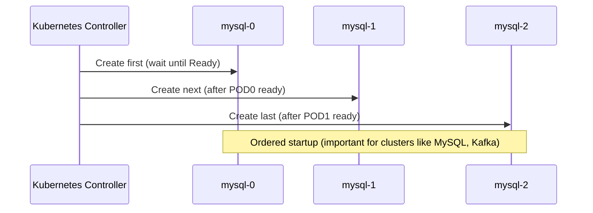

# 🫙 **Kubernetes StatefulSets 101** — Managing Stateful Applications

> 🎯 **Goal:** Learn how to create, manage, and operate StatefulSets — the special workload type that gives Pods **stable identities**, **persistent storage**, and **ordered scaling**.

---

## 📖 **What Makes StatefulSets Special?**

Unlike Deployments, which treat Pods as replaceable <u title="ماشية">cattle</u> 🐄,  
**StatefulSets treat Pods as <u title="حيوانات اليفة">pets</u> 🐕 — each has a name, identity, and history.**

Each Pod:

- Has a **stable network identity** (e.g., `mysql-0`, `mysql-1`).
- Has **persistent storage** via PVCs (not deleted with the Pod).
- Follows **ordered deployment, scaling, and termination**.

---

### ⚙️ StatefulSet Lifecycle in Simple Terms

<div align="center" style="background-color: #141a19ff;color: #a8a5a5ff; border-radius: 10px; border: 2px solid">



</div>

If you delete a StatefulSet, the **PVCs remain**, preserving the data for the next Pod instance.

---

## 🩻 **Structure of a StatefulSet** (Admin’s View)

Example manifest:

```yaml
apiVersion: apps/v1
kind: StatefulSet
metadata:
  name: mysql
spec:
  serviceName: mysql-headless
  replicas: 3
  selector:
    matchLabels:
      app: mysql
  template:
    metadata:
      labels:
        app: mysql
    spec:
      containers:
        - name: mysql
          image: mysql:8
          ports:
            - containerPort: 3306
          env:
            - name: MYSQL_ROOT_PASSWORD
              value: admin123
          volumeMounts:
            - name: data
              mountPath: /var/lib/mysql
  volumeClaimTemplates:
    - metadata:
        name: data
      spec:
        accessModes: ["ReadWriteOnce"]
        resources:
          requests:
            storage: 10Gi
```

---

## 🤯 **Headless Service** — The Backbone of StatefulSets

StatefulSets require a **Headless Service** (no cluster IP)
to give Pods stable DNS names.

```yaml
apiVersion: v1
kind: Service
metadata:
  name: mysql-headless
spec:
  clusterIP: None
  selector:
    app: mysql
  ports:
    - port: 3306
```

This allows you to access Pods directly:

```ini
mysql-0.mysql-headless.default.svc.cluster.local
mysql-1.mysql-headless.default.svc.cluster.local
mysql-2.mysql-headless.default.svc.cluster.local
```

💡 Perfect for database clusters, message queues, and caches that require **peer discovery**.

---

## 🧩 **Creating a StatefulSet**

Apply your YAMLs:

```bash
kubectl apply -f mysql-service.yaml
kubectl apply -f mysql-statefulset.yaml
```

Check resources:

```bash
kubectl get statefulsets
kubectl get pods -l app=mysql
```

Output:

```ini
NAME     READY   AGE
mysql    3/3     2m
```

Pod names:

```ini
mysql-0
mysql-1
mysql-2
```

> ✅ Each has a predictable hostname and persistent volume claim.

---

## 📈 **Scaling StatefulSets (with Order)**

### 🔹 Scale in:

```bash
kubectl scale statefulset mysql --replicas=5
```

Pods created in order:

```ini
mysql-3 → mysql-4
```

### 🔹 Scale out:

```bash
kubectl scale statefulset mysql --replicas=2
```

Pods terminated **in reverse order**:

```ini
mysql-4 → mysql-3
```

> 💡 Ensures dependent replicas (like DB secondaries) shut down safely.

---

## 📦 **StatefulSet Volume Behavior on Scale-out**

When you reduce replicas in a StatefulSet (e.g., from 5 to 2), Kubernetes removes the pods with the highest ordinal numbers (`pod-4`, `pod-3`, etc.), but it _does not delete_ their PersistentVolumeClaims (PVCs) or the underlying PersistentVolumes (PVs). Here's why:

- **PVCs are named deterministically**: Each pod gets a PVC like `data-pod-3`, `data-pod-4`, etc.
- **PVCs are not garbage collected automatically**: Even after the pod is deleted, the PVC remains in the namespace unless explicitly removed.
- **PVs remain in `Bound` state**: Because the PVCs still exist, the volumes stay attached and reserved.

This behavior ensures that if you scale the StatefulSet back up later, the same pod index (e.g., `pod-3`) can reclaim its original volume and state.

---

### 🧹 How to Clean Up Volumes After Scale-Out

If you want to remove unused volumes after scaling down:

1. **Delete the PVCs manually**:

   ```bash
   kubectl delete pvc data-pod-3
   kubectl delete pvc data-pod-4
   ```

2. **Ensure your storage class supports reclaim policy**:
   - If `reclaimPolicy: Delete`, the PV will be deleted when the PVC is removed.
   - If `reclaimPolicy: Retain`, the PV will persist even after PVC deletion — you’ll need to clean it manually.

---

### 📘 Example Workflow

```bash
kubectl scale statefulset my-db --replicas=2
kubectl get pvc  # still shows data-my-db-2, data-my-db-3, data-my-db-4
kubectl delete pvc data-my-db-4 data-my-db-3
```

---

### 🔐 Why This Matters

This behavior is intentional to preserve **stateful data integrity**. It prevents accidental data loss when scaling down and allows pods to resume with their original data if scaled back up.

Would you like a markdown snippet or diagram to document this for your portfolio? I can tailor it for visibility and recruiter impact.

---

## 💾 **Persistent Volumes & Claims**

When the StatefulSet is created, Kubernetes **auto-creates PVCs** from the template:

```ini
data-mysql-0
data-mysql-1
data-mysql-2
```

Even if Pods are deleted, these PVCs persist:

```bash
kubectl delete pod mysql-0
kubectl get pvc
```

> ✅ PVCs remain → Pod reuses the same volume on restart.

---

## 🧠 **Pod Identity and DNS Rules**

<div align="center" style="background-color: #141a19ff;color: #a8a5a5ff; border-radius: 10px; border: 2px solid">

| Pod     | Hostname | FQDN                                             |
| ------- | -------- | ------------------------------------------------ |
| mysql-0 | mysql-0  | mysql-0.mysql-headless.default.svc.cluster.local |
| mysql-1 | mysql-1  | mysql-1.mysql-headless.default.svc.cluster.local |
| mysql-2 | mysql-2  | mysql-2.mysql-headless.default.svc.cluster.local |

</div>

> 💡 This is critical for clustering systems like Cassandra, Redis Sentinel, Kafka, etc.

---

## 🧩 **Ordered Rolling Updates**

Kubernetes updates StatefulSet Pods **one by one**, in order.
The next Pod won’t update until the previous is “Ready”.

```bash
kubectl rollout status statefulset mysql
```

This avoids simultaneous disruption of multiple replicas.

---

### 🔹 Control update behavior:

```yaml
updateStrategy:
  type: RollingUpdate
  rollingUpdate:
    partition: 1
```

Meaning:
Only Pods with an ordinal **≥1** will update — great for **canary testing**.

---

## 🗑️ **Deleting StatefulSets Safely**

```bash
kubectl delete statefulset mysql
```

This removes Pods **but keeps PVCs** by default.

If you want to remove the PVCs too:

```bash
kubectl delete pvc -l app=mysql
```

> 💡 Best practice: keep PVCs until you verify backup data.

---

## 🧪 **Troubleshooting StatefulSets**

<div align="center" style="background-color: #141a19ff;color: #a8a5a5ff; border-radius: 10px; border: 2px solid">

| Problem              | Symptom                  | Fix                              |
| -------------------- | ------------------------ | -------------------------------- |
| Pods stuck Pending   | PVCs not bound           | Check StorageClass or PVs        |
| DNS resolution fails | Missing headless service | Create `clusterIP: None` service |
| Rolling update hangs | Previous Pod not Ready   | Check readiness/liveness probes  |
| Data loss            | PVCs deleted manually    | Restore from backup              |
| Replica out of sync  | DB cluster misconfigured | Check peer discovery via DNS     |

</div>

---

### 🧠 Debug Commands

```bash
kubectl describe statefulset mysql
kubectl get pods -l app=mysql -o wide
kubectl describe pod mysql-0
kubectl get pvc
kubectl logs mysql-0
```

---

## ⚙️ **Real Example — Redis Cluster StatefulSet**

```yaml
apiVersion: apps/v1
kind: StatefulSet
metadata:
  name: redis
spec:
  serviceName: redis-headless
  replicas: 3
  selector:
    matchLabels:
      app: redis
  template:
    metadata:
      labels:
        app: redis
    spec:
      containers:
        - name: redis
          image: redis:7
          ports:
            - containerPort: 6379
          volumeMounts:
            - name: data
              mountPath: /data
  volumeClaimTemplates:
    - metadata:
        name: data
      spec:
        accessModes: ["ReadWriteOnce"]
        resources:
          requests:
            storage: 2Gi
```

Pods will form a Redis cluster with:

```ini
redis-0.redis-headless
redis-1.redis-headless
redis-2.redis-headless
```

---

## 🧩 **Best Practices for Admins**

<div align="center" style="background-color: #141a19ff;color: #a8a5a5ff; border-radius: 10px; border: 2px solid">

| Area                    | Best Practice                               |
| ----------------------- | ------------------------------------------- |
| **Data**                | Always use PVCs (never emptyDir)            |
| **Headless Service**    | Must exist — no clusterIP                   |
| **Rolling Updates**     | Use readiness probes                        |
| **Scaling**             | Add replicas one by one (observe readiness) |
| **Backup**              | Never delete PVCs before data verified      |
| **Clustered DBs**       | Use stable DNS (`podname.servicename`)      |
| **Partitioned updates** | Test with `partition` strategy first        |

</div>

---

## ✅ **Summary**

<div align="center" style="background-color: #141a19ff;color: #a8a5a5ff; border-radius: 10px; border: 2px solid">

| Concept              | Takeaway                      |
| -------------------- | ----------------------------- |
| Headless Service     | Enables stable network IDs    |
| Persistent Volumes   | Maintain data across restarts |
| Ordered Pod creation | Safe for stateful systems     |
| Identity naming      | Predictable FQDNs per Pod     |
| Safe deletion        | Keeps PVCs by default         |
| Rolling update       | Ordered and safe              |
| Scaling              | Sequential, not parallel      |

</div>

---

## 🧭 Next Topic:

➡️ **StatefulSets 102 — Troubleshooting StatefulSets**

We’ll cover:

- Debugging PVC binding failures
- Diagnosing stuck Pods
- Fixing partitioned rollouts
- Handling volume corruption and recovery
- Understanding upgrade rollback for StatefulSets

Would you like me to continue with **StatefulSets 102 — Troubleshooting StatefulSets** next?
