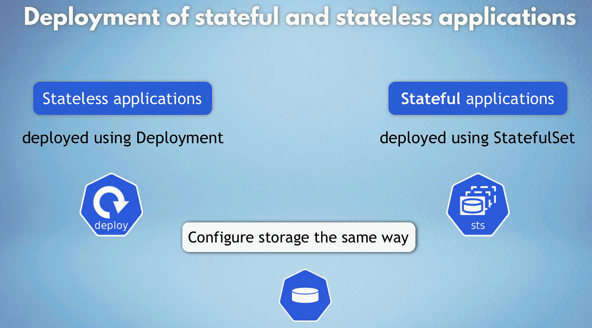
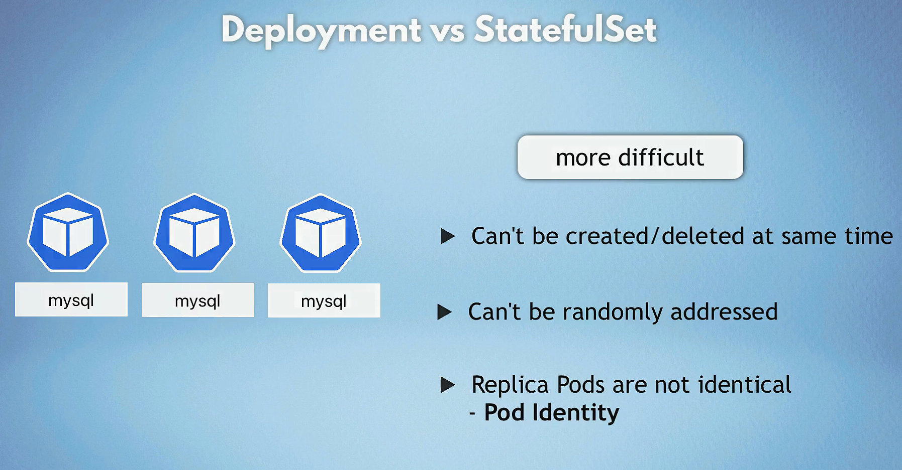
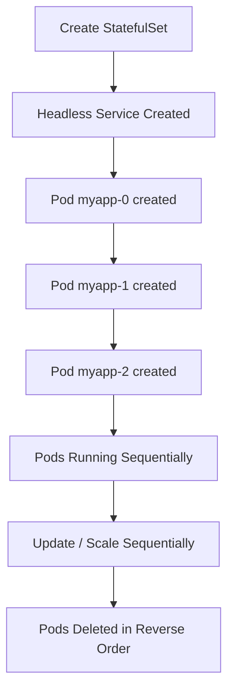
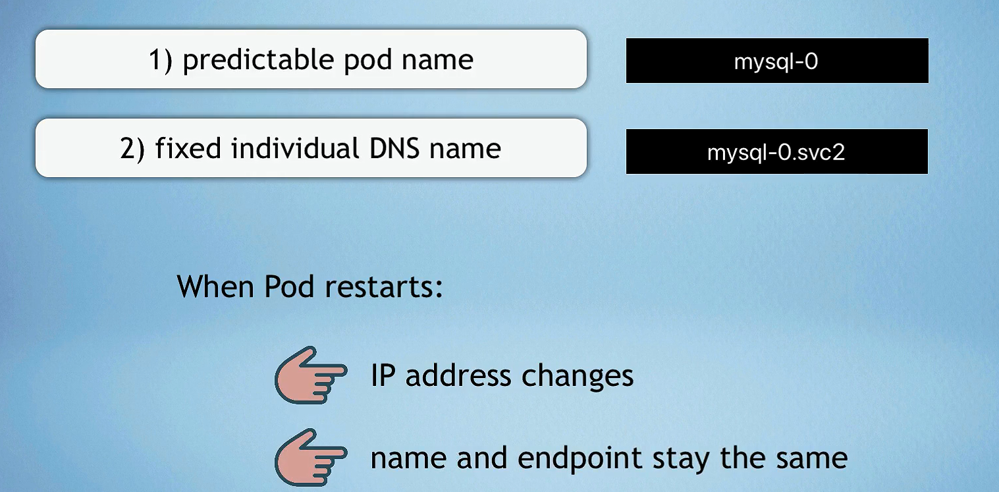
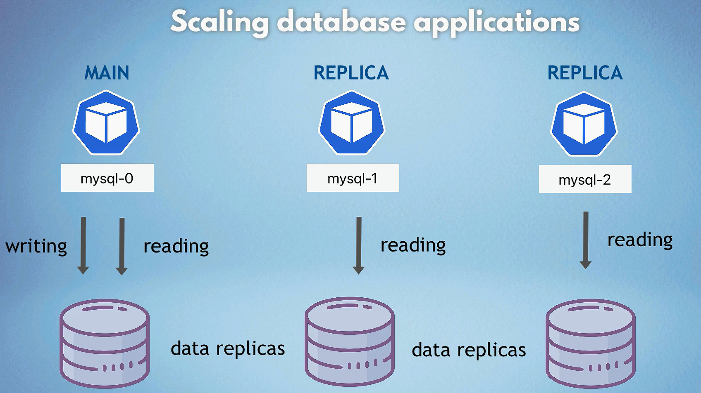
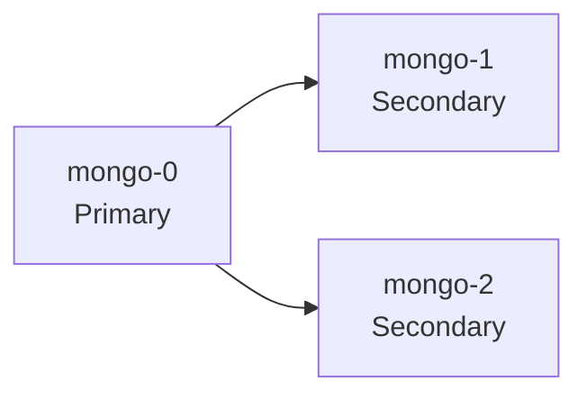

# 🌐 Kubernetes StatefulSet — Master of Stateful Applications ⚙️

## 🧩 What Is a StatefulSet?

A **StatefulSet** is a Kubernetes **controller** used to deploy and manage **stateful applications** — ones that need **stable network identity, persistent storage, and predictable startup order**.

> 🧠 **Official Definition:**
> A StatefulSet manages the deployment and scaling of a set of Pods and provides guarantees about their **ordering** and **uniqueness**.

---

## 🚀 Why Use StatefulSets?

| Feature                    | Description                                                          | Example                    |
| -------------------------- | -------------------------------------------------------------------- | -------------------------- |
| 🆔 **Stable Pod Identity** | Each Pod has a fixed, predictable name (e.g., `mysql-0`, `mysql-1`). | Database replica set       |
| 💾 **Persistent Storage**  | Each Pod gets its own volume that sticks even after Pod restarts.    | MongoDB data directory     |
| 🔄 **Ordered Operations**  | Pods start, update, and terminate one at a time in order.            | Zookeeper quorum formation |
| 🌐 **Stable DNS**          | Each Pod gets a DNS entry — easy for peer-to-peer communication.     | Redis cluster nodes        |

---

## 🧱 StatefulSet vs Deployment

### 🧠 Stateless vs Stateful

<div align="center">
  
</div>

### ⚖️ Deployment vs StatefulSet

<div align="center">
  
</div>

| Feature      | Deployment          | StatefulSet               |
| ------------ | ------------------- | ------------------------- |
| Pod Identity | Random              | Fixed (Ordinal-based)     |
| Pod Order    | Parallel            | Sequential                |
| Storage      | Shared or ephemeral | Dedicated PVC             |
| DNS          | Random name         | Predictable               |
| Use Case     | Web apps, APIs      | Databases, Queues, Caches |

---

## 🧩 Core Components

| Component                | Purpose                                                 |
| ------------------------ | ------------------------------------------------------- |
| **Headless Service**     | Gives Pods stable network identity (ClusterIP: None).   |
| **Pod Template**         | Defines the Pod spec (containers, labels, ports, etc.). |
| **VolumeClaimTemplates** | Creates a unique PVC per Pod automatically.             |

---

## ⚙️ YAML Example — StatefulSet in Action

Here’s a simple but complete example 👇

```yaml
apiVersion: apps/v1
kind: StatefulSet
metadata:
  name: myapp
spec:
  serviceName: "myapp" # Must point to a headless service
  replicas: 3
  selector:
    matchLabels:
      app: myapp
  template:
    metadata:
      labels:
        app: myapp
    spec:
      containers:
        - name: myapp
          image: myapp:latest
          ports:
            - containerPort: 8080
          volumeMounts:
            - name: myapp-storage
              mountPath: /data
  volumeClaimTemplates:
    - metadata:
        name: myapp-storage
      spec:
        accessModes: ["ReadWriteOnce"]
        resources:
          requests:
            storage: 1Gi
```

🧠 **Don’t forget:**
Create a **Headless Service** for the StatefulSet 👇

```yaml
apiVersion: v1
kind: Service
metadata:
  name: myapp
spec:
  clusterIP: None
  selector:
    app: myapp
  ports:
    - port: 8080
      name: web
```

---

## 🧭 Lifecycle of a StatefulSet



🧩 **Behavior:**

- Pods are **created in order (0 → N)**
- Deleted **in reverse (N → 0)**
- A new Pod doesn’t start until the previous one is **Ready**

---

## 📦 Persistent Storage — How It Works

Each Pod gets its **own Persistent Volume Claim (PVC)** automatically.

Example:

```ini
myapp-storage-myapp-0
myapp-storage-myapp-1
myapp-storage-myapp-2
```

🧠 **Rule:** If `myapp-0` is deleted, its PVC remains unless you delete it manually — so the data survives rescheduling.

> 💡 Best Practice: Always define a **StorageClass** in your cluster so PVCs are dynamically provisioned.

---

## 🌐 Stable DNS — Pod-Level Networking

Each Pod gets a stable DNS name through the headless service.

**Pattern:**

```ini
<statefulset-name>-<ordinal>.<service-name>.<namespace>.svc.cluster.local
```

**Example:**

```ini
myapp-0.myapp.default.svc.cluster.local
myapp-1.myapp.default.svc.cluster.local
myapp-2.myapp.default.svc.cluster.local
```

<div align="center">
  
</div>

<div align="center">
  
</div>

---

## 📈 Scaling StatefulSets

```bash
kubectl scale statefulset myapp --replicas=5
```

- New Pods (`myapp-3`, `myapp-4`) will be added **one at a time**
- Each gets its own PVC and DNS
- Scaling down removes Pods in reverse order (`myapp-4`, `myapp-3`, ...)

<div align="center">
  
</div>

<div align="center">
  
</div>

---

## 🔄 Updating a StatefulSet

### Option 1: Update via YAML

```bash
kubectl apply -f myapp-statefulset.yaml
```

### Option 2: Update via Image Command

```bash
kubectl set image statefulset/myapp myapp=myapp:v2
```

### Option 3: Manual Patch

```bash
kubectl patch statefulset myapp -p \
  '{"spec":{"template":{"spec":{"containers":[{"name":"myapp","image":"myapp:v2"}]}}}}'
```

🧠 **Note:** Updates occur sequentially (one Pod at a time).
Use the `partition` field in `updateStrategy` for **canary-style rollouts**.

---

## ⏪ Rolling Back a StatefulSet

```bash
kubectl rollout undo statefulset/myapp
```

Check rollout status:

```bash
kubectl rollout status statefulset/myapp
```

---

## 🔍 Monitoring a StatefulSet

```bash
kubectl get statefulsets
kubectl describe statefulset myapp
kubectl get pods -l app=myapp
kubectl get pvc -l app=myapp
```

---

## ❌ Deleting a StatefulSet

```bash
kubectl delete statefulset myapp
```

⚠️ PVCs **remain** after deletion (to protect your data).
If you want to clean them too:

```bash
kubectl delete pvc -l app=myapp
```

---

## 🧠 Common Use Cases

| Application Type    | Example                    |
| ------------------- | -------------------------- |
| Databases           | MySQL, PostgreSQL, MongoDB |
| Message Queues      | Kafka, RabbitMQ            |
| Distributed Systems | Zookeeper, Elasticsearch   |
| Stateful Caches     | Redis with persistence     |

---

## ⚠️ Limitations & Considerations

| Limitation                  | Description                                           |
| --------------------------- | ----------------------------------------------------- |
| ⚙️ **Slower Scaling**       | Pods start one-by-one, not in parallel                |
| 📋 **Complex Updates**      | Need ordered updates for consistency                  |
| 🧹 **Manual Cleanup**       | PVCs not auto-deleted (for safety)                    |
| 💬 **App Awareness Needed** | The app must handle replica roles (primary/secondary) |

---

## 💡 Best Practices

✅ Always use a **headless service**.
✅ Enable **dynamic provisioning** with a StorageClass.
✅ Use **readiness probes** to ensure proper Pod sequencing.
✅ Don’t reuse PVCs manually — let Kubernetes manage them.
✅ Test rolling updates in staging before production.
✅ If ordering isn’t critical, use `podManagementPolicy: Parallel` for faster creation.

---

## 🧱 Example: MongoDB StatefulSet Architecture



Each Pod has stable DNS:

```ini
mongo-0.mongo.default.svc.cluster.local
mongo-1.mongo.default.svc.cluster.local
mongo-2.mongo.default.svc.cluster.local
```

---

## 🏁 Final Summary

| Aspect           | StatefulSet                 | Deployment            |
| ---------------- | --------------------------- | --------------------- |
| **Purpose**      | Manage stateful apps        | Manage stateless apps |
| **Pod Identity** | Fixed                       | Random                |
| **Storage**      | Dedicated PVC per Pod       | Shared or ephemeral   |
| **DNS Name**     | Predictable                 | Random                |
| **Scaling**      | Ordered                     | Parallel              |
| **Best For**     | Databases, queues, clusters | Web servers, APIs     |

---

### ✨ TL;DR

> 🧩 **StatefulSet = Identity + Storage + Order**
>
> Use it when your app needs to **remember who it is** (like a database).
> Use a Deployment when your app **doesn’t care who it is** (like an API).

---

> 💬 “Deployments scale fast. StatefulSets scale correctly.”
