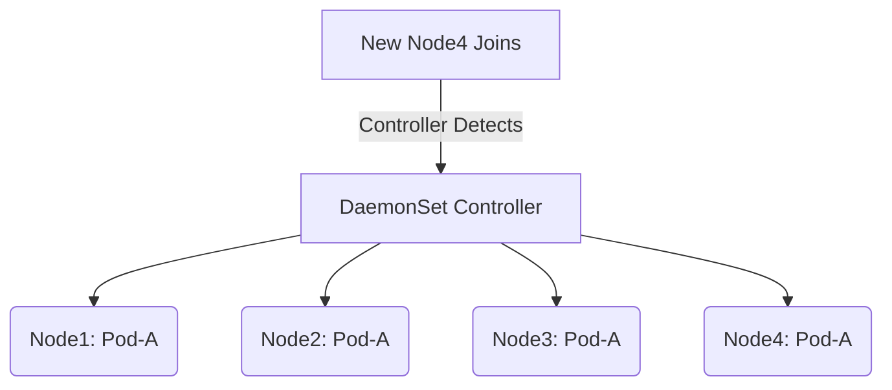

# ⚙️ **Kubernetes DaemonSets** — The Node-Level Workload Explained

> 🎯 **Goal:** Understand DaemonSets from an admin’s lens — what they do, how they differ from other controllers, when to use them, and what happens behind the scenes when nodes join or leave your cluster.

---

## 📖 **What Is a DaemonSet?**

A **DaemonSet** is a Kubernetes controller that ensures a specific Pod runs **on every (or selected) node** in the cluster.

- When a **new node** joins → DaemonSet **automatically schedules** a Pod there.
- When a **node is removed** → Kubernetes **cleans up** the Pod automatically.
- When the **DaemonSet is deleted** → its managed Pods are deleted too.

> 🧠 Real-World Analogy:  
> Imagine every house (node) must have a **security guard (Pod)**.
> If you add a new house, a guard automatically appears; if the house is demolished, the guard disappears.

---

## ⁉️ **Why DaemonSets Exist**

Kubernetes was designed for **application workloads**, but some workloads must run **once per node** — not once per cluster.

Examples:

<div align="center" style="background-color: #141a19ff;color: #a8a5a5ff; border-radius: 10px; border: 2px solid">

| Type           | Example                      | Purpose                             |
| -------------- | ---------------------------- | ----------------------------------- |
| **Logging**    | Fluentd, Filebeat            | Collect logs from node filesystem   |
| **Monitoring** | Node Exporter, Datadog Agent | Report CPU/memory/disk metrics      |
| **Networking** | Calico, Cilium, Kube-Proxy   | Manage CNI and network routing      |
| **Security**   | Falco, sysdig                | Monitor kernel and system events    |
| **Storage**    | Ceph OSDs, Rook              | Manage local disks or storage nodes |

</div>

> Without DaemonSets, you’d have to manually deploy one Pod per node — impossible at scale.

---

## ⚙️ **How DaemonSets Work** (Behind the Scenes)

Let’s visualize this:

<div align="center" style="background-color: #141a19ff;color: #a8a5a5ff; border-radius: 10px; border: 2px solid">



</div>

### Internally:

1. Controller watches all nodes.
2. For each node, it checks:

   - Should a DaemonSet Pod exist?
   - Is there already one?

3. If missing → it **creates** the Pod.
4. If the node is deleted → it **removes** the Pod.

---

## 📦 **DaemonSet Core Structure**

A DaemonSet is defined like any workload object (e.g., Deployment), but the **controller** logic differs.

```yaml
apiVersion: apps/v1
kind: DaemonSet
metadata:
  name: node-logger
  namespace: kube-system
spec:
  selector:
    matchLabels:
      app: node-logger
  template:
    metadata:
      labels:
        app: node-logger
    spec:
      containers:
        - name: filebeat
          image: docker.elastic.co/beats/filebeat:8.10.0
          volumeMounts:
            - name: logs
              mountPath: /var/log
      volumes:
        - name: logs
          hostPath:
            path: /var/log
```

### Key Fields:

| Field       | Description                              |
| ----------- | ---------------------------------------- |
| `selector`  | Labels used to match managed Pods.       |
| `template`  | Pod definition (what to run).            |
| `hostPath`  | Gives Pod access to node filesystem.     |
| `namespace` | Usually `kube-system` for system agents. |

---

## 🧠 **Pod Placement Logic**

DaemonSet Pods can run:

- On **all nodes**, or
- On **specific nodes** using:

  - `nodeSelector`
  - `affinity` / `antiAffinity`
  - `tolerations` (for tainted nodes)

### Example — Run only on GPU nodes:

```yaml
spec:
  template:
    spec:
      nodeSelector:
        gpu: "true"
```

### Example — Run even on tainted nodes:

```yaml
tolerations:
  - key: "dedicated"
    operator: "Equal"
    value: "gpu"
    effect: "NoSchedule"
```

---

## 📊 **DaemonSet vs Deployment**

<div align="center" style="background-color: #141a19ff;color: #a8a5a5ff; border-radius: 10px; border: 2px solid">

| Feature             | DaemonSet                     | Deployment               |
| ------------------- | ----------------------------- | ------------------------ |
| **Pods per node**   | 1 per node                    | Any number               |
| **Scaling**         | Auto (matches node count)     | Manual / HPA             |
| **Scheduling**      | Node-level                    | Cluster-wide             |
| **Rolling updates** | Controlled by update strategy | Controlled by ReplicaSet |
| **Use case**        | Background/system agents      | Application workloads    |

</div>

---

## 🔄 **Update Strategy**

DaemonSets use an **updateStrategy** (default: `RollingUpdate`).

Example:

```yaml
updateStrategy:
  type: RollingUpdate
  rollingUpdate:
    maxUnavailable: 1
```

This means:

- Only one Pod is unavailable during the update.
- Updates roll through nodes one by one.

To update:

```bash
kubectl apply -f daemonset.yaml
kubectl rollout status daemonset node-logger
```

---

## 🧩 **How DaemonSets React to Cluster Changes**

<div align="center" style="background-color: #141a19ff;color: #a8a5a5ff; border-radius: 10px; border: 2px solid">

| Event             | DaemonSet Behavior                    |
| ----------------- | ------------------------------------- |
| New node added    | Pod automatically created on it       |
| Node deleted      | Pod deleted                           |
| Node tainted      | Pod evicted unless tolerated          |
| Label changed     | Pod may be recreated or deleted       |
| DaemonSet updated | Controller restarts Pods sequentially |

</div>

---

## 🧰 **Listing and Inspecting DaemonSets**

```bash
kubectl get daemonsets -A
```

Example:

```ini
NAMESPACE     NAME            DESIRED   CURRENT   READY   AGE
kube-system   kube-proxy      4         4         4       2d
monitoring    node-exporter   4         4         4       1h
```

To describe:

```bash
kubectl describe daemonset node-exporter
```

To see its Pods:

```bash
kubectl get pods -l app=node-exporter -o wide
```

---

## 🔍 **Checking DaemonSet Distribution Across Nodes**

```bash
kubectl get pods -o wide -l app=node-logger
```

Output:

```ini
NAME                  NODE
node-logger-abc12     worker-1
node-logger-bcd23     worker-2
node-logger-cde34     worker-3
```

✅ One Pod per node.

---

## 💾 **Deleting DaemonSets**

```bash
kubectl delete daemonset node-logger
```

All its Pods will be deleted automatically.
If you want Pods to **remain running**, use:

```bash
kubectl delete daemonset node-logger --cascade=orphan
```

---

## ⚙️ **Real Example** — Node Exporter

```yaml
apiVersion: apps/v1
kind: DaemonSet
metadata:
  name: node-exporter
  namespace: monitoring
spec:
  selector:
    matchLabels:
      app: node-exporter
  template:
    metadata:
      labels:
        app: node-exporter
    spec:
      hostNetwork: true
      containers:
        - name: node-exporter
          image: prom/node-exporter:v1.8.1
          ports:
            - containerPort: 9100
          volumeMounts:
            - name: sys
              mountPath: /host/sys
              readOnly: true
      volumes:
        - name: sys
          hostPath:
            path: /sys
```

This creates one exporter Pod on each node, exposing metrics at port `9100`.

---

## 🧠 **Best Practices for Admins**

<div align="center" style="background-color: #141a19ff;color: #a8a5a5ff; border-radius: 10px; border: 2px solid">

| Area                | Best Practice                                     |
| ------------------- | ------------------------------------------------- |
| **Namespace**       | Use `kube-system` or dedicated namespaces.        |
| **Labels**          | Use clear labels for selectors.                   |
| **Tolerations**     | Add tolerations for critical system nodes.        |
| **Resource Limits** | Always define requests/limits.                    |
| **Rolling Updates** | Set `maxUnavailable: 1` for safe updates.         |
| **HostPath Access** | Limit to necessary directories only.              |
| **Pod Monitoring**  | Use `kubectl get ds -A` and `kubectl get events`. |

</div>

---

## ✅ **Summary**

<div align="center" style="background-color: #141a19ff;color: #a8a5a5ff; border-radius: 10px; border: 2px solid">

| Concept             | Description                                        |
| ------------------- | -------------------------------------------------- |
| **Purpose**         | Run exactly one Pod per node                       |
| **Scaling**         | Automatically matches cluster size                 |
| **Scheduling**      | Can be restricted by labels/tolerations            |
| **Update strategy** | Rolling updates per node                           |
| **Deletion**        | Removes Pods by default, can orphan them           |
| **Use cases**       | Logging, monitoring, networking, storage, security |

</div>
