# 🧮 **Jobs & CronJobs 101 — Batch and Scheduled Workloads**

> 🎯 **Goal:** Understand how to create, manage, and troubleshoot **Jobs** and **CronJobs** — the go-to Kubernetes resources for **one-time** or **recurring** tasks.

---

## 📖 **What Are Jobs in Kubernetes?**

A **Job** ensures that a **specific number of Pods successfully complete**.
Unlike Deployments or DaemonSets, Jobs are **not long-running** — they **run to completion**.

### 🧩 Behavior Overview

<div align="center" style="background-color: #141a19ff;color: #a8a5a5ff; border-radius: 10px; border: 2px solid">

| Action                      | What Happens                       |
| --------------------------- | ---------------------------------- |
| You create a Job            | Controller starts one or more Pods |
| A Pod finishes successfully | Count of completed Pods increases  |
| Desired completions reached | Job is marked **Completed**        |
| Pods fail repeatedly        | Job retries them (based on policy) |

</div>

---

### 🧱 Example: A Simple Job

```yaml
apiVersion: batch/v1
kind: Job
metadata:
  name: hello-job
spec:
  template:
    spec:
      containers:
        - name: hello
          image: busybox
          command: ["echo", "Hello from Kubernetes Job!"]
      restartPolicy: Never
```

Deploy:

```bash
kubectl apply -f hello-job.yaml
```

Check status:

```bash
kubectl get jobs
kubectl get pods
```

Logs:

```bash
kubectl logs job/hello-job
```

---

## ⚙️ **Job Lifecycle and States**

A Job transitions through these states:

```mermaid
flowchart LR
A[Pending] --> B[Running]
B -->|Success| C[Completed ✅]
B -->|Failure| D[Backoff/Retry ♻️]
D -->|Exhausted retries| E[Failed ❌]
```



Each retry spawns **a new Pod** until it reaches the `backoffLimit`.

---

## 🧩 **Controlling Job Behavior**

### 💥 `restartPolicy`

- Must be `Never` or `OnFailure`.
- Job controller manages retries — not kubelet.

### 🔁 `backoffLimit`

Number of retries before Job fails:

```yaml
spec:
  backoffLimit: 3
```

### 🧮 `completions` and `parallelism`

- **`completions`** = how many successful Pods are required.
- **`parallelism`** = how many Pods can run at once.

Example — run 5 Pods, 2 at a time:

```yaml
spec:
  completions: 5
  parallelism: 2
```

---

## ✍🏻 **Real Example — Batch File Processor**

```yaml
apiVersion: batch/v1
kind: Job
metadata:
  name: file-processor
spec:
  completions: 5
  parallelism: 2
  template:
    spec:
      containers:
        - name: processor
          image: alpine
          command: ["sh", "-c", "echo Processing file $(hostname); sleep 5"]
      restartPolicy: Never
```

View progress:

```bash
kubectl get jobs
```

```ini
NAME              COMPLETIONS   DURATION   AGE
file-processor    5/5           35s        1m
```

---

## 🧑🏻‍💻 **Job Management Commands**

| Action   | Command                                                  |
| -------- | -------------------------------------------------------- |
| Create   | `kubectl apply -f job.yaml`                              |
| View     | `kubectl get jobs -A`                                    |
| Describe | `kubectl describe job <name>`                            |
| Logs     | `kubectl logs job/<name>`                                |
| Delete   | `kubectl delete job <name>`                              |
| Rerun    | `kubectl delete job <name> && kubectl apply -f job.yaml` |

---

## 🧹 **Cleaning Up Old Jobs**

By default, Jobs and Pods stay after completion.
To **auto-cleanup**, use TTL (Time-To-Live):

```yaml
spec:
  ttlSecondsAfterFinished: 60
```

✅ Job and Pods deleted automatically 60 seconds after finishing.

---

## 🧮 **CronJobs — Scheduled Jobs**

A **CronJob** runs Jobs **on a time-based schedule**, like a Linux cron.

Example schedule:
`"0 */6 * * *"` → every 6 hours.

### 🧱 Example: CronJob YAML

```yaml
apiVersion: batch/v1
kind: CronJob
metadata:
  name: cleanup-temp
spec:
  schedule: "0 */6 * * *"
  jobTemplate:
    spec:
      template:
        spec:
          containers:
            - name: cleanup
              image: alpine
              command: ["sh", "-c", "echo Cleaning temp files at $(date)"]
          restartPolicy: OnFailure
```

Deploy:

```bash
kubectl apply -f cleanup-temp.yaml
```

---

### 🧩 Cron Syntax Reference

| Field        | Meaning | Example               |
| ------------ | ------- | --------------------- |
| Minute       | `0-59`  | `*/5` every 5 minutes |
| Hour         | `0-23`  | `3` → 3 AM            |
| Day of month | `1-31`  | `1` → first day       |
| Month        | `1-12`  | `*/2` every 2 months  |
| Day of week  | `0-6`   | `1` → Monday          |

💡 Use [crontab.guru](https://crontab.guru) to generate schedules.

---

## ⚙️ **CronJob Execution Flow**


- The **CronJob controller** creates a new Job object each time the schedule triggers.
- Each Job runs its Pod(s) independently.

---

## 🧠 **Key CronJob Parameters**

| Field                        | Description                       |
| ---------------------------- | --------------------------------- |
| `schedule`                   | Cron expression                   |
| `successfulJobsHistoryLimit` | Number of successful Jobs to keep |
| `failedJobsHistoryLimit`     | Number of failed Jobs to keep     |
| `concurrencyPolicy`          | Controls overlapping executions   |
| `startingDeadlineSeconds`    | Grace period for missed schedules |

### Example:

```yaml
spec:
  concurrencyPolicy: Forbid
  failedJobsHistoryLimit: 3
  successfulJobsHistoryLimit: 2
```

---

### 🧩 `concurrencyPolicy` Options

| Policy    | Behavior                               |
| --------- | -------------------------------------- |
| `Allow`   | Default; multiple runs may overlap     |
| `Forbid`  | Skip new run if previous still running |
| `Replace` | Cancel running job and start a new one |

---

## 🧰 **Managing CronJobs**

| Action            | Command                                       |
| ----------------- | --------------------------------------------- |
| List all          | `kubectl get cronjobs`                        |
| Describe          | `kubectl describe cronjob <name>`             |
| View Jobs created | `kubectl get jobs --selector=job-name=<name>` |
| Logs              | `kubectl logs job/<job-name>`                 |
| Delete            | `kubectl delete cronjob <name>`               |

---

## ⚙️ **Troubleshooting Jobs & CronJobs**

| Problem                    | Symptom                      | Fix                                |
| -------------------------- | ---------------------------- | ---------------------------------- |
| Job stuck in Pending       | Node affinity or quota issue | Check events and resources         |
| Pods restarting repeatedly | restartPolicy wrong          | Use `Never` or `OnFailure`         |
| CronJob missed run         | Controller downtime          | Check `startingDeadlineSeconds`    |
| Overlapping Jobs           | Tasks run simultaneously     | Use `concurrencyPolicy: Forbid`    |
| CronJob never triggers     | Wrong cron syntax            | Verify schedule via `crontab.guru` |

### Diagnostic commands:

```bash
kubectl describe job <name>
kubectl describe cronjob <name>
kubectl get events --sort-by=.metadata.creationTimestamp
```

---

## 🧱 **Real Example — Nightly Database Backup**

```yaml
apiVersion: batch/v1
kind: CronJob
metadata:
  name: db-backup
spec:
  schedule: "0 2 * * *" # every day at 2 AM
  jobTemplate:
    spec:
      template:
        spec:
          containers:
            - name: backup
              image: alpine
              command: ["sh", "-c", "pg_dump -h db -U admin > /backup/db.sql"]
              env:
                - name: PGPASSWORD
                  valueFrom:
                    secretKeyRef:
                      name: db-secret
                      key: password
          restartPolicy: OnFailure
  successfulJobsHistoryLimit: 3
  failedJobsHistoryLimit: 1
```

✅ Automatically triggers backup every night at 2 AM.

---

## 🧭 **Best Practices**

| Area                    | Best Practice                                 |
| ----------------------- | --------------------------------------------- |
| **TTL Cleanup**         | Use `ttlSecondsAfterFinished` for old Jobs.   |
| **Logs**                | Stream logs using `kubectl logs job/<name>`.  |
| **Concurrency Control** | Prevent overlaps with `Forbid`.               |
| **Resource Requests**   | Always set limits for batch jobs.             |
| **Monitoring**          | Track Job completions via Prometheus metrics. |
| **Security**            | Run CronJobs with dedicated service accounts. |

---

## ✅ **Summary**

| Concept         | Job                  | CronJob                           |
| --------------- | -------------------- | --------------------------------- |
| **Purpose**     | Run to completion    | Run on a schedule                 |
| **Controller**  | Job Controller       | CronJob Controller (creates Jobs) |
| **Retries**     | Yes (`backoffLimit`) | Yes (per run)                     |
| **Cleanup**     | TTL or manual        | History limits                    |
| **Concurrency** | Parallel Pods        | Parallel scheduled runs           |

---
