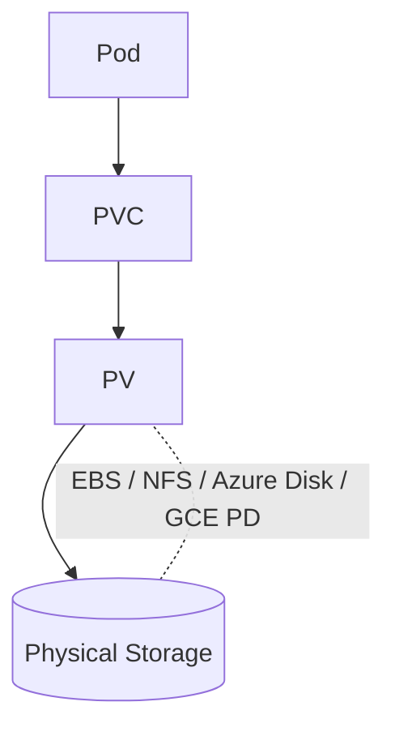

# 💾 **PersistentVolumes (PVs) — The Foundation of Kubernetes Storage**

> 🎯 **Goal:** Understand, create, and manage PersistentVolumes (PVs) like a pro — covering how Kubernetes abstracts physical storage, handles binding, and persists data beyond Pod lifecycles.

---

## 📖 **What is a PersistentVolume?**

A **PersistentVolume (PV)** is a **cluster-wide storage resource** that represents **a piece of storage** in the cluster — provisioned **manually (static)** or **automatically (dynamic)** — and **independent of any Pod’s lifecycle**.

Think of it like:

> 🧱 PV = actual disk  
> 📦 PVC = claim/ticket to use that disk

---

## ⁉️ **Why PV Exists**

Normally, when a Pod is deleted, its **ephemeral storage (emptyDir)** is lost.
But with PVs:

- Data **persists** beyond Pod deletion or rescheduling.
- Storage is **decoupled** from compute.
- Kubernetes can **bind storage dynamically** from your underlying provider.

---

## 🧩 **PersistentVolume Architecture**

Let’s visualize how the core storage flow works:

<div align="center" style="background-color: #141a19ff;color: #a8a5a5ff; border-radius: 10px; border: 2px solid">



</div>

---

> 📍 **Pod** → uses a **PVC (PersistentVolumeClaim)**  
> 📍 **PVC** → binds to a **PV (PersistentVolume)**  
> 📍 **PV** → maps to a **real storage backend**

---

## 🧠 **PV Key Concepts**

<div align="center" style="background-color: #141a19ff;color: #a8a5a5ff; border-radius: 10px; border: 2px solid">

| Concept            | Description                                 |
| ------------------ | ------------------------------------------- |
| **Provisioning**   | Can be static or dynamic                    |
| **Reclaim Policy** | What happens when a PVC is deleted          |
| **Access Modes**   | How Pods can access the volume              |
| **Capacity**       | Total storage size                          |
| **Storage Class**  | Defines provisioner & parameters            |
| **Phase**          | Status (Available, Bound, Released, Failed) |

</div>

---

## 🔑 **Access Modes**

<div align="center" style="background-color: #141a19ff;color: #a8a5a5ff; border-radius: 10px; border: 2px solid">

| Access Mode               | Description               | Typical Backend     |
| ------------------------- | ------------------------- | ------------------- |
| `ReadWriteOnce` (RWO)     | One node can read/write   | EBS, Azure Disk     |
| `ReadOnlyMany` (ROX)      | Many nodes can read       | NFS, Ceph           |
| `ReadWriteOncePod` (RWOP) | Only one Pod can access   | CSI drivers (newer) |
| `ReadWriteMany` (RWX)     | Many nodes can read/write | NFS, GlusterFS      |

</div>

---

## 💾 **Static PV Creation**

In **static provisioning**, the admin manually defines the storage (useful for on-prem setups).

Example (NFS-based PV):

```yaml
apiVersion: v1
kind: PersistentVolume
metadata:
  name: pv-nfs
spec:
  capacity:
    storage: 5Gi
  accessModes:
    - ReadWriteMany
  persistentVolumeReclaimPolicy: Retain
  nfs:
    path: /srv/nfs/pv1
    server: 10.0.0.25
```

Apply:

```bash
kubectl apply -f pv-nfs.yaml
kubectl get pv
```

Output:

```ini
NAME      CAPACITY   ACCESS MODES   RECLAIM POLICY   STATUS      CLAIM   STORAGECLASS   AGE
pv-nfs    5Gi        RWX            Retain           Available           manual          5s
```

---

## ⚙️ **PV Lifecycle Phases**

<div align="center" style="background-color: #141a19ff;color: #a8a5a5ff; border-radius: 10px; border: 2px solid">

| Phase            | Meaning                           |
| ---------------- | --------------------------------- |
| 🟢 **Bound**     | Claimed by a PVC                  |
| ⚫ **Available** | Ready to be bound                 |
| 🟡 **Released**  | PVC deleted, PV not reclaimed yet |
| 🔴 **Failed**    | Automatic recycling failed        |

</div>

Check phase:

```bash
kubectl get pv
```

---

## 👮🏻 **Reclaim Policies**

Defines what happens to data when PVC is deleted.

<div align="center" style="background-color: #141a19ff;color: #a8a5a5ff; border-radius: 10px; border: 2px solid">

| Policy       | Behavior                            | Example Use                   |
| ------------ | ----------------------------------- | ----------------------------- |
| ✅ `Retain`  | Keep volume/data for manual cleanup | Databases                     |
| ⚠️ `Recycle` | Deletes data (deprecated)           | Legacy                        |
| ❌ `Delete`  | Delete backend storage              | Cloud disks (EBS, Azure Disk) |

</div>

Modify policy:

```bash
kubectl patch pv pv-nfs -p '{"spec":{"persistentVolumeReclaimPolicy":"Retain"}}'
```

---

## ⚙️ **Dynamic Provisioning (with PersistentVolumeClaim and StorageClass)**

In dynamic provisioning, PVs are **created on demand** using **StorageClasses**.

Example (AWS EBS):

```yaml
apiVersion: v1
kind: PersistentVolumeClaim
metadata:
  name: pvc-ebs
spec:
  accessModes:
    - ReadWriteOnce
  resources:
    requests:
      storage: 5Gi
  storageClassName: gp2
```

💡 Here, Kubernetes automatically provisions a new **EBS volume** and creates a matching PV.

---

## 🧰 **Viewing & Managing PVs**

<div align="center" style="background-color: #141a19ff;color: #a8a5a5ff; border-radius: 10px; border: 2px solid">

| Action      | Command                                                    |
| ----------- | ---------------------------------------------------------- |
| List PVs    | `kubectl get pv`                                           |
| Describe PV | `kubectl describe pv <name>`                               |
| Delete PV   | `kubectl delete pv <name>`                                 |
| View Events | `kubectl get events --sort-by=.metadata.creationTimestamp` |

</div>

---

## 🔗 **Binding Process (Admin View)**

Let’s go step by step:

1. Admin creates PV (`pv-nfs`).
2. Developer creates PVC requesting 5Gi & RWX.
3. Control plane checks if any PV matches those criteria.
4. If match found → `STATUS: Bound`.
5. Pod mounts the claim via `volumeMount`.

You can verify:

```bash
kubectl get pvc
kubectl describe pvc myclaim
```

---

## ✍🏻 **Example: Pod using a PersistentVolumeClaim**

```yaml
apiVersion: v1
kind: Pod
metadata:
  name: pv-demo
spec:
  containers:
    - name: app
      image: nginx
      volumeMounts:
        - name: html
          mountPath: /usr/share/nginx/html
  volumes:
    - name: html
      persistentVolumeClaim:
        claimName: pvc-ebs
```

Now your Pod’s data persists even after deletion!

---

## 🔴 **Troubleshooting PVs**

<div align="center" style="background-color: #141a19ff;color: #a8a5a5ff; border-radius: 10px; border: 2px solid">

| Symptom                      | Likely Cause            | Fix                                       |
| ---------------------------- | ----------------------- | ----------------------------------------- |
| PVC stuck in “Pending”       | No matching PV found    | Check storageClassName, size, access mode |
| PV “Released” but not reused | Reclaim policy = Retain | Manually delete/recycle PV                |
| PV “Failed”                  | Provisioning issue      | Check CSI driver logs                     |
| Pod won’t start              | Volume not mounted      | Inspect `kubectl describe pod` events     |
| Mount permission denied      | NFS export or mode      | Fix permissions on backend                |

</div>

---

### 🔍 Diagnostic Commands

```bash
kubectl describe pvc <name>
kubectl describe pv <name>
kubectl get events --sort-by=.metadata.creationTimestamp
kubectl logs <pod-name>
kubectl get sc
```

---

## 📝 **Real Cloud Examples**

### 🟦 AWS EBS Example

```yaml
apiVersion: v1
kind: PersistentVolume
metadata:
  name: pv-ebs
spec:
  capacity:
    storage: 10Gi
  accessModes:
    - ReadWriteOnce
  awsElasticBlockStore:
    volumeID: vol-0123abcd4567efgh
    fsType: ext4
```

### 🟪 Azure Disk Example

```yaml
azureDisk:
  diskName: myDisk
  diskURI: /subscriptions/.../disks/myDisk
  fsType: ext4
```

### 🟨 GCP PD Example

```yaml
gcePersistentDisk:
  pdName: my-pd
  fsType: ext4
```

---

## 🔐 **Security Considerations**

- Restrict who can **create/modify PVs** with RBAC.
- Use **node affinity** for storage locality.
- Enable **CSI driver encryption** (e.g., encrypted EBS).
- Avoid sharing volumes across tenants (RWX caution).
- Always **set ReclaimPolicy = Retain** for critical data.

---

## ✅ **Best Practices**

<div align="center" style="background-color: #141a19ff;color: #a8a5a5ff; border-radius: 10px; border: 2px solid">

| Area                | Recommendation                                 |
| ------------------- | ---------------------------------------------- |
| **Provisioning**    | Use dynamic provisioning unless special case   |
| **StorageClass**    | Match region/zone with nodes                   |
| **Data Protection** | Enable snapshotting or backup tooling          |
| **Performance**     | Choose appropriate disk type (gp3/io2/etc.)    |
| **Visibility**      | Regularly audit PV usage (`kubectl get pv -A`) |

</div>

---

## 🏁 **Summary**

<div align="center" style="background-color: #141a19ff;color: #a8a5a5ff; border-radius: 10px; border: 2px solid">

| Concept           | Description                                      |
| ----------------- | ------------------------------------------------ |
| **PV**            | Represents actual storage in cluster             |
| **PVC**           | Claim that requests a PV                         |
| **StorageClass**  | Defines storage backend for dynamic provisioning |
| **ReclaimPolicy** | What happens after PVC deletion                  |
| **AccessModes**   | Controls how Pods can access the volume          |

</div>

---

## 🧭 **Next in Storage Series**

Now that you understand **PersistentVolumes**, we’ll move to:

### 👉 **Next Topic: PersistentVolumeClaims (PVCs) — How Pods Claim and Bind Storage**

We’ll cover:

- Claim creation and matching logic
- Volume binding modes (`Immediate` vs `WaitForFirstConsumer`)
- PVC resizing, cloning, and snapshots
- Real-world troubleshooting & live admin commands
