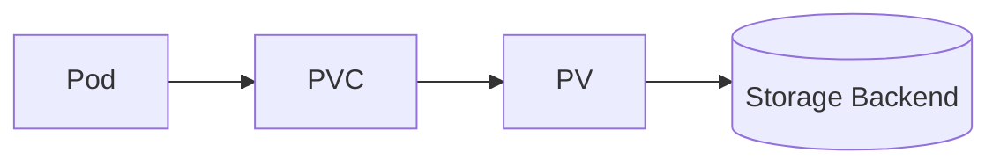

# 📦 **PersistentVolumeClaims (PVCs) — Binding Apps to Storage**

> 🎯 **Goal:** Learn how to create, bind, use, expand, and troubleshoot PersistentVolumeClaims (PVCs) — the bridge between your Pods and PersistentVolumes.

---

## 📖 **What is a PersistentVolumeClaim (PVC)?**

A **PersistentVolumeClaim (PVC)** is a **request for storage by a user or Pod**.

- Users **don’t directly reference PVs**.
- Instead, they **declare a claim** specifying:

  - How much storage they need (`storage`)
  - What access they require (`accessModes`)
  - Optionally, which **StorageClass** to use

> 🧾 Think of PVC like a _storage ticket_ — Kubernetes matches it with a fitting **PersistentVolume**.

---

## ⚙️ **PV vs PVC — The Relationship**

<div align="center" style="background-color: #141a19ff;color: #a8a5a5ff; border-radius: 10px; border: 2px solid">

| Component   | Responsibility                | Created By           |
| ----------- | ----------------------------- | -------------------- |
| **PV**      | Actual physical/disk resource | Admin / StorageClass |
| **PVC**     | Request to use that resource  | Developer / Pod      |
| **Binding** | Connects PV ↔ PVC             | Control Plane        |



</div>

---

## 🧩 **PVC Anatomy (Key Fields)**

```yaml
apiVersion: v1
kind: PersistentVolumeClaim
metadata:
  name: myclaim
spec:
  accessModes:
    - ReadWriteOnce
  resources:
    requests:
      storage: 5Gi
  storageClassName: manual
```

**Explanation:**

- `accessModes`: How Pod can access storage.
- `resources.requests.storage`: Requested capacity.
- `storageClassName`: Which backend to use (optional).
- When applied → Kubernetes binds it to a suitable PV.

---

## 🧱 **PVC Lifecycle States**

<div align="center" style="background-color: #141a19ff;color: #a8a5a5ff; border-radius: 10px; border: 2px solid">

| Phase       | Meaning                        |
| ----------- | ------------------------------ |
| **Pending** | No suitable PV found yet       |
| **Bound**   | Successfully bound to a PV     |
| **Lost**    | PV deleted before PVC released |

</div>

---

Check PVC status:

```bash
kubectl get pvc
kubectl describe pvc myclaim
```

---

## 🧠 **Binding Logic**

Kubernetes tries to find a **PV** whose:

- `storageClassName` matches the PVC
- `accessModes` include the requested mode
- `capacity.storage` ≥ requested size

If found → **binds** automatically.

Otherwise → PVC remains **Pending** until a matching PV appears.

---

## 🧰 **PVC Creation Scenarios**

### 🟢 1️⃣ Static Binding (Admin creates PV manually)

```yaml
apiVersion: v1
kind: PersistentVolume
metadata:
  name: pv-static
spec:
  capacity:
    storage: 10Gi
  accessModes: [ReadWriteOnce]
  hostPath:
    path: /data/pv1
  storageClassName: manual
  persistentVolumeReclaimPolicy: Retain
```

Then PVC:

```yaml
apiVersion: v1
kind: PersistentVolumeClaim
metadata:
  name: pvc-static
spec:
  accessModes: [ReadWriteOnce]
  resources:
    requests:
      storage: 10Gi
  storageClassName: manual
```

Result:

```bash
kubectl get pv,pvc
```

Output:

```ini
NAME          STATUS   CAPACITY  ACCESS MODES  RECLAIM POLICY  STORAGECLASS  AGE
pv-static     Bound    10Gi      RWO           Retain          manual        5s
pvc-static    Bound    10Gi      RWO                            manual        3s
```

---

### ⚙️ 2️⃣ Dynamic Binding (StorageClass creates PV automatically)

```yaml
apiVersion: v1
kind: PersistentVolumeClaim
metadata:
  name: pvc-dynamic
spec:
  accessModes:
    - ReadWriteOnce
  resources:
    requests:
      storage: 5Gi
  storageClassName: gp2
```

✅ A new PV is **automatically created and bound** to this PVC by the **StorageClass**.

---

## 🧩 **Using PVC in a Pod**

```yaml
apiVersion: v1
kind: Pod
metadata:
  name: pvc-demo
spec:
  containers:
    - name: app
      image: nginx
      volumeMounts:
        - mountPath: /usr/share/nginx/html
          name: myvol
  volumes:
    - name: myvol
      persistentVolumeClaim:
        claimName: pvc-dynamic
```

✅ Any file written in `/usr/share/nginx/html` is **stored on the PV**.
Even if Pod restarts, data remains.

---

## 💡 **AccessModes Refresher**

<div align="center" style="background-color: #141a19ff;color: #a8a5a5ff; border-radius: 10px; border: 2px solid">

| Mode               | Meaning                   | Example         |
| ------------------ | ------------------------- | --------------- |
| `ReadWriteOnce`    | One node can read/write   | EBS, Azure Disk |
| `ReadOnlyMany`     | Multiple nodes read       | NFS             |
| `ReadWriteMany`    | Multiple nodes read/write | NFS, CephFS     |
| `ReadWriteOncePod` | One Pod can access        | CSI-specific    |

</div>

---

## 🧠 **Volume Binding Modes (StorageClass-level)**

Determines **when** the PV is created/bound:

<div align="center" style="background-color: #141a19ff;color: #a8a5a5ff; border-radius: 10px; border: 2px solid">

| Mode                   | Behavior                               | Use Case                               |
| ---------------------- | -------------------------------------- | -------------------------------------- |
| `Immediate`            | PV created right after PVC             | Works for non-zonal storage            |
| `WaitForFirstConsumer` | PV created **only when Pod scheduled** | Best for zonal disks (EBS, Azure Disk) |

</div>

---

Check your StorageClass:

```bash
kubectl get sc gp2 -o yaml | grep volumeBindingMode
```

---

## 🔄 **Expanding (Resizing) PVCs**

To increase size:

1️⃣ Ensure your `StorageClass` supports resizing:

```yaml
allowVolumeExpansion: true
```

2️⃣ Patch PVC:

```bash
kubectl patch pvc pvc-dynamic -p '{"spec":{"resources":{"requests":{"storage":"10Gi"}}}}'
```

3️⃣ Verify:

```bash
kubectl get pvc
```

> ⚠️ Volume must support online resizing (some CSI drivers require Pod restart).

---

## 🧰 **Deleting PVCs**

```bash
kubectl delete pvc pvc-dynamic
```

Behavior depends on **PV ReclaimPolicy**:

- `Retain`: Keeps data (manual cleanup)
- `Delete`: Deletes volume
- `Recycle`: Wipes (deprecated)

---

## 🧠 **Troubleshooting PVCs**

<div align="center" style="background-color: #141a19ff;color: #a8a5a5ff; border-radius: 10px; border: 2px solid">

| Problem                      | Symptom                        | Fix                            |
| ---------------------------- | ------------------------------ | ------------------------------ |
| PVC stuck in `Pending`       | No matching PV                 | Check size, accessModes, class |
| Pod fails to mount volume    | `MountVolume.SetUp failed`     | Check node access & CSI driver |
| PVC resizing not applied     | `allowVolumeExpansion` missing | Enable in StorageClass         |
| PVC lost binding             | PV deleted                     | Recreate PV or PVC             |
| PVC “Bound” but data missing | App using wrong path           | Verify `mountPath` in Pod      |

</div>

---

### 🔍 Debug Commands

```bash
kubectl describe pvc <name>
kubectl describe pv <name>
kubectl get events --sort-by=.metadata.creationTimestamp
kubectl logs <pod>
kubectl get sc
kubectl get pods -o wide
```

---

## 🧩 **Advanced Operations**

### 🧱 PVC Cloning (K8s v1.18+)

Duplicate an existing volume:

```yaml
apiVersion: v1
kind: PersistentVolumeClaim
metadata:
  name: pvc-clone
spec:
  dataSource:
    name: pvc-dynamic
    kind: PersistentVolumeClaim
    apiGroup: ""
  accessModes: [ReadWriteOnce]
  resources:
    requests:
      storage: 5Gi
  storageClassName: gp2
```

---

### 📸 PVC Snapshot (CSI Feature)

Create snapshot:

```yaml
apiVersion: snapshot.storage.k8s.io/v1
kind: VolumeSnapshot
metadata:
  name: pvc-snap
spec:
  source:
    persistentVolumeClaimName: pvc-dynamic
```

Restore from snapshot:

```yaml
dataSource:
  name: pvc-snap
  kind: VolumeSnapshot
  apiGroup: snapshot.storage.k8s.io
```

---

## ⚙️ **Real Cloud Examples**

### 🟦 AWS EBS

StorageClass:

```yaml
provisioner: ebs.csi.aws.com
volumeBindingMode: WaitForFirstConsumer
```

PVC:

```yaml
storageClassName: gp3
accessModes: [ReadWriteOnce]
resources:
  requests:
    storage: 20Gi
```

---

### 🟪 Azure Disk

StorageClass:

```yaml
provisioner: disk.csi.azure.com
allowVolumeExpansion: true
```

PVC:

```yaml
storageClassName: managed-csi
accessModes: [ReadWriteOnce]
resources:
  requests:
    storage: 20Gi
```

---

## 🧭 **Best Practices for Admins**

<div align="center" style="background-color: #141a19ff;color: #a8a5a5ff; border-radius: 10px; border: 2px solid">

| Area         | Recommendation                               |
| ------------ | -------------------------------------------- |
| **Defaults** | Set a default StorageClass                   |
| **Resizing** | Enable `allowVolumeExpansion: true`          |
| **Zones**    | Use `WaitForFirstConsumer` for zonal storage |
| **Cleanup**  | Use `Retain` policy for stateful data        |
| **Audit**    | Regularly check `kubectl get pvc -A`         |
| **Backups**  | Use snapshots before scaling or upgrades     |

</div>

---

## ✅ **Quick Summary**

<div align="center" style="background-color: #141a19ff;color: #a8a5a5ff; border-radius: 10px; border: 2px solid">

| Concept                  | Description                            |
| ------------------------ | -------------------------------------- |
| **PVC**                  | User’s claim for storage               |
| **Binding**              | Auto match PVC ↔ PV                    |
| **Dynamic Provisioning** | Uses StorageClass to create PV         |
| **Reclaim Policy**       | Defines cleanup behavior               |
| **Expansion**            | Resize volume dynamically              |
| **Troubleshooting**      | Check `describe`, events, and CSI logs |

</div>

---

## 🧭 Next Step in Storage Series

Now that we’ve mastered PVs and PVCs, it’s time for:

### 👉 **StorageClass — Dynamic Provisioning, Parameters, VolumeBindingMode, and Tuning for Cloud Providers**

We’ll cover:

- How StorageClasses automate disk provisioning
- Parameters for AWS, Azure, GCP
- Volume binding behavior
- Expansion settings & reclaim policies
- Troubleshooting & admin tuning

Would you like me to start the **StorageClass** section next?
