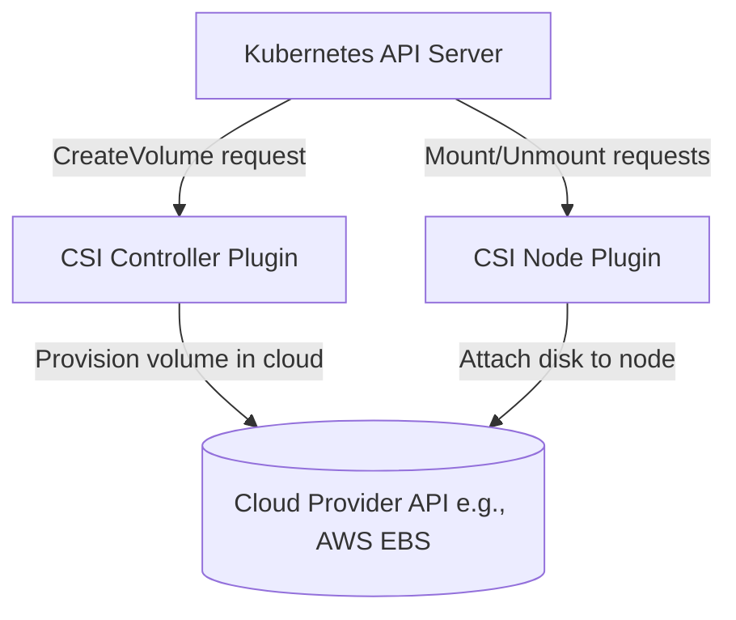
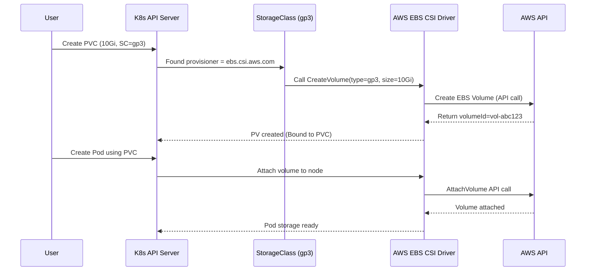
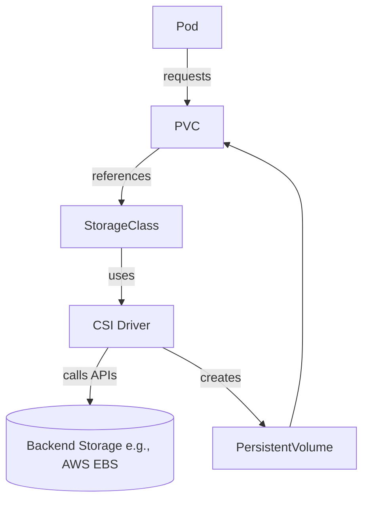

# 🧠 **StorageClass & CSI Drivers** — The Real Engine Behind Kubernetes Storage

## 📖 **The Real Role of a StorageClass**

The **StorageClass** in Kubernetes is _not_ a storage resource itself — it’s a **blueprint (policy)** that tells Kubernetes:

> “When someone requests a PVC that references me, use this driver, with these parameters, to create the actual volume.”

Think of it like a **template** for automatic disk creation.

---

### 🧩 Example: AWS gp3 StorageClass

```yaml
apiVersion: storage.k8s.io/v1
kind: StorageClass
metadata:
  name: gp3
provisioner: ebs.csi.aws.com
parameters:
  type: gp3
  fsType: ext4
  encrypted: "true"
reclaimPolicy: Delete
volumeBindingMode: WaitForFirstConsumer
allowVolumeExpansion: true
```

Now let’s decode this piece by piece 👇

---

## 🤔 **How Kubernetes Knows Which Plugin to Use**

The key field here is:

```yaml
provisioner: ebs.csi.aws.com
```

This value tells Kubernetes **which CSI driver** to call when provisioning storage.

Behind the scenes:

- Each CSI driver runs as a **Kubernetes Deployment + DaemonSet** inside your cluster (installed via Helm or `kubectl apply` from the vendor).
- It registers itself to the Kubernetes API via a **CSIDriver** object.

To check which CSI drivers exist:

```bash
kubectl get csidrivers
```

Example output:

```ini
NAME                ATTACHREQUIRED   PODINFOONMOUNT   MODE
ebs.csi.aws.com     true             false            Persistent
efs.csi.aws.com     true             false            Persistent
```

So when a PVC references a StorageClass with `provisioner: ebs.csi.aws.com`,
Kubernetes knows:

> “Hey, there’s a CSI driver called `ebs.csi.aws.com` running in my cluster — I’ll send it a `CreateVolume` request.”

---

## 🧩 **CSI Components in the Cluster**

Each CSI driver has two main logical parts:

<div align="center" style="background-color: #141a19ff;color: #a8a5a5ff; border-radius: 10px; border: 2px solid">



| Component                | Runs As              | Responsibility                                            |
| ------------------------ | -------------------- | --------------------------------------------------------- |
| **External Provisioner** | Controller           | Watches for new PVCs → asks CSI driver to create a volume |
| **External Attacher**    | Controller           | Manages attach/detach operations                          |
| **External Resizer**     | Controller           | Handles PVC resize requests                               |
| **External Snapshotter** | Controller           | Manages snapshots                                         |
| **Node Plugin**          | DaemonSet (per node) | Mounts/Unmounts the volume inside Pods                    |

</div>

These are usually installed automatically when you deploy a CSI driver.

---

## 🔒 **But Wait — How Does the CSI Driver Talk to AWS or Azure?**

💡 **Through Kubernetes Secrets + IAM Roles.**

### For Cloud Environments (e.g., AWS EBS CSI):

- The CSI driver pods (in `kube-system` namespace) run on nodes that already have **IAM permissions** to manage EBS volumes.
- This is typically achieved through:

  - **IAM Roles for Service Accounts (IRSA)** on EKS
  - Or **EC2 instance roles** on worker nodes

So when Kubernetes says:

> “Hey CSI driver, create a 10Gi gp3 volume,”

The driver calls AWS APIs like:

```bash
aws ec2 create-volume --volume-type gp3 --size 10 --availability-zone us-east-1a
```

using **its own AWS credentials** (not the user’s).

You never put AWS access keys in YAML files — it’s handled via the node’s IAM or ServiceAccount role.

---

### 🔐 For On-Prem or Custom Drivers

If the storage system isn’t cloud-native (like NFS, Ceph, or OpenEBS):

- The CSI driver’s Deployment usually mounts a **Secret** containing credentials.
- That secret is referenced in the driver’s configuration.

Example (Ceph RBD CSI):

```yaml
apiVersion: v1
kind: Secret
metadata:
  name: ceph-secret
type: kubernetes.io/rbd
data:
  key: <base64-encoded-key>
```

Then StorageClass refers to it:

```yaml
parameters:
  csi.storage.k8s.io/provisioner-secret-name: ceph-secret
```

---

## ⁉️ **How the CSI Driver Knows _What_ to Create**

When you create a PVC like this:

```yaml
spec:
  resources:
    requests:
      storage: 20Gi
  storageClassName: gp3
```

Kubernetes passes these details to the **CSI external-provisioner** via a gRPC call.

The provisioner translates them into a `CreateVolume` request:

```json
{
  "name": "pvc-1234abcd",
  "capacity_range": { "required_bytes": 21474836480 },
  "parameters": { "type": "gp3", "fsType": "ext4", "encrypted": "true" },
  "volume_capability": {
    "access_mode": { "mode": "SINGLE_NODE_WRITER" },
    "mount": { "fs_type": "ext4" }
  }
}
```

The CSI driver receives this payload and uses the backend API (like AWS SDK) to create the actual disk.
Then it returns metadata back to Kubernetes:

```json
{
  "volume": {
    "volume_id": "vol-0abc123456789def",
    "capacity_bytes": 21474836480
  }
}
```

Kubernetes then creates a **PersistentVolume** object with:

```yaml
csi:
  driver: ebs.csi.aws.com
  volumeHandle: vol-0abc123456789def
```

---

## ⚙️ **Binding Logic Recap**

<div align="center" style="background-color: #141a19ff;color: #a8a5a5ff; border-radius: 10px; border: 2px solid">

| Step | Actor                | Action                                               |
| ---- | -------------------- | ---------------------------------------------------- |
| 1️⃣   | User                 | Creates PVC referencing `gp3`                        |
| 2️⃣   | Kubernetes           | Looks up StorageClass → sees `ebs.csi.aws.com`       |
| 3️⃣   | External Provisioner | Calls `CreateVolume` via CSI                         |
| 4️⃣   | AWS                  | Creates actual EBS volume                            |
| 5️⃣   | Kubernetes           | Creates PV object and binds it to PVC                |
| 6️⃣   | Pod                  | Mounts PVC → CSI Node Plugin attaches volume to node |

</div>

---

## ⚡ **Key StorageClass Parameters That Matter**

<div align="center" style="background-color: #141a19ff;color: #a8a5a5ff; border-radius: 10px; border: 2px solid">

| Field                  | Description                      | Example                               |
| ---------------------- | -------------------------------- | ------------------------------------- |
| `provisioner`          | Which CSI driver to use          | `ebs.csi.aws.com`                     |
| `parameters`           | Backend-specific options         | `type: gp3`, `fsType: ext4`           |
| `reclaimPolicy`        | What happens when PVC is deleted | `Retain`, `Delete`                    |
| `volumeBindingMode`    | When volume is created           | `Immediate` or `WaitForFirstConsumer` |
| `allowVolumeExpansion` | Enables resizing                 | `true`                                |

</div>

---

### 📦 `volumeBindingMode`

One of the most underrated fields.

- **Immediate** → Volume created immediately when PVC is created.
- **WaitForFirstConsumer** → Volume created only when a Pod actually uses the PVC.
  Useful for zone-aware volumes (EBS, Azure Disk).

---

## 🧭 **How Kubernetes Handles Availability Zones**

For cloud storage (EBS, Azure Disk, etc.):

- Volumes are **zonal** (can attach only to nodes in the same zone).
- The **WaitForFirstConsumer** binding mode ensures:

  - Scheduler picks a node first.
  - Then CSI creates the volume in that node’s zone.

So that the volume and Pod always align in zone.

---

## 🧩 **Checking and Managing CSI Resources**

See all storage classes:

```bash
kubectl get storageclass
```

Describe one:

```bash
kubectl describe storageclass gp3
```

List PVs provisioned by a StorageClass:

```bash
kubectl get pv -o wide | grep gp3
```

Inspect CSI driver registration:

```bash
kubectl get csidrivers
```

View CSI pods:

```bash
kubectl get pods -n kube-system | grep csi
```

---

## 🧰 **Troubleshooting StorageClass / CSI**

<div align="center" style="background-color: #141a19ff;color: #a8a5a5ff; border-radius: 10px; border: 2px solid">

| Symptom                       | Likely Cause                            | Fix                                             |
| ----------------------------- | --------------------------------------- | ----------------------------------------------- |
| PVC stuck in `Pending`        | CSI driver not installed or SC misnamed | Check `provisioner` matches existing CSI driver |
| PV created but not bound      | Access mode mismatch                    | Match `RWO/RWX`                                 |
| Pod stuck `ContainerCreating` | Volume attach failure                   | Check node logs `/var/log/kubelet.log`          |
| Volume deleted unexpectedly   | SC reclaimPolicy=`Delete`               | Change to `Retain`                              |
| Resize fails                  | SC missing `allowVolumeExpansion`       | Add it and reapply                              |

</div>

---

## ✍🏻 **Real Example — End-to-End AWS CSI Flow**

Let’s visualize the full sequence 👇

<div align="center" style="background-color: #141a19ff;color: #a8a5a5ff; border-radius: 10px; border: 2px solid">



</div>

---

## ➕ **Advanced Feature: Topology-Aware Storage**

CSI drivers can define _topology keys_ like:

```ini
topology.kubernetes.io/zone
topology.kubernetes.io/region
```

Kubernetes uses these to ensure:

- Volumes are created in the same zone as Pods.
- Scheduler knows which nodes can attach which volumes.

---

## 🔑 **Key Takeaways**

<div align="center" style="background-color: #141a19ff;color: #a8a5a5ff; border-radius: 10px; border: 2px solid">

| Concept               | Summary                                                |
| --------------------- | ------------------------------------------------------ |
| **StorageClass**      | Policy that defines how dynamic volumes are created    |
| **CSI Driver**        | Plugin that actually creates and manages the real disk |
| **provisioner**       | Field in SC that links it to a CSI driver              |
| **Parameters**        | Backend-specific instructions (type, fsType, etc.)     |
| **IAM/Secrets**       | Used by driver to authenticate to backend              |
| **volumeBindingMode** | Controls provisioning timing (zone-aware logic)        |

</div>

---

## 🎉 **Bonus — How to View CSI Driver Internals**

You can inspect driver pods:

```bash
kubectl -n kube-system get pods | grep ebs
```

and view logs:

```bash
kubectl -n kube-system logs <ebs-provisioner-pod> -c ebs-plugin
```

Common containers inside a CSI pod:

- `csi-provisioner`
- `csi-attacher`
- `csi-resizer`
- `liveness-probe`
- `<driver-name>` (e.g., `ebs-plugin`)

---

## 🧭 **Summary Diagram**

<div align="center" style="background-color: #141a19ff;color: #a8a5a5ff; border-radius: 10px; border: 2px solid">



</div>

---

## ✅ **In Summary**

- The **StorageClass** is the “policy template”.
- The **CSI driver** is the “worker” that actually creates the disk.
- The **Kubernetes controller** orchestrates binding between PVC ↔ PV.
- **IAM roles or Secrets** provide secure backend access.
- **volumeBindingMode**, **reclaimPolicy**, and **parameters** define provisioning behavior.

---

### 🔮 Up Next (Recommended Order)

Now that you understand how the **StorageClass + CSI system** truly works,
you’re ready for:

1. 🧱 **PersistentVolumes (PV)** — lifecycle, reclaim, inspection
2. 📜 **PersistentVolumeClaims (PVC)** — binding logic, resizing
3. 🔧 **Data Operations & Troubleshooting Storage** — resizing, backups, CSI event analysis
