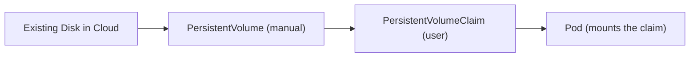
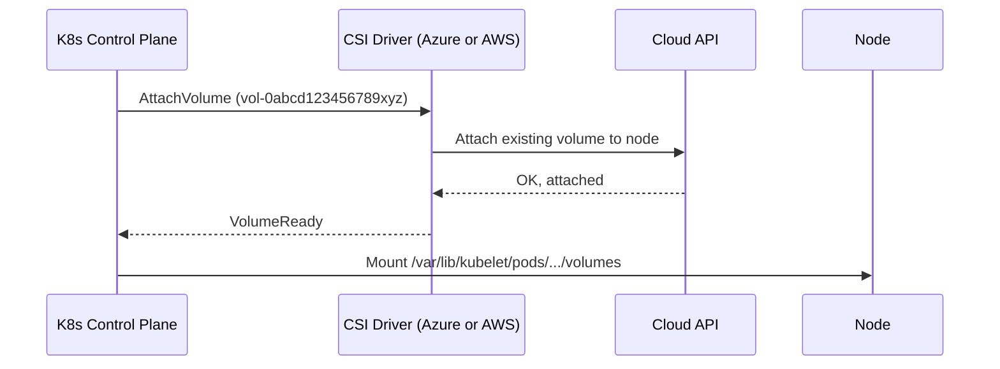
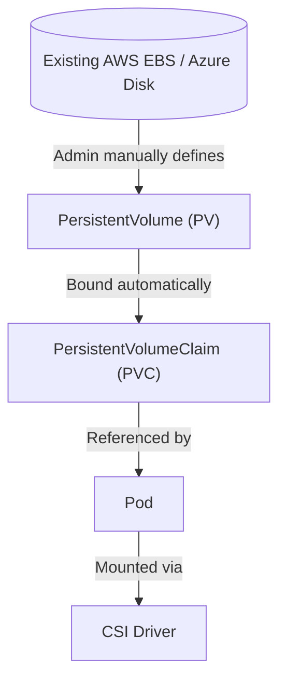

# 🦥 **Static Provisioning Deep Dive**

## 📖 **Concept Overview**

Normally when you use a StorageClass (like `gp3`), Kubernetes dynamically creates a **new disk** each time a PVC is created.

But if you already have disks (like pre-provisioned EBS volumes or Azure Managed Disks), you can **manually register** them in Kubernetes as **PersistentVolumes (PVs)** and **bind** them to **PVCs** manually.

This is known as **static provisioning**.

---

## 🖼️ **Architecture Recap**

<div align="center" style="background-color: #141a19ff;color: #a8a5a5ff; border-radius: 10px; border: 2px solid">



</div>

---

In dynamic provisioning:

- PVs are created automatically by the StorageClass and CSI driver.

In static provisioning:

- You **create the PV yourself** and tell Kubernetes which existing disk to use.

---

## ☁️ **Case 1: AWS EBS — Using Existing EBS Volume**

### Step 1️⃣ — Check your existing EBS volume

You can list existing volumes in AWS:

```bash
aws ec2 describe-volumes --region us-east-1 --query "Volumes[*].{ID:VolumeId,AZ:AvailabilityZone,State:State,Size:Size}"
```

Let’s say you already have:

```ini
vol-0abcd123456789xyz  | us-east-1a | in-use=false | 20GiB
```

That’s your target volume.

---

### Step 2️⃣ — Create a PersistentVolume (PV)

Here’s how you manually register that EBS volume:

```yaml
apiVersion: v1
kind: PersistentVolume
metadata:
  name: pv-existing-ebs
spec:
  capacity:
    storage: 20Gi
  accessModes:
    - ReadWriteOnce
  storageClassName: manual
  persistentVolumeReclaimPolicy: Retain
  csi:
    driver: ebs.csi.aws.com
    volumeHandle: vol-0abcd123456789xyz # your actual AWS volume ID
    fsType: ext4
```

**Notes:**

- `volumeHandle` is literally your existing AWS EBS volume ID.
- `storageClassName: manual` is optional — but we’ll match it later in PVC.
- `persistentVolumeReclaimPolicy: Retain` ensures Kubernetes won’t delete the disk if you delete the claim.

---

### Step 3️⃣ — Create a PersistentVolumeClaim (PVC)

```yaml
apiVersion: v1
kind: PersistentVolumeClaim
metadata:
  name: pvc-existing-ebs
spec:
  accessModes:
    - ReadWriteOnce
  resources:
    requests:
      storage: 20Gi
  storageClassName: manual
```

When this PVC is created:

- Kubernetes sees the PV “pv-existing-ebs” matches the PVC specs (same size, access mode, SC name).
- It automatically binds the PVC to that PV.
- You can verify:

```bash
kubectl get pv,pvc
```

You should see:

```ini
NAME                CAPACITY   ACCESS MODES   RECLAIM POLICY   STATUS   CLAIM                   STORAGECLASS
pv-existing-ebs     20Gi       RWO            Retain           Bound    default/pvc-existing-ebs   manual
```

---

### Step 4️⃣ — Mount in a Pod

```yaml
apiVersion: v1
kind: Pod
metadata:
  name: test-ebs
spec:
  containers:
    - name: app
      image: nginx
      volumeMounts:
        - mountPath: /usr/share/nginx/html
          name: ebsdata
  volumes:
    - name: ebsdata
      persistentVolumeClaim:
        claimName: pvc-existing-ebs
```

Now your Pod will mount the **existing EBS volume** directly.

If you write to `/usr/share/nginx/html`, the data is saved on your existing disk!

---

### Step 5️⃣ — Confirm the Mount

Inside the Pod:

```bash
kubectl exec -it test-ebs -- df -h
```

You’ll see your `/usr/share/nginx/html` mounted to `/var/lib/kubelet/pods/.../volumes/kubernetes.io~csi/...`

---

## 🔥 **Tip: Retain Policy for Safety**

If you delete your PVC or Pod, the EBS volume is **not deleted** because of:

```yaml
persistentVolumeReclaimPolicy: Retain
```

That’s crucial when using existing disks — otherwise, you risk Kubernetes deleting your real data.

---

## ☁️ **Case 2: Azure Disk — Using Existing Managed Disk**

The concept is the same; the driver and syntax differ slightly.

### Step 1️⃣ — Find your existing Azure disk

List your managed disks:

```bash
az disk list --resource-group myResourceGroup --query "[].{Name:name,Id:id,Size:diskSizeGb,Zone:zones}" -o table
```

Assume the disk ID is:

```ini
/subscriptions/xxxxx/resourceGroups/myResourceGroup/providers/Microsoft.Compute/disks/my-existing-disk
```

---

### Step 2️⃣ — Create the PV

```yaml
apiVersion: v1
kind: PersistentVolume
metadata:
  name: pv-existing-azuredisk
spec:
  capacity:
    storage: 20Gi
  accessModes:
    - ReadWriteOnce
  storageClassName: manual
  persistentVolumeReclaimPolicy: Retain
  csi:
    driver: disk.csi.azure.com
    volumeHandle: /subscriptions/xxxxx/resourceGroups/myResourceGroup/providers/Microsoft.Compute/disks/my-existing-disk
    fsType: ext4
```

💡 The `volumeHandle` is the **full Azure Resource ID** of the existing disk.

---

### Step 3️⃣ — Create the PVC

```yaml
apiVersion: v1
kind: PersistentVolumeClaim
metadata:
  name: pvc-existing-azuredisk
spec:
  accessModes:
    - ReadWriteOnce
  resources:
    requests:
      storage: 20Gi
  storageClassName: manual
```

Kubernetes binds them automatically (same as AWS case).

---

### Step 4️⃣ — Mount in a Pod

```yaml
apiVersion: v1
kind: Pod
metadata:
  name: test-azuredisk
spec:
  containers:
    - name: web
      image: nginx
      volumeMounts:
        - mountPath: /mnt/azure
          name: azdata
  volumes:
    - name: azdata
      persistentVolumeClaim:
        claimName: pvc-existing-azuredisk
```

Done — your Pod now uses your existing Azure disk. 🟢

---

## ⚙️ **Static vs Dynamic Summary**

<div align="center" style="background-color: #141a19ff;color: #a8a5a5ff; border-radius: 10px; border: 2px solid">

| Aspect                | Static Provisioning                    | Dynamic Provisioning                   |
| --------------------- | -------------------------------------- | -------------------------------------- |
| Who creates PV        | Admin manually                         | Kubernetes auto-creates                |
| When PV created       | Before PVC                             | After PVC creation                     |
| StorageClass required | Optional                               | Required                               |
| Common use case       | Reuse existing disks, migrate old data | Cloud-native app deployments           |
| Risk of deletion      | Controlled by `Retain`                 | Controlled by SC policy                |
| Example               | Pre-existing AWS EBS / Azure Disk      | New volume from gp3 or managed-premium |

</div>

---

## 👀 **Behind the Scenes (CSI Driver View)**

Even though you’re using an existing volume, the **CSI driver** still participates:

- It still handles the **mount/attach/detach** operations.
- But it skips **CreateVolume**, since the volume already exists.

The PV `csi.volumeHandle` tells the driver which existing backend volume to attach to the node.

Example flow:

<div align="center" style="background-color: #141a19ff;color: #a8a5a5ff; border-radius: 10px; border: 2px solid">



</div>

---

So the volumeHandle bridges Kubernetes PV to real backend volume.

---

## 🔂 **Reusing Volumes Across Clusters**

You can attach the same volume to a new cluster — but be careful:

- Most volumes (`ReadWriteOnce`) can only be attached to **one node at a time**.
- You must **detach** it from any old EC2/VM before Kubernetes can use it again.
- For shared access, you need `ReadWriteMany` backends like:

  - AWS EFS
  - Azure Files
  - NFS
  - CephFS

---

## 💡 **Troubleshooting Tips**

<div align="center" style="background-color: #141a19ff;color: #a8a5a5ff; border-radius: 10px; border: 2px solid">

| Symptom                       | Root Cause                      | Fix                           |
| ----------------------------- | ------------------------------- | ----------------------------- |
| PVC stuck in `Pending`        | PV size/SC mismatch             | Match specs exactly           |
| Pod stuck `ContainerCreating` | Volume still attached elsewhere | Detach from old EC2/VM        |
| Volume attach failed          | Wrong AZ or node                | Check zone alignment          |
| Volume deleted accidentally   | Wrong reclaim policy            | Always use `Retain`           |
| “Read-only filesystem”        | Volume was previously used      | Reformat or fsck before reuse |

</div>

---

## 💭 **Migration Use Case (Common Real-World Scenario)**

Imagine:

- You ran an app directly on EC2 with EBS volumes.
- Now you’re moving that app into Kubernetes.

✅ You can reuse your EBS data:

1. Stop EC2 instance.
2. Note the EBS volume ID.
3. Create PV using that volumeHandle.
4. Bind to PVC.
5. Mount in Pod.
6. Your data is now accessible inside Kubernetes.

That’s how large enterprises migrate legacy workloads without data loss.

---

## 🧰 **Key Takeaways**

<div align="center" style="background-color: #141a19ff;color: #a8a5a5ff; border-radius: 10px; border: 2px solid">

| Concept                  | Explanation                                                      |
| ------------------------ | ---------------------------------------------------------------- |
| **Static Provisioning**  | Manually create PVs for existing disks                           |
| **Dynamic Provisioning** | Kubernetes auto-creates PVs via StorageClass                     |
| **volumeHandle**         | Unique backend disk identifier (EBS ID, Azure resource ID, etc.) |
| **CSI Driver**           | Still handles mount/attach even in static mode                   |
| **ReclaimPolicy**        | Use `Retain` for existing volumes                                |
| **Zone Awareness**       | Ensure PV and Node are in same AZ                                |
| **RWX/RWO Modes**        | Match your backend capability                                    |

</div>

---

## 🏁 **Diagram Summary**

<div align="center" style="background-color: #141a19ff;color: #a8a5a5ff; border-radius: 10px; border: 2px solid">



</div>

---

✅ **In short:**

- Yes — you can absolutely use your existing AWS EBS or Azure disks.
- You just register them as **PersistentVolumes** manually using the correct `volumeHandle`.
- Kubernetes won’t create or delete them (if you set `Retain`).
- The CSI driver only attaches/detaches/mounts them.
