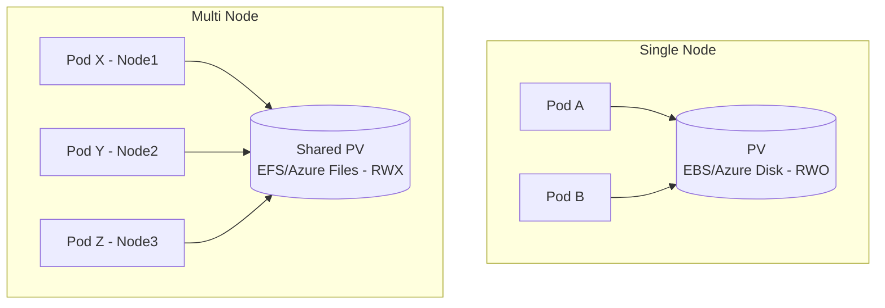

# 🔗 **Sharing a PersistentVolume Between Multiple Pods**

## 👉🏻 **The Core Rule: Access Modes Control Sharing**

Every PersistentVolume (PV) in Kubernetes defines one or more **access modes**.

<div align="center" style="background-color: #141a19ff;color: #a8a5a5ff; border-radius: 10px; border: 2px solid">

| Access Mode                   | Meaning                                           | Sharing Behavior                       |
| ----------------------------- | ------------------------------------------------- | -------------------------------------- |
| `ReadWriteOnce` (**RWO**)     | Can be mounted _as read/write by only one node_   | ❌ Not shareable across multiple nodes |
| `ReadWriteMany` (**RWX**)     | Can be mounted _as read/write by many nodes/pods_ | ✅ Shareable                           |
| `ReadOnlyMany` (**ROX**)      | Can be mounted _as read-only by many nodes/pods_  | ⚠️ Shareable (read-only)               |
| `ReadWriteOncePod` (**RWOP**) | Mounted _by one Pod only_, even on same node      | ❌ Strictly one pod                    |

</div>

---

So the _answer_ depends entirely on what **access mode** your backend supports.

---

## ☁️ **Common Storage Backends and Their Supported Modes**

<div align="center" style="background-color: #141a19ff;color: #a8a5a5ff; border-radius: 10px; border: 2px solid">

| Storage Backend               | RWO | RWX | ROX | Notes                                 |
| ----------------------------- | --- | --- | --- | ------------------------------------- |
| AWS EBS                       | ✅  | ❌  | ❌  | Zonal block storage, single-node only |
| Azure Disk                    | ✅  | ❌  | ❌  | Same as EBS                           |
| GCP Persistent Disk           | ✅  | ❌  | ❌  | Same                                  |
| AWS EFS                       | ✅  | ✅  | ✅  | Network filesystem, great for sharing |
| Azure Files                   | ✅  | ✅  | ✅  | SMB/NFS shared backend                |
| NFS Server                    | ✅  | ✅  | ✅  | Classic shared network storage        |
| CephFS / GlusterFS            | ✅  | ✅  | ✅  | Distributed FS supports sharing       |
| Longhorn / OpenEBS (RWX mode) | ✅  | ✅  | ✅  | Can be configured as shared backend   |

</div>

---

So:

- If you’re using **EBS** or **Azure Disk** → ❌ cannot share across nodes
- If you’re using **EFS**, **Azure Files**, or **NFS** → ✅ fully shareable

---

## ⁉️ **Why EBS or Azure Disk Cannot Be Shared**

EBS and Azure Disk are **block-level volumes**, not **network file systems**.
That means they can only be attached to **one node at a time** in “read/write” mode.

If you try to attach the same PV to multiple Pods on _different nodes_, one of these happens:

- Pod 2 gets stuck in `ContainerCreating`
- Event shows:

  ```ini
  Multi-Attach error for volume "pvc-xxxx": Volume is already exclusively attached to one node
  ```

That’s by design — the disk can’t be mounted in multiple places simultaneously (without a cluster FS like GFS2).

---

## ⚙️ **How to Share Volumes Properly — 3 Working Patterns**

Let’s go through real, working patterns.

---

### 🧩 Pattern 1 — Shared Read/Write Volume (RWX) via AWS EFS or Azure Files

If you want **true multi-pod read/write sharing**, use a **network filesystem**.

#### Example: AWS EFS (Elastic File System)

```yaml
apiVersion: storage.k8s.io/v1
kind: StorageClass
metadata:
  name: efs-sc
provisioner: efs.csi.aws.com
```

PVC:

```yaml
apiVersion: v1
kind: PersistentVolumeClaim
metadata:
  name: shared-data
spec:
  accessModes:
    - ReadWriteMany
  storageClassName: efs-sc
  resources:
    requests:
      storage: 5Gi
```

Pods:

```yaml
apiVersion: v1
kind: Pod
metadata:
  name: app1
spec:
  containers:
    - name: web1
      image: nginx
      volumeMounts:
        - mountPath: /data
          name: shared
  volumes:
    - name: shared
      persistentVolumeClaim:
        claimName: shared-data
---
apiVersion: v1
kind: Pod
metadata:
  name: app2
spec:
  containers:
    - name: web2
      image: nginx
      volumeMounts:
        - mountPath: /data
          name: shared
  volumes:
    - name: shared
      persistentVolumeClaim:
        claimName: shared-data
```

✅ Both `app1` and `app2` can **read/write** to `/data` simultaneously.

---

#### Example: Azure Files (same idea)

StorageClass:

```yaml
apiVersion: storage.k8s.io/v1
kind: StorageClass
metadata:
  name: azurefile-sc
provisioner: file.csi.azure.com
parameters:
  skuName: Standard_LRS
```

PVC:

```yaml
apiVersion: v1
kind: PersistentVolumeClaim
metadata:
  name: shared-data
spec:
  accessModes:
    - ReadWriteMany
  resources:
    requests:
      storage: 5Gi
  storageClassName: azurefile-sc
```

✅ Both Pods on _any_ node can mount `/data` and share files instantly.

---

### 🧩 Pattern 2 — Shared ReadOnly Volume (ROX)

Sometimes you want multiple Pods to _read the same dataset_ (e.g., configuration files, models, reference data).

Then you can use `ReadOnlyMany` (ROX):

```yaml
accessModes:
  - ReadOnlyMany
```

Multiple Pods can mount the same PV — but only read from it.

> 💡 Useful for ML models, static assets, or precomputed results.

---

### 🧩 Pattern 3 — One Node, Multiple Pods (Same PV, RWO)

If multiple Pods happen to be **scheduled on the same node**,
and your PV supports `ReadWriteOnce`, they _can_ share it locally.

Example:

- 3 Pods on same node
- All use same PVC with `ReadWriteOnce`

That’s allowed because the volume is only attached **once** to the node, not multiple times across nodes.

Kubernetes enforces **node-level exclusivity**, not Pod-level.

> ⚠️ But if any of those Pods move to another node → attachment conflict.

---

## 🚨 **PV/PVC Capacity When Shared Across Pods**

✅ **So to your question:**

> “If PV is 50 Gi and PVC is 50 Gi, does each pod get 50 Gi?”

**Answer:**  
❌ No — all Pods share the same 50 Gi total. It’s a shared pool, not duplicated capacity.

---

### ⚙️ The PV defines **total capacity**, not per-pod quota

When you create:

```yaml
PersistentVolume:
  capacity:
    storage: 50Gi
```

That means **the whole EFS volume is represented as “50Gi” of logical capacity**, but **Kubernetes does not enforce any quota per Pod or PVC**.  
It’s just **a declaration**, not an enforced limit.

> 🧩 Think of it like a 50 GB shared folder — if 5 Pods mount it, they’re all writing into the same folder. The 50 GB is **shared**, not multiplied.

---

### 🧮 The PVC “requests” capacity, not “reserves” it

When your PVC says:

```yaml
resources:
  requests:
    storage: 50Gi
```

That means:

> “I need a volume that can provide up to 50 GiB capacity.”

It does **not** mean each Pod gets 50 GiB guaranteed or reserved.
Kubernetes uses that number only for **binding and scheduling**, not quota enforcement.

---

### 🧩 Multiple Pods share the same data and space

If all Pods reference the same PVC:

```yaml
volumes:
  - name: logs
    persistentVolumeClaim:
      claimName: shared-logs
```

Then:

- They all see the _same filesystem path_.
- They all read/write the same files.
- They all share the same total available storage (50 GiB).

So if Pod A writes 20 GiB and Pod B writes 15 GiB, only 15 GiB remain free.

> ⚠️ No automatic partitioning or per-Pod isolation exists.

---

### 📘 Enforcement and Quotas (if you need them)

If you want each Pod/team to have **its own quota**, you have two main choices:

**🧩 Option 1 — Separate PVCs per team (recommended):**

Create one PVC per team/app (possibly from the same EFS filesystem via Access Points):

```yaml
PVC team-a → Access Point /k8s/team-a (50Gi)
PVC team-b → Access Point /k8s/team-b (50Gi)
```

Then each has its own subdirectory, permissions, and logical quota.

You can track usage per directory in EFS metrics or CloudWatch.

---

**🧩 Option 2 — Enforce quota inside EFS:**

AWS EFS itself does not enforce hard quotas natively, but you can:

- Use **EFS File Sync reports** or **AWS CloudWatch metrics** to monitor usage.
- Use **Access Points** + **IAM policies** to restrict apps to specific subpaths.
- For hard quotas, use a **user-space quota tool** inside the container (e.g., `xfs_quota` if using XFS layer over EFS, or per-directory monitoring).

---

## ✅ **Best Practice — Use the Right Backend for RWX**

If you need shared data across Pods, use a **shared filesystem backend**.
Here’s a quick cheat sheet:

<div align="center" style="background-color: #141a19ff;color: #a8a5a5ff; border-radius: 10px; border: 2px solid">

| Cloud   | Recommended RWX Solution     | CSI Provisioner                         |
| ------- | ---------------------------- | --------------------------------------- |
| AWS     | **EFS**                      | `efs.csi.aws.com`                       |
| Azure   | **Azure Files**              | `file.csi.azure.com`                    |
| GCP     | **Filestore**                | `filestore.csi.storage.gke.io`          |
| On-Prem | **NFS / CephFS / GlusterFS** | `nfs.csi.k8s.io`, `cephfs.csi.ceph.com` |

</div>

---

## ➕ **Special Advanced Option — Shared EmptyDir via Sidecar**

If all Pods are in the **same Pod spec** (multi-container Pod),
they can share data via `emptyDir` volumes.

Example:

```yaml
apiVersion: v1
kind: Pod
metadata:
  name: shared
spec:
  volumes:
    - name: shared-volume
      emptyDir: {}
  containers:
    - name: app1
      image: busybox
      volumeMounts:
        - name: shared-volume
          mountPath: /tmp/data
    - name: app2
      image: busybox
      volumeMounts:
        - name: shared-volume
          mountPath: /tmp/data
```

✅ Both containers share `/tmp/data` inside one Pod.  
❌ But not across multiple Pods — only within one Pod.

---

## 🧪 **Troubleshooting Multi-Pod Access**

<div align="center" style="background-color: #141a19ff;color: #a8a5a5ff; border-radius: 10px; border: 2px solid">

| Symptom                           | Root Cause                          | Fix                                     |
| --------------------------------- | ----------------------------------- | --------------------------------------- |
| `Multi-Attach error for volume`   | Trying to share EBS/AzureDisk RWO   | Switch to RWX storage (EFS/Azure Files) |
| Pod stuck `ContainerCreating`     | PV attached to another node         | Ensure backend supports multi-attach    |
| “read-only file system”           | Backend driver does not support RWX | Use correct provisioner                 |
| Works only when Pods on same node | Backend = block storage             | Expected for RWO                        |

</div>

---

## ✍🏻 **Quick Real-Life Example Comparison**

<div align="center" style="background-color: #141a19ff;color: #a8a5a5ff; border-radius: 10px; border: 2px solid">

| Use Case                                | Storage Type | Access Mode | Example Backend                      |
| --------------------------------------- | ------------ | ----------- | ------------------------------------ |
| Database (PostgreSQL, MySQL)            | Block        | RWO         | AWS EBS / Azure Disk                 |
| Shared app logs                         | File         | RWX         | AWS EFS / Azure Files                |
| Shared static files                     | File         | RWX         | NFS / Azure Files                    |
| Model weights (read-only)               | File         | ROX         | NFS / CephFS                         |
| Cache across replicas (not recommended) | File         | RWX         | Redis typically uses memory, not PVs |

</div>

---

## 🧭 **Visual Recap**

<div align="center" style="background-color: #141a19ff;color: #a8a5a5ff; border-radius: 10px; border: 2px solid">



</div>

---

- **Left:** EBS/Disk — works only if Pods are on the _same node_.
- **Right:** EFS/Files — works across _many nodes at once_.

---

## 🏁 **Summary**

<div align="center" style="background-color: #141a19ff;color: #a8a5a5ff; border-radius: 10px; border: 2px solid">

| Scenario                                             | Can Share PV? | Recommended Backend        |
| ---------------------------------------------------- | ------------- | -------------------------- |
| Multiple Pods on **same node**                       | ✅ (RWO)      | EBS / Azure Disk           |
| Multiple Pods on **different nodes**, **read/write** | ✅            | EFS / Azure Files / NFS    |
| Multiple Pods on **different nodes**, **read-only**  | ✅            | Any backend supporting ROX |
| Database Pods (need exclusive access)                | ❌            | Block storage (RWO only)   |

</div>

---

## 🧠 **In Practice — What to Remember**

> “Sharing = RWX.
> RWX = Network filesystem.
> Block disks = RWO only.”

Simple rule, always true.
