# 🧰 **Data Operations (PV/PVC Lifecycle Management)**

## ⚙️ **Resizing PersistentVolumes**

### 💡 When You Can Resize

You can increase PVC size **only if**:

- The **StorageClass** allows it:

  ```yaml
  allowVolumeExpansion: true
  ```

- The **driver supports online expansion** (CSI-based, like AWS EBS, EFS, Azure Disk, Azure Files, etc.).

### 🧩 How to Resize

1️⃣ Edit PVC:

```bash
kubectl edit pvc mydata
```

Then modify:

```yaml
spec:
  resources:
    requests:
      storage: 20Gi # old was 10Gi
```

2️⃣ Check status:

```bash
kubectl get pvc mydata
```

Wait until it returns `Bound` and `FileSystemResizePending` clears.

3️⃣ Inside Pod:

```bash
df -h /data
```

If filesystem isn’t auto-expanded, restart the Pod to remount the volume.

> 💡 For **EBS/AzureDisk**, filesystem expansion happens automatically since Kubernetes 1.24+.

---

## 🧩 **Cloning PVCs**

> Great for creating test or dev copies of live data.

### ✅ Requirements

- CSI driver must support `VolumePVCDataSource`.
- Same StorageClass and namespace (for in-tree).
- Source PVC must be `Bound`.

### 📘 Example

```yaml
apiVersion: v1
kind: PersistentVolumeClaim
metadata:
  name: cloned-pvc
spec:
  dataSource:
    name: original-pvc
    kind: PersistentVolumeClaim
  accessModes:
    - ReadWriteOnce
  resources:
    requests:
      storage: 10Gi
  storageClassName: gp3
```

```bash
kubectl get pvc
# cloned-pvc will be Bound once data is copied
```

> 💡 Some CSI drivers (like EBS, AzureDisk, etc.) perform fast, snapshot-based cloning.

---

## 📸 **Snapshots — Time Travel for PVCs**

> Snapshots capture the exact data state at a specific moment. Perfect for rollback or backup.

### 🧩 Prerequisites

- Snapshot CRDs must be installed:

  ```bash
  kubectl get crd | grep snapshot
  ```

  You should see:

  - `volumesnapshotclasses.snapshot.storage.k8s.io`
  - `volumesnapshots.snapshot.storage.k8s.io`
  - `volumesnapshotcontents.snapshot.storage.k8s.io`

### 🧱 Snapshot Class

```yaml
apiVersion: snapshot.storage.k8s.io/v1
kind: VolumeSnapshotClass
metadata:
  name: ebs-snapclass
driver: ebs.csi.aws.com
deletionPolicy: Delete
```

### 🗂 Snapshot Creation

```yaml
apiVersion: snapshot.storage.k8s.io/v1
kind: VolumeSnapshot
metadata:
  name: app-backup
spec:
  volumeSnapshotClassName: ebs-snapclass
  source:
    persistentVolumeClaimName: app-pvc
```

Check snapshot:

```bash
kubectl get volumesnapshots
```

---

### 💾 Restore From Snapshot

```yaml
apiVersion: v1
kind: PersistentVolumeClaim
metadata:
  name: restored-pvc
spec:
  dataSource:
    name: app-backup
    kind: VolumeSnapshot
    apiGroup: snapshot.storage.k8s.io
  accessModes:
    - ReadWriteOnce
  storageClassName: gp3
  resources:
    requests:
      storage: 10Gi
```

✅ A new PV will be created from the snapshot’s data.

---

## 🔁 **Backup and Restore (Full Data Ops Strategy)**

### 🧱 A. Snapshots = quick in-cluster restore

> For disaster recovery within same cluster or region.

### 🧱 B. External backups (tools)

Use storage-aware tools:

- **Velero** — backs up both manifests and volumes.
- **Kasten K10** — enterprise-grade snapshot + backup.
- **Restic / Rclone** — file-level backups of mounted PVCs.

#### Example: Velero + CSI snapshots

```bash
velero backup create daily-backup --include-namespaces app --snapshot-volumes
```

Restore:

```bash
velero restore create --from-backup daily-backup
```

> 💡 For EBS → integrates with AWS snapshots.
> For Azure → creates Managed Disk snapshots.

---

## 🚚 **Migrating Data Between Clusters or Clouds**

### Option 1 — CSI snapshots

If both clusters share same backend (e.g., AWS account + EBS):

- Create VolumeSnapshot.
- Export snapshot ID.
- Import snapshot in target cluster via same CSI driver.

### Option 2 — File copy (cross-cloud)

If you must migrate data between different cloud vendors:

1. Mount PVC into Pod.
2. Use `rsync`, `rclone`, or `velero` to sync data out.
3. Create new PVC in target cluster.
4. Restore data into it.

Example Pod for rsync:

```yaml
apiVersion: v1
kind: Pod
metadata:
  name: data-migrator
spec:
  containers:
    - name: sync
      image: alpine
      command: ["sh", "-c", "apk add rsync && rsync -av /source/ /dest/"]
      volumeMounts:
        - mountPath: /source
          name: old
        - mountPath: /dest
          name: new
  volumes:
    - name: old
      persistentVolumeClaim:
        claimName: old-pvc
    - name: new
      persistentVolumeClaim:
        claimName: new-pvc
```

---

## 🔍 **Troubleshooting Data Ops**

<div align="center" style="background-color: #141a19ff;color: #a8a5a5ff; border-radius: 10px; border: 2px solid">

| Problem                                       | Cause                                  | Fix                                              |
| --------------------------------------------- | -------------------------------------- | ------------------------------------------------ |
| PVC resize stuck in `FileSystemResizePending` | Pod not restarted                      | Restart pod to remount                           |
| Clone PVC pending                             | Source PVC not Bound                   | Check `kubectl describe pvc`                     |
| Snapshot not created                          | Snapshot CRDs not installed            | Install snapshot controller                      |
| Restore fails                                 | Wrong `apiGroup` in dataSource         | Should be `snapshot.storage.k8s.io`              |
| Backup empty                                  | App still writing data during snapshot | Use pre-snapshot hooks                           |
| Migration slow                                | NFS or EFS throughput limits           | Adjust performance mode or use rsync compression |

</div>

---

## 🧭 **Visual Recap**

```mermaid
flowchart TD
  subgraph Resize
    A1[PVC requests larger storage]
    A2[SC allows expansion]
    A3[PV resized]
  end

  subgraph Clone
    B1[New PVC]
    B2[dataSource: old PVC]
    B3[Cloned volume created]
  end

  subgraph Snapshot
    C1[VolumeSnapshot]
    C2[Stored in backend]
    C3[Restore → new PVC]
  end

  subgraph Backup/Restore
    D1[Velero backup]
    D2[Object storage snapshot]
    D3[Velero restore]
  end

  subgraph Migration
    E1[Pod mounts old+new PVC]
    E2[rsync data]
  end
```

<div align="center" style="background-color: #141a19ff;color: #a8a5a5ff; border-radius: 10px; border: 2px solid">



</div>

---

## ✅ **Key Commands Cheat Sheet**

<div align="center" style="background-color: #141a19ff;color: #a8a5a5ff; border-radius: 10px; border: 2px solid">

| Task                   | Command                           |     |
| ---------------------- | --------------------------------- | --- |
| Resize PVC             | `kubectl edit pvc mypvc`          |     |
| Check expansion status | `kubectl get pvc mypvc -o wide`   |     |
| Create snapshot        | `kubectl apply -f snapshot.yaml`  |     |
| Restore snapshot       | `kubectl apply -f restore.yaml`   |     |
| Clone PVC              | `kubectl apply -f clone.yaml`     |     |
| Check snapshot CRDs    | `kubectl get crd | grep snapshot` |
| Describe PV/PVC        | `kubectl describe pvc mypvc`      |     |
| Watch PVs              | `watch kubectl get pv,pvc`        |     |

</div>

---

## 🔮 **Summary Table**

<div align="center" style="background-color: #141a19ff;color: #a8a5a5ff; border-radius: 10px; border: 2px solid">

| Operation | Supported By         | Notes                                 |
| --------- | -------------------- | ------------------------------------- |
| Resize    | Most CSI drivers     | Must set `allowVolumeExpansion: true` |
| Clone     | CSI drivers          | In same namespace                     |
| Snapshot  | CSI + Snapshot CRDs  | Fast restore point                    |
| Restore   | CSI snapshot restore | Creates new PV                        |
| Backup    | Velero/Kasten        | App + PVC backup                      |
| Migration | rsync / Velero       | Cluster or cloud transfer             |

</div>

---

✅ **In short:**

- Resize = scale up data.
- Clone = duplicate data.
- Snapshot = time-travel restore point.
- Backup = off-cluster protection.
- Migration = move workloads between clusters.
