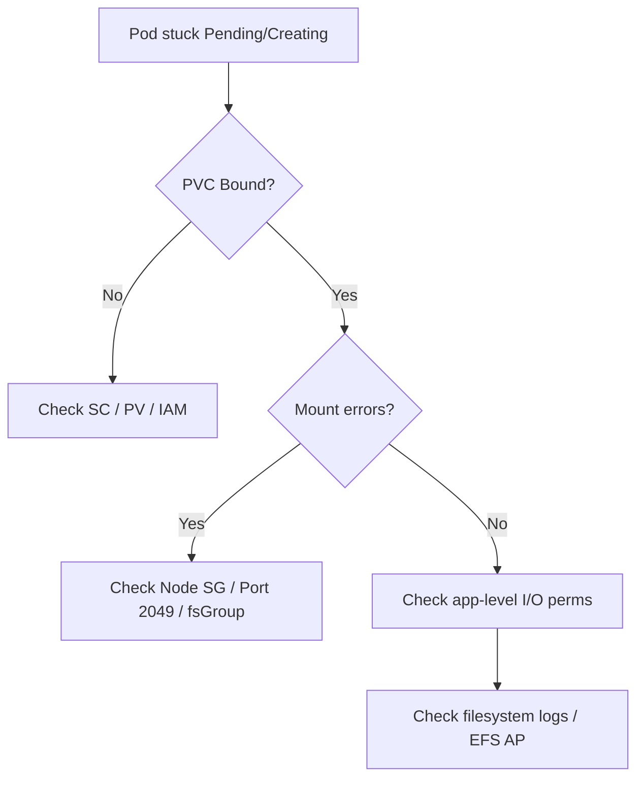

# ⚠️ **Kubernetes Storage Troubleshooting (PV, PVC, CSI, and Mount Issues)**

## 🧭 **Start with the Basics — Identify What’s Broken**

When Pods fail to start due to storage, you’ll often see:

```bash
kubectl get pods
# STATUS: ContainerCreating / Pending
```

Get full context:

```bash
kubectl describe pod <pod-name>
```

Look at:

- **Events** → “waiting for volume to attach”, “failed to mount”, “pending claim”, etc.
- **VolumeMounts** → names match PVC?
- **AccessModes** → RWX/RWO mismatch?

---

## 🔍 **PVC and PV Lifecycle Diagnosis**

### Step 1 — Check PVC

```bash
kubectl get pvc -A
kubectl describe pvc <pvc-name>
```

Common PVC statuses:

<div align="center" style="background-color: #141a19ff;color: #a8a5a5ff; border-radius: 10px; border: 2px solid">

| Status    | Meaning                           | Fix                                          |
| --------- | --------------------------------- | -------------------------------------------- |
| `Pending` | PV not bound yet                  | StorageClass misconfigured or none available |
| `Bound`   | PV successfully attached          | OK                                           |
| `Lost`    | PV deleted while PVC still exists | Recreate PV or update reclaim policy         |

</div>

### Step 2 — Check PV

```bash
kubectl get pv
kubectl describe pv <pv-name>
```

Verify:

- `STATUS` = Bound
- `ReclaimPolicy` = Retain / Delete
- Correct `StorageClassName`
- Correct `VolumeHandle` (for CSI driver)

---

## 🧩 **CSI Driver Debugging**

CSI = Container Storage Interface, the plugin that talks to the actual cloud or NFS backend.

### 🔍 Inspect CSI Pods

```bash
kubectl -n kube-system get pods -l app=ebs-csi-controller
kubectl -n kube-system get pods -l app=ebs-csi-node
```

Check logs:

```bash
kubectl -n kube-system logs -l app=ebs-csi-controller -c ebs-plugin
kubectl -n kube-system logs -l app=ebs-csi-node -c ebs-plugin
```

You might find messages like:

- `AttachVolume.Attach failed` → IAM / permission issue.
- `MountVolume.SetUp failed` → path or filesystem error.
- `not authorized to perform efs:ClientMount` → missing IAM policy for worker nodes.

---

## 💭 **Common Failure Scenarios & Fixes**

<div align="center" style="background-color: #141a19ff;color: #a8a5a5ff; border-radius: 10px; border: 2px solid">

| Problem                           | Likely Cause                                         | Solution                                                                     |
| --------------------------------- | ---------------------------------------------------- | ---------------------------------------------------------------------------- |
| **PVC Pending**                   | No matching PV or SC misconfigured                   | Check `storageClassName`, enable dynamic provisioning                        |
| **Pod stuck “ContainerCreating”** | NFS 2049 blocked                                     | Open port 2049 in SG (EFS/AzureFiles)                                        |
| **MountVolume failed**            | Wrong mount options                                  | Remove invalid `mountOptions`                                                |
| **Read-only filesystem**          | Underlying disk corruption or `accessModes` mismatch | Recreate PVC or set `ReadWriteOnce`                                          |
| **EBS volume not attaching**      | Node IAM role lacks EBS permissions                  | Attach `AmazonEBSCSIDriverPolicy`                                            |
| **EFS not mounting**              | No mount targets in subnet                           | Create EFS mount targets for each AZ                                         |
| **Permission denied**             | fsGroup/UID mismatch                                 | Align Pod’s `securityContext.fsGroup` with AP’s UID/GID                      |
| **“no such file or directory”**   | EFS path missing                                     | Ensure Access Point path exists or recreate                                  |
| **Volume stuck in Terminating**   | Finalizer stuck on PVC                               | `kubectl patch pvc <pvc> -p '{"metadata":{"finalizers":null}}' --type=merge` |

</div>

---

## 🧰 **Tools for Live Inspection**

### 🧪 Debug Pod

If a Pod won’t mount a volume:

```bash
kubectl debug pod/<pod> --image=busybox
```

Then inside:

```bash
mount | grep pvc
ls -lah /data
```

Check if path mounted, permissions correct, etc.

### 📄 Events

```bash
kubectl get events --sort-by=.metadata.creationTimestamp
```

Look for CSI messages — they’ll usually reference `AttachVolume` or `MountVolume`.

---

## 🧠 **Access Mode Conflicts**

Each PV supports specific access modes:

<div align="center" style="background-color: #141a19ff;color: #a8a5a5ff; border-radius: 10px; border: 2px solid">

| Mode            | Description            | Notes                |
| --------------- | ---------------------- | -------------------- |
| `ReadWriteOnce` | Mounted by single node | EBS, AzureDisk       |
| `ReadWriteMany` | Multiple Pods/nodes    | EFS, NFS, AzureFiles |
| `ReadOnlyMany`  | Multiple readers only  | Rarely used          |

</div>

If multiple Pods try to mount an EBS PVC (RWO) on different nodes, you’ll see:

```ini
Multi-Attach error for volume
```

✅ Fix → Use EFS or AzureFiles (RWX), or co-locate Pods using `nodeSelector`.

---

## 🔐 **IAM / RBAC Storage Permissions**

Cloud drivers depend on node IAM roles:

- **AWS EBS:** `AmazonEBSCSIDriverPolicy`
- **AWS EFS:** `AmazonEFSCSIDriverPolicy`
- **Azure Disk/File:** Node identity must have `Contributor` or `Storage Blob Data Contributor` on the disk/storage account.

Check service account mapping:

```bash
kubectl describe sa ebs-csi-controller-sa -n kube-system
```

---

## 🧱 **Filesystem Corruption or Stale Mounts**

Symptoms:

- Pod logs show `I/O error` or `Stale file handle`.
- Volume remains mounted after deletion.

### Fix:

```bash
kubectl delete pod <pod> --force --grace-period=0
```

SSH into node:

```bash
sudo umount -l /var/lib/kubelet/pods/<uid>/volumes/kubernetes.io~csi/
```

Then delete PVC/PV again.

---

## 🔄 **Reclaim Policy & Retention Issues**

<div align="center" style="background-color: #141a19ff;color: #a8a5a5ff; border-radius: 10px; border: 2px solid">

| Policy    | Behavior                      | Notes                      |
| --------- | ----------------------------- | -------------------------- |
| `Delete`  | Volume deleted with PVC       | Default for dynamic SC     |
| `Retain`  | Keeps data after PVC deletion | Useful for manual recovery |
| `Recycle` | Deprecated                    | Do not use                 |

</div>

If you delete PVC but still see PV lingering:

```bash
kubectl patch pv <pv> -p '{"spec":{"persistentVolumeReclaimPolicy":"Delete"}}'
```

---

## 🧾 **Advanced Diagnosis — Using Node Logs**

If CSI logs don’t show anything, check node:

```bash
sudo journalctl -u kubelet | grep volume
```

Look for:

- “MountVolume.SetUp failed”
- “Unmounter.TearDown failed”

If using EKS:

```bash
sudo cat /var/log/containers/*csi*.log
```

---

## 🧩 **Preventative Admin Practices**

- 🧱 Always use **unique PVC names per app**.
- 🔐 Enforce correct **fsGroup and permissions** for shared volumes.
- 📦 Prefer **dynamic provisioning** to avoid manual mismatches.
- 🧾 Tag PVs in the cloud (e.g., “ManagedBy=Kubernetes”).
- 💾 Monitor **volume usage** via Prometheus or `df -h` cron.
- 🚨 Set alerts for “PVC Pending” or “Pod ContainerCreating” longer than X mins.

---

## 🧠 **Quick Troubleshooting Flowchart**

<div align="center" style="background-color: #141a19ff;color: #a8a5a5ff; border-radius: 10px; border: 2px solid">



</div>

---

## 🧾 **Summary Table**

<div align="center" style="background-color: #141a19ff;color: #a8a5a5ff; border-radius: 10px; border: 2px solid">

| Layer  | Tool                    | Command               |
| ------ | ----------------------- | --------------------- |
| Pod    | `describe pod`          | Look for mount events |
| PVC    | `describe pvc`          | Binding & resize      |
| PV     | `describe pv`           | VolumeHandle check    |
| CSI    | `logs -n kube-system`   | Driver errors         |
| Node   | `journalctl -u kubelet` | Low-level mount       |
| Events | `kubectl get events`    | Real-time clues       |

</div>

---

✅ **In short:**

> Storage issues in Kubernetes are rarely random — they’re almost always in one of five places:
>
> 1. PVC–PV mismatch
> 2. CSI driver or IAM permission
> 3. Network/mount connectivity
> 4. AccessMode or fsGroup misalignment
> 5. Residual finalizers or stale mounts

Fix those, and 95% of storage incidents disappear.
