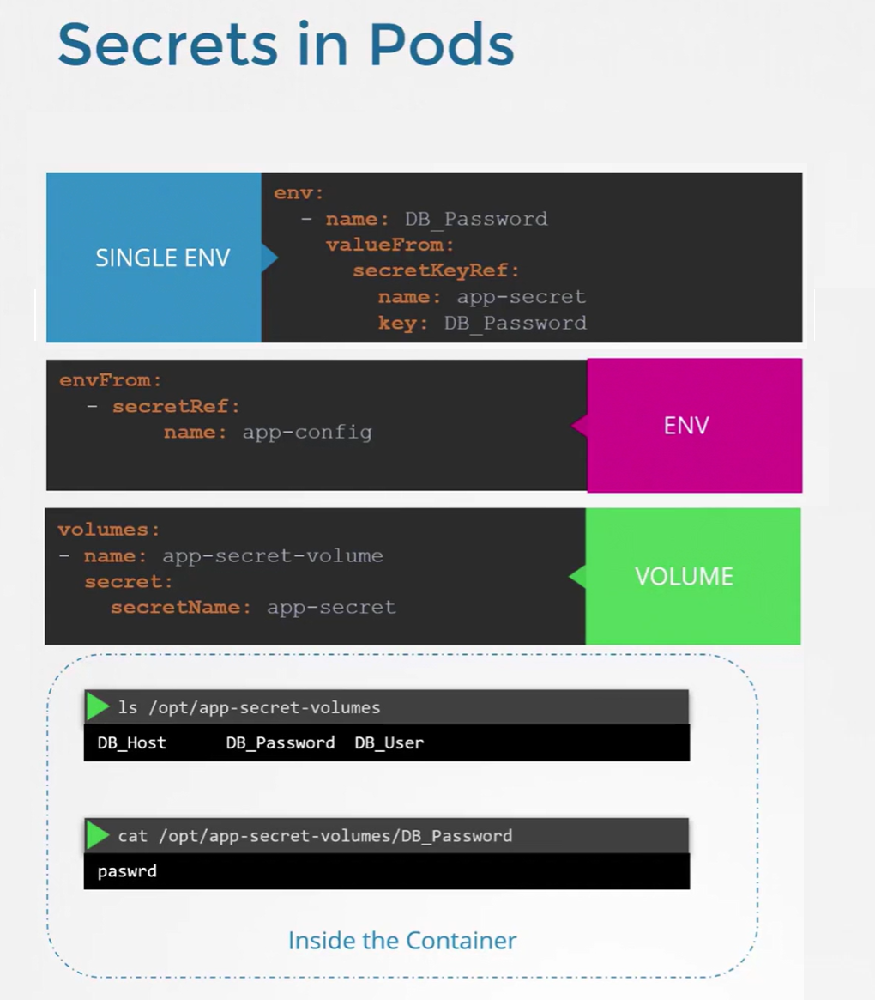
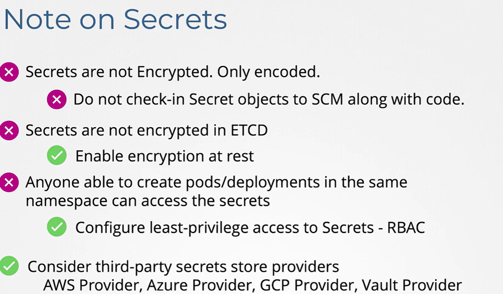

# 🔐 **Secrets in Kubernetes**

> 🎯 **Goal:** Learn how to **create, manage, mount, decode, secure, and troubleshoot Secrets** as an administrator — including best practices for encryption, RBAC, and integration with workloads.

---

## 📖 **What is a Secret?**

A **Secret** is a **Kubernetes object that stores sensitive data** — like passwords, tokens, certificates, or SSH keys — in **base64-encoded** form.

It’s similar to a **ConfigMap**, but with added layers of protection.

---

### ⚖️ Key Differences: ConfigMap vs Secret

<div align="center" style="background-color: #141a19ff;color: #a8a5a5ff; border-radius: 10px; border: 2px solid">

| Feature      | ConfigMap                | Secret                    |
| ------------ | ------------------------ | ------------------------- |
| **Purpose**  | Non-sensitive config     | Sensitive data            |
| **Encoding** | Plain text               | Base64 encoded            |
| **Access**   | Open to all in namespace | Restricted via RBAC       |
| **Storage**  | etcd (plain)             | etcd (`can be encrypted`) |
| **Usage**    | Env vars / files         | Env vars / volumes        |

</div>

---

### 💡 Real-world analogy:

> **ConfigMap** = your app’s config file.  
> **Secret** = your app’s `.env` file with passwords and tokens.

---

## 🤹🏻 **Secret Types**

Kubernetes supports multiple built-in secret types:

<div align="center" style="background-color: #141a19ff;color: #a8a5a5ff; border-radius: 10px; border: 2px solid">

| Commands                                | Type                                     | Purpose                             |
| --------------------------------------- | ---------------------------------------- | ----------------------------------- |
| `kubectl create secret generic`         | 📍 `Opaque`                              | Default, arbitrary key-value pairs  |
| `kubectl create secret token`           | 📍 `kubernetes.io/service-account-token` | Auto-generated for service accounts |
| `kubectl create secret docker-registry` | 📍 `kubernetes.io/dockerconfigjson`      | Docker registry credentials         |
| `kubectl create secret tls`             | 📍 `kubernetes.io/tls`                   | TLS cert and key                    |

</div>

---

### 🔐 Common Example (Opaque)

```bash
kubectl create secret generic db-secret \
  --from-literal=username=admin \
  --from-literal=password='P@ssw0rd!'
```

View:

```bash
kubectl get secret db-secret -o yaml
```

Output:

```yaml
type: Opaque
data:
  password: UEBzc3cwcmQh
  username: YWRtaW4=
```

✅ Stored encoded, not plain text.

Decode for verification:

```bash
echo 'UEBzc3cwcmQh' | base64 --decode
```

---

## 🚀 **Secret Creation Methods**

Kubernetes gives you several flexible ways:

---

### **1️⃣ From Literal Values**

```bash
kubectl create secret generic api-secret \
  --from-literal=api-key=abcd1234
```

Output:

```yaml
type: Opaque
data:
  api-key: YWJjZDEyMzQ=
```

---

### **2️⃣ From File**

```bash
echo -n "abcd1234" > ./api-key.txt
kubectl create secret generic api-secret --from-file=api-key.txt
```

Output:

```yaml
type: Opaque
data:
  api-key: YWJjZDEyMzQ=
```

---

### **3️⃣ From Multiple Files**

```bash
kubectl create secret generic multi-secret \
  --from-file=username.txt \
  --from-file=password.txt
```

Output:

```yaml
type: Opaque
data:
  password: UEBzc3cwcmQh
  username: YWRtaW4=
```

---

### **4️⃣ From YAML Manifest**

```yaml
apiVersion: v1
kind: Secret
metadata:
  name: app-secret
type: Opaque
data:
  username: YWRtaW4=
  password: UGFzc3cwcmQ=
```

Apply:

```bash
kubectl apply -f app-secret.yaml
```

Output:

```yaml
type: Opaque
data:
  password: UGFzc3cwcmQ=
  username: YWRtaW4=
```

---

## 👀 **Viewing & Managing Secrets**

<div align="center" style="background-color: #141a19ff;color: #a8a5a5ff; border-radius: 10px; border: 2px solid">

| Action       | Command                                                                       |
| ------------ | ----------------------------------------------------------------------------- |
| List         | `kubectl get secrets`                                                         |
| Describe     | `kubectl describe secret <name>`                                              |
| View decoded | `kubectl get secret <name> -o jsonpath='{.data.username}' \| base64 --decode` |
| Delete       | `kubectl delete secret <name>`                                                |

</div>

---

## 📝 **Using Secrets in Pods**

Secrets can be injected into Pods **as environment variables** or **as mounted files**.

---

<div align="center" style="background-color:#f1f1f1; border-radius: 10px; border: 2px solid">
  
</div>

---

### 🔐 1. **Inject a Single Key as an Environment Variable (`env.valueFrom`)**

This method loads a specific key from a Secret into a named environment variable.

#### ✅ Secret: `app-secret`

```yaml
apiVersion: v1
kind: Secret
metadata:
  name: app-secret
type: Opaque
data:
  DB_Password: cGFzc3dk # base64 for 'passwd'
```

#### ✅ Pod Using `env.valueFrom`

```yaml
apiVersion: v1
kind: Pod
metadata:
  name: single-env-pod
spec:
  containers:
    - name: app
      image: busybox
      command: ["sleep", "3600"]
      env:
        - name: DB_Password
          valueFrom:
            secretKeyRef:
              name: app-secret
              key: DB_Password
```

---

### 🔐 2. **Inject All Keys as Environment Variables (`envFrom`)**

This method loads all key-value pairs from a Secret into the container’s environment.

#### ✅ Secret: `app-config`

```yaml
apiVersion: v1
kind: Secret
metadata:
  name: app-config
type: Opaque
data:
  DB_User: ZGJ1c2Vy # base64 for 'dbuser'
  DB_Password: cGFzc3dk # base64 for 'passwd'
  DB_Host: ZGJfaG9zdA== # base64 for 'db_host'
```

#### ✅ Pod Using `envFrom`

```yaml
apiVersion: v1
kind: Pod
metadata:
  name: envfrom-pod
spec:
  containers:
    - name: app
      image: busybox
      command: ["sleep", "3600"]
      envFrom:
        - secretRef:
            name: app-config
```

---

### 🔐 3. **Mount Secret as a Volume**

This method mounts the entire Secret as files inside a container directory.

#### ✅ Secret: `app-secret`

```yaml
apiVersion: v1
kind: Secret
metadata:
  name: app-secret
type: Opaque
data:
  DB_User: ZGJ1c2Vy # base64 for 'dbuser'
  DB_Password: cGFzc3dk # base64 for 'passwd'
  DB_Host: ZGJfaG9zdA== # base64 for 'db_host'
```

#### ✅ Pod Using Volume Mount

```yaml
apiVersion: v1
kind: Pod
metadata:
  name: volume-secret-pod
spec:
  containers:
    - name: app
      image: busybox
      command: ["sleep", "3600"]
      volumeMounts:
        - name: app-secret-volume
          mountPath: /opt/app-secret-volumes
          readOnly: true
  volumes:
    - name: app-secret-volume
      secret:
        secretName: app-secret
```

Inside the container, you’ll find:

```bash
ls /opt/app-secret-volumes
# DB_User  DB_Password  DB_Host

cat /opt/app-secret-volumes/DB_Password
# passwd
```

---

## 🔁 **Updating Secrets**

Update via:

```bash
kubectl apply -f secret.yaml
```

or recreate:

```bash
kubectl create secret generic db-secret \
  --from-literal=username=admin2 \
  --from-literal=password='N3wp@ss!' \
  -o yaml --dry-run=client | kubectl apply -f -
```

🧠 Like ConfigMaps, **Pods don’t auto-reload** Secrets.
You must **restart them** to pick up changes:

```bash
kubectl rollout restart deployment webapp
```

---

## 📜 **Managing Sensitive Files (Docker, TLS)**

### 🐳 Docker Registry Secret

```bash
kubectl create secret docker-registry regcred \
  --docker-server=ghcr.io \
  --docker-username=myuser \
  --docker-password=mypassword \
  --docker-email=user@example.com
```

Output:

```yaml
apiVersion: v1
kind: Secret
metadata:
  name: regcred
type: kubernetes.io/dockerconfigjson
data:
  .dockerconfigjson: eyJhdXRoIjogeyJ1c2VybmFtZSI6ICJteXVzZXIiLCJwYXNzd29yZCI6ICJteXBhc3N3b3JkIiwg
    ...
```

Mount in Pod spec:

```yaml
imagePullSecrets:
  - name: regcred
```

---

### 🔐 TLS Secret

```bash
kubectl create secret tls my-tls \
  --cert=server.crt \
  --key=server.key
```

Output:

```yaml
apiVersion: v1
kind: Secret
metadata:
  name: my-tls
type: kubernetes.io/tls
data:
  tls.crt: ...
  tls.key: ...
```

Used by Ingress:

```yaml
tls:
  - secretName: my-tls
```

---

## 🧰 **Troubleshooting Secrets**

<div align="center" style="background-color: #141a19ff;color: #a8a5a5ff; border-radius: 10px; border: 2px solid">

| Problem                              | Symptom            | Fix                                    |
| ------------------------------------ | ------------------ | -------------------------------------- |
| Pod can’t start                      | `secret not found` | Ensure Secret exists in same namespace |
| Empty env values                     | Wrong key          | Check key name in YAML                 |
| Permission denied                    | Read-only issue    | Ensure proper `volumeMount`            |
| Secret visible in logs               | App prints env     | Use files instead of env               |
| Secret updated but Pod not refreshed | No live reload     | Restart Deployment                     |

</div>

---

### 🔍 Diagnostic Commands

```bash
kubectl describe pod <pod>
kubectl describe secret <name>
kubectl get events --sort-by=.metadata.creationTimestamp
kubectl exec -it <pod> -- ls /etc/creds
```

---

## ⚙️ **Encrypting Secrets at Rest (Admin-Level)**

By default, Secrets are **base64-encoded**, not encrypted.
To secure them, enable **encryption at rest** in `kube-apiserver`.

Example encryption config file (on control plane):

```yaml
apiVersion: apiserver.config.k8s.io/v1
kind: EncryptionConfiguration
resources:
  - resources:
      - secrets
    providers:
      - aescbc:
          keys:
            - name: key1
              secret: <base64-encoded-key>
      - identity: {}
```

Start API server with:

```bash
--encryption-provider-config=/etc/kubernetes/encryption.yaml
```

✅ Secrets now stored encrypted in etcd.

---

## 🔒 **Access Control (RBAC)**

You can restrict who reads secrets:

```yaml
kind: Role
apiVersion: rbac.authorization.k8s.io/v1
metadata:
  name: secret-reader
rules:
  - apiGroups: [""]
    resources: ["secrets"]
    verbs: ["get", "list"]
```

Bind:

```bash
kubectl create rolebinding reader-bind \
  --role=secret-reader \
  --user=dev-user
```

---

## 💎 **Immutable Secrets (K8s 1.19+)**

Make a Secret read-only (immutable):

```yaml
apiVersion: v1
kind: Secret
metadata:
  name: app-secret
type: Opaque
immutable: true
data:
  api-key: YWJjZDEyMzQ=
```

✅ Prevents accidental modification  
✅ Safer in production environments

---

## ✅ **Best Practices**

<div align="center" style="background-color: #141a19ff;color: #a8a5a5ff; border-radius: 10px; border: 2px solid">

| Area          | Best Practice                                 |
| ------------- | --------------------------------------------- |
| **Storage**   | Enable encryption at rest                     |
| **Access**    | Use RBAC for secret read/write                |
| **Namespace** | Keep secrets scoped to namespace              |
| **Rotation**  | Rotate secrets regularly and automatically    |
| **Logging**   | Never print secrets in logs                   |
| **Mounting**  | Prefer file mounts for high-sensitivity data  |
| **CI/CD**     | Use sealed-secrets, External Secrets Operator |
| **Auditing**  | Enable Kubernetes audit logs                  |

</div>

---

## ✍🏻 **Example: Deployment with Secret + ConfigMap**

```yaml
apiVersion: apps/v1
kind: Deployment
metadata:
  name: webapp
spec:
  replicas: 2
  selector:
    matchLabels:
      app: webapp
  template:
    metadata:
      labels:
        app: webapp
    spec:
      containers:
        - name: web
          image: nginx
          envFrom:
            - configMapRef:
                name: web-config
            - secretRef:
                name: db-secret
          ports:
            - containerPort: 8080
```

✅ Both `ConfigMap` and `Secret` injected seamlessly.

---

## 🔗 **Integrating with External Secret Managers**

For production environments, Kubernetes can integrate with:

<div align="center" style="background-color: #141a19ff;color: #a8a5a5ff; border-radius: 10px; border: 2px solid">

| Tool                                 | Description                         |
| ------------------------------------ | ----------------------------------- |
| **AWS Secrets Manager CSI Driver**   | Inject AWS Secrets dynamically      |
| **Azure Key Vault Provider**         | Direct Key Vault secret injection   |
| **Google Secret Manager CSI Driver** | Sync GCP secrets                    |
| **HashiCorp Vault Agent Injector**   | Dynamic secret fetching and renewal |

</div>

Example (Azure):

```yaml
kind: SecretProviderClass
metadata:
  name: azure-kv-secrets
spec:
  provider: azure
  parameters:
    keyvaultName: myKeyVault
    objects: |
      array:
        - objectName: db-pass
          objectType: secret
```

---

## 🏁 **Summary**

<div align="center" style="background-color: #141a19ff;color: #a8a5a5ff; border-radius: 10px; border: 2px solid">

| Concept              | Secret             | ConfigMap          |
| -------------------- | ------------------ | ------------------ |
| **Purpose**          | Sensitive data     | Non-sensitive data |
| **Storage**          | etcd (encrypted)   | etcd (plain)       |
| **Encoding**         | Base64             | Plain              |
| **Usage**            | Env vars / Volumes | Env vars / Volumes |
| **RBAC Required**    | Yes                | Recommended        |
| **Immutable Option** | ✅ Yes             | ✅ Yes             |
| **Auto Reload**      | ❌ No              | ❌ No              |

</div>

---

<div align="center" style="background-color:#f1f1f1; border-radius: 10px; border: 2px solid">
  
</div>

---

## 🧭 **Next Deep Dives**

You can extend your knowledge with:

- 🧩 **Sealed Secrets (Bitnami)** — encrypt before committing to Git
- 🧩 **External Secrets Operator (ESO)** — sync with cloud secret stores
- 🧩 **Secret Rotation Automation** — CI/CD + vault integration
- 🧩 **K8s Encryption Configuration Internals**
