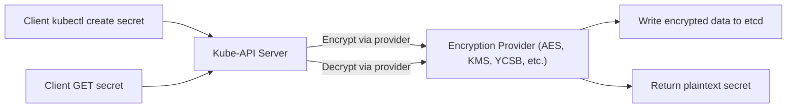

# 🔐 **Encrypting Secret Data at Rest in K8s**

_The complete hands-on guide: what, why, how, with real examples + encryption providers._

---

## 📖 What Does “Secrets Encryption at Rest” Mean?

Kubernetes _always_ stores Secrets in **etcd**.
By default (unless enabled manually), etcd stores values **Base64-encoded, not encrypted**.

Meaning:

- If someone gains etcd access
- Or disk-level access
- Or performs a etcd backup snapshot

👉 They can read your Secret plaintext.

To prevent this, Kubernetes supports **Encryption at Rest** using the API server.

---

## ❓ Why Do We Encrypt Secrets at Rest?

### 2.1. Threat Scenarios

- A rogue admin gets `/var/lib/etcd/member/snap/db`
- A backup system stores etcd snapshots in S3 unencrypted
- A hostile node has filesystem access
- A security audit requires data encryption (PCI DSS, HIPAA, SOC2)

### 2.2. Protection Level

Encryption at Rest in Kubernetes protects:

- ✔️ Kubernetes Secrets
- ✔️ ConfigMaps (if configured)
- ✔️ Deployment manifests that embed secrets
- ✔️ TokenRequest API objects

It does NOT protect:

- ❌ Secrets in RAM
- ❌ Secrets transmitted to Pods
- ❌ Secrets in environment variables

---

## 🚦 How K8s Secrets Encryption Works (Architecture)



💡 **Encryption is only applied at the API server layer.**  
etcd never encrypts itself. API server encrypts/decrypts on-the-fly.

---

## 🛠️ Encryption Providers (Latest Kubernetes 1.30+)

Kubernetes supports:

| Provider      | Description                                                                       |
| ------------- | --------------------------------------------------------------------------------- |
| **AES-CBC**   | Older, still supported, but CBC has risks (padding oracle attacks)                |
| **AES-GCM**   | Modern, authenticated encryption; RECOMMENDED                                     |
| **Secretbox** | Uses XSalsa20+Poly1305                                                            |
| **KMS v2**    | Cloud KMS integration (AWS KMS, GCP KMS, Azure KeyVault) with encryption envelope |
| **Identity**  | No encryption (plaintext – used during migration)                                 |

**Best practice (2025):**

👉 Use **KMS v2** in production  
👉 Use **AES-GCM** in clusters without cloud KMS

---

## 📃 EncryptionConfiguration File (the most important piece)

File location (recommended):

```ini
/etc/kubernetes/encryption-config.yaml
```

### 📌 Key concepts:

- You define **resources** that should be encrypted
- You define **providers in priority order**
- Each provider can contain multiple keys (for rotation)

---

## ✍🏻 Fully Working Example: AES-GCM Encryption

### encryption-config.yaml

```yaml
apiVersion: apiserver.config.k8s.io/v1
kind: EncryptionConfiguration
resources:
  - resources:
      - secrets
    providers:
      - aescbc:
          keys:
            - name: key1
              secret: 5TdyOqH3uHoCYdG7+xzHNiE7UdnA/yjmCqX0Ml/G4nU= # 32 bytes base64
      - identity: {}
```

**Explanation:**

- Kubernetes encrypts secret data using AES CBC
- Key is 32 bytes (256-bit AES)
- `identity` fallback ensures old unencrypted secrets still read

---

## 🛠️ Enable It in kube-apiserver

Modify api-server manifest:

```bash
sudo nano /etc/kubernetes/manifests/kube-apiserver.yaml
```

Add:

```yaml
--encryption-provider-config=/etc/kubernetes/encryption-config.yaml
--encryption-provider-config-automatic-reload=true
```

Save → kubelet automatically restarts API server.

---

## 🧪 Testing Encryption at Rest (Hands-on)

We will:

1. Create a Secret
2. View raw data stored in etcd
3. Confirm it is encrypted

---

### Step 1: Create a secret

```bash
kubectl create secret generic mysecret \
  --from-literal=password=SuperSecret123
```

---

### Step 2: Read Secret normally

```bash
kubectl get secret mysecret -o yaml
```

You will see **base64 data**:

```yaml
data:
  password: U3VwZXJTZWNyZXQxMjM=
```

This is **not encryption**, just Base64.

---

### Step 3: View secret _directly from etcd_ (unencrypted-INSTEAD-of-plaintext)

If etcdctl is installed:

```bash
ETCDCTL_API=3 etcdctl get /registry/secrets/default/mysecret \
  --endpoints=https://127.0.0.1:2379 \
  --cacert=/etc/kubernetes/pki/etcd/ca.crt \
  --cert=/etc/kubernetes/pki/etcd/server.crt \
  --key=/etc/kubernetes/pki/etcd/server.key
```

Result:

```ini
...
"value":"k8s:enc:aescbc:v1:key1:<BIG RANDOM BINARY ENCRYPTED PAYLOAD>"
```

🔥 **Yay! It’s encrypted. No plaintext.**

---

## 🔄 Key Rotation (Real-World Example)

### Step 1: Add new key

```yaml
providers:
  - aescbc:
      keys:
        - name: key2
          secret: NEW-GENERATED-BASE64-KEY
        - name: key1
          secret: OLD-BASE64-KEY
  - identity: {}
```

**Rules:**

- New key first = used for new writes
- Old keys still decrypt old secrets

---

### Step 2: Run encryption migration

```bash
kubectl delete secret mysecret
kubectl apply -f secret.yaml
```

(or run the official encryption migration tool.)

Now data is re-written using new key.

---

## 🏦 Using **KMS v2** (AWS/GCP/Azure KMS)

The **best production setup**.

Example:

```yaml
apiVersion: apiserver.config.k8s.io/v1
kind: EncryptionConfiguration
resources:
  - resources:
      - secrets
    providers:
      - kms:
          name: "aws-kms"
          apiVersion: v2
          endpoint: unix:///var/run/kmsplugin/socket.sock
      - identity: {}
```

KMS Plugin Responsibilities:

- Hold master key in cloud KMS
- Generate DEKs (data encryption keys)
- Encrypt Secrets
- Decrypt on read

---

## 🏗️ Setup KMS Provider Plugin Example (AWS)

Download AWS KMS Plugin container:

```bash
docker run -d \
  -v /var/run/kmsplugin:/var/run/kmsplugin \
  public.ecr.aws/aws-k8s-security/kms-plugin:latest
```

API server talks to the plugin using gRPC over Unix domain socket.

---

## 🧪 Encrypt ConfigMaps as well

Extend:

```yaml
resources:
  - resources:
      - secrets
      - configmaps
```

---

## 🛡️ Validating Encryption is Injected

Use:

```bash
kubectl get --raw /metrics | grep encryption
```

You’ll see:

```ini
apiserver_encryption_config_controller_dynamics_reload_total 1
```

---

## 🚨 Important Notes (Latest Best Practices)

### ✔️ Use AES-GCM or KMS v2

CBC is older and unauthenticated.

### ✔️ Enable encryption-provider-config-automatic-reload

Works in Kubernetes 1.27+

### ✔️ Always keep identity provider at bottom

It helps during migration.

### ✔️ Rotate keys every 6 months

Or comply with SOC2/PCI requirements.

### ✔️ Encrypt backups too

etcd encryption protects only live disk—not backups.

---

## 🎁 Full Minimal Working Lab (Kind Cluster)

kind-config.yaml:

```yaml
kind: Cluster
apiVersion: kind.x-k8s.io/v1alpha4
kubeadmConfigPatches:
  - |
    apiVersion: kubeadm.k8s.io/v1beta3
    kind: ClusterConfiguration
    apiServer:
      extraArgs:
        encryption-provider-config: /etc/kubernetes/encryption-config.yaml
      extraVolumes:
        - name: encryption-config
          hostPath: /root/encryption-config.yaml
          mountPath: /etc/kubernetes/encryption-config.yaml
          readOnly: true
```

Run Kind:

```bash
sudo kind create cluster --config kind-config.yaml
```

Apply encryption config → tested earlier.

---

## 🏁 Final Summary (Cheat Sheet)

| Concept                 | Meaning                                 |
| ----------------------- | --------------------------------------- |
| EncryptionConfiguration | Defines K8s encryption                  |
| Encryption Providers    | aescbc, aesgcm, kms, secretbox          |
| Etcd encryption         | Done by API server only                 |
| Key Rotation            | Add new keys + re-encrypt               |
| KMS v2                  | Production-grade cloud-based encryption |

**Encrypting at rest = protecting Secrets stored in etcd.**
