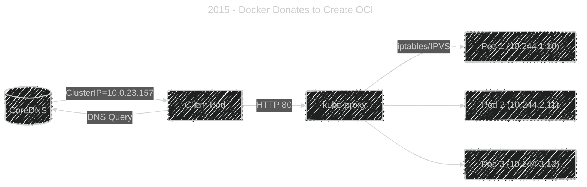

# 🌐 **Kubernetes Services & Networking – Core Concepts & ClusterIP**

## ⁉️ **Why We Need Services**

Pods are **ephemeral**:

- Their IPs change whenever they restart.
- They can scale dynamically (1 → 10 → 0 replicas).
- They die and respawn frequently.

So how can other Pods, users, or applications **reliably connect** to them?

✅ That’s why **Services** exist — they provide a **stable virtual IP (ClusterIP)** and DNS name that always points to the **healthy Pods** behind it.

---

## 📖 **What is a Kubernetes Service?**

A **Service** is an abstraction that defines a **logical set of Pods** (usually matched by labels) and a policy to access them.

Think of it as:

> 🏷️ “Pods with label `app=nginx` → expose on port 80 → stable IP and DNS.”

---

## 🤹🏻 **Service Types Overview**

<div align="center" style="background-color: #141a19ff;color: #a8a5a5ff; border-radius: 10px; border: 2px solid">

| Type                  | Purpose                            | Accessible From | Example Use           |
| --------------------- | ---------------------------------- | --------------- | --------------------- |
| `ClusterIP` (default) | Internal-only access               | Inside cluster  | Backend microservices |
| `NodePort`            | Exposes service via node IP + port | Outside cluster | Testing/dev           |
| `LoadBalancer`        | Cloud-managed LB                   | Internet        | Public API endpoint   |
| `ExternalName`        | Maps to external DNS               | Cluster-only    | SaaS integrations     |

</div>

---

## 🧱 **Anatomy of a ClusterIP Service**

Let’s build a simple internal service that exposes a backend app.

### 🧩 Deployment

```yaml
apiVersion: apps/v1
kind: Deployment
metadata:
  name: backend
spec:
  replicas: 3
  selector:
    matchLabels:
      app: backend
  template:
    metadata:
      labels:
        app: backend
    spec:
      containers:
        - name: api
          image: nginx
          ports:
            - containerPort: 80
```

### 🧩 ClusterIP Service

```yaml
apiVersion: v1
kind: Service
metadata:
  name: backend-service
spec:
  selector:
    app: backend
  ports:
    - port: 80
      targetPort: 80
  type: ClusterIP
```

Deploy:

```bash
kubectl apply -f backend.yaml
kubectl apply -f service.yaml
```

Check:

```bash
kubectl get svc
```

Output:

```ini
NAME              TYPE        CLUSTER-IP     PORT(S)   AGE
backend-service   ClusterIP   10.0.23.157    80/TCP    2m
```

---

## ⚙️ **How ClusterIP Works Internally**

Here’s the magic 👇

<div align="center" style="background-color: #141a19ff;color: #a8a5a5ff; border-radius: 10px; border: 2px solid">



</div>

---

- **CoreDNS** resolves `backend-service.default.svc.cluster.local` to ClusterIP (10.0.23.157).
- **kube-proxy** (running on every node) intercepts connections to ClusterIP.
- It load-balances traffic to one of the backend Pods.

> ⚙️ The load balancing is **round-robin** by default (via IPVS or iptables).

---

## 🌐 **Check DNS Resolution**

Run a test Pod:

```bash
kubectl run -it test --image=busybox --restart=Never -- sh
```

Then:

```bash
nslookup backend-service
curl backend-service
```

Output:

```ini
Server:    10.96.0.10
Name:      backend-service.default.svc.cluster.local
Address:   10.0.23.157
```

✅ DNS resolves to ClusterIP successfully.

---

## 🔍 **Service Discovery in Kubernetes**

Each Service automatically gets:

- A **DNS entry**:
  `service-name.namespace.svc.cluster.local`
- A **ClusterIP** (virtual IP).
- A **port mapping** to containers.

Pods in the same namespace can reach each other by just `service-name`.
Pods in different namespaces use `service-name.namespace`.

Example:

```ini
curl backend-service.default
curl backend-service.dev
```

---

## 🔐 **TargetPort vs Port vs NodePort (explained visually)**

```yaml
ports:
  - name: http
    port: 80 # Service port (ClusterIP listener)
    targetPort: 8080 # Pod containerPort
    nodePort: 30080 # (optional for NodePort type)
```

<div align="center" style="background-color: #141a19ff;color: #a8a5a5ff; border-radius: 10px; border: 2px solid">

| Field          | Description                                  |
| -------------- | -------------------------------------------- |
| **port**       | The port exposed by the Service              |
| **targetPort** | The port on the container                    |
| **nodePort**   | Port exposed on each node (if type=NodePort) |

</div>

---

## 🧰 **Verify Endpoint Bindings**

Check which Pods the service is sending traffic to:

```bash
kubectl get endpoints backend-service
```

Output:

```ini
NAME              ENDPOINTS                              AGE
backend-service   10.244.1.10:80,10.244.2.11:80,10.244.3.12:80   2m
```

> ✅ These are the IPs of Pods matching the selector.

---

## 🧾 **Troubleshooting ClusterIP**

<div align="center" style="background-color: #141a19ff;color: #a8a5a5ff; border-radius: 10px; border: 2px solid">

| Symptom                  | Likely Cause                   | Solution                                 |
| ------------------------ | ------------------------------ | ---------------------------------------- |
| `curl` times out         | No Endpoints registered        | Check labels on Pods vs Service selector |
| DNS fails                | CoreDNS issue                  | Restart CoreDNS Pod or check ConfigMap   |
| Only some Pods reachable | Pod readinessProbe failing     | Check `kubectl describe pod`             |
| Random Pod unreachable   | NetworkPolicy blocking traffic | Check `kubectl get netpol`               |

</div>

---

Debug tips:

```bash
kubectl get endpoints backend-service -o yaml
kubectl logs -n kube-system -l k8s-app=kube-proxy
kubectl logs -n kube-system -l k8s-app=coredns
```

---

## ✅ **Best Practices for ClusterIP Services**

✅ Always define **labels** and **selectors** clearly.  
✅ Use **readinessProbes** to exclude unready Pods.  
✅ Keep Service **names short and lowercase** (DNS-friendly).  
✅ Avoid exposing unnecessary ports.  
✅ Use **NetworkPolicies** for inter-service security.

---

## 🏁 **Summary**

<div align="center" style="background-color: #141a19ff;color: #a8a5a5ff; border-radius: 10px; border: 2px solid">

| Concept                 | Description                            |
| ----------------------- | -------------------------------------- |
| **ClusterIP**           | Internal-only service inside cluster   |
| **CoreDNS**             | Resolves service names to ClusterIP    |
| **kube-proxy**          | Routes packets to correct Pod          |
| **Endpoints**           | Dynamic list of Pod IPs behind Service |
| **Namespace isolation** | Service names scoped by namespace      |

</div>
