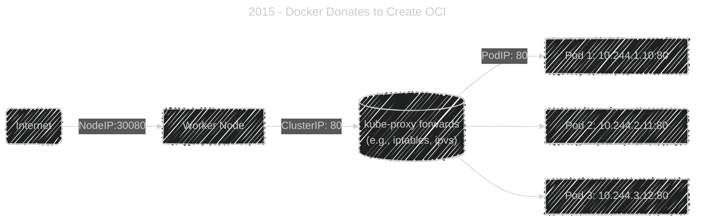

# 🌍 **Kubernetes NodePort Service — Exposing Your App to the Outside World**

## 📖 **What Is a NodePort Service?**

A **NodePort** service exposes your application **on every Node’s IP address** at a **static port (30000–32767)**.

That means:

> 🧩 Anyone who can reach any Node IP on that port can reach your application.

---

### 📖 In Short:

<div align="center" style="background-color: #141a19ff;color: #a8a5a5ff; border-radius: 10px; border: 2px solid">

| Concept          | Description                         |
| ---------------- | ----------------------------------- |
| **ClusterIP**    | Internal-only access                |
| **NodePort**     | External access through a node’s IP |
| **LoadBalancer** | Managed cloud external access       |
| **ExternalName** | DNS alias                           |

</div>

---

## 🩻 **NodePort Structure**

Let’s say we have an app running in Pods with label `app=web`.

We’ll expose it as NodePort on port `30080` (for example).

```yaml
apiVersion: v1
kind: Service
metadata:
  name: web-nodeport
spec:
  type: NodePort
  selector:
    app: web
  ports:
    - port: 80 # service port inside cluster
      targetPort: 80 # pod container port
      nodePort: 30080 # external port (optional)
```

Apply:

```bash
kubectl apply -f web-nodeport.yaml
kubectl get svc
```

Output:

```ini
NAME            TYPE       CLUSTER-IP     EXTERNAL-IP   PORT(S)        AGE
web-nodeport    NodePort   10.0.25.182    <none>        80:30080/TCP   3m
```

✅ **Interpretation:**

- ClusterIP = 10.0.25.182 → internal.
- NodePort = 30080 → accessible from any node’s IP.

---

## 👀 **How It Works Internally**

<div align="center" style="background-color: #141a19ff;color: #a8a5a5ff; border-radius: 10px; border: 2px solid">



</div>

---

1️⃣ A client sends request → `http://<NodeIP>:30080`  
2️⃣ `kube-proxy` intercepts and load-balances across Pods  
3️⃣ Works for **any node**, even if the Pod isn’t running on that node.

---

## 🌐 **Accessing NodePort from Outside**

### ✅ Inside same VPC / LAN:

You can reach it directly:

```ini
curl http://<NodeIP>:30080
```

Example:

```ini
curl http://192.168.10.12:30080
```

### 🚫 From Internet:

- You must open the port (e.g., 30080) in the node’s **firewall or cloud security group**.
- Your cloud provider (AWS, Azure, GCP) must allow inbound traffic.

Example for AWS:

```bash
aws ec2 authorize-security-group-ingress \
  --group-id sg-123abc \
  --protocol tcp \
  --port 30080 \
  --cidr 0.0.0.0/0
```

---

## ⚡ **Automatic NodePort Assignment**

If you don’t specify `nodePort`, Kubernetes will automatically assign a free port from the **default range (30000–32767)**.

Example:

```yaml
nodePort: <optional>
```

After applying:

```bash
kubectl get svc web-nodeport
```

Output might show:

```ini
80:31245/TCP
```

---

## 📝 **NodePort with Custom Port Range**

To change the NodePort range, edit your **API Server / kube-proxy** config:

```bash
--service-node-port-range=20000-40000
```

Then restart the control plane components (for self-managed clusters).

---

## 🧪 **Troubleshooting NodePort**

<div align="center" style="background-color: #141a19ff;color: #a8a5a5ff; border-radius: 10px; border: 2px solid">

| Problem                | Cause                                 | Solution                                   |
| ---------------------- | ------------------------------------- | ------------------------------------------ |
| Connection refused     | Node firewall or SG blocked port      | Open port 30080                            |
| Works on one node only | Network overlay issue                 | Check CNI plugin                           |
| Random Pod unreachable | Endpoint missing                      | Verify `kubectl get endpoints`             |
| Service not exposed    | NodePort not set                      | Confirm `type: NodePort` and correct range |
| Timeout from browser   | Worker node’s public IP not reachable | Check NAT or cloud route table             |

</div>

---

### 🔍 Useful Commands

```bash
kubectl describe svc web-nodeport
kubectl get endpoints web-nodeport
kubectl logs -n kube-system -l k8s-app=kube-proxy
```

---

## 🔒 **Security Considerations**

- 🔐 Avoid exposing NodePorts directly to the Internet in production.
- 🧱 Use **firewalls** or **NetworkPolicies** to restrict access.
- 🧩 Prefer **Ingress + LoadBalancer** for managed TLS and routing.
- ⚠️ NodePorts bypass cluster-level access control.

---

## ✍🏻 **Real Example — Expose a NGINX Pod**

```yaml
apiVersion: v1
kind: Pod
metadata:
  name: nginx-pod
  labels:
    app: nginx
spec:
  containers:
    - name: nginx
      image: nginx
      ports:
        - containerPort: 80
---
apiVersion: v1
kind: Service
metadata:
  name: nginx-nodeport
spec:
  selector:
    app: nginx
  type: NodePort
  ports:
    - port: 80
      targetPort: 80
      nodePort: 30080
```

Apply and test:

```bash
kubectl apply -f nginx.yaml
kubectl get svc nginx-nodeport
curl http://<any-node-ip>:30080
```

✅ Output:

```ini
<html>
<head><title>Welcome to nginx!</title></head>
...
```

---

## 🧾 **NodePort vs ClusterIP Summary**

<div align="center" style="background-color: #141a19ff;color: #a8a5a5ff; border-radius: 10px; border: 2px solid">

| Feature         | ClusterIP              | NodePort                       |
| --------------- | ---------------------- | ------------------------------ |
| Visibility      | Internal only          | Internal + external            |
| Port Range      | Any                    | 30000–32767                    |
| Load balancing  | kube-proxy             | kube-proxy                     |
| DNS             | Yes                    | Yes                            |
| External access | No                     | Yes                            |
| Use case        | Internal microservices | Simple external access/testing |

</div>

---

## ✅ **Best Practices**

- Use **NodePort only for development, debugging, or local clusters** (like Minikube or K3s).
- In production, combine NodePort behind a **LoadBalancer or Ingress Controller**.
- Keep ports within the default range to avoid collisions.
- Always label your Services for clarity and observability.
